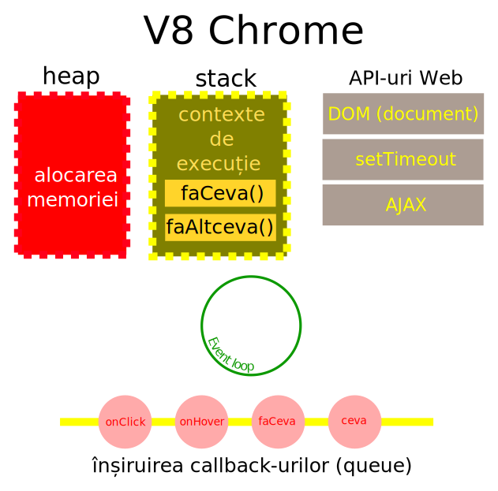

# Despre JavaScript

JavaScript este un limbaj inventat de Brendan Eich în perioada când lucra la compania Netscape. Numele corect este ECMAScript și este rezultatul unui efort colaborativ care a pornit în 1996, un an mai târziu fiind publicată prima ediție. În aprilie 1998 devine standardul internațional ISO/IEC 16262.

## Ce este?

Standardul ECMAScript 2016 este un „limbaj de programare” cu aplicativitate largă. Inițial ECMAScript a fost dezvoltat ca un limbaj de scriptare, dar a evoluat în unul care este aplicabil la o paletă foarte largă de aplicații.

ECMAScript este un limbaj de programare orientat pe obiecte pentru a face calcule și pentru a manipula obiecte pentru calcul într-un mediu găzduit. Chiar standardul ECMA 262 menționează faptul că „un program ECMAScript este un grup de obiecte care comunică”.

JavaScript este un runtime cu un singur fir de execuție. Acest lucru implică existența unei stive unice pentru apeluri (callstack).

JavaScript este un limbaj de programare bazat pe evenimente (event driven).

John Resig (JQuery) spune că JavaScript este o relație între funcții, closure-uri și obiecte, care conduce la înțelegerea cu adevărat a acestui limbaj de programare dinamic.

Motoarele JavaScript au o structură ceva mai complexă. Au o stivă de apeluri cu tot atâtea contexte de execuție, au un event loop - o buclă care capturează evenimente și mai au și o coadă de așteptare a callback-urilor (funcții care se execută când funcția gazdă și-a încheiat execuția), plus API-urile web.

JavaScript nu poate face decât un singur lucru la un moment dat, dar pentru că runtime-ul JS nu este singur, ci mai avem și bucla, dar și [API-urile web](https://www.w3.org/TR/html5/webappapis.html#webappapis), se poate rula cod asincron, ceea ce înseamnă că un eveniment, nu va bloca firul de execuție pentru că nu și-a terminat treaba. Toate aceste lucruri suplimentare care există în browser, de fapt înseamnă tot atâtea fire de execuție și asta înseamnă că poți să te apropii de ceea ce ar fi un mediu care execută mai multe treburi deodată fără să se creeze blocaje.
