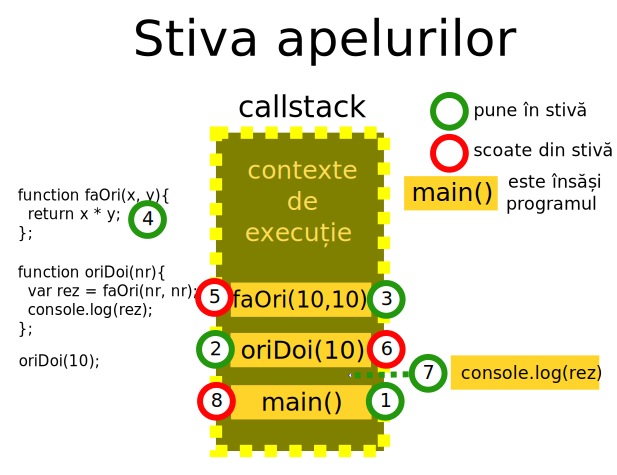
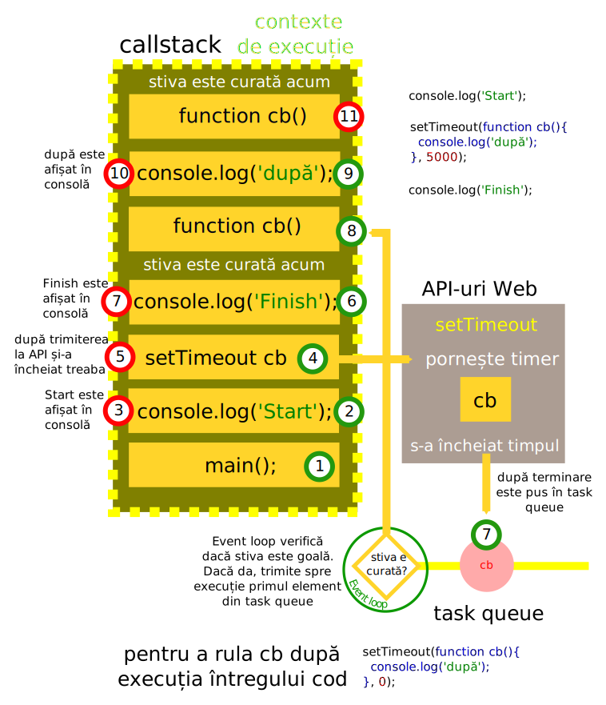

# Relația între stivă, event loop și API-uri pentru a permite asincronicitatea

Comportamentul asincron este permis de relația dintre runtime-ul JavaScript, stiva de apeluri și API-urile web. Fiecare dintre ceste componente reprezintă tot atâtea fire de execuție.

## Stiva apelurilor - CALLSTACK

Stiva de apel este o structură de date care memorează locul unde te afli în timpul rulării unui program. Invocarea unei funcții introduce acea funcție în stivă, iar dacă returnăm dintr-o funcție, stiva este eliberată de funcție.



Funcțiile în JavaScript permit argumente care la rândul lor sunt funcții. Numim funcțiile care permit acest lucru funcții de ordin înalt („higher order functions). Unele funcții care intră ca argumente sunt gândite să aibe au un comportament special în sensul că așteaptă până la încheierea execuției funcției și din acel moment își încep execuția. Acestea se numesc callback-uri. Callback-urile au un caracter sincron (`[].foreach(callback`)) și la nevoie asincron (`websocket.connect(callback)`) în ceea ce privește execuția.



Pentru programarea execuției unui callback după ce întreg programul a fost executat și stiva este goală se poate forța cu un setTimeout având al doilea argument 0.

```js
setTimeout(function cb(){
  console.log('după');
}, 0);
```

# Referințe

Acest material a fost inspirat de prezetarea lui Philip Roberts: [What the heck is the event loop anyway?](https://www.youtube.com/watch?v=8aGhZQkoFbQ) de la JSConf EU 2014. Instrumentul de simulare „Loupe” este la [acest link](http://latentflip.com/loupe).
