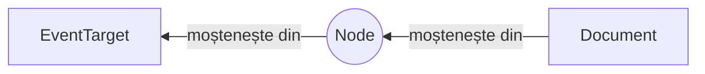

# Document

Această interfață permite interacțiunea cu arborele DOM.

Este considerată a fi una din interfețele *fundamentale* așa cum o menționează standardul și reprezintă „întregul document HTML sau XML”. Oferă accesul la toate datele documentului.

Este un document încărcat în browser care oferă accesul la structura DOM-ului.
Conținutul sunt nodurile din arborele stabilit de Document Object Model.

Interfața `Document` oferă metodele și proprietățile care sunt comune tuturor documentelor posibile, fie acestea HTML, XML sau SVG.

## Modelul de moștenire al interfeței `Document`

Interfața este extinsă de interfața `ParentNode`.

## Mantre

-   Interfața `Document` moștenește din interfeța părinte `Node`, care moștenește la rândul ei din `EventTarget`

## Referințe

-   [Interfața Document la Mozilla Developer Network](https://developer.mozilla.org/en-US/docs/Web/API/Document)
-   [Document Object Model (Core) Level 1. Fundamental Interfaces](https://www.w3.org/TR/REC-DOM-Level-1/level-one-core.html)
