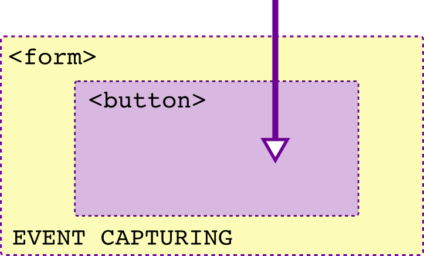

# Evenimente

„Programarea dictată de evenimente se întâmplă atunci când un sistem este interesat de un set de evenimente, oferă o cale de a fi anunțat atunci când evenimentele se întâmplă și răspunde la acestea folosind callback-uri”. (*Beautiful Javascript*, Jonathan Barronville). Evenimentele din DOM oferă o reprezentare a ceea ce se petrece în browser cum ar fi interacțiuni de bază precum click-uri de mouse sau activități de notificare a unor accesări de date la distanță, cam tot ce ar putea să însemne dinamică, acțiune.

La momentul în care un eveniment se declanșează, apelarea callback-ul are drept efect returnarea către program a unor date prelucrate.

## Mantre

-   HTML nu este DOM.
-   callback-ul este un closure care va fi invocat atunci când un anumit eveniment se întâmplă.
-   un eveniment este de fapt modificarea la un moment dat a stării unui sistem.
-   Evenimentele nu pornesc de la elementul care este cauza evenimentului (apăsarea unui buton), ci de la elementul rădăcină, de la `window` în cazul browserului și va merge din ramură în ramură până la elementul căruia îi este destinat. În drumul său, fiecare element din cale va „ști” despre acest eveniment. Acestă primă fază se numește `capturing phase`.
-   Capturarea unui eveniment returnează un eveniment. Datele depind de tipul evenimentului.
-   După ce evenimentul a ajuns la elementul țintit, acesta va porni înapoi către elementul rădăcină `window` alertând toate elementele din cale. Această fază se numește `bubbling phase` sau faza a doua.

## Anatomie

Fiecare eveniment DOM, de fapt, este un obiect care se bazează pe interfața `Event`. Toate evenimentele implementează metodele interfeței `EventTarget`. Fiecare dintre evenimentele DOM are proprietăți și metode caracteristice care se adaugă celor puse la dispoziție de interfața `Event`.
Pentru a răspunde unui eveniment, browserul, mai întâi trebuie să *captureze* evenimentul iar această etapă se numește *înregistrarea evenimentului* - `event registration`. Mecanismul prin care se face acest lucru este acela al setării de către programator a unor funcții de răspuns la acel eveniment. Aceste funcții de răspuns se numesc în limba engleză `event handlers`. Atunci când se creează evenimentul, de fapt este generat un obiect eveniment, care este asociat mai apoi de browser cu funcția de răspuns. Funcția de răspuns este mai apoi trimisă în coada de așteptare. Când stiva de execuție (call stack) este liberă, se trimite spre execuție funcția răspuns.

Cel mai simplu event handler este cel pe care-l oferă un atribut pus direct în codul HTML.

```html
<html>
  <head>
    <title>Atașare event handler</title>
  </head>
  <body>
    <div>
      <p onclick="alert('un eveniment')">Acesta este un paragraf!</p>
    </div>
  </body>
</html>
```

Această modalitate trebuie evitată în practica de zi cu zi. Ceea ce vei ajunge să faci este folosirea unei metode de selectare a unui element DOM `getElementById()` sau `querySelector()` și apoi vei atașa evenimentul.

```javascript
let x = document.getElementById('identificator');
x.onclick = function () {
  alert('am fost apasat');
};
```

Am ajuns la modul în care vei folosi evenimentele la momentul scrierii codului dedicat. În mod curent vei *atașa* evenimente folosind metoda `addEventListener(numeEveniment, numeFunctie, true/false)` pusă la dispoziție de interfața `EventTarget`.

Să atașăm un eveniment unui buton.

```javascript
var elementApasat = document.querySelector("#identificator");
function faCeva () {
  alert('s-a petrecut ceva');
};
elementApasat.addEventListener("click", faCeva, true);
```

Cel de-al treilea argument (`true`) specifică faptul că evenimentul va fi declanșat în faza de `capturing`. O valoare `false` înseamnă că evenimentul va fi declanșat în faza de `bubbling`. Când procesul de parcurgere a nodurilor a ajuns chiar la elementul destinație, spunem că că suntem chiar la țintă (Event.AT_TARGET === true). Aceste *situații* în care poate fi un eveniment se numește propagarea evenimentului - `event propagation`.

Pentru a vedea mai multe detalii despre eveniment, haideți să *capturăm* obiectul rezultat de eveniment. Pentru a realiza acest lucru, pasăm funcției cu rol de callback însuși obiectul eveniment.

```javascript
var elementApasat = document.querySelector("#identificator");
function faCeva (eveniment) {
  console.log(eveniment);
};
elementApasat.addEventListener("click", faCeva, true);
```

Câteva informații interesante apar în consolă la o inspecție a conținutului obiectului eveniment:

-   `type`, fiind tipul evenimentului, în cazul nostru *click*;
-   `timestamp`, fiind momentul la care a apărut evenimentul;
-   `defaultPrevent()`, fiind un Boolean care dacă este `true` înseamnă că va împiedica comportamentul normal al elementului... gândește-te la un link împiedicat să deschidă pagina. Dacă este `false`, va face acel lucru, dacă e `true`, va avea un comportament deturnat în alt scop.
-   `originalTarget`, fiind elementul care a declanșat evenimentul.
-   `target`, fiind elementul țintit de eveniment.

Și acum câteva informații utile privind poziționarea elementului:

-   screenX,Y îți dă poziția relativ la ecranul utilizatorului
-   clientX,Y își dă poziția relativ la fereastra deschisă
-   offsetX,Y îți dă poziția relativ la elementul care a inițiat evenimentul
-   pageX,Y îți dă poziția relativ la documentul HTML,
-   layerX,Y îți dă poziția față de un alt element.

Poți obține informații despre care combinație de taste a fost folosită pentru a declanșa evenimentul:

-   altKey: false/true,
-   ctrlKey: false/true,
-   shiftKey: false/true.

## Propagarea evenimentului - event propagation

Cele trei faze ale „călătoriei” unui obiect eveniment.

### Faza de captură - capturing phase

Este faza în care obiectul eveniment „călătorește” până la părintele direct al țintei pornind de cel mai de sus, de la `Window`.

### Faza localizată pe țintă - target phase

În această fază, dacă tipul evenimentului are la opțiuni specificat că nu va face bubbling, propagarea se oprește aici.

### Faza de bubbling

După executarea funcției callback pentru evenimentul specificat de țintă, propagarea face cale întoarsă către `Window`.

Un element părinte va permite capturarea tuturor evenimentelor apărute la elementele copil. Să ne uităm nițel cam cum ar apărea.

```html
<!DOCTYPE html>
<html>
  <head>
    <meta charset="utf-8">
    <title>Test event propagation</title>
  </head>
  <body>
    <div id="identificator">
      <p>Un fragment.</p>
      <p>Alt fragment.</p>
    </div>
    <script type="text/javascript">
      var elemCapturat = document.getElementById('identificator');
      elemCapturat.addEventListener('click', arataDetalii, true);
      function arataDetalii (eveniment) {
        console.log(eveniment);
      };
    </script>
  </body>
</html>
```

Ceea ce se observă imediat este faptul că indiferent că am dat click pe oricare dintre cele două paragrafe, evenimentul a fost emis chiar dacă „receptorul” (event listener-ul) a fost setat la elementul părinte al celor două paragrafe.

Vom observa că proprietatea `target` a evenimentului, va avea valoarea elementului DOM care a fost acționat.

### Două modele: captură (capture) și ridicarea la suprafață (bubbling)

Să presupunem că avem două elemente unul fiind containerul celui de-al doilea. Ambele evenimente au același eveniment atașat: onclick. Ceea ce se întâmplă este că în cazul unui click pe elementul găzduit, se declanșează ambele evenimente, adică și `onclick` de la părinte.

Întrebarea este următoarea: care event handler s-a executat primul?

Aici intervin cele două modele pentru a înțelege. A existat un moment când Netscape și Microsoft nu au căzut de acord asupra unui model comun și astfel, s-au născut două modele diferite care coexistă. Cel al lui Netscape care spune că evenimentul elementului gazdă se va declanșa primul, numindu-se „capturing” și modelul Microsoft care spune că elementul găzduit, cel care a fost acționat primul se va declanșa primul, numindu-se „bubbling”.




### MODELUL CURENT

Pentru armonizare, W3C a fost de acord ca cele două modele să coexiste după următorul scenariu: orice eveniment se declanșează, mai întâi de orice este capturat și este declanșat în toți copiii (dacă aceștia au event handlere - receptori cu true), până când ajunge la cel vizat (`target element`), după care face „bubbling”, adică se ridică din nou către gazdă declanșând toate *event handlere*-le.


Partea bună este că te poți decide singur când vei „înregistra” evenimentul, fie în faza de capturare, fie în faza de bubbling folosind metoda `addEventListener`. Dacă cel de-al treilea argument este setat la `true`, atunci evenimentul va fi „înregistrat” la faza de capturare, iar inversul indică faza de bubbling.

## Oprește comportamentul implicit

Am menționat deja faptul că obiectul eveniment pune la dispoziție o metodă `preventDefault()`, cu ajutorul căreia putem împiedica comportamentul obișnuit al unei acțiuni. De exemplu, comportamentul obișnuit al unui link este să deschidă pagina pentru adresa specificată la `href`.

```javascript
let selecțieLink = document.querySelector('#unLink');
selecțieLink.addEventListener('click', (eveniment) => {
  eveniment.preventDefault();
  console.log(eveniment.target.attributes.href);
});
```

Evenimentele sunt emise ca urmare a interacțiunii utilizatorului (a apăsat un buton) sau a încheierii unui proces cum ar fi accesarea asincronă a unor resurse. Unele evenimente pot să determine sau să controleze chiar comportamentul următoarelor evenimente care vor fi emise ca răspuns al primelor sau chiar poate fi urmat cursul anulării efectelor acțiunii primelor. Aceste acțiuni, aceste evenimente se numesc evenimente „anulabile” (*cancelable*), iar comportamentul pe care-l anulează este „efectul implicit” (*default action*) al evenimentului.

Obiectele eveniment care pot fi anulate pot fi asociate cu una sau mai multe *efecte implicite*. Drept exemplu, standardul indică comportamentul unui eveniment `mouse down`. Pentru momentul în care utilizatorul apasă pe butonul mouse-ului pe un text sau poziționează săgeata mouse-ului pe o imagine, efectul implicit (*default action*) este ceea ce se întâmplă imediat după eveniment, iar acest lucru poate fi selecția textului sau modificarea imaginii. Anularea „efectului implicit” al evenimentului, de fapt elimină acțiunile pe care le poți face după poziționarea mouse-ului: selectarea textului sau deplasarea imaginii.

Un alt exemplu oferit este cel al bifării unui checkbox. Dacă evenimentului `click` îi este anulat „efectul implicit”, pe ecran nu va mai apărea căsuța bifată iar valoarea va fi restaurata la cea anterioară.

## Cazuistică

### Container true (capturing), copilul false (bubbling)

Condiții: utilizatorul dă click pe elementul copil.

```html
<div id="identificator">
  <p id="primo">Un fragment.</p>
</div>
<script type="text/javascript">
  var elemContainer = document.getElementById('identificator'),
      elemCopil     = document.getElementById('primo');

  function arataDetaliiGazda (eveniment) {
    console.log(eveniment);
  };
  function arataDetaliiCopil (eveniment) {
    console.log(eveniment);
  };

  elemContainer.addEventListener('click', arataDetaliiGazda, true);
  elemCopil.addEventListener('click', arataDetaliiCopil, false);
</script>
```

Având în minte modelul W3C, evenimentul `click` mai întâi de orice este capturat.

Apoi motorul se va uita mai întâi pe ramurile DOM părinte ale elementului care a fost acționat pentru a găsi dacă este vreunul dintre acestea în modul `capture`.
În cazul nostru, chiar dacă elementul acționat este în faza de `bubbling` după cum indică cu `false` receptorul de eveniment - addEventListener, elementul părinte la care se uită mai întâi și mai întâi motorul este în faza de `capture`.
Efectul acestui aranjament este că se va executa mai întâi funcția de la părinte: `arataDetaliiGazda()`.

Deci, evenimentul va porni de la părinte și se va propaga către copil executând toate callback-urile pentru receptoarele setate la `capture` pentru evenimentul `click`.

Ajungând la copil, evenimentul va executa callback-ul pentru copil și evenimentul va intra în faza de bubbling, executând în ordine orientat spre părinte toate callback-urile pentru care al treilea paramentru este setat la `false`.

### Container false (bubbling), copilul false (bubbling)

Evenimentul `click` pornește în faza de capturing.

Apoi motorul se uita dacă există vreun părinte pornind de la elementul care a fost acționat și care are capturing-ul activat prin `true`. În cazul nostru nu. Pentru că nu există niciun `onclick` listener în capture la vreun părinte, mototul pornește să facă bubbling de la elementul acționat către container. Astfel, este apelat `arataDetaliiCopil()` urmată de `arataDetaliiGazda()`.

### Adăugarea funcției receptor la container

Uneori pentru a gestiona mai multe elemente cu un singur eveniment, se va proceda la atașarea unui eveniment la elementul container și apoi identificarea elementului acționat cu proprietatea `target` a obiectului eveniment. Justificarea pentru o astfel de abordare este legată de eficientizarea și optimizarea codului. Ar fi contraproductiv dacă ai avea o colecție de elemente de același tip, de exemplu și ai atașa la fiecare același eveniment. Mai bine atașezi evenimentul la elementul container (părinte).

```html
<ul id="ceva">
  <li>unu</li>
  <li>doi</li>
  <li>trei</li>
</ul>
<script>
  let colectie = document.querySelector('#ceva');
  colectie.addEventListener('click', (eveniment) => {
    event.target.tagName === "LI" ? console.log(event.target.textContent) : console.log(`Bump`);;
  });
</script>
```

## Bună practică

Caută ca după ce vei fi termiat de procesat evenimentul să elimini funcția receptor. Acest lucru eliberează memoria crescând performanțele.

```javascript
// atașează receptori pe evenimente
let handler = (event) => console.log(event.target.textContent);
document.addEventListener('click', handler);
// după ce ai terminat cu ei, șterge-i!
document.removeEventListener('click', handler);
```

## Resurse

-   [Event order](https://quirksmode.org/js/events_order.html)
-   [3.1. Event dispatch and DOM event flow](https://www.w3.org/TR/DOM-Level-3-Events/#event-flow)
-   [UI Events. W3C Working Draft, 04 August 2016](https://www.w3.org/TR/DOM-Level-3-Events)
