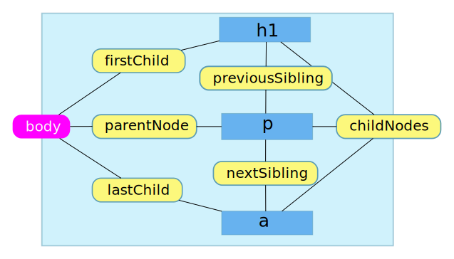

# Document Object Model

## Introducere

DOM este acronimul de la **Document Object Model**. DOM este un API (Application Programming Interface), care oferă posibilitatea de a manipula documentele HTML și XML. DOM-ul trebuie văzut ca un liant între tagurile HTML și JavaScript, fiind astfel permisă interacțiunea cu pagina.

Standardul spune că *programatorii pot redacta documente, pot parcurge structura lor și pot adăuga, modifica sau șterge elementele și conținutul acestora*.

Să vedem ce înseamnă *document* în cazul acestui API. Standardul spune că termenul *document* este utilizat în sens larg și se leagă de capacitatea XML-ului de a *reprezenta diferite tipuri de informație care pot fi stocate în diferite sisteme și mare parte dintre acestea vor fi văzute în mod tradițional ca date și nu ca documente*. Următoarea precizare este fundamentală pentru a înțelege relația dintre date, informație și reprezentarea acestora. Zice standardul: **\[...] XML prezintă aceste date ca documente iar DOM-ul poate fi utilizat pentru a gestiona aceste date**.

Standardul (DOM Core) spune că *prezintă documentele ca o ierarhie de obiecte Node care implementează alte interfețe mai specializate*. Hai să lămurim nițel care-i treaba cu interfețele astea. Sunt de fapt niște colecții de funcționalități implementate la nivel de browser de fiecare producător. Scopul este punerea la dispoziție de metode și proprietăți pentru a manipula diferite reprezentări de date.

Browserele când parcurg structura HTML, construiesc un arbore cu noduri care reprezintă elementele. Această structură este una vie, care poate fi manipulată într-o manieră dinamică.

## Ce sunt nodurile?

Nodul este un nume dat oricărui tip de obiect din ierarhia DOM. Nodurile pot fi obiectele native ale DOM cum ar fi `document` sau `document.body`, dar poate fi foarte bine și reprezentarea ca obiect a unui tag de HTML.

Fiecare obiect nod al DOM-ului are o proprietate `nodeType`. Acest `nodeType` indică tipul de care poate fi un nod:

- noduri document (`DOCUMENT_NODE` cu valoarea `1`), adică `window.document`, 
- noduri elemente (`ELEMENT_NODE` cu valoarea `1`), adică `body`, `p`, `html`, etc., 
- noduri de atribut (`ATTRIBUTE_NODE` cu valoarea `2`) așa cum sunt, de exemplu clasele specificate: `class="ceva"` sau `DOCUMENT_FRAGMENT_NODE` (`document.createDocumentFragment()`), ori `DOCUMENT_TYPE_NODE`,
- noduri text (`TEXT_NODE` cu valoarea `3`), adică caracterele unui text.

Aceste tipuri de noduri specificate prin constantele scrise cu majuscule poartă o valoare specifică fiecărui tip de nod. Pentru a afla valoarea constantelor se va apela numele constantei ca proprietate a obiectului `Node : Node.ELEMENT_NODE // 1`

Toate nodurile pe care le generează motorul browserului moștenesc proprietăți de la interfața `Node`. Adu-ți mereu aminte faptul că `Node` este un constructor, deci o funcție obiect, care moștenește totul din `Object.prototype`.

## Lucrul cu DOM

DOM-ul este de fapt o ierahie, un arbore de noduri. Fiecare dintre aceste noduri are un nod părinte, unul sau mai multe copil și unul sau mai multe pe același nivel ca și el.

Fiecare `nodeType` conține un cod sub forma unui număr care identifică tipul nodului. Elementele comune au valoarea `1`, o valoare pe care o poartă constanta ca proprietate `document.ELEMENT_NODE`.

```javascript
elementIdentificat.nodeType === 3;
```

Nodurile care sunt de text au valoarea 3 pentru constanta `document.TEXT_NODE`.

Se mai poate face o verificare folosind `instanceof`.

```javascript
elementIdentificat.nodeType instanceof Text
```

-   `document.documentElement` este rădăcina tuturor elementelor.
-   `document.body` este rădăcina întregului body.



## childNodes

Este un obiect array-like.
De exemplu, poți afla numărul de elemente: `document.body.childNodes.length`

## firstChild și lastChild

Pentru nodurile care nu au copii, valoarea acestora este `null`.

## previousSibling și nextSibling

Aceste proprietăți trimit la nodurile învecinate.
Pentru `firstChild` a primului nod copil, valoarea este `null`.

## Referințe online

-   [W3C DOM 4.1](https://www.w3.org/TR/2018/WD-dom41-20180201/)
-   [What is the Document Object Model?](https://www.w3.org/TR/REC-DOM-Level-1/introduction.html)
-   [1. Document Object Model (Core) Level 1](https://www.w3.org/TR/REC-DOM-Level-1/level-one-core.html)
