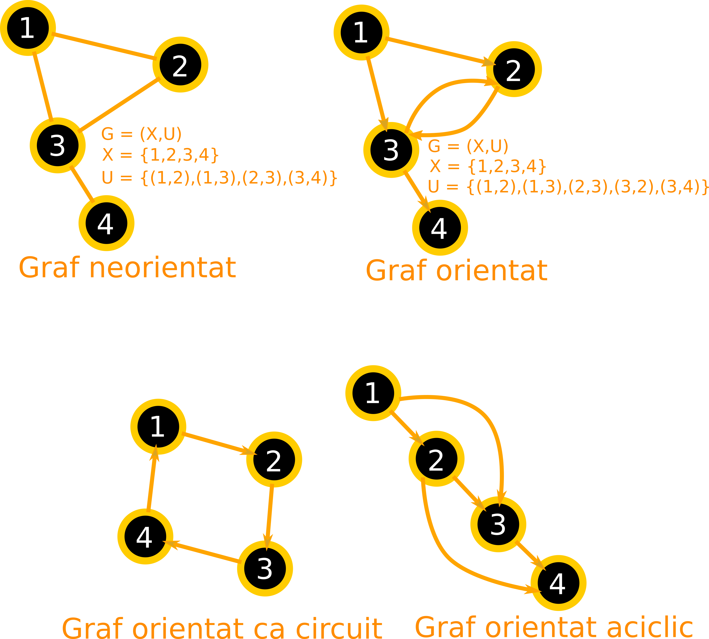

# Grafuri

## Introducere

Un graf este o abstracțiune matematică care este folosită pentru a reprezenta relațiile care se stabilesc într-o colecție de obiecte. În contextul unui graf, obiectele se numesc **noduri** sau **vertex**. Relația care se stabilește între două obiecte/noduri se numește **muchie** (*edge* în limba engleză).

> Numim graf o pereche ordonată de mulțimi, notată G=(X,U), unde X este o mulțime finită și nevidă de elemente numite noduri sau vârfuri, iar U este o mulțime de perechi (ordonate sau neordonate) de elemente din X numite muchii (dacă sunt perechi neordonate) sau arce (dacă sunt perechi ordonate). În primul caz, graful se numește neorientat, altfel acesta este orientat. Așadar un graf poate fi reprezentat sub forma unei figuri geometrice alcătuite din puncte (care corespund vârfurilor) și din linii drepte sau curbe care unesc aceste puncte (care corespund muchiilor sau arcelor). Numim drum într-un graf o succesiune de muchii adiacente și distincte care conectează două vârfuri din graf (numite capetele drumului). Un drum se numește simplu dacă muchiile care îl compun sunt distincte. Numim ciclu un drum care are drept capete un același vârf. Un ciclu se numește hamiltonian dacă este simplu și trece prin toate nodurile grafului G, exact o dată, și se numește eulerian dacă trece prin toate muchiile grafului G, exact o dată. Nu orice graf conține un ciclu hamiltonian. [Graf, Wikipedia](https://ro.wikipedia.org/wiki/Graf)

Grafurile sunt alcătuite dintr-un set de noduri sau vertices, precum și un set de muchii/arce sau edges în lb. engleză. Convențional, muchiile/arcele sunt notate printr-o pereche a nodurilor/vertices pe care le leagă: (v1, v2). În anumite grafuri, verticele au o pondere/weight care se numește cost. Indicarea unei direcții/orientare printr-o săgeată atunci când reprezinți muchia transformă graful într-unul orientat. Săgeata indică direcția de la un vertex către altul.

Un graf care nu indică nicio ordine este un graf simplu. În cazul în care unele noduri sunt conectate între ele prin muchii, acestea formează o cale. În cazul în care o cale pleacă dintr-un nod și se întoarce în același nod fără a trece prin ale noduri, spunem că formează o buclă. Atunci când o muchie pleacă dintr-un nod, ajunge în altul și apoi se întoarce la cel din care a plecat, spunem că am realizat un ciclu/cycle. Căile care repetă aceleași vertice în afară de cel de start și cel final se numesc cicluri generale. Două noduri sunt legate *puternic* dacă există o cale de la primul nod la al doilea și de la al doilea la primul.

Ordinul (cardinalitatea) unui graf este dat de numărul de noduri, iar mărimea sa este dată de numărul muchiilor.

### Drum/cale și lanț

Un graf orientat al cărui muchii/arce sunt într-o succesiune, fiecare  muchie/arc care urmează, pornind din extremitatea anteriorului, formează ceea ce se numește **drum**/**cale**. În cazul grafurilor neorientate, acesta se numește **lanț**.

Drumurile pot fi:
- elementare în care nodurile nu se repetă;
- simple în care muchiile nu se repetă;
- hamiltonian dacă nodurile nu se repetă (elementar) și sunt toate;
- eulerian dacă este simplu și sunt toate muchiile.

### Circuit și ciclu

Dacă ultimul **arc**/**muchie** a unui graf orientat intră în originea primului arc al grafului, numim acest graf, un **circuit**. În cazul grafurilor neorientate, se numește **ciclu**.

Trecerea o singură dată printr-un nod în intenția de a parcurge un nod, se numește **drum elementar**, iar parcurgerea unui nod, dar de această dată folosind o muchie o singură dată chiar dacă vei trece de mai multe ori printr-un nod, se numește **drum simplu**. Lungimea unui drum este totalitatea arcelor acelui drum. Acum, un circuit de lungime unu este chiar o buclă. **Distanța** de la un nod la altul este numărul de arce care leagă cele două noduri.

Dacă toate nodurile sunt legate de un arc, atunci graful se numește **graf complet**.

### Arbore

Un **arbore** este un graf finit neorientat cu cel puțin două noduri care este conex (adică pot face un lanț) și nu se pot forma cicluri.

## Tipurile de grafuri

În funcție de anumite particularități, putem elabora o tipologie a grafurilor:

- Grafurile ***simple*** sunt nedirectate, fără vreo pondere care nu conțin bucle sau noduri legate puternic.
- Grafurile ***neorientate***/***nedirectate*** sunt cele în care muchiile dintre două noduri *A* și *B* pot fi reprezentate prin perechea *(A, B)*, dar și vice-versa *(B, A)*. Pur și simplu nodurile sunt legate între ele printr-o linie care nu indică o direcție. Linia nu este o săgeată.
- Grafurile ***orientate***/***directate*** sunt cele în care liniile (*muchiile*) care leagă nodurile sunt săgeți care indică o direcție. Direcția se stabilește în funcție de o condiție de natură funcțională sau logică. În limba engleză există sintagma digraf pentru grafurile orientate.
- Grafurile ***ciclice*** sunt cele a căror muchii ce indică direcția care pleacă dintr-un nod și după ce au parcurs un traseu format din mai multe noduri, ultima direcție indică nodul de origine.
- Grafurile ***direcționate aciclice*** sunt cele în care nu se pot forma cicluri.
- Grafuri ***ponderate***/***weighted*** sunt grafurile în care muchiilor li se atribuie o pondere sau greutate.



## Parcurgerea/explorarea grafului

Complexitatea rezolvării unui graf este O(n+m) - noduri plus muchii, adică O(n).

```javascript
let noduri = 'București,Ploiești,Buzău,Brașov,Giurgiu,Pitești,Craiova,Sibiu,Râmnicu-Vâlcea'.split(',');

// ai putea folosi o matrice pentru a reprezenta relațiile (precum tabla de șah)
//
// dar ar fi o metodă care nu este prea eficientă, pentru că ar fi o matrice cu prea multe goluri

// cel mai eficient din punct de vedere al căutării ar fi o listă de conexiuni
let conexiuni = [
  ["București","Ploiești"],
  ["București","Giurgiu"],
  ["București","Pitești"],
  ["Pitești","Râmnicu-Vâlcea"],
  ["Ploiești","Brașov"],
  ["Pitești","Craiova"],
  ["Sibiu","Brașov"],
  ["Sibiu","Râmnicu-Vâlcea"],
  ["Brașov","Buzău"],
  ["Ploiești","Buzău"]
];

// implementarea grafului nedirecționat folosind un Map (listă de noduri adiacente)
let graf = new Map();

/**
* Adaugă nodurile în graful reprezentat ca Map
* @param {String} numele orașului care este și nod
*/
function adaugaNod (oras) {
  graf.set(oras, []); // adaugă nodul în graf
};

/**
* Adaugă muchiile în graful care
* @param {String} `origine` numele orașului din care pleci
* @param {String} `destinatie` numele orașului în care vrei să ajungi
*/
function adaugaMuchie (origine, destinatie) {
  graf.get(origine).push(destinatie);
  graf.get(destinatie).push(origine); // și vice-versa
};

//crearea grafului
noduri.forEach(adaugaNod);
conexiuni.forEach((conexiune) => adaugaMuchie(...conexiune));
```

## Algoritmi de explorare a grafului

### BFS - Breadth First Search

Acest algoritm va parcurge toate nodurile pentru a găsi destinația. Întregul graf va fi parcurs.

```javascript
// BFS - Breadth First Search
// Acest algoritm este foarte bun pentru a descoperi cea mai bună cale de a ajunge la o destinație.

/**
* Funcția are nevoie de un punct de start pentru a începe căutarea
* Căutarea se va face vizitând copii nodului și apoi mai departe
* până când este găsit nodul căutat ca destinație.
* @param {String} `start`
*/
function bfs (start) {
  const vizitate = new Set(); // structura este necesară pentru a ține evidența nodurilor deja vizitate
  const queue = [start]; // căutarea se va face prin implementarea unei cozi de tipul FIFO.
  // câtă vreme există un element în array, vom lua primul element folosind shift.
  while (queue.length > 0) {
    let nod = queue.shift(); // obținerea primei valori intrate; array-ul original va fi transformat la aplicarea lui shift.
    let conexiunileDirecte = graf.get(nod); // pentru nodul vizat, obține lista tuturor posibilelor conexiuni directe.
    // având toate posibilele destinații directe ale nodului, le vom adăuga în `queue` în vederea adăugării ca posibile puncte de start ale căutării mai departe
    let destinatie;
    for (destinatie of conexiunileDirecte) {

      if (destinatie === 'Sibiu') {
        console.log(`Am găsit destinația mea: Sibiu`);
      }

      // Vom introduce o destinație în `queue` doar dacă nu a fost vizitată deja
      if (!vizitate.has(destinatie)) {
        vizitate.add(destinatie); // adaugă destinația în setul de control
        queue.push(destinatie); // adaugă în `queue` doar dacă nu a fost vizitat
        console.log(destinatie);
      }
    }
  }
};
```

### DFS - Deep First Search

Este un algoritm care permitea găsirii cât mai rapide a unei rute către destinație. Se pornește de la un nod și apoi se caută în nodurile copil și nodurile copil ale acestora ș.a.m.d. până când este găsită destinația. În caz contrar, se face un backtracking pentru a căuta pe o ramură diferită.

```javascript
let pasi = 0;
function dfs (start, vizitat = new Set()) {
  // parametrul vizitat va ține contul nodurilor deja vizitate.
  vizitat.add(start); // adaugă nodul de start la setul care ține evidența.
  let destinatii = graf.get(start);
  let destinatie;
  for (destinatie of destinatii) {

    if (destinatie === 'Sibiu') {
      console.log(`pașii necesari pentru găsirea Sibiului sunt ${pasi}`);
      return;
    }

    // dacă un nod nu a fost deja vizitat, funcția va fi apelată recursiv
    if (!vizitat.has(destinatie)) {
      dfs(destinatie, vizitat);
      pasi++;
    }
  }
};
```

## Resurse

- [Graph Search Algorithms in 100 Seconds - And Beyond with JS | Fireship](https://www.youtube.com/watch?v=cWNEl4HE2OE)
- [Graph Algorithms for Technical Interviews - Full Course | freeCodeCamp.org](https://www.youtube.com/watch?v=tWVWeAqZ0WU)
