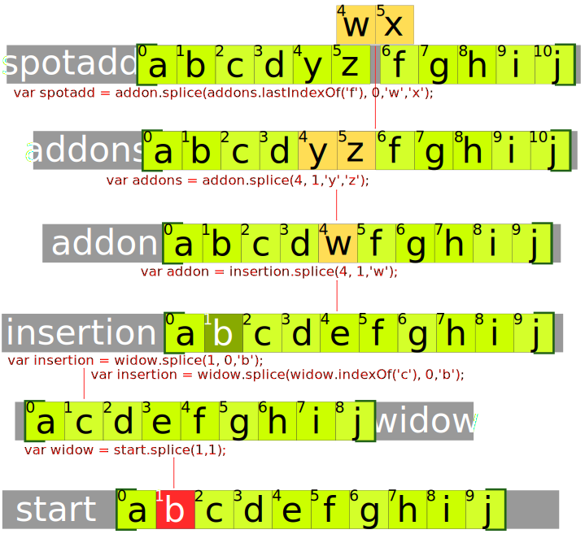
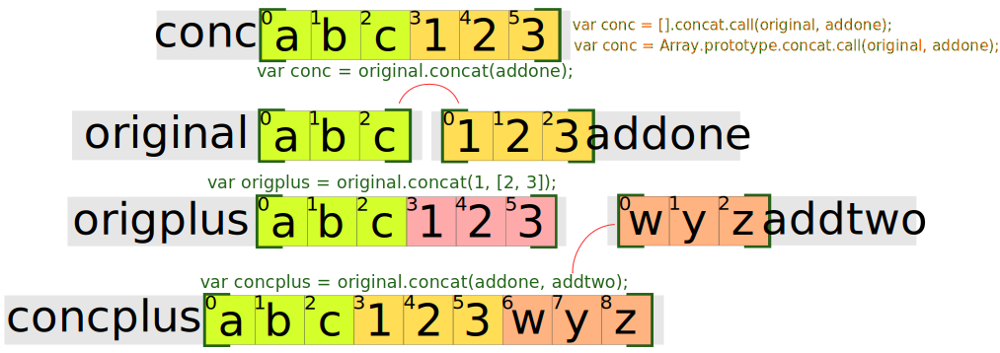

# Generalități

Array-urile conțin mai multe valori numite elemente.
Indexarea internă a elementelor atunci când nu este explicită, pornește de la 0.

| valoare | el1 | el2 | el3 |
|---------|:---:|:---:|:---:|
| index   |  0  |  1  |  2  |

## Crearea array-urilor

### Folosind constructorul: ```new Array()```
```js
var tablou = new Array();
```

### Cu declararea simplă prin paranteze drepte: array literal
```js
var tablou = [];
```

## Mantre

- ``Array`` este un obiect global. Acesta este folosit pentru crearea array-urilor
- Array este un obiect iterabil pentru că obiectul prototip are o metodă @@iterator (precum String, TypedArray, Map și Set).

### Metode aplicabile obiectului array

| to               | încărcare/descărcare | extragere/încărcare | identificare    | parcurgere/mutații | altele       | creare       |
|:-----------------|:---------------------|:--------------------|:----------------|:-------------------|:-------------|:------------ |
| toSource()       | push()               | splice()            | lastIndexOf()   | map()              | copyWithin() | Array.from() |
| toString()       | pop()                | slice()             | indexOf()       | reduce()           | fill()       | Array.of()   |
| toLocaleString() | shift()              | concat()            | find()          | reduceRight()      | entries()    | |
|                  | unshift()            |                     | findIndex()     | filter()           | includes()   | |
|                  |                      |                     | keys()          | some()             |              | |
|                  |                      |                     | Array.isArray() | every()            |              | |


#### Metoda slice


#### Metoda splice



#### Array.from()

Creează o instanță ``new Array`` din orice obiect care arată ca un array sau care iterabil.
Obiectele din care se creează array-urile trebuie să aibe o lungime și elemente indexate.

```js
function f() {
  return Array.from(arguments);
}

f(1, 2, 3);
// [1, 2, 3]

// String
Array.from("foo");                      
// ["f", "o", "o"]
```

#### Array.isArray()

Este testat un obiect pentru a vedea dacă este un array.

```js
var test = ['unu', 'doi', 'trei', 'patru'];
Array.isArray(test); // true
```

#### Array.of()

Metoda creează o instanță ``new Array`` cu un număr variabil de argumente indiferent de numărul sau tipul argumentelor.

Diferența dintre metoda Array.of() și constructorul Array este în felul în care sunt gestionate argumentele ca numere întregi. Array.of(42) creează un array cu un singur element în vreme ce Array(42) creează un array cu 42 de elemente.

#### Array.prototype.concat()

Realizează o „copie simplă” (shallow copy) formată din elementele array-ului asupra căruia se invocă metoda și elementele care se doresc a fi adăugate.

Elementele array-urilor originale sunt copiate în noul array format respectându-se următoarele reguli:
- în cazul obiectelor sunt copiate referințe către acestea, nu obiectele în sine. Dacă un obiect referențiat este modificat, se va reflecta în array-ul original și cel nou format.
- în cazul șirurilor și numerelor, acestea vor fi copiate în noul array. Modificarea valorilor din array-urile originale nu se vor răsfrânge în cel nou constituit.




## Menționarea resurselor folosite pentru documentare:
[MDN>Web technology for developers>JavaScript>JavaScript reference>Standard built-in objects>Array](https://developer.mozilla.org/en-US/docs/Web/JavaScript/Reference/Global_Objects/Array?redirectlocale=en-US&redirectslug=JavaScript%2FReference%2FGlobal_Objects%2FArray)
