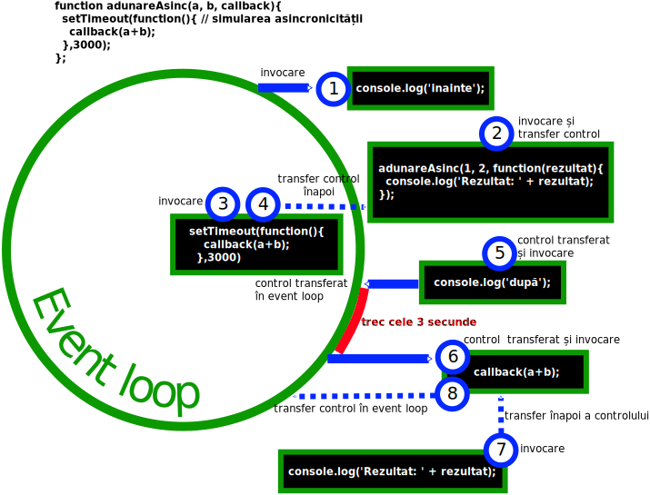

# Ce sunt callback-urile?

Este o funcție care este executată ca răspuns la un eveniment. Ori de câte ori o funcție este construită pentru a fi apelată ulterior, fie de browser, fie de o altă parte a codului, aceasta se numește `callback`.

Un callback este o funcție care este pasată ca argument unei alte funcții și care este invocată atunci când se ajunge la un rezultat. Pe scurt, rezultatul funcției nu este intors celui care a invocat-o, ci este preluat de callback.

În programarea funcțională, acest mod de a propaga rezultatul se numește „continuation-passing style” (CPS). Returnarea rezultatului dintr-o funcție se numește „direct style”.

```js
// exemplificare direct style versus continuation-passing style

function adunare(a, b){
  return a + b;                      // direct style
};

// adunare ca operațiune sincronă
function adunare(a, b, faAdunarea){
  faAdunarea(a + b);                // continuation-passing style
};                                  //se va returna o valoare abia după ce callback-ul și-a încheiat execuția

console.log('inainte de adunare');
adunare(1, 2, function(rezultat){  // callbackul primește un singur argument, care reflectă evaluarea operațiunii a+b
  console.log('Rezultatul este: ' + rezultat);
});
console.log('după adunare');
// mesajele în consolă apar în ordine

// adunarea ca operațiune asincronă
function adunareAsinc(a, b, callback){
  setTimeout(function(){ // simularea asincronicității
    callback(a+b);
  },3000);
};

console.log('inainte');
adunareAsinc(1, 2, function(rezultat){  // callbackul primește un singur argument, care reflectă evaluarea operațiunii a+b
  console.log('Rezultat: ' + rezultat);
});
console.log('după');
// mesajul rezultatului apare în consolă după
```

Atenție! funcția adunareAsincrona nu va mai aștepta la execuție să se declanșeze execuția callbackului și va relua execuția mai departe și abia după ce setTimeout va fi terminat, după cele 3 secunde, abia atunci va fi executat și callback-ul. După ce timpul se va fi scurs, execuția callback-ului returnează rezultatul. Menținerea contextului se face datorită closure-ului.



## Mantre

- Funcțiile pot fi pasate ca argumente altor funcții.
- Funcțiile care acceptă alte funcții drept argumente sau care returnează funcții se numesc „funcții de ordin superior” - „higher-order function”.
- Nu toate funcțiile cărora li se pasează un callback sunt asincrone. Un exemplu este `[1,2].map(function(elem){return elem+1;});`. Rezultatul este returnat sincron folosind „direct style”.

În programare, un callback este o secvență de cod executabilă care este pasată ca argument unei funcții. Aceasta este „apelată” - „called back” de către funcție la un moment ulterior.

Cel mai simplu exemplu este oferit de execuția la un anumit moment în timp.

```js
function arataMesajul(mesaj){
  setTimeout(function(){
    alert(mesaj);
  }, 3000);
}

arataMesajul('funcția internă este chemată după trei secunde');
```

Un alt exemplu simplu ca demonstrație:

```js
function test (numeFuncție){
  return numeFuncție();
};
```

## Mantre

- Funcțiile sunt obiecte first-class
- Funcțiile pot fi pasate ca argumente alor funcții și pot fi returnate din funcții.
- Atunci când funcția este un callback, ține minte că tot o referință către funcție este (implicit assignment), nu este valoarea sa.

## Folosire

Sunt folosite în bibliotecile de cod pentru că oferă reutilizare. Permite ca metodele bibliotecii să fie ușor de configurat și de extins.

### Utilizare în Node.js

Un exemplu de folosire a callback-urilor în Node.js

```js
var fs = require('fs');

var callback = function faCeva(error, data){  // o practică bună este a numi funcțiile pentru a le vedea în stivă
  if(error){
    return callback(error, null);
  };
  // fă ceva cu datele
};

fs.readFile('date.csv', 'utf-8', callback);
```

Atenție, în Node, primul argument al unui callback va fi întotdeauna un obiect de eroare. Acesta este modelul care trebuie urmat. Datele vehiculate constituie cel de-al doilea argument.
