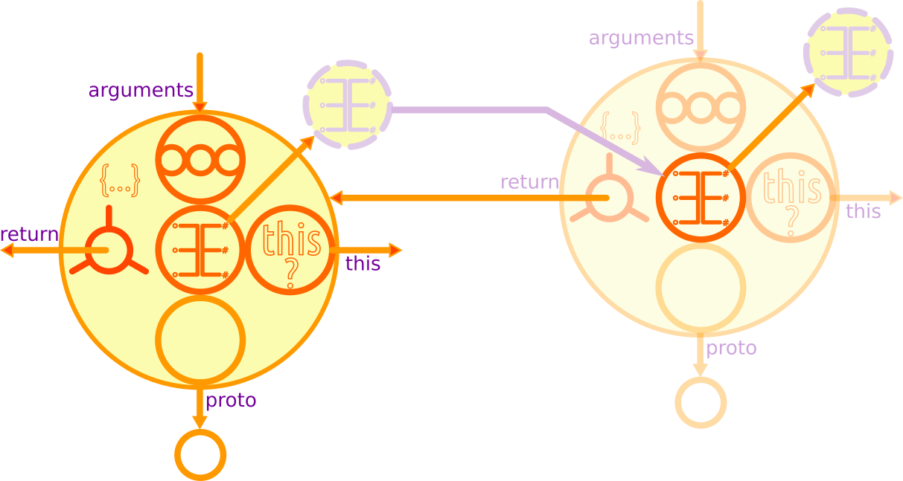
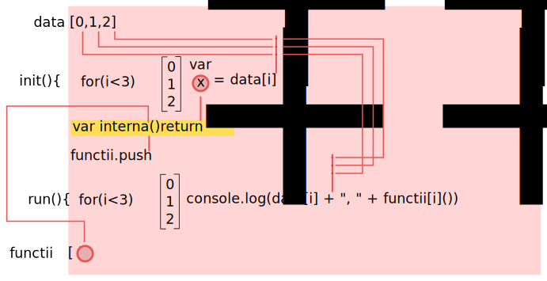

# Closures

O funcție definită în interiorul unei funcții container, generează un closure.

Cum am putea traduce în română termenul de *closure*. Am explorat deja la funcții posibile traduceri în limba română și pentru că ambii termeni identificați: **portiță** și  **breșă** nu sunt tocmai eleganți pentru uzul curent, am căzut de acord că vom folosi termenul în limba engleză. După ce vom fi explorat mai mult, vom înțelege că este o caracteristică, un mecanism al limbajului de programare și astfel, am putea să ne gândim la acțiunea pe care o implică termenul de **closure**. Să o luăm încetișor. Primul lucru pe care-l știm despre funcții, este că acestea sunt acțiuni transformatoare asupra datelor pe care le primesc (aplicarea pe argumente de care am pomenit), fie că aceste date sunt „injectate” în funcție prin argumente, fie că sunt disponibile „la liber” în mediul lexical unde a fost declarată funcția. Trebuie să ne aducem mereu aminte de importanța redactării codului și în consecință de locul unde declarăm funcțiile. Foarte important este și locul de unde le apelăm pentru că de acolo este posibil să „injectăm” prin argumente date, care sunt necesare doar în locul în care este apelată funcția sau în obiectul în a cărui context a fost invocată.

O funcție declarată în mediul lexical global, va avea acces la toate proprietățile acestui obiect. Dacă o funcție, va fi declarată într-un bloc de cod sau într-o altă funcție, aceasta va avea acces la tot ce constituie mediul lexical format local de acel bloc de cod sau de funcție.

Acum apare minunea: dacă declari o funcție în interiorul altei funcții, pe care o returnezi, vei avea acces la un set de date ce nu pot fi prelucrate direct. Acesta este și motivul pentru care avem acest instrument foarte puternic care este closure-ul.

Ascunderea unui set de date ce nu poate fi manipulat direct, care poate fi accesat la un moment dat sau dacă este nevoie cu o anumită întârzire, ori pur și simplu să știi că există o structură de date creată în anumite condiții, dar cu care poți interacționa, este ceea ce oferă closure-urile.

Bineînțeles vei avea o variabilă-identificator căreia îi va fi asignat rezultatul evaluării funcției gazdă. Rezultatul va fi funcția returnată (**nu uita niciodată că mai întâi de toate, o funcție este o valoare în sine**), care, MAGIE! are acces încă la mediul lexical al funcției gazdă, chiar dacă aceasta și-a încheiat execuția.



Te vei întreba pe bună dreptate: cum să mai fie disponibile datele unei funcții care și-a terminat execuția, când știm foarte bine că „dispar” (sunt trimise la gunoi)?

Răspunsul este unul simplu și plin de lumină: funcția noastră a returnat o altă funcție, care și ea la rândul ei are nevoie de date din mediul lexical în care a fost declarată, plus toate referințele la datele necesare pentru a se putea face evaluarea codului din corpul său.

Și cum acestea aparțineau funcției gazde, acestea nu vor fi colectate la gunoi, ci vor fi disponibile tocmai pentru a-i servi celei returnate.

Profesorul Christopher Strachey, cercetător britanic în domeniul sistemelor de calcul, spunea încă din octombrie 1967:

> Aplicarea unei funcții argumentelor sale implică evaluarea expresiei care o definește după ce au fost date valori variabilelor conectate la acestea din lista argumentelor.

> Astfel, valoarea-R a funcției conține două părți: o regulă pentru evaluarea expresiei și un mediu care să-i ofere variabilele libere. O valoare-R de acest tip va fi numită un closure. Nu este nicio problemă în reprezentarea regulii dintr-un closure ca fiind adresa unui fragment de program ceea ce este suficient (i.e. punctul de acces pentru o subrutină). Cel mai direct mod de a reprezenta mediul este printr-un pointer (n.n. un pointer, este un indicator către o valoare) către un Free Variable List (FVL), care are câte o intrare pentru fiecare variabilă liberă a funcției. Această listă este formată atunci când funcția este definită inițial (mai exact atunci când expresia-λ care este funcția, este evaluată, de regulă la momentul definirii funcției) și în acest moment, fie valoarea-R, fie valoarea-L a oricăreia dintre variabilele libere este copiată în FVL.

Funcțiile sunt valori! Pot fi pasate ca valori altor funcții și pot fi returnate de funcții ca valori. Te vei întreba pe bună dreptate care este utilitatea acestui aspect? Răspunsul vine tot din necesitatea de a manipula valori, dar care aparțin unor medii lexicale diferite, a celor care există în locul declarării funcției care face closure.

**Moment Zen**: Closure-urile cuplează funcțiile cu mediile peste care face closure-uri.

Un closure menține accesul la toate variabilele care erau „în scope” la momentul definirii funcției. Putem spune că o funcție din interiorul altei funcții este o funcție ***privată***, cu acces la mediul lexical al gazdei.

**Moment Zen**: Toate closure-urile - funcțiile din aceeași gazdă - împărtășesc același mediu.

Acest comportament al closure-urilor este perfect pentru a „ascunde” date, pentru a le face private.

## Closure cu fat arrows

Cel mai simplu și mai elegant exemplu este oferit de sintaxa modernă **fat arrow** pentru a ilustra un closure. Acest exemplu concis este prezentat de Reg “raganwald” Braithwaite în lucrarea sa „JavaScript Allongé, the **Six** Edition” și îl vom diseca la rândul nostru pentru a vedea cum se leagă cunoștințele dobândite de la **mediul lexical**, **funcții** și **compilare și execuție**.

```javascript
((x) => (y) => x)(5)(10); // 5
```

Ceea ce avem mai sus este o expresie a unei funcții care este executată pe argumentul din prima paranteză, iar rezultatul evaluării va fi o funcție care se va executa pe al doilea parametru.

Avem o formă contrasă: `(expresie)(argument)(argument)`. JavaScript va vedea a doua pereche de paranteze și va decide că perechile de paranteze `(expresie)(argument)` trebuie evaluate.
Pornind execuția codului, motorul va evalua ce-i în prima paranteză căutând expresia de funcție care este declarată. O găsește iar aceasta arată astfel: `(x) => ...`.

Acum, pasul următor este să construiască „registrul inventar” al mediul lexical: `{x: 5, ...}`. S-a ajuns la faza returnării, dar, ce să vezi? Rezultatul returnării este o altă expresie, care, conform modului de operare al JavaScript, trebuie evaluată, dar care se aplică pe argumentul din a treia pereche de paranteze, adică `10`. Deci, va trebuie evaluată expresia `((y) => x)(10);`. În acest moment, „registrul inventar” al acestei funcții este `{y: 10, ...}` plus registrul inventar al funcției gazdă `{x: 5, ...}`. Variabila `x` pare să nu mai existe în noul mediu lexical stabilit. Și totuși ea există pentru că tocmai a fost returnată. Variabila `x` nu a fost pasată **explicit** celei de-a doua funcții și este una „detașată”, dar accesibilă.
Referința către variabila `x` este menținută pentru că funcția internă, cea care trebuie returnată în cazul nostru pur și simplu are nevoie de ea pentru a se executa, pentru a fi evaluată. De aceea există.

**Moment Zen**: Funcțiile care nu păstrează referințe către variabile „detașate”, se numesc funcții **pure**. Funcțiile care păstrează astfel de referințe, se numesc **closures**.

Și acum vine o concluzie importantă: funcția gazdă este pură pentru că nu are referințe către variabile „detașate”, dar poate găzdui funcții care fac closure. Reține faptul că în cazul `(x) => (y) => x`, evaluarea se face funcției gazdă.

Funcția definită și care face closure poate fi asignată unei variabile, pasată ca argument unei alte funcții sau poate fi returnată.

**Efect**: Scope-ul existent (totalitatea identificatorilor) la momentul definirii funcției va fi accesibil câtă vreme există o referință către funcția returnată care face closure-ul. De fapt, closure-urile sunt un efect al modului în care lucrează motorul JavaScript pentru a realiza scope-urile (**lexical environment**). Fiecare funcție imbricată creează propriul scope la momentul evaluării. În cazul mai multor niveluri de adâncime, creându-se un lanț al scope-urilor, trebuie avut grijă la conflictele ce pot apărea atunci când doi identificatori poartă același nume.

Closure este atunci când o funcție ține minte scope-ul lexical chiar și atunci când este executată în afara acelui scope lexical (Kyle Simpson).

**Moment Zen**: definirea unei funcții are ca efect menținerea „în viață” a tuturor identificatorilor necesari pentru ca aceasta să fie executată.

Simplist poți spune că un closure se formează atunci când o funcție returnează o alta pe care a găzduit-o sau când există o referință externă la funcția internă. Acest lucru înseamnă că această funcție poate fi invocată la un moment viitor.

```javascript
function closureEx () {
  var a = 'ceva';
  function logger (valoare) {
    console.log(a);
  };
  logger();   // execuția este imediată
};
closureEx();
```

Returnarea unei funcții care va deveni valoarea unei variabile.

```javascript
function closureEx () {
  var a = 'ceva';
  return function (valoare) {
    console.log(a);
  };
};

var cheama = closureEx(); // execuția este la nevoie prin asignarea ei la o variabilă
cheama('a');              // ceva
cheama.toString();        // "function (valoare){ console.log(a);}"
```

La nevoie, se poate executa funcția returnată fără a mai fi asignată.

```javascript
closureEx()();
```

## Dependințe cognitive

- funcții
- scope (**Lexical Environment**)

## Mantre

- Folosirea cuvântului cheie `function` într-o funcție gazdă, creează un closure.
- JavaScript are un **scope lexical** (lexical environment) generat la faza de compilare.
- Closure-uri generează doar funcțiile.
- Closure-ul în sine nu este un obiect care să conțină toată informația necesară.
- Un closure permite accesarea variabilelor definite în funcția container și, atenție, le poate și modifica.
- Toate variabilele din scope, chiar dacă sunt declarate după ce funcția container a fost declarată, sunt incluse în closure.
- Accesarea de informație prin intermediul unui closure, taxează memoria, pentru că la fiecare invocare a funcției care face closure, un nou set de informații va fi alocat în memorie.
- În cazul buclelor, bindingul closer-ului se va face pe ultimul rezultat al buclei. Nu te aștepta să existe rezultate intermediare. În acest caz, abia la momentul returnării funcției interne, se face referențierea valorilor și de aceea va fi ultima valoare din operațiunea de ciclare.
- De fiecare dată când funcția externă este apelată, funcția internă este definită din nou. Codul funcției interne va fi identic, dar scope chain-ul asociat va fi diferit. Pe scurt, se resetează valorile la cele definite, daca acestea au fost modificate.
- De fiecare dată când funcția gazdă este apelată, se creează un nou set de variabile pentru acea invocare.
- Variabilele din scope-ul pus la dispoziție de un closure **pot fi modificate**.
- **Un closure nu poate accesa `this` al funcției container**. În acest scop se folosește salvarea lui this într-o variabilă `var self = this;`
- Un closure stochează valorile externe prin referință, nu prin valoare.
- Ori de câte ori folosești `eval()` într-o funcție, este folosit un closure. Textul de cod pe care-l folosești cu eval poate referenția variabile locale ale funcției gazde, dar și variabile declarare în textul de cod folosit cu eval.
- Folosirea constructorului de funcții în interiorul unei funcții gazde `new Function()`, nu conduce la crearea unui closure.
- Closure-urile pot merge mai adânc de un nivel.
- Closure-ul introduce posibilitatea unor **variabile private**.
- Pentru ca un closure să se formeze nu este neapărat nevoie să se facă un return. Accesarea variabilelor din afara scope-ului lexical propriu, creează un closure.

## Anatomie

Un closure, are acces la:
- variabile și obiectele care aparțin de scope-ul global,
- variabilele și obiectele care aparțin scope-ului funcției părinte, plus parametrii acesteia,
- toate variabilele declarate după (d.p.d.v. lexical) ce funcția (care face closure-ul) a fost declarată.

### La ce avem acces:

```javascript
var extern = 1000;
function gazda(par){
  var interna = 100;
  return function(){
    var proprie = 10;
    console.log(
      'this este: ' + this + '; extern gazdei: ' + extern + '; interna gazdei: ' + interna + '; cea proprie: ' + proprie + '; dupa: ' + dupa + '; parametru: ' + par
    );
  };
};
var dupa = 10000;
var init = gazda('ceva');
typeof init; // => "function"
init();
// this este: [object Window];
// extern gazdei: 1000; interna gazdei: 100;
// cea proprie: 10; dupa: 10000; parametru: ceva
init.__proto__.constructor // => function Function()
```

Un closure este mecanismul prin care putem obține o încapsulare dinamică a stării scope-ului, care, atenție, poate fi modificat atâta vreme cât closure-ul există. Cel mai simplu closure se face atunci când funcția internă se execută chiar în funcția gazdă.

Closure-urile întâlnite în practica curentă se fac prin returnarea unei funcții sau a unui obiect care conține metode sau se poate crea la momentul execuției funcției chiar în interiorul funcției gazdă.

### Closure fără a returna

```javascript
function faCeva () {
  var interna = 10;
  function plasa (val) {
    console.log(interna + val);
  };
  plasa(10);
};
faCeva(); // 20
```

Pentru ca un closure să se formeze nu este neapărat nevoie să se facă un `return`. Accesarea variabilelor din afara scope-ului lexical propriu, creează un closure.

### Closure fără a returna cu o referință către funcția internă

Execuția funcției interne se va face din extern, nu prin execuția containerului.

```javascript
var externa = 'ceva extern';
var referintaCatreIntern;
function container(){
  var valContainer = 'ceva din container';
  function interna(){
    console.log('Am acces la ' + externa + ' și la ' + valContainer);
  };
  // încarci referința către funcția internă în variabila din afara containerului.
  referintaCatreIntern = interna;
};
container();            // se creează closure-ul
referintaCatreIntern(); // Am acces la ceva extern și la ceva din container
// din interiorul funcției interne poți executa funcția container;
// este echivalentul seriei de execuție de mai sus
referintaCatreIntern(container());
```

### Variabile „private” și accesarea acestora.

Cazul cel mai simplu este al unei funcții returnate care păstrează referințele către toți identificatorii din propriul scope, dar și scope-ul părinte. Aici se observă cât de intim conceptul de closure este legat de cel al scope-ului (lexical environment) creat la momentul compilării codului sursă (**function code**).

```javascript
function gazda(ceva){
  return function(altceva){
    console.log(this); // va fi Window
    return ceva + ' și ' + altceva;
  };
};
let faCeva = gazda("Lică");
faCeva ("Ionel salută colegii!"); // "Lică și Ionel salută colegii!"
let faAltceva = gazda("x");
faAltceva(0);                     // "x și 0"
```

### Crerea de obiecte noi folosind constructori.

Înainte de a porni lucrul cu un exemplu, ar fi necesar să amintim getter-ii și sette-rii.

```javascript
function Lansare (data) {
  var altitudine = 0;
  const viteza = 11;
  this.getAltitudine = function () {
    console.log(data + ' la altitudinea de ' + altitudine);
  };
  this.setAltitudine = function (val) {
    altitudine = val;
  };
};
var primaLansare = new Lansare("19.01.2016");
primaLansare.setAltitudine(30000);
primaLansare.getAltitudine(); // 19.01.2016 la altitudinea de 30000

var aDouaLansare = new Lansare("24.06.2016");
aDouaLansare.setAltitudine(45000);
aDouaLansare.getAltitudine(); // 24.06.2016 la altitudinea de 45000
```

**Pas cu pas**:

1. `new` execută Lansare().
2. Este instanțiat un nou obiect pe care-l vor folosi metodele drept context (`this`).
3. Când firul de execuție întră în `Lansare()` este creată automat o referință către lexical environment-ul (scope-ul) găsit. În exemplul nostru sunt doi identificatori, variabila `altitudine` și constanta `viteza`. De fiecare dată când este invocată o funcție cu rol de constructor, se creează un nou **lexical environment** (scope), care conține identificatorii pentru varibilele locale ale funcției contructorului. În timpul execuției cu `new` a funcției constructor `Lansare()`, se creează și cele două funcții (`getAltitudine` și `setAltitudine`), care devin proprietățile noului obiect creat (`primaLansare`). Respectând tipicul, funcțiile acestea vor păstra o referință a scope-ului în care au fost declarate, adică **lexical environment**-ul lui `Lansare`. Efectul final este că putem accesa funcțiile `getAltitudine` și `setAltitudine`, bineînțeles cu rolurile lor de metode ale noului obiect, dar care fac closure pe variabilele existente în `Lansare()`: `altitudine` și `viteza`. Cu alte cuvinte, țin în viață lexical environment-ul (scope-ul) lui `Lansare`.
4. Pentru `aDouaLansare` întreg procesul se repetă, dar cu valorile originale ale variabilelor din funcția constructor `Lansare`. Metodele celor două obiecte generate vor fi diferite.

Trebuie remarcat faptul că în exemplul nostru metodele sunt rulate în **global execution context**, iar scope-ul asociat, firesc, este cel global.
La execuția metodelor, acestea vor crea câte un context de execuție propriu care va fi adăugat la call-stack și care va dispărea din stack la momentul finalizării execuției lor. Executarea metodelor mai are ca efect crearea scope-ului propriu (**lexical environment**) și crearea referinței către scope-ul în care au fost create (Lansare), care era activ la crearea funcției. Accesarea variabilei altitudine se face prin căutarea mai întâi în propriul scope creat, care nu conține un identificator pe nume altitudine și mai apoi căutarea în scope-ul care exista la momentul creării, adică scope-ul lui Lansare, unde îl găsește și rezolvă aducând valoarea.

Reține faptul că în cazul în care este nevoie poți atribui metoda unui obiect creat cu `new` unei proprietăți a altui obiect creat ad-hoc și care va putea accesa valorile din scope-ul funcției contructor. Acest caz conduce la concluzia că aceste variabile nu sunt atât de ascunse pe cât s-ar crede la prima vedere. Dar acest mecanism totuși este cel mai aproape de „încapsularea” din alte limbaje de programare.

### Crearea accesarea și modificarea membrilor unui obiect

Pentru a înțelege exemplul de mai jos, nu uita faptul că funcțiile în JavaScript sunt obiecte și că, orice funcție în JS, poate face referință la variabile definite în scope-ul extern.

```javascript
function unObiect () {
  var oValoare;
  return {
    set: function(modVal){ oValoare = modVal; },
    get: function(){ return oValoare; },
    tip: function(){ return typeof oValoare; }
  };
};
let x = unObiect(); // typeof x => "object"
x.get();    // undefined
x.set(10);  // undefined
x.get();    // 10
x.tip();    // "number"
```

La invocarea lui `unObiect`, s-a returnat obiectul care are trei closure-uri (`set`, `get` și `tip`). Toate aceste trei closure-uri au acces la variabila `oValoare`.

Asemănător, se pot declara variabile care să fie referințe către funcții declarate în interiorul unei funcții gazde.

```javascript
var set, get, tip;
function gazda () {
  var interna = 1000;
  set = function (val) { interna = val; };
  get = function () { return interna };
  tip = function () { return typeof interna; };
};
gazda();
get();        // 1000
tip();        // "number"
set("ceva");  // undefined
get();        // "ceva"
tip();        // "string"

gazda();
get();        // 1000
```

Se observă că după invocarea a doua oară a funcției gazdă, orice modificare internă suferită anterior dispare, scope-ul și funcțiile fiind recreate.

### Crearea și accesarea membrilor unui obiect creat cu un constructor

John Resig aduce acest caz de closure format la crearea unui obiect pe baza unei funcții constructor.

Funcțiile cu rol de constructori pot defini întern metodele, iar acestea devin niște metode tip „accessor” sau „getter”, care te ajută să ajungi din scope-ul extern la valorile din constructor.

```javascript
function Sablon(){
  var cantitate = 10;

  this.getCantitate = function () {
    return cantitate;
  };

  this.incrementare = function () {
    cantitate++;
  };
};

var obiect1 = new Sablon();
// se generează un obiect care va fi contextul pentru funcțiile din constructor.
obiect1.getCantitate(); // 10
obiect1.incrementare(); // undefined
obiect1.getCantitate(); // 11
var obiect2 = new Sablon();
// se generează un alt obiect pentru care toate valorile din constructor sunt cele originale
obiect2.getCantitate(); // 10
```

Pentru a ajunge la cantitate este nevoie de metode de acces (în engleză li se spune **accessors**). Acesta este și unul din cazurile de realizare a unui closure. Trebuie reținut faptul că pentru funcțiile din contructor, `this` este obiectul generat prin invocarea cu `new`.

## Referințe către obiecte care nu fac closure.

Exemplu de referințe către obiecte care nu sunt un closure (prezentat de Kyle Simpson):

```javascript
var obiect = (function(){
  var o = {test: "test"};
  return {obj: o} // obj ține o referință către obiectul o
})();

console.log(obiect.obj.test); // => test
```

## Concluzii

Closure-ul poate simula variabile private.
Este baza șablonului tip modul (MODULE PATTERN) prin care se realizează încapsularea și/sau ascunderea datelor.

Cu ajutorul closure-urilor se poate scrie cod care să ruleze într-un mediu izolat. Closure-ul propune un model de incapsulare a funcționalităților, durează câtă vreme rulează aplicația și oferă o zonă privată, care poate memora o stare. Un exemplu este o funcție anonimă executată imediat.

```javascript
// exemplu de closure anonim
(function () {
	// toate variabilele și funcțiile se află doar în acest scope
	// se pot accesa toate variabilele globale
}());
```

Pornind de la acest model, se poat rula cod extern:

```javascript
(function($, Mootools){
  // acum ai acces la globalele jQuery ca prescurtarea $ și la Mootools
}(jQuery, Mootools));
```

### Lazy loading

TODO: explică ce este lazy loading

```javascript
var faCeva = function (bool) {
  var oValoare = 10;
  faCeva = function (bool) {
    if (bool === true) {
      return oValoare;
    }
  };
  return faCeva(bool);
}; console.log(faCeva(true)); // 10
```

## Erori

### Closure în bucle

Este considerată a fi o eroare crearea de closure-uri în bucle. Probleme pot apărea, de exemplu, atunci când o serie de bucle au drept scop încărcarea unui array cu funcții.

De exemplu, în cazul buclelor realizate cu `for`, binding-ul se va face pe ultima valoare stabilită și aceasta va fi returnată.
Pentru a soluționa problema, se va introduce bucla în funcția returnată:

```javascript
var colectie = ["Gino", "Rahan", "Mario"];
function faCeva(nume, unArray){
    for(var i = 0; i < unArray.length; i++){
      if(unArray[i] == nume){
        return function(){
          console.log(nume);
        };
      }else{console.log("Nu se potrivește");}
    }
};
var alege = faCeva("Gino", colectie);
alege();  // Gino
```

### Bucle buclucașe - iterări care produc closure-uri

Să ne aducem aminte faptul că ori de câte ori declari o funcție, aceasta face „o fotografie” a mediului lexical în care „s-a născut”.
Buclele buclucașe se referă la faptul că te aștepți la un anumit rezultat, dar pentru că variabilele declarate cu `var` permit ceea ce se numește „shadowing”, adică înlocuirea valorii imediat ce este disponibilă o nouă valoare căreia îi este atribuită, vei avea în closure ultima valoare a buclei pentru acea variabilă, nu valorile de etapă, adică valoarea pentru fiecare iterație.

Să luăm următorul exemplu:

```javascript
var functii = [];
for (var i = 0; i <= 3; i++) {
  functii[i] = function () {console.log(i);};
}; functii;
functii[0](); // 4
functii[1](); // 4
functii[2](); // 4
functii[3](); // 4
```

Probabil că ceea ce ai dori să obții este câte un closure pentru „valorile de etapă”.

Bun, să o luăm pe bucăți să vedem de unde am putea regla. Ceea ce trebuie să ne aducem aminte este faptul că `var i` este declarată în mediul lexical în care a fost inițiată instrucțiunea `for`. Acesta este efectul hoistării. Abia la nivelul lui `for` se va face atribuirea („legarea”) valorii. În cazul nostru este chiar cel „global”. Este ca și cum am scrie:

```javascript
var functii = [], i;
for (i = 0; i <= 3; i++) {
  functii[i] = function () {console.log(i);};
};
```

Să ne aducem aminte faptul că **funcțiile sunt la rândul lor valori**, care pot fi introduse într-un array.
Acum, efectul instrucțiunii `for` este că introduce într-un array declarații de funcții, care reprezintă fiecare câte o valoare. Pentru a fi limpede ceea ce tocmai s-a petrecut trebuie să ne aducem minte faptul că în cazul fiecărei funcții care face closure, aceasta face „o fotografie” a mediului în care a fost declarată (de fapt, o legătură dinamică la mediul lexical în care a fost definită), pentru a se putea executa, iar în cazul nostru în „fotografie” se găsește și `i`.
Buclucul vine la invocarea vreunei funcții din array pentru că valoarea lui `i`, după încheierea lui `for` rămâne 3. Când invoci funcția, ce să vezi, va găsi identificatorul, dar nu va mai găsi valoarea de la momentul introducerii în array, ci aceea de la finalul lui `for`.

### Menținerea valorilor de etapă

Soluția pentru a menține valorile de etapă este cea legată de executarea pentru fiecare ciclu a unui IIFE.

```javascript
var functii = [];
for (var i = 0; i <= 3; i++) {
  (function (i) {
    functii[i] = function () {console.log(i);};
  })(i);
};
functii[0](); // 0
functii[1](); // 1
functii[2](); // 2
functii[3](); // 3
```

Soluția funcționează pentru că IIFE-ul creează propriul mediu (scope), care va fi izolat de cel extern, dar care va „ține minte” valoarea din parametru pentru care funcția introdusă în array va face closure.

ECMAScript 2015 oferă `let` în sprijinul „ancorării” valorii la etapă.

```javascript
var functii = [];
for (let i = 0; i <= 3; i++) {
  functii[i] = function () {console.log(i);};
};
functii[0](); // 0
functii[1](); // 1
functii[2](); // 2
functii[3](); // 3
```

Iată un caz de closure care ilustrează cel mai bine felul în care se manifestă și efectele.

Cazul a fost preluat de la resursa online „js by example”: [Closures in loop](https://github.com/bmkmanoj/js-by-examples/blob/master/examples/closures_in_loop.md "Link către resursa originală Closures in loop")

```javascript
var data = [0, 1, 2];
var funcs = [];

function init() {                   // 0
  for (var i = 0; i < 3; i++) {
    var x = data[i];                // 1
    var innerFunc = function() {    // 2
        return x;
    };
    funcs.push(innerFunc);          // 3
  };
};

function run() {                    // 4
  for (var i = 0; i < 3; i++) {
      console.log(data[i] + ", " +  funcs[i]());   // 5
  };
};
init();
run();
// 0, 2
// 1, 2
// 2, 2
```



#### init()
`init()` ciclează de 3 ori iar `x` va rămâne după finalizarea buclei la valoarea `2`.
innerFunction face „enclosing” (circumscrie) variabila x.
La momentul execuției sunt introduse în array-ul `funcs` trei referințe către funcția internă a lui `init()`, astfel, făcându-se un clojure pe funcția internă.

#### run()

La execuție, `run()`, va executa rând pe rând funcțiile din `funcs[]`. Toate returnează aceeași valoare, adică ultima rezultată din execuția buclei.

#### PROBLEMA

Variabilele din funcțiile interne cu același identificator (`x` în cazul nostru) sunt legate de aceeași variabilă cu cea din funcția container. Acest lucru se întâmplă pentru că variabilele au același scope stabilit de funcția container. Variabilele nu sunt block scoped, adică limitate la scope-ul creat de funcția internă.

var data = [0, 1, 2];
```javascript
var funcs = [];
function init() {
  for (var i = 0; i < 3; i++) {
    var x = data[i];
    var innerFunc = function() {
      var temp = x;
      return function() {
      };
        return temp;
    }();
    funcs.push(innerFunc);
  }
function run() {
};
  for (var i = 0; i < 3; i++) {
    console.log(data[i] + ", " +  funcs[i]());
  }
};
init();
run();
// 0, 0
// 1, 1
// 2, 2
```


### Diferența dintre binding și assignment - closures în bucle

Crearea unui scope la momentul rulării codului conduce la alocarea unui „spațiu” în memorie pentru fiecare variabilă care se „leagă” de o valoare în respectivul scope.

```javascript
function adunaFunctii (arr) {
  var functii = [], i;
  for (i = 0; i < arr.length; i++) {
    functii.push(function() { console.log(arr[i]);}); // arr[i] nu este valoarea, pentru că i este doar o referință către valoare
  }
  return functii;
};

var colectieFunctii = adunaFunctii([23, 221, 4342]);
var y = colectieFunctii[0];
y(); // undefined
// se poate imagina chiar o funcție care să testeze funcțiile closure

function test(){
  var lista = adunaFunctii([23, 221, 4342]);
  for(var j = 0; j < lista.length; j++){
    lista[j]();
  };
};
test(); // undefined (3)
```

Funcția `adunaFunctii` „leagă” la scope-ul său trei variabile: ***functii, i și n***, iar când este invocată, se alocă „spațiu” în memorie pentru acestea. La fiecare iterare, bucla creează un closure pentru funcția declarată care este apoi introdusă în array-ul `functii`.
În cazul de mai sus, logica superficială spune că `arr[i]` ar trebui să rezolve la valoare. Dar `i`, de fapt este o referință către valoare.
Pentru că valoarea lui `i` se modifică la fiecare iterație, funcțiile declarate vor vedea doar ultima valoare. Acest lucru se întâmplă pentru că un closure stochează valorile externe prin referință, nu prin valoare.
Toate funcțiile create de `adunaFunctii`, care, de fapt fac closure, stochează o referință către `i` care exista de dinainte să înceapă iterarea. Între timp, iterarea incrementează valoarea lui `i`.
La momentul în care se invocă una dintre funcțiile din array-ul constituit, dar care face closure, `i` are deja valoarea 5 (valoarea lui `n`, care este lungimea array-ului). Este returnat `undefined` pentru că array-ul pasat ca parametru nu are index cu valoarea 5, indexul oprindu-se la 4.

Pentru a face să funcționeze:

```javascript
var functii = [];

function emiteFunctii (index) {
  return function(){
    return index;
  };
};

for(var index = 0; index < 5; index++){
  functii[index] = emiteFunctii(index);
};

for(var index in functii){
  console.log(functii[index]());
};
```
Diferența este că `emiteFunctii` este invocat pentru fiecare iterație. Ca efect se creează un scope nou, iar index este legat de acel scope, ceea ce înseamnă ca avem 5 scope-uri create.

## Alonjă

Înțelegerea closure-urilor oferă posibilitatea de mimare a variabilelor private.
Înțelegerea modului în care se face closure vă va ajuta în înțelegerea lui **Revealing Module Pattern**.
Înțelegerea șablonului **Module**.
Closure-urile formează baza funcțională a callback-urilor și a temporizărilor. Ambele cazuri implică funcții care sunt apelate asincron la un moment nespecificat din viitor. De regulă, se folosesc astfel de funcții pentru accesarea datelor externe.
Va ajuta la înțelegerea felului în care Event Loop funcționează.
Pentru că un closure memorează contextul, poate prelua controlul de la Event Loop pentru a încheia execuția unui callback, de exemplu.
Funcțiile de nivel înalt și closure-urile formează coloana vertebrală a programării funcționale.

## Referințe

[JavaScript Allongé, the "Six" Edition](https://leanpub.com/javascriptallongesix/read#closures)

[JavaScript Getters and Setters](https://javascriptplayground.com/blog/2013/12/es5-getters-setters/)

[Javascript Closures](http://jibbering.com/faq/notes/closures/)
