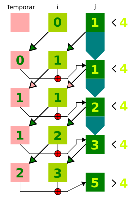

## Enunțul `for`

Ca și în cazul lui `while` sau al lui `do`, `for` execută repetat un fragment de cod de câte ori o condiție este întrunită.

Aceast enunț, numit de standard `IterationStatement`, creează o secvență repetitivă, care produce un set de rezultate sau care parcurge o structură de date existentă. Este enunțul cel mai des folosit pentru a genera serii de numere, pentru a parcurge liste de valori din array-uri, pentru a asocia valori din liste diferite și cam tot ce îți trece prin minte atunci când vine vorba de a lucra cu intervale de numere sau seturi de date în general.

Înțelegerea iterațiilor cu `for` este pasul către înțelegerea unor instrumente mai puternice cum ar fi `Array.prototype.forEach()` și mai departe pentru `Array.prototype.map()`, `Array.prototype.reduce()`, `Array.prototype.filter()`. Aceste instrumente sunt una din țintele pe care le vizăm cu toate aceste cunoștințe pe care le acumulăm.

## Blocul de inițializare și blocul de execuție

Această buclă va fi creată ținându-se cont de câteva expresii opționale care se introduc între paranteze, așa-numitul **bloc de inițializare**, fiind urmate de un **bloc de execuție**, care conține codul ce va fi executat pentru fiecare pas al buclei.

### Despre intervale

Pentru a construi bucle for, avem nevoie să înțelegem că numărul de cicluri, de iterații, de bucle, este dat de un interval numeric pe care-l creăm de la bun început în blocul de inițializare. Acest interval este inițiat prin declararea unei variabile cu o valoare numerică - un contor. Apoi, este nevoie de specificarea limitei până la care se vor face iterații. Această limită poate fi una deschisă, dacă este folosit operatorul de comparare. Folosind mai mic sau mai mare după necesitate, indică motorului că este vizat un interval deschis, care nu va include și ultima valoare, dar dacă se folosește mai mic sau egal ori mai mare sau egal, motorul va ști că dorim folosirea unui interval închis ceea ce se traduce la momentul evaluării că ultima iterație va fi făcută chiar pe valoarea menționată la comparator.

Am menționat aceste informații pentru că în funcție de operatorul de comparație folosit, vom avea cu o iterație mai mult sau mai puțin decât numărul real menționat drept limită.

Un interval care pornește de la 0 și are menționată limita ca fiind 3, în cazul folosirii operatorului de comparație simplu, va declanșa o buclă cu trei iterații: pentru 0, pentru 1, pentru 2, dar nu și pentru 3. Oarecum face sens deplin pentru că asta ne-am și dorit specificând valoarea 3: dorim trei iterații. Dacă foloseam operatorul de comparație combinat, care va include și valoarea trei, vom avea 4 iterații.

### Blocul de inițializare

Oricare dintre *expresiile opționale* pot fi utilizate sau nu în blocul de inițializare. Mai jos avem un exemplu pentru care s-a optat plasarea variabilei cu rol de contor în afara blocului de inițializare. Sintaxa este perfect legitimă atâta vreme cât pui totuși un punct și virgulă care să delimiteze *locul* de expresia de comparare.

```javascript
var x = 0;
for (; x < 5; x++) {
  console.log(x);
};
```

Expresiile opționale sunt separate prin punct și virgulă și se compun din următoarele:

- **un contor**, care este o valoare ce va porni de la o anumită valoare prestabilită (standardul spune că este un `LexicalDeclaration Expression`).
- **un comparator**, care ia valoarea din contor și o compară cu o altă valoare, de regulă dimensiunea unui array adusă prin proprietatea `array.length`.
- **un incrementor/decrementor**

Privind la expresiile folosite pentru a face funcțional un `for`, nu poți să nu privești la expresia `do..while` și să nu te întrebi, de ce nu ai folosi-o în continuare pe aceasta. Singura diferență este că la `do..while`, inițializarea sau contorul (ca expresie) stă în blocul de cod ce trebuie executat, iar condiția sau comparatorul este în **blocul expresiei de evaluat**. În cazul lui `for`, blocul are la final expresia de incrementare. Răspunsul este legat de concizia pe care o oferă `for`. Este pur și simplu mai ușor de urmărit.

De cele mai multe ori vei întâlni în cod numele variabilei pentru contor ca fiind litera `i`. Acesta vine ca prescurtare la termenul *index* și este larg utilizat. Atenție, nu este necesar să se folosească `i`. Poți numi variabila cum dorești și din acest motiv pe parcursul lucrării acesteia voi folosi și alte litere sau chiar cuvinte. Adu-ți mereu aminte că nu este musai ca variabila să se cheme `i` sau `x` sau cumva anume. Câtă vreme sunt respectate regulile la denumirea unei variabile, totul e ok. Se pune o singură literă pentru concizie.

În cazul în care se decide omiterea comparatorului, se va crea o buclă infinită, care poate fi întreruptă doar folosind comanda `break`.

```javascript
for (var x = 0; ; x++) {
  console.log(x);
  if (x > 5) { break };
};
```

Pot fi omise toate cele trei expresii opționale, dar vor trebui tratate în blocul de execuție. Altfel, se intră într-o buclă infinită. Atenție, nu dorești acest lucru! Totul se oprește și de cele mai multe ori browserul se blochează. Fii foarte atent să pui condițiile de ieșire din buclă.

```javascript
console.time("start");
var x = 0;
for (;;) {
  console.log(x);
  // dacă nu introduci decizia
  // ai o buclă infinită
  if (x > 5) break;
  x++;
};
console.timeEnd("final");
```

Motivul pentru care bucla este una infinită este că blocul de condiție va fi evaluat la `undefined`, care este transformat într-un **falsey**, ceea ce conduce la execuția infinită.

## Scenariu de prelucrare a datelor cu `for`

Să presupunem că avem nevoie să prelucrăm datele dintr-un array în care avem valori scalare. Nimic nu poate fi mai simplu: creăm o listă și apoi o parcurgem cu un enunț `for`, care permite prelucrarea unui array element cu element.

```javascript
var listă = [1, 2, 3];
for (var i = 0; i < listă.length; i++) {
  console.log(listă[i]);
};
```

După parcurgerea array-ului sunt returnate rezultatele, dar dacă se mai dorește parcurgerea încă o dată, acest lucru nu este posibil decât dacă pornim din nou execuția codului. Dacă am dori să avem acces la rezultatele de etapă, acest lucru nu este posibil. În exemplul de mai sus, am folosit utilitarul `console.log()` ca și funcție de prelucrare. Acesta nu ne ajută prea mult în afară de a vedea datele din array, în schimb, am putea introduce în exercițiul nostru o funcție, care să poată face o prelucrare mult mai complexă pentru fiecare valoare din array. Acest pas crește complexitatea exemplului nostru, dar și flexibilitatea în ceea ce privește multitudinea de prelucrări pe care le poți efectua.

```javascript
function prelucrează (elementArray) {
  return elementArray + 1;
};
for (var i = 0; i < listă.length; i++) {
  prelucrează(listă[i]);
}; // 4
```

Față de exemplul anterior, am avansat considerabil aplicând o funcție pe fiecare valoarea din listă. Da, o funcție croită după necesitățile noastre. Câteva lucruri care încă persistă: trecerea se face din nou o singură dată și nu avem acces la valorile de etapă. Soluția pentru aceste cazuri este legată de modul în care declarăm variabilele în enunțul `for`.

## Declararea variabilelor în `for`

Declararea unei variabile într-un `for`, are ca efect, declararea unei variabile în funcția în care rulează bucla.

Pentru cei ingrijorați de blocul delimitat de acolade. Doresc să vă liniștesc temerile. În acest moment, conform standardului un bloc de cod `for` nu creează un scope (mediu lexical separat). Ține minte că doar funcțiile creează unul.

### Păstrarea vie a mediului lexical pentru fiecare iterație în parte

Declararea variabilelor cu `let` la contor, le va „lega” de blocul de execuție a lui `for` pentru fiecare iterație. Aici vorbim despre avantajul folosirii lui `let` în cazul constituirii de *closure*-uri. Mai fin spus, se leagă de necesitarea ca funcțiile care au fost definite în corpul enunțului `for` să păstreze viu mediul lexical existent la momentul unei singure iterații.

```javascript
var colectie = [];
for (let i = 0; i < 5; i++) {
  var valDeIterație = 10;
  colectie.push(function ruleazaMa () {
    console.log(`Iterația ${i} și ${valDeIterație++}`);
  });
};
colectie[0](); // Iterația 0 și 10
colectie[1](); // Iterația 1 și 11
```

În cazul folosirii lui `var`, în exemplul nostru am fi rămas cu valoarea ultimei iterații.

```javascript
var colectie = [];
for (var i = 0; i < 5; i++) {
  var valDeIterație = 10;
  colectie.push(function ruleazaMa () {
    console.log(`Iterația ${i} și ${valDeIterație++}`);
  });
};
colectie[0](); // Iterația 5 și 10
colectie[1](); // Iterația 5 și 11
```

### Sari peste o iterație - iterare cu verificare

În cazul în care este necesar, se poate face un `salt`, evitându-se execuția unuia din pașii buclei.

```javascript
for (var x = 0; x < 10; x++) {
  if (x === 5) {
    // daca nu verifici și tipul cu ===,
    // intri intr-o buclă infinită
    document.writeln(`am ajuns la ${x}`);
    continue;
  };
  console.log(x);
};
```

În exemplul prezentat am ajuns la `5`, care este afișat în pagina web prin utilizarea utilitarului `writeln` (*write line*, care înseamnă *scrie o linie*), pus la dispoziție de browser. Consola sare peste afișarea lui 5.

### Întreruperea execuției unei bucle

Uneori este nevoie ca atunci când o condiție internă buclei a fost atinsă, să oprim cu totul execuția buclei. Acest lucru se realizează cu `break`.

```javascript
for (let a = 0; a < 10; a++) {
  console.log(`bucla ${a}`);
  if (a > 0 && a % 3 === 0) {
    break;
  }
};
```

### Pași diferiți și variabili

Am văzut în exemple că pasul de incrementare a contorului este unu. Uneori ai nevoie ca pasul să fie diferit sau chiar variabil. Să presupunem că intervalul trebuie parcurs din 2 în 2.

```javascript
for (let a = 0; a < 10; a += 2) {
  console.log(`bucla ${a}`);
};
```

Poate vei avea nevoie ca incrementarea să se facă în funcție de o valoare externă care să dicteze câte iterații vei face.

```javascript
let variabil = 4;
for (let x = 0; x <= 20; x += variabil) {
  console.log(`bucla ${x}`);
};
```

### Bucle imbricate

Să presupunem că dorești ca atunci când parcurgi un interval, pentru fiecare iterație, să mai parcurgi un interval pentru care să faci niște operațiuni. Utilitatea se dovedește atunci când ai nevoie să construiești structuri de date, care conțin la rândul lor alte fragmente de date. Sună complicat, dar în simplitatea sa pentru o buclă într-o altă buclă, am putea rezuma ceea ce se petrece astfel: pentru fiecare iterație din bucla principală, se fac x iterații în bucla internă.

```javascript
for (let x = 0; x <= 5; x++) {
  console.log(`bucla principala: ${x}`);
  for (let y = 0; y <= 2; y++) {
    console.log(`bucla internă: ${y}`);
  };
};
```

Utilitatea buclelor în alte bucle este de a crea array-uri multidimensionale, de exemplu. Și pentru că am menționat array-urile, structuri de date pe care încă nu le-am abordat structurat, în „manipularea” datelor conținute de acestea, `for` constituie un instrument de bază. Mai mult, `for` este adeseori folosit pentru a **împinge** date într-un array. La fiecare iterație este *alimentat* un array folosind metoda *push* cu rezultatul evaluării codului.

```javascript
let lista = [];
for (let x = 0; x <= 3; x++) {
  // alimentez array-ul la fiecare iterație
  lista.push(x);
};
console.log(lista); // Array [ 0, 1, 2, 3 ]
console.log(lista.length); // 4
```

Un singur amănunt mai adaug la informațiile despre array-uri. În orice moment se poate afla dimensiunea unui array, dacă se apelează proprietatea `length`. În cazul exemplului nostru, lungimea este 4, adică are patru elemente. Este chiar intervalul închis [0, 3].

### Enunțul `for` poate fi folosit și în lucrul cu șirurile de caractere

Șirurile de caractere au caracteristici asemănătoare unui array. Deci, au proprietate care indică dimensiunea șirului de caractere.

Putem avea cazul în care la un caracter poți adăuga un altul până când numărul lor va atinge limita specificată prin valoarea lui `length`.

```javascript
for (var i = "»"; i.length < 5; i += "~") {
  console.log(i);
}
/*
»
»~
»~~
»~~~
 */
```

În exemplul nostru, facem o adăugare a unui caracter la unul definit inițial.

### Folosirea lui `for` în lucrul cu Document Object Model - DOM

Buclele cu `for` pot fi folosite pentru introducerea de elemente în DOM.

```html
<!DOCTYPE html>
<html>
  <head>
    <meta charset="utf-8">
    <title>Introducerea de elemente cu for</title>
  </head>
  <body>
    <h1>Introducere elemente în DOM folosind iterarea</h1>
    <div class="" id="carlig"></div>
  </body>
  <script>
    var x, y;
    console.time("start");
    for (x = 0; x < 20; x++) {
      y = document.createElement('p');
      y.innerText = x;
      document.body.appentChils(y);
    };
    console.timeEnd("final");
  </script>
</html>
```

## Folosirea lui `for` cu variabile multiple

În enunțurile `for` se pot introduce mai multe variabile. Un exemplu pentru a căuta membri ai șirului lui Fibonacci implică declararea mai multor variabile inițiale. După aceea, în expresia de incrementare sunt manipulate pentru a avansa.

```javascript
for(let temp, i = 0, j = 1; j < 4; temp = i, i = j, j = i + temp) {
  console.log(j);
};
```



Pentru că aceeași problemă se poate rezolva folosindu-ne de recursivitatea funcțiilor, vom introduce aici soluția pentru a avea o ancoră în viitor.

```javascript
function fibonacci (x) {
  if (x < 2) {
    return x
  }
  return fibonacci (x - 1) + fibonacci (n - 2)
};
```

## Mantre

- toate expresiile din blocul de inițializare pot lipsi, dar trebuie să existe terminatoarele punct și virgulă.

## Referințe

- Ethan Brown. Learning JavaScript
- [Interval (mathematics), Wikipedia](https://en.wikipedia.org/wiki/Interval_(mathematics))
