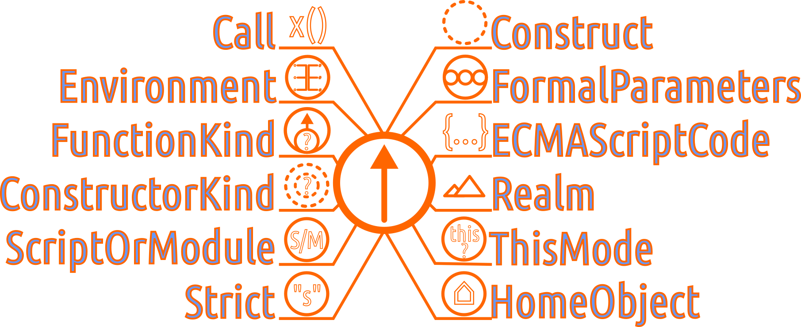

# Dualitatea obiect - funcție

JavaScript este un limbaj care face uz extensiv de obiecte. În Geneză, am văzut că exercitând pașii argoritmului intern `CreateRealm()`, care solicită rularea algoritmului `CreateIntrinsics(realmRec)`, există ca pas distinct crearea primului obiect al limbajului (prin apelarea algoritmului `ObjectCreate(null)`). Astfel, s-a născut obiectul prototipal, care va fi folosit pentru a forma și obiectul prototipal al funcțiilor.

Prin urmare, putem spune că obiectele și funcțiile - obiect alcătuiesc o paradigmă circulară. Una nu poate fără cealaltă. În lucrul de zi cu zi, nu ne vom lovi de necesitatea de a lucra cu sloturile interne ale celor două entități, dar este esențial a fi înțelese.

O bună cunoaștere a acestor amănunte intime privind obiectele și funcțiile construite pe baza obiectelor, este o necesitate. Această secțiune s-a născut din această necesitate. După ce am redactat final capitolul dedicat funcțiilor și pe cel al obiectelor, am realizat că ar fi dificil să încerc o poziționare a unuia față de celălalt, mai ales că un cititor nefamiliarizat, se va lovi, cu siguranță de concepte pe care nu le-ar înțelege decât dacă le-ar fi știut dinainte. Astfel s-a născut această secțiune ca o conciliere și o aprofundare a unor concepte care vor crea premiza înțelegerii celor două în armonie.

## Sloturi

După cum am aflat din capitolul genezei, motorul JavaScript trebuie să parcurgă o serie de pași aparținând unor algoritmi interni pentru a constitui un Tărâm (Realm) și odată cu acesta și obiectele intrinseci necesare pentru a se porni evaluarea codului sursă JavaScript.
Ceea ce ochiul agil a cules ca informație specifică în capitolul genezei este faptul că generarea unui Tărâm nu este nimic mai mult decât constituirea unor registre în care se ține evidența unor înregistrări. Acestea poartă denumirea între paranteze pătrate: `[[intrinsics]]`. Sunt numite sloturi. Reamintindu-ne aceste detalii, vom avansa prin a face o mică anatomie a sloturilor, adică ce ce ascunde ca funcționalitate internă în motorul JavaScript pentru a fi capabilă generarea de obiecte și funcții.

## Obiecte

La momentul genezei a fost creat și intrinsecul `Object`.

Câteva detalii foarte importante oferite chiar de standard. Secțiunea **6.1.7.2 Object Internal Methods and Internal Slots** aduce detaliile cele mai importante în ceea ce privește obiectele și structura lor internă.

> Semanticile obiectelor în ECMAScript sunt specificate prin algoritmi care sunt numiți *metode interne*. Fiecare obiect în motorul ECMAScript este asociat cu un set de metode interne care definesc comportamentul în runtime. \[...] Sloturile interne corespund stării interne care este asociată obiectelor și sunt folosite de diferiții algoritmi ai specificației ECMAScript. Sloturile interne nu sunt proprietăți ale obiectelor și nu sunt moștenite. \[...] Dacă nu este specificat altfel, sloturile interne sunt alocate ca parte a procesului de creare a unor obiecte și nu pot fi adăugate dinamic unui obiect. \[...] Metodele interne și sloturile interne sunt identificate în aceaste specificații folosind denumiri între paranteze pătrate duble \[\[]].

*Metodele interne esențiale* sunt aplicabile tuturor obiectelor create sau manipulate de ECMAScript, mai adaugă standardul la momentul în care introduce tabelul descriptiv al acestora. Și mai este o mențiune foarte importantă: *fiecare obiect trebuie să aibă algoritmi pentru toate metodele interne esențiale*. Pentru claritate, pentru fiecare funcționalite deja existentă, care este deja gata să fie folosită de programatori, există un set de algoritmi corespondenți, care rulează în motor pentru a oferi aceste funcționalități.

Reține faptul că toate aceste indicații sunt date celor care construiesc motoare JavaScript, fiind tot atâtea instrucțiuni privind algoritmii motorului, care au drept efect crearea entităților JavaScript cu care operăm noi. În mod normal, aceste detalii sunt lăsate în grija magicienilor C și C++, limbajele în care se programează motoarele JavaScript. Totuși, pentru că avem nevoie să înțelegem părțile cele mai importante ale anatomiei obiectelor și funcțiilor, ne vom sluji de aceste indicații pentru a face o hartă mentală a ceea ce se întâmplă când creăm obiecte și funcții. Cel mai mare câștig va fi înțelegerea dualității obiect-funcție reflectată și prin sintagma standardului ce descrie cel mai corect o funcție: **funcție - obiect**.

Pentru a înțelege, am constituit o hartă internă a obiectelor. Un obiect, l-am reprezentat ca pe un cerc cu trei linii interioare, care simbolizează proprietățile și metodele. De jur împrejur am dispus fiecare **metodă internă** și slotul destinat obiectului prototip. Acestea stau în spatele formării entității ECMAScript pe care noi o numim obiect. Pe fiecare metodă internă am căutat că o reprezint grafic pentru a  adăuga și un reper vizual. Pentru a simplifica imaginea și a facilita înțelegerea, am renunțat la parantezele pătrate care indică faptul că vorbim de sloturi interne existente doar la nivel de motor.

Spuneam mai devreme că acești algoritmi interni aparțin motorului JavaScript, dar ca și programator, avem acces la ceea ce oferă prin expunerea lor ca și metode, fie a obiectelor interne `Function` sau `Object`, fie, ceva mai direct prin obiectul intern `Reflect`, a cărei existență se justifică chiar pentru a pune la îndemâna noastră o cale de acces către *metodele interne*.


Să le luăm pe rând să vedem ce reprezintă fiecare.

### \[\[GetPrototypeOf()]]


Caută obiectul de la care moștenește proprietăți obiectul de lucru. Dacă valoarea este deja setată la `null`, înseamnă că moștenirea este tăiată. Ca simbol l-am reprezentat precum două obiecte ca două cercuri dintre care cel mai mic din dreapta este cel de lucru, iar cel din stânga este cel a cărui identificator va fi returnat în urma operațiunii de interogare. Sensul de interogare este dat de sensul săgeții orientat către un posibil obiect candidat cu rol de prototip.

Metoda pe care o putem folosi și noi ca programatori este parte a obiectului global `Object` și este disponibilă prin mecanismul de moștenire tuturor obiectelor. Deci, ține minte că există `Object.getPrototypeOf(obiectPentruCareSeFaceInterogarea)`. Odată cu noua versiune a standardului, există și `Reflect.getPrototypeOf`, care permite folosirea directă a „metodelor interne”.

### \[\[SetPrototypeOf]]


Această metodă internă asociază obiectul cu un alt obiect care oferă proprietăți ce se doresc a fi moștenite de obiectul nostru de lucru. Ca simbol îl copiază pe cel de la `GetPrototypeOf` cu diferența că semnul exclamării indică imperativul setării iar sensul săgeții este către obiectul de lucru.

`Object` are o metodă care o pune la dispoziția programatorilor pentru a folosi metoda internă. Odată cu noua versiune a standardului, există și `Reflect.setPrototypeOf`, care permite folosirea directă a *metodelor interne*.

### \[\[isExtensible()]]


Este o valoare Boolean, care indică posibilitatea de a extinde un obiect prin adăugarea unor proprietăți noi sau opusul. Am reprezentat algoritmul ca un obiect având o proprietate reprezentată cu o linie întrerupă ceea ce trimite la ideea că ar putea fi completat cu o nouă proprietate.

`Object` are o metodă care o pune la dispoziția programatorilor pentru a folosi metoda internă. Este la îndemână și metoda pe care obiectul `Reflect` o pune la dispoziție: `Reflect.isExtensible`.

### \[\[PreventExtensions()]]


Este verificată posibilitatea de a adăuga proprietăți noi obiectului. Dacă la analiza obiectului se determină că obiectul poate fi extins, este returnată valoarea `true`.
Am reprezentat având ultima proprietate cu un semn interzis ceea ce trimite la ideea că este imposibil a se mai adăuga ceva.

`Object` are o metodă care o pune la dispoziția programatorilor pentru a mima metoda internă. Această metodă este `Object.isFrozen`. Odată cu noul standard, obiectul intern `Reflect` pune la dispoziție `Reflect.preventExtensions`.

### \[\[GetOwnProperty]]


Rulând această metodă internă, fie obții valoarea `undefined` pentru că nu a fost găsită o astfel de proprietate, fie obții o descriere a acesteia în caz contrar. Descrierea aceasta, conform standardului este o înregistrare (Record). Am explicat în geneză ce este o înregistrare, un Record. În cazul nostru, **Property Descriptor** este un tip al specificației, care este ca specie un Record și conține toate informațiile privind o anumită proprietate a unui obiect; dacă poate fi scrisă (**writable**), dacă poate fi configurată (**configurable**), dacă este enumerabilă (**enumerable**), dacă are valoare deja (value) și în fine, dacă are proprietăți de accesare (**accessor**): **get** pentru obținerea valorii și **set** pentru a o seta.

Am reprezentat această metodă internă precum obiect care are proprietăți. Cea din mijloc, care are săgeată, se distinge ca fiind proprie acelui obiect. Acest lucru înseamnă că nu a fost moștenită.

Această metodă internă are un echivalent și pentru uzul programatorilor. Metoda este pusă la dispoziție de obiectul `prototype` a obiectului intern `Object`: `Object.prototype.hasOwnProperty`. Cel mai eficient este să folosim `Reflet.getOwnPropertyDescriptor`, care oferă acces direct la metoda internă.

### \[\[HasProperty]]


Este o metodă prin care este întrebat obiectul dacă are o anume proprietate, fie că este a lui, fie că a fost moștenită. Răspunsul returnat este o valoare Boolean: `true`, dacă proprietatea există, `false` în caz contrar.

Reprezentarea este un obiect în interiorul căruia o proprietate are atașat semnul întrebării.

Mecanismul de acces pus nouă la dispoziție este `Object.keys()`. Mai bine folosește operatorului `in`. Totuși, noua versiune a standardului oferă acces direct la *metoda internă* prin intermediul `Reflect.has()`.

### \[\[Get]]


Este o metodă internă cu ajutorul căreia obții valoarea unei proprietăți a cărei chei a fost folosită pentru a face căutarea. În cazul în care sunt specificate operațiuni suplimentare pentru a obține valoarea cheii, se poate introduce valoarea lui `this` la ceea ce standardul numește **Receiver**. Pentru cei nerăbdători, `this` este un obiect în al cărui context a fost apelată o funcție.

Am simbolizat printr-un obiect în care o proprietate trimite la cererea `get` valoarea sa. Această acțiune, această cerere am simbolizat-o printr-o săgeată orientată către dreapta.

Instrumentul la dispoziția noastră ar fi `Object.values()`. Dar, după cum te-am obișnuit, îți dau varianta de acces direct la această *metodă internă* întrupată în `Reflect.get()`.

### \[\[Set]]


Este o metodă internă care poate fi folosită pentru a introduce o valoare pentru o proprietate a unui obiect. Dacă sunt necesare operațiuni suplimentare pentru introducerea valorii, se poate pasa obiectul context prin `this` (Receiver). Dacă operațiunea a reușit, acest lucru este marcat prin returnarea valorii `true`.

Am simbolizat printr-o proprietate a cărei săgeată indică înspre interiorul obiectului.

La îndemâna noastră este folosirea sintaxei cu punct sau cu paranteze drepte. Ceva mai întortocheat, ar fi `Object.defineProperty()`. Accesul direct la această *metodă internă* îl oferă `Reflect.set()`.

### \[\[Delete]]


Această metodă internă are drept scop eliminarea de proprietăți care nu mai sunt necesare dintr-un obiect. Dacă operațiunea a reușit, acest lucru este marcat prin returnarea valorii `true`.

Am simbolizat printr-un obiect în care o proprietate ce va fi anulată, va fi ștearsă din obiect. Ștergerea este reprezentată printr-un x peste o proprietate existentă.

Pentru noi există operatorul `delete` care face acest lucru. Dar dacă dorești acces direct la acestă metodă internă, poți folosi `Reflect.deleteProperty`.

### \[\[DefineOwnProperty]]


Este o metodă internă folosită pentru a crea o proprietate într-un obiect sau pentru a modifica caracteristicile uneia existente deja. Dacă operațiunea a reușit, acest lucru este marcat prin returnarea valorii `true`.

Am simbolizat această metodă internă printr-un obiect a cărei ultimă proprietate este în asteptarea definirii. Am folosit elementul sintactic două puncte pentru a reprezenta această stare.

Pentru noi există `Object.defineProperty`. Pentru că știu că ești nerăbdătoare să folosești nemijlocit această metodă internă, îți prezint metoda oferită de `Reflect`: `Reflect.defineProperty()`.

### \[\[OwnPropertyKeys]]


Această metodă internă returnează o listă (valoarea de tip **List**ă a standardului) cu toate cheile proprii ale obiectului.

Am reprezentat acest lucru printr-un obiect al cărui proprietăți proprii au câte un diamant atașat.

Noi avem ca instrument `Object.getOwnPropertyNames`. Accesul direct la această metodă internă este asigurat de `Reflect.ownKeys`.

### \[\[Prototype]]


Ne-a mai rămas în acest moment slotul intern \[\[Prototype]]. Valoarea sa internă este un obiect menit să ofere proprietăți obiectelor copil prin mecanismul de moștenire.

Am ales să reprezint vizual printr-un simbol ce indică prin săgeata orientată spre dreapta că un obiect (cel din dreapta) moștenește proprietăți de la un alt obiect, în cazul nostru cel din dreapta. Am ales dimensiunea mai mare a celui din care se moștenește pentru a indica faptul că cel de la care se moștenește poate fi considerat un părinte a celui din dreapta, care poate fi văzut drept un copil.

În ceea ce privește lucrul cu obiectul prototip, obiectul intern `Reflect`, oferă două metode foarte importante `Reflect.getPrototypeOf()` și `Reflect.setPrototypeOf()`. Prima returnează obiectul prototip pentru identificatorul unui obiect, iar a doua va seta drept prototip un obiect arbitrar.

Și acum că am lămurit aceste aspecte privind obiectele, mai adăugăm cazul funcțiilor. Trebuie să ne aducem mereu aminte faptul că funcțiile sunt obiecte, ceva mai speciale, dar tot obiecte. Ce le face mai speciale? Faptul că pot fi apelate și că în baza lor pot fi create alte obiecte. Poate părea bizar, dar acest lucru este unul din aspectele cele mai interesante și mai utile ale limbajului de programare.

Cum se realizează acest lucru?

Pur și simplu mai adaugi la metodele interne deja enumerate la obiecte două în plus: \[\[Call]] și \[\[Construct]]. Le vom descrie imediat, dar dacă tot am pășit în lumea funcțiilor cu această mică introducere, hai să vedem și harta sloturilor interne și a proprietăților pentru funcții.

Noi avem acces la acest obiect prin `Object.prototype`.



În acest moment ar fi util să-ți imaginezi că în ADN-ul hărții funcțiilor stă înscrisă harta obiectelor. Pentru fiecare funcție va fi disponibil tot ce este disponibil obiectelor plus tot ce este înfățișat în noua hartă. Să pornim cu reluarea firului lăsat la \[\[Call]] și \[\[Construct]].

În reprezentarea hărții pentru funcții am procedat la a nu menționa paramentrii pe care-i ia \[\[Call]] sau \[\[Construct]] pentru că vizual ar fi fost foarte aglomerat. Voi menționa forma completă la descrierea lor. Restul sunt sloturi, nu metode interne și nu au argumente.

### \[\[Call]] (thisArgument, argumentsList)


Standardul spune așa despre această metodă internă: *execută codul asociat cu acest obiect. Este invocat printr-o expresie de apelare a funcțiilor. Argumentele interne pentru metoda internă sunt o valoare `this` și o listă care conține argumentele pasate funcției prin expresia de apelare. Obiectele care implementează această metodă internă sunt «callable»*.

Ce poate fi mai evident decât însuși textul standardului?

Ca reprezentare simbolică am ales însăși expresia de apelare a unei funcții în toată simplitatea sa.

### \[\[Construct]]( argumentsList, newTarget)


În cazul metodei interne \[\[Construct]], voi lăsa din nou textul standardului să povestească pentru claritatea sa.

> Creează un obiect. Este invocată prin intermediul operatorilor `new` sau `super`. Primul argument al acestei metode interne este o listă ce conține argumentele operatorului. Cel de-al doilea argument este obiectul pentru care a fot aplicat inițial operatorul `new`. Obiectele care implementează această metodă internă se numesc constructori. O funcție obiect nu este neapărat să fie un constructor iar astfel de funcții obiecte nu au metoda internă \[\[Construct]].

Reprezentarea este un cerc care simbolizează un obiect, dar care folosește o linie întreruptă ce indică faptul că acel obiect încă nu există. Există potențialul de a deveni obiect.

Din acest moment, vom analiza doar sloturile unei funcții obiect. Am încheiat aici descrierea metodelor interne pentru obiecte și obiecte funcții. Nu voi trece mai departe până când nu vă voi oferi și instrumentul util pe care `Reflect.construct` îl pune la dispoziție. Acesta este echivalentul folosirii operatorului `new`, dar cu avantajele unei funcții.

### \[\[Environment]]


Vorbim despre **mediul lexical** al unei funcții la momentul creării sale. Acest mediu lexical este *memorat* de slotul \[\[Environment]]. Standardul aduce câteva lămuriri în ceea ce privește natura mediilor lexicale și spune că este o specificație a standardului folosită pentru a defini asocierile identificatorilor la anumite variabile și funcții pe baza structurii de imbricare lexicală a codului ECMAScript.
În ceea ce privește formarea sa, mediul lexical este asociat unor structuri de cod precum declarația de funcție, enunțurile de bloc de cod și secvența `Catch()` din enunțul Try..Catch (**8.1.1 Environment Records**).

Este potrivit să amintim ce face o funcție atunci când este declarată în raport cu mediul lexical. Tot standardul spune la **9.2 ECMAScript Function Objects**:

> funcțiile obiect încapsulează cod parametrizat ECMAScript acoperind un mediu lexical care permite evaluarea dinamică a codului. Un obiect funcție ECMAScript este un obiect ordinar care are aceleași sloturi interne și aceleași metode ca și celelalte obiecte ordinare.

Aceste detalii sunt importante pentru a înțelege aspectele cele mai intime ale unei funcții.
Ar fi necesar să privim și la cazul în care o funcție este invocată într-un anumit context de execuție. Ce se întâmplă cu mediul lexical? Acesta se modifică reflectând ceea ce a fost găsit în locul în care se execută. Să-ți aduci mereu aminte că funcțiile pot fi pasate și apelate oriunde este necesar.

Pentru acest slot am ales o reprezentare care cuprinde într-un cerc asocieri între identificatori notați cu semnul diez și valori notate cu puncte.

### \[\[FormalParameters]]


Este o listă a parametrilor pe care funcția îi va primi ca argumente la momentul invocării.

Am reprezentat parametrii ca trei valori care sunt disponibile în interiorul funcției obiect.

### \[\[FunctionKind]]


Acest slot conține o valoare tip șir care indică ce tip de funcție avem. Posibilitățile sunt: **normal**, **classConstructor** și **generator**.

Am reprezententat slotul ca o funcție peste care vine o întrebare.

### \[\[ECMAScriptCode]]


Este chiar codul sursă din interiorul funcției.

Am găsit că cel mai potrivit este să reprezint ca un bloc de cod.

### \[\[Realm]]


Tipologic vorbind, acest slot va conține înregistrarea de `Tărâm` pentru respectiva funcție. Este Tărâmul în care a fost declarată funcția și care oferă acesteia toate obiectele intrinseci (intrinsics) necesare pentru evaluarea codului.

Am găsit o reprezentare simpatică a doi munți care implică sensul unui Tărâm, a unui spațiu geografic.

### \[\[ScriptOrModule]]


Este un slot care, fie are înregistrarea caracteristică unui script, fiind astfel scriptul în care a fost definită funcția, fie este înregistrarea specifică unui modul în care a fost definită funcția.

Reprezentarea indică cele două posibile înregistrări.

### \[\[ThisMode]]


Este un slot care definește cum este interpretată legătura la `this`. Există trei  posibilități: lexical, strict și global. Lexical înseamnă că `this` va fi mediul lexical pentru care face o acoperire funcție. Strict înseamnă că `this` va respecta strict modul în care este invocată funcția, iar global se referă la momentul când valoarea lui `this` este `null`, ceea ce îl va seta pe `this` la obiectul global.

Reprezentarea grafică este grăitoare de la sine.

### \[\[Strict]]


Dacă funcția va fi una care va fi rulată sub `strict mode`, acest slot va avea valoarea Boolean `true`.
Reprezentarea este o prescurtare a prea lungului `"strict mode";`

### \[\[HomeObject]]


Este un obiect. Dacă funcția va folosi `super`, acesta este obiectul la care va trimite `super`.

Am reprezentat cu încadrarea unei căsuțe într-un cerc care desemnează un obiect.

## Discuție

Ce am aflat până în acest moment?

Știm că la baza oricărei funcții stă un obiect. Peste acest obiect se adaugă propriile sloturi și cele două metode interne care transformă obiectul într-o funcție. Metoda `Call` permite ca obiectul funcție să permită evaluarea codului din corp. Metoda `Construct` este cea care dă posibilitatea unui obiect funcție să poată construi obiecte prin invocarea cu operatorul `new`.

Funcțiile sunt obiecte de „primă clasă” în JavaScript, ceea ce le permite să fie manipulate precum orice obiect, mai exact, precum orice valoare obiect.

```javascript
// Pot fi atribuite unui identificator:
let funcție = function facCeva (x) {
  return x++;
};
const obiect = {x: 1};
// Poți introduce valori
funcție.test = 10;
obiect.test = 10;
// Pot fi trimise altei funcții ca argumente
function facCeva (x, y) {
  return x + y;
};
function maiElaborat (a, valoare) {
  return valoare(a, 1);
};
var captura = maiElaborat(10, facCeva);
// pot fi returnate din funcții ca orice valoare
function iaOFuncție () {
  return function () {};
};
```
