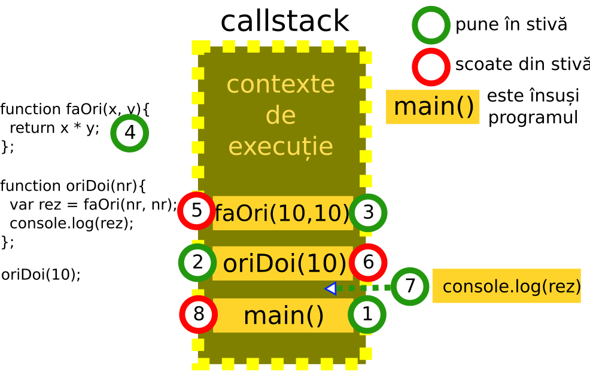

# Relația între stiva apelurilor, bucla de evenimente și API-urile browserului

Există un concept fundamental pentru a înțelege în adâncime programarea în JavaScript și nu numai. Acesta este cel de **control**. Adeseori veți auzi, viziona sau citi despre faptul că o anumită funcție este executată de **control** sau că acesta este înapoiat unei funcții deja aflată în execuție dar care era în așteptare în stivă.

**Controlul**, de fapt este firul roșu al execuției fragmentelor de cod.

Să ne imaginăm următoarea poveste care dorește să te pună într-un context de înțelegere a componentelor și a interacțiunilor dintre acestea.

Octav este un meșter tâmplar. Toată lumea îl poreclește **Control** pentru că atunci când se adâncește în treabă, nu-l poate scoate nimeni din ale lui. Stând retrași în atelier, dis-de-dimineață îl privim pe Control apucându-se de treabă. În atelier mai sunt și două ajutoare, care îl asistă pe Control. Pe unul l-a poreclit **Vreme** și pe celălalt domnișoara **Du-Adu** (*utilitare ale browserului*). Octav se uită pe o listă de treburi întocmită dinainte (*codul sursă*) și se apucă să le facă rând pe rând (*executarea programului prin evaluarea expresiilor*). Prima sarcină este să închege o ramă pentru niște prieteni (*să-i spunem funcția ramă*). Numai că imediat ce a măsurat și tăiat materialele, Control își dă seama că are nevoie de niște pene din lemn. Dă acestă sarcină lui Vreme și îl roagă să-i dea penele în zece minute (*inițierea unui setTimeout*). Vreme pornește treaba. Între timp Control nu ia o pauză așa cu e pe la noi. Nuuu, el trece la fasonarea ramei și la examinarea încheieturilor. Își ridică ochii spre borcanul cu aracet și realizează că nu mai are. O roagă pe Du-Adu să meargă la feronerie să cumpere o rezervă (*inițierea unui apel XMLHttpRequest*). Du-Adu fericită că schimbă peisajul, fuge să aducă aracet. Control își vede de treabă în continuare dar lasă pentru o scurtă perioadă de timp rama pe bancul alăturat (*funcția este în stiva contextelor de execuție*) și se apucă să caute o bucată de salcâm numai bună să croiască o jucărie pentru fetița lui Du-Adu (*o altă funcție pornește și este așezată în stivă peste cea dinainte care nu este încheiată încă*). Se apucă să o fasoneze, când, Vreme îi spune că a terminat penele. Control, preocupat ce ceea ce făcea, îl roagă pe Vreme să-i pună penele într-un loc (*o coadă de așteptare a job-urilor terminate de utilitare*) de unde le va lua imediat ce termină ce face acum și îi mulțumește. Între timp apare și Du-Adu cu aracetul (*un alt job așezat imediat peste cel anterior*). Control o roagă să i-l pună la îndemână lângă penele făcute de Vreme și îi mulțumește. Octav a terminat de fasonat bucata de salcâm și o pune deoparte (*acum funcția fasonare dispare din stiva contextelor de execuție, atenția fiind îndreptată la cea de dedesubt*). E timpul să se reapuce de ramă. Pentru că nu mai e nimic altceva de făcut, desface borcanul, ia penele, le unge cu aracet (*în stiva contextelor de execuția ajung și funcțiile ungere_cu_aracet și potrivirea_penelor care intră în execuție*) și încheagă rama (*funcția ramă returnează rezultatele*). Treaba e gata. Cei trei ies din atelier în soarele primăverii.

Browserul are un set foarte important de utilitare gata pentru a fi utilizate și mulți programatori le numesc părți ale API-ului JavaScript. Ce este un API? Este acronimul de la Application Programming Interface (Interfață de programare pentru aplicații), care este un set de conectori / funcționalități ale unui software gata pentru a fi folosite de programatori. Poți asemui funcționalitățile expuse de un API precum manetele și butoanele dintr-un cockpit. Nu trebuie să știi toate părțile componente ale avionului pentru a-l face să zboare. În plus, de obicei, există un manual detaliat pentru fiecare instrument.

În cazul browserul sunt oferite deja funcții care pot fi asemuite utilitarelor așa cum am menționat deja. Una deja o folosim în mod curent pentru a sonda rezultatele evaluărilor: `console.log()`. Aceasta face parte din API-urile Web puse la dispoziție de fiecare browser. Pentru a vedea câte instrumente există, nu ar fi rău să aruncați o privire la documentația existentă pe Mozilla Developer Network, https://developer.mozilla.org/en-US/docs/Web/API pentru a vedea cât de complex este mediul de care dispune un program JavaScript.

Adu-ți aminte că o funcție poate fi pasată ca valoare a unui argument unei alteia pentru a fi executată de îndată ce a fost evaluat codul din corpul funcției pe care a primit-o. Vorbim despre callback-uri. Le-am amintit pentru motivul că acesta este modul în care comunicăm intențiile noastre unui API. Folosim un utilitar al API-ului căruia îi trimitem o funcție ce va fi executată de îndată ce utilitarul a adus niște rezultate. Ceea ce se petrece pe scara timpului este că toate aceste utilitate, până să execute callback-ul, au nevoie de timp să-și facă ele treaba. Imaginează-ți un apel către o resursă de undeva de pe Internet. utilitarul trebuie să parcurgă toate căile către acea resursă interogând servere de DNS, stabilind comunicații pe diferite protocoale, ș.a.m.d. Tot acest efort are o amprentă în timp. Și totuși, atunci când rulăm programele noastre în browser, nu simțim aceste sincope. Dacă ar fi fost altfel, tot programul s-ar opri până își face treaba utilitarul finalizând prin execuția funcției callback. Știm că JavaScript are un singur fir de execuție. Și totuși acesta nu este blocat. Acest lucru se petrece pentru că utilitarele sunt rulate de browser în alte fire separate de cel al programului nostru. Și atunci, te vei întreba, cum se face comunicarea și armonizarea?

## Scenariul de lucru

Indiferent de numărul funcțiilor apelate, doar una singură este în evaluare. Restul așteaptă cuminți la rând într-o **stiva a contextelor de execuție în derulare** (stiva de apeluri - **call stack**) sau într-o **coadă** de așteptare în cazul folosirii API-urilor. Atenție, API-urile puse la dispoziție de browser au propriile fire de execuție separate de cel principal al programului. Acesta este motivul pentru care anumite acțiuni precum rularea unui apel AJAX (XMLHttpRequest) sau a unui `setTimeout()` nu blochează firul principal de execuție.

## Concepte care se legă de contextul de execuție

În multe lucrări veți vedea că momentul rulării codului unei funcții este reprezentat sau menționat ca fiind un **cadru**. Un cadru este un concept abstract care incorporează toate elementele asociate contextului de execuție: mediul lexical propriu, legătura `this`, obiectul prototip și stabilirea legăturii de moștenire și constituirea obiectului arguments. Toate aceste concepte se leagă la nivelul cel mai de jos de alocarea unor spații de memorie care nu indică o structură. Acest spațiu de memorie este numit și **heap** în limba engleză. Am putea traduce **grămadă**.

### Call stack - stiva apelurilor

Când arunci privirea la ceea ce se petrece atunci când este rulat codul, imaginea poartă numele de **running execution context**, ceea ce am putea traduce în română ca fiind **contextul de execuție în efect**. Pe scurt, **ce rulează pe moment**.

Evaluarea codului care se face într-un „context de execuție” în plină desfășurare, care se poate suspenda în momentul în care o altă funcție este apelată în interiorul celei care este deja în execuție. În acest moment special de întrerupere un alt context de execuție devine „context de execuție în efect” și astfel va purcede la evaluarea propriului cod. Mai târziu, codul suspendat poate redeveni la rândul său „contextul de execuție în efect” pentru că ceea ce l-a întrerupt s-a încheiat și să reia evaluarea codului de la momentul de unde s-a oprit. Această succesiune a contextelor de execuție în efect este gestionată cu ajutorul unei structuri de date speciale.

Structura de date care ține evidența funcțiilor care sunt în execuție, se numește **stiva apelurilor** - **call stack**. Să analizăm următoarea secvență de cod foarte simplă:

```javascript
function faOri (x, y) {
  return x * y;
};
function oriDoi (nr) {
  var rez = faOri(nr, nr);
  console.log(rez);
};
oriDoi(10);
```



Programarea bazată pe evenimente este o paradigmă înscrisă practicii de zi cu zi tradițional legată de manipularea **DOM**-ului (*Document Object Model*). Modelul bazat pe *evenimente* mai este cunoscut drept modelul de gestiune al tuturor solicitărilor de preluare a controlului, în engleză numit *concurency model*. Chiar despre asta este și vorba: despre gestionarea intereselor concurente la momentul evaluării codului.
În acest sens, este nevoie de un mecanism de gestiune a evenimentelor care să fie capabil introducă ordine pentru a putea raționaliza codul și pașii necesari.

Îți poți închipui povestea concurențială precum o busculadă care s-a creat la poarta unui magazin de Black Friday. Din fericire, există ofițeri de securitatea care ordonează accesul. Bucla evenimentelor împreună cu stiva pot fi considerați agenții noștri de securitate.
Sunt necesare câteva lămuriri importante. Evaluarea codului din corpul unei funcții începe la momentul apelării. Atunci când o funcție este apelată, fie a programului, fie a API-ului, poți spune că aceasta creează un *eveniment*.

Din acest motiv, JavaScript este considerat a fi **event-driven**, adică un limbaj a cărui principală activitate este să răspundă la evenimente. Și cum navigarea și interacțiunea cu o pagină web creează evenimente pentru care este necesar câte un răspuns, putem să înțelegem și mai bine rolul JavaScript pentru Platforma Web.

**DOM**-ul (este în sine o microplatformă), interpretorul, componenta de networking și toate celelalte părți componente ale unui browser alcătuiesc mediul de execuție.

### Job și job queue

Înainte de toate, va trebui să lămurim conceptul de **job** și **job queue** pe care le introduce standardul. Am putea traduce în limba română un **job** ca **sarcină**, dar pentru că termenul este deja absorbit de limba română ca neologism, voi continua să-l folosesc ca atare.

**Spune standardul**:

> Un Job este o operațiune abstractă care inițiază o computație atunci când nici o altă computație ECMAScript nu este în desfășurare.[...] Execuția unui Job poate fi inițiată doar atunci când nu există niciun context de execuție și stiva contextelor de execuție este goală. A PendingJob este o cerere pentru o viitoare execuție a unui Job.[...] Din moment ce execuția unui Job este inițiată, Job-ul va fi rulat până când se încheie. Totuși, Job-ul care rulează sau evenimente externe pot fi cauza trimiterii în coada de așteptare a unor PendingJobs suplimentare care pot fi inițiate cândva după încheierea Job-ului curent.

Job-urile sunt organizate printr-un mecanism intern motorului care se comportă ca o stivă FIFO (First In, First Out), ceea ce înseamnă că primul job intrat va fi și primul care va ieși. Standardul recomandă ca motoarele diferiților implementatori să fie prevăzute cu cel puțin două stive de Job-uri: una dedicată validării și evaluării textelor sursă pentru scripturi și module și una dedicată rezolvării promisiunilor.

În resursele pe care le veți consulta suplimentar, veți remarca faptul că acest **job queue** este numit simplu **queue** sau **coada**.

## Imaginea întregului

Pentru a gestiona comportamentul complex al apelurilor și al timpilor de execuție, motorul de JavaScript are la dispoziție trei mecanisme interne: **stiva de apeluri** numită științific **stiva contextelor de execuție în derulare** (*call stack* în engleză prescurtat în debuggerul browserelor), **API**-urile browserului, care preiau din efortul de soluționare a unor evaluări precum apelurile AJAX sau temporizările cu `setTimeout()` și **job queue**. Mai există și un mecanism care gestionează felul în care joburile sunt reinserate în firul principal de execuție a codului JavaScript. Coroborarea acestor mecanisme permite rularea codului complex al oricărei aplicații JavaScript. Din acest motiv este necesară înțelegerea în adâncime a felului în care funcționează.

Rularea unui program în firul de execuție, neutilizând API-urile browserului, este un program care va rula secvență cu secvență în ordinea intenționată de programator. Acest aspect descrie execuția ca fiind una **sincronă**. Aceste cazuri sunt rare, de cele mai multe ori se aplică fragmentelor de cod explicate într-un manual de programare.

Realitatea rulării unor mari aplicații ține de gestionarea mai multor fire de execuție: a celui principal al programului și ale API-urilor puse la dispoziție de mediul creat de browser. Înțelegerea aspectelor complexe la rularea într-un astfel de model ține de caracterul **asincron** al execuției. Marea majoritate a software-ului JavaScript existent este scris pentru a rula asincron.

Îți voi da numai un singur exemplu elocvent. Gândește-te la faptul că vei dori manipularea unei pagini web, care, de fapt, este un arbore dinamic de noduri a ceea ce numim **Document Object Model**. La un moment dat, un utilizator, dă un click pe un element al paginii. Asociat elementului acționat prin click trebuie să ai un mecanism de ascultare și o funcție din program care să pornească execuția la momentul click-ului. Utilizatorului îi este returnat un rezultat la finalizarea execuției funcției acționate (în jargonul programării web se numește **event handler**). Toate acestea, fără să te simți copleșit se subscriu caracterului asincron al programelor JavaScript. Acest aspect este, de fapt, cel pentru care JavaScript are valoarea sa actuală.

Să luăm cazul callback-urilor pentru că acestea sunt cel mai des întâlnit exemplu în practică. O funcție este pasată unui utilitar al API-ului pentru ca în momentul în care utilitarul și-a încheiat execuția, acesta să execute funcția pe care i-am dat-o noi și pe care să o aplice rezultatelor oferite de utilitar la finalul execuției sale. Fenomenele interesante apar atunci când stiva apelurilor (a contextelor de execuție în desfășurare) nu este goală. De ce este nevoie să fie goală, te vei întreba? Pentru că funcția callback trebuie și ea la rândul ei executată, dar pentru că necesitaea executării sale a survenit într-un moment când alte apeluri de funcții erau în rulare, această cerință trebuie memorată undeva. Astfel, mecanismul cozii de așteptare este evident. De îndată ce stiva apelurilor se golește, primul apel de callback din coadă, va fi trimis spre execuție. Acesta devine primul context din stiva apelurilor. Această funcție intră în execuție chiar dacă va apela la rândul ei alte funcții, etc. Următorul callback din coadă alteaptă cumințel ca stiva să fie goală ca să intre și el în execuție. Și tot așa până când sunt epuizate toate callbackurile din coadă.

## Asincronicitate în prelucrarea datelor

Comportamentul asincron este permis de relația dintre runtime-ul JavaScript, stiva de apeluri și API-urile web. Luate individual, aceste componente reprezintă tot atâtea fire de execuție generate de mediul browserului.
Să presupunem că avem o colecție de elemente pe care dorim să le iterăm și pentru fiecare element să-i aplicăm o funcție.

```javascript
let colectie = ['unu', 'doi', 'trei'];
function procesor (element) {
  console.log(element);
};
for (let x = 0; x < colectie.length; x++) {
  procesor(colectie[x]);
}; /* unu doi trei*/
```

În cazul în care pentru fiecare element ai dori să faci mult mai multe lucruri, poți apela la un callback, care va împlini toate sarcinile și abia la final va face procesarea elementului din colecție. În acest caz, vom construi o funcție specială care ia drept argumente colecția și drept callback, o altă funcție care trebuie să fie aplicată pe fiecare element al colecției. Ceea ce permite astfel de model de lucru este ca funcția callback să fie una diferită în funcție de necesități.

```javascript
let colectie = ['unu', 'doi', 'trei'];
function procesor (element) {
  console.log(element);
};
function prelucrarePerElement (arr, modificator) {
  for (let x = 0; x < arr.length; x++) {
    modificator(arr[x]);
  };
};
prelucrarePerElement (colectie, procesor);
```

Lucrurile se simplifică drastic dacă folosim utilitarul `forEach` pus la dispoziție de prototipul obiectului intern `Array.prototype`. Nu mai trebuie să creăm noi funcția de `prelucrarePerElement`.

```javascript
let colectie = ['unu', 'doi', 'trei'];
function procesor (element) {
  console.log(element);
};
colectie.forEach(procesor);
function afisare (element) {
  console.log(`Am pe: ${element}`);
};
colectie.forEach(afisare);
```

Simți să s-ar putea simplifica și mai mult? Da, ai dreptate, pur și simplu am putea folosi în locul callback-ului o funcție anonimă care să facă prelucrarea. Astfel, am putea renunța din verbozitatea codului prin declararea funcțiilor cu nume.

```javascript
let colectie = ['unu', 'doi', 'trei'];
colectie.forEach(function (element) {
  console.log(`Am pe: ${element}`);
});
```

Și pentru că unora le place eleganța, îți voi arăta o formă și mai prescurtată prin folosirea „arrow functions”.

```javascript
let colectie = ['unu', 'doi', 'trei'];
colectie.forEach( element => console.log(`Am pe: ${element}`));
```

Pentru că am văzut mecanismele simple care stau la baza lucrului asincron prin exemplele anterioare, vom simula asincronicitatea utilizând utilitarul `setTimeout()`, parte a API-ului browserului, care ia un callback și valoarea de timp exprimată în milisecunde. Ceea ce dorim este să introducem o întârziere, o **amânare** (în engleză am zice că execuția funcției este *deferred* - amânată).

```javascript
setTimeout (() => {
  console.log('Hop și eu mult după');
}, 5000);
console.log('Eu între timp m-am executat');
```

Pe scurt, ceea ce se întâmplă este că apelarea lui `console.log()` intern din callback-ul lui `setTimeout()`, a fost *amânat* la execuție cinci secunde mai târziu unui API intern motorului JavaScript în vreme ce codul care urma a `setTimeout`-ului a fost evaluat fără a mai aștepta finalizarea celui anterior. Este un fel de „valoarea vine, când vine”.

Din nefericire, modelul asincronicității construit pe callback-uri conduce la un anumit fenomen de aglomerare în care vei folosi un callback în interiorul unui alt callback și așa mai departe pentru atingerea unui anumit model funcțional.

# Referințe

1. Acest material a fost inspirat de prezetarea lui Philip Roberts: [What the heck is the event loop anyway?](https://www.youtube.com/watch?v=8aGhZQkoFbQ) de la JSConf EU 2014. Instrumentul de simulare „Loupe” este la [acest link](http://latentflip.com/loupe).
2. [Wikipedia Call stack](https://en.wikipedia.org/wiki/Call_stack)
3. [Concurrency model and Event Loop](https://developer.mozilla.org/en/docs/Web/JavaScript/EventLoop)
4. [Understanding the Node.js Event Loop](https://nodesource.com/blog/understanding-the-nodejs-event-loop/)
5. [Callback Hell](http://callbackhell.com/)
