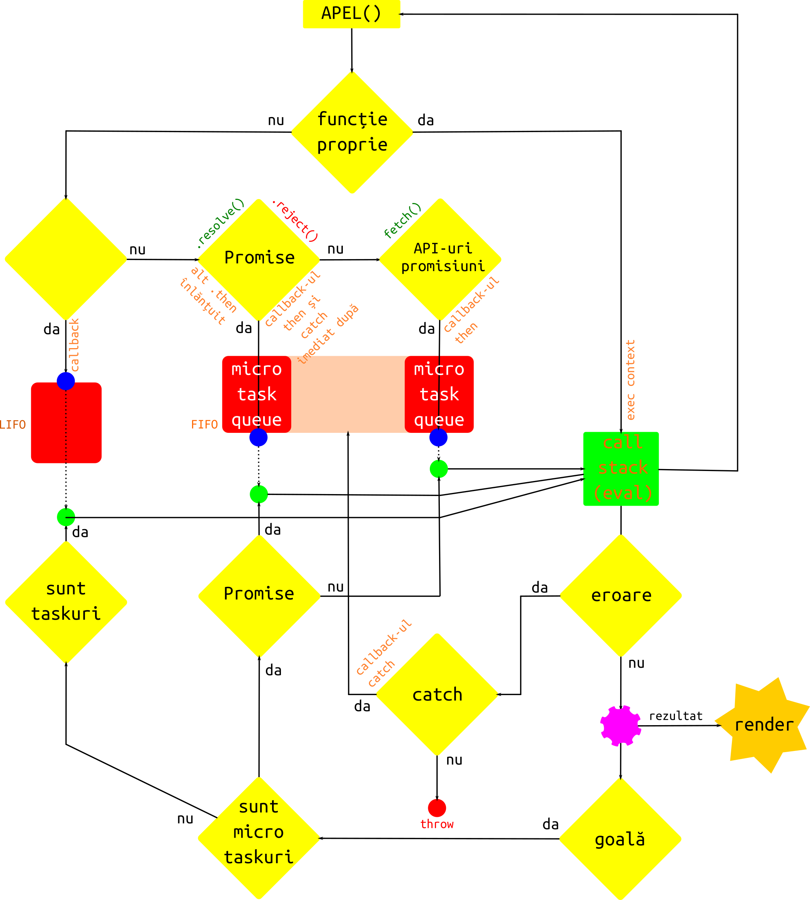

# Relația între stiva apelurilor, bucla de evenimente și API-urile browserului

Programele JavaScript sunt executate în mod tradițional în browserul web. Alte programe sunt construite pentru a folosi Node.js. În aplicațiile actuale, serverul folosește Node.js pentru a oferi resursele și datele necesare construcției unei adevărate aplicații. Putem vorbi despre o completă modificare a arhitecturii paginilor web de la documente, la aplicații.

În momentul în care deschizi browserul, în spatele interfeței grafice este creat ceea ce se numește **mediul de execuție**. Tot software-ul care rulează în browser este limitat în acțiune la granițele browserului. Vorbim despre un mediu separat numit *mediul de execuție* (în engleză *Execution environment*).

Browserul are un set foarte important de utilitare gata pentru a fi utilizate și mulți programatori le numesc părți ale API-ului său. Ce este un API? Este acronimul de la **Application Programming Interface** (*interfață de programare pentru aplicații*), care este un set de conectori / funcționalități oferite din oficiu de un pachet software. Poți asemui funcțiile expuse de un API precum manetele și butoanele dintr-un cockpit. Nu trebuie să știi toate părțile componente ale avionului pentru a-l face să zboare. În plus, de regulă, există un manual detaliat pentru fiecare instrument.

## Mediul de execuție

Executarea codului JavaScript este sincronă pentru majoritatea cazurilor, iar activitatea web este una ce implică conceptul de rulare asincronă. Asincronicitatea implică gândirea codului într-un model care rupe liniaritatea procedurală cu care creierul uman este obișnuit, forțându-ne să gândim în termenul relațiilor și timpilor de execuție care se stabilesc între diferitele entități, fie acestea ale browserului, fie ale codului propriu aflat în execuție. În momentul în care browserul se află în interacțiune cu utilizatorul, toată activitatea este tradusă în **task-uri** (în limba română: *sarcini*). Acestea se nasc în mediul de execuție.

Actorii principali sunt:

- **interpretorul** JavaScript, care execută fragmentele de cod ca răspuns la evenimente (*callback*-uri),
- **call stack** (*stiva apelurilor*), fiind locul în care se execută codul sincron,
- **task queue** fiind **coada** în care se rânduiesc funcțiile cu rol de callback,
- **microtask queue** sau **job queue**,
- **event loop** care este o neîntreruptă activitate de verificare a lui *microtask queue* și *task queue*.


În cazul browser-ului sunt oferite din oficiu funcții care pot fi asemuite utilitarelor. Una deja o folosim în mod curent pentru a sonda rezultatele evaluărilor: `console.log()`. Aceasta face parte din API-urile Web puse la dispoziție de browser. Pentru a vedea câte instrumente există, nu ar fi rău să aruncați o privire la documentația existentă pe Mozilla Developer Network - [API](https://developer.mozilla.org/en-US/docs/Web/API).

Cât privește codul JavaScript și execuția sa de către interpretor, există un concept fundamental necesar înțelegerii în adâncime. Acesta este cel de **control**. Vom spune că o anumită funcție este executată de **control** sau că acesta este returnat unei funcții care era în așteptare în stivă. **Controlul**, de fapt este firul roșu al execuției fragmentelor de cod ca răspuns la anumite evenimente.

Sunt convins că te-ai întrebat de foarte multe ori cum *știe* browserul să reacționeze la un click, de exemplu. Ori de câte ori apare un **eveniment** în browser, acesta este transformat într-o **sarcină** (execuția unei funcții cu rol de callback), care trebuie îndeplinită. Adu-ți aminte că o funcție poate fi pasată drept valoare unui argument unei alteia, pentru a fi executată la un moment dat. Callback-urile reprezintă modul în care comunicăm intențiile noastre unui API. Codul din callback ne aparține și este cel care va face ceva cu rezultatul pe care-l va primi de la API-ul căruia i-l pasăm. Callback-ul va fi programat spre execuție de îndată ce API-ul a adus niște rezultate. Ceea ce se petrece este că toate aceste API-uri, până să execute callback-ul, au nevoie de timp să-și facă și ele treaba: să aducă resurse de pe net, să facă calcule care necesită putere de calcul, etc. Aceasta este natura asyncronă a Javascript-ului.

Pentru a anunța browserul că suntem interesați să răspundem prin execuția unei funcții atunci când apare un eveniment, vom atașa un **receptor de eveniment** (în limba engleză se numesc **event handlers** sau **event listeners**) pentru elementul care va fi acționat de utilizator. Atașarea se face folosind proprietatea `onNumeEveniment`. Dacă dorim specificarea directă a numelui evenimentului, vom folosi funcția `elementDOM.addEventListener('click', numeCallback)`. Browserul va căuta în cod funcția `numeCallback` și va încărca în memorie tot ce este nevoie pentru evaluarea funcției callback. Codul din corpul funcției este pasat interpretorului JavaScript, care are sarcina de a-l executa. Dacă sunt mai multe apeluri către alte funcții ș.a.m.d., se creează o stivă de apeluri care ține evidența a ceea ce se află în execuție. Când ultima funcție adăugată în stivă returnează, aceasta dispare cedând **controlul** celei de dedesubt ce aștepta rezultatul ș.a.m.d.

Stiva apelurilor poate fi înțeleasă drept o coadă de așteptare după modelul LIFO (Last In, First Out) - *ultimul intrat este primul care pleacă*. Bucla verifică continuu stiva apelurilor pentru a verifica dacă există vreo funcție care are nevoie să ruleze. La fiecare iterație a buclei, se execută ce găsește în stiva apelurilor și este cod sincron.

Browserul stă atent și verifică în continuu dacă apar evenimente (**task**-uri) pe care le inventariază și le introduce în **task queue**. Sarcinile pot cere executarea prin intermediul unui mecanism care asigură evaluarea numit **buclă a evenimentelor** - în limba engleză **event loop**. Într-un mediu de execuție nu există mai mult de o **buclă** pentru că interpretorul nu rulează decât pe un singur fir de execuție.

Imaginează-ți un apel către o resursă de undeva de pe Internet. API-ul responsabil trebuie să parcurgă toate căile către acea resursă interogând servere de DNS, stabilind comunicații pe diferite protocoale, ș.a.m.d. Tot acest efort are o amprentă în timp. Și totuși, atunci când rulăm programele noastre în browser, nu simțim aceste sincope. Dacă ar fi fost altfel, tot programul s-ar opri până își face treaba API-ul, finalizând prin execuția funcției callback. Știm că JavaScript are un singur fir de execuție. Și totuși acesta nu este blocat. Acest lucru se petrece pentru că utilitarele, de fapt, sunt rulate de browser în alte fire, separate de cel al programului nostru. Și atunci, te vei întreba, cum se face comunicarea și armonizarea?

## Interpretorul la lucru

Înainte de a privi cum se execută codul JavaScript, reține că pentru **execution environment**, interpretorul plus codul constituie tot un **task** care trebuie gestionat.

Înainte ca vreun callback să-și pornească execuția, trebuie să știm faptul că există un **context de execuție** global pentru întreg codul. Pagina noastră, dacă vorbim de browser, a fost încărcată și a descărcat toate resursele JavaScript pentru a oferi o experiență de utilizare persoanei care a accesat-o. Fișierele cod sursă au fost compilate de motor și în acest moment există toți identificatorii la îndemână în **mediul lexical** pentru a *rezolva* callback-urile apărute în urma evenimentelor.

Pe această bază se clădește o stivă a contextelor de execuție începând cu prima funcție apelată pentru că fiecare dintre funcții creează propriul mediu de execuție. Reține faptul că, mai nou, modulele și funcțiile generator produc la rândul lor contexte de execuție.

Indiferent de numărul funcțiilor apelate, doar una singură este în evaluare. Nu există paralelism în JavaScript și acest aspect constituie miezul înțelegerii **firului de execuție**. Restul așteaptă cuminți la rând într-o **stivă a contextelor de execuție în derulare** (*stiva de apeluri* - **call stack**), similar **cozii task-urilor** din cazul folosirii API-urilor. Atenție, API-urile puse la dispoziție de browser au propriile fire de execuție separate de cel al motorului JavaScript. Acesta este motivul pentru care anumite acțiuni precum rularea unui apel AJAX (`XMLHttpRequest`) sau a unui `setTimeout()` nu blochează unicul fir de execuție.

Să ne imaginăm că pagina a fost încărcată și toate scripturile care au fost aduse ca resurse au fost deja executate. În acest moment, toate interacțiunile utilizatorului cu pagina sunt task-uri, care sunt gestionate de **event loop**, dar care sunt ordonate pentru a fi executate de motor. Pentru această situație, fragmentele de cod care sunt cerute a fi executate ca răspuns al unui eveniment, se numesc **job**-uri și pentru a le gestiona, motorul constituie câteva cozi de așteptare în funcție de tipul *job*-ului. Interpretorul folosește două *job queue*-uri. Una pentru a gestiona callback-urile care așteaptă datele în urma lucrului făcut de API-uri și alta folosită exclusiv pentru tratarea promisiunilor (vezi obiectul `Promise`), **microtask queue**.

## Contextul de execuție al funcțiilor

În multe lucrări veți vedea că momentul rulării codului unei funcții - contextul său de execuție - este reprezentat sau denumit **cadru** (în limba engleză *frame*). Un *cadru* este un concept abstract, care incorporează toate elementele asociate contextului de execuție: **mediul lexical propriu**, legătura `this`, **obiectul prototip**, stabilirea legăturii de **moștenire** și constituirea obiectului `arguments`. Toate aceste concepte se leagă la nivelul cel mai de jos, cel de alocarea a unor spații de memorie, care nu indică o structură. Acest spațiu de memorie este numit și *heap* în limba engleză.

### Call stack - stiva apelurilor

Când arunci privirea la ceea ce se petrece atunci când este rulat codul, imaginea poartă numele de **running execution context**, ceea ce am putea traduce în română ca fiind **contextul de execuție în efect**. Pe scurt, **ce rulează pe moment**.

Evaluarea codului se face într-un *context de execuție* în plină desfășurare, care se poate suspenda în momentul în care o altă funcție este apelată în interiorul celei care este deja în execuție. În acest moment special de întrerupere, un alt context de execuție devine *context de execuție în efect* și astfel va purcede la evaluarea propriului cod. Mai târziu, codul suspendat poate redeveni la rândul său *contextul de execuție în efect* pentru că ceea ce l-a întrerupt s-a încheiat, fiind reluată execuția de la momentul întreruperii. Această succesiune a contextelor de execuție în efect este gestionată cu ajutorul unei structuri de date speciale.

Structura de date care ține evidența funcțiilor care sunt în execuție, se numește **stiva apelurilor** - **call stack**. Să analizăm următoarea secvență de cod foarte simplă. Vom factoriza un număr natural pozitiv. Asta înseamnă că luăm numărul și îl înmulțim cu valoarea obținută după ce am scăzut o unitate și așa mai departe până când ajungem la `1`. Acesta este un caz în care vom folosi stiva apelurilor pentru că apelăm la recursivitate.

```javascript
function factorizez (x) {
    if (x == 1) {
        return 1;
    }
    return x * factorizez(x - 1);
};
fact(4); // 24 fiind 4*3*2*1
```

Ceea ce se petrece mai sus este că pentru numărul natural pasat ca parametru funcției `factorizez`, va fi testat să nu fie `1` pentru că `1` factorial este `1`. Acesta este și declanșatorul ieșirii din recursivitate, de fapt. Legătura cu stiva contextelor de execuție se leagă de următorul scenariu:

-   Pentru prima dată funcția este apelată pasându-i-se argumentul cu valoarea `4`. Aceasta își începe execuția. Se creează în stivă cadrul de execuție pentru `factorizez`. Execuția codului din corpul funcției începe. Controlul se asigură că `x` nu este `1` și ajunge la momentul în care ar trebui să iasă din execuție prin returnarea rezultatului în urma evaluării expresiei de după `return`. Ce să vezi, această expresie implică apelarea funcției `factorizez` dar de data aceasta cu valoarea nu `x` din mediul de execuție curent, din care am scăzut o unitate.
-   Controlul oprește finalizarea funcției `factorizez` și apelează încă o dată funcția după ce a scăzut valoarea. Este creat un alt cadru de execuție peste cel al funcției *suspendate* în care se execută încă o dată corpul funcției. Se va ajunge la aceeași imposibilitate de finalizare, cu aceleași urmări. Acest lucru va fi repetat până când condiția ca `x` să fie `1` va fi întrunită. Abia atunci `1` este returnat din cel mai de sus context de execuție al stivei către cel de dedesubt care aștepta această valoare. Acest proces se va repeta în cascadă până când apelul original va avea valoarea așteptată pentru a încheia evaluarea.

Programarea bazată pe evenimente este o paradigmă înscrisă practicii de zi cu zi tradițional legată de manipularea **DOM**-ului (*Document Object Model*). Modelul bazat pe *evenimente* mai este cunoscut drept modelul de gestiune al tuturor solicitărilor de preluare a controlului, care în engleză este numit *concurency model*. Chiar despre asta este și vorba: despre gestionarea intereselor concurente la momentul evaluării codului. În acest sens, este nevoie de un mecanism de gestiune a evenimentelor care să fie capabil să introducă ordine pentru a putea raționaliza codul și pașii necesari. Toate evenimentele sunt asincrone.

Îți poți închipui povestea concurențială precum o busculadă care s-a creat la poarta unui magazin de Black Friday. Din fericire, există agenți de securitate care ordonează accesul. Dacă sunt multe persoane, vor fi organizate pe mai multe rânduri, dar la intrare se va face una după cealaltă. Bucla evenimentelor împreună cu stiva pot fi considerați agenții noștri de securitate.

Sunt necesare câteva lămuriri importante. Evaluarea codului din corpul unei funcții începe la momentul apelării. Atunci când o funcție este apelată, fie a programului, fie a API-ului, poți spune că aceasta creează un *eveniment*. Din acest motiv, JavaScript este considerat a fi **event-driven**, adică un limbaj a cărui principală activitate este să răspundă la evenimente. Și cum navigarea și interacțiunea cu o pagină web creează evenimente pentru care este necesar câte un răspuns, putem să înțelegem și mai bine rolul JavaScript pentru Platforma Web. **DOM**-ul (este în sine o micro-platformă), interpretorul, componenta de networking și toate celelalte părți componente ale unui browser alcătuiesc *mediul de execuție*.

### Job și job queue

Înainte de toate, va trebui să lămurim conceptul de **job** și **job queue** pe care le introduce standardul. Am putea traduce în limba română un **job** ca **sarcină**, dar pentru că termenul este deja absorbit de limba română ca neologism, voi continua să-l folosesc ca atare. Spre deosebire de API-uri care sunt puse la dispoziție de browser, coada joburilor este un mecanism pus la dispoziție de motorul JavaScript și acest lucru este o diferență importantă pentru a înțelege că o operațiune desfășurată prin apelul unui API, va trimite rezultatul în *coada joburilor*, ca mecanism de reinserție în firul de execuție JavaScript.

În cuprinsul materialelor, am folosit de multe ori API-ul `setTimeout()`. Acest API, după cum am practicat de multe ori primește ca prim parametru o funcție callback, iar al doilea, o valoare numerică ce reprezintă timpul în milisecunde după care se va executa funcția. Browserul pornește un cronometru și va trimite funcția în *coada de așteptare*. Mecanismele cozii vor aștepta primul momentul când stiva contextelor de execuție va fi goală și va injecta funcția callback pentru a fi executată. Vom mai investiga acest proces, dar ceea ce doream să subliniez aici un aspect important: timpul menționat este unul minim garantat de așteptare, dar la acesta se mai poate adăuga un timp cât l-a petrecut în coadă pentru a fi trimis spre execuție.

```javascript
function temporizator (x = 10000) {
  var i = 0;
  while (++i < x * x) {};
  return i;
}
var timer = setTimeout(() => {
  console.timeEnd('setTimeout');
}, 300);

console.time('setTimeout');
expensive();
```

**Spune standardul**:

> Un Job este o operațiune abstractă care inițiază o computație atunci când nici o altă computație ECMAScript nu este în desfășurare.\[...] Execuția unui Job poate fi inițiată doar atunci când nu există niciun context de execuție și stiva contextelor de execuție este goală. A PendingJob este o cerere pentru o viitoare execuție a unui Job.\[...] Din moment ce execuția unui Job este inițiată, Job-ul va fi rulat până când se încheie. Totuși, Job-ul care rulează sau evenimente externe pot fi cauza trimiterii în coada de așteptare a unor PendingJobs suplimentare care pot fi inițiate cândva după încheierea Job-ului curent.

Job-urile sunt organizate printr-un mecanism intern motorului, care se comportă ca o stivă FIFO (First In, First Out), ceea ce înseamnă că primul job intrat, va fi și primul care va ieși. Standardul recomandă ca motoarele diferiților implementatori să fie prevăzute cu cel puțin două stive de Job-uri: una dedicată validării și evaluării textelor sursă pentru scripturi și module, precum și una dedicată rezolvării promisiunilor.

În resursele pe care le veți consulta suplimentar, veți remarca faptul că acest **job queue** este numit simplu **queue** sau **coada**.

## Imaginea întregului

Pentru a gestiona comportamentul complex al apelurilor și al timpilor de execuție, motorul JavaScript are la dispoziție trei mecanisme interne: **stiva de apeluri**, numită științific **stiva contextelor de execuție în derulare** (*call stack* în engleză), **API**-urile browserului, care preiau din efortul de soluționare a unor evaluări, precum apelurile AJAX sau temporizările cu `setTimeout()` și **job queue**. Mai există și un mecanism care gestionează felul în care joburile sunt reinserate în firul principal de execuție. Coroborarea acestor mecanisme permite rularea codului complex al oricărei aplicații JavaScript. Din acest motiv este necesară înțelegerea în adâncime a felului în care funcționează.

Rularea unui program în firul de execuție este echivalent evaluarea expresie după expresie în ordinea intenționată de programator. În lucrările de specialitate veți găsi sintagma **run-to-completition**, adică un program va rula până la încheierea tuturor pașilor prevăzuți de un algoritm. Acest aspect descrie execuția ca fiind una **sincronă** sau **serială**. Pe măsură ce paradigma de programare în JavaScript evoluează, aceste cazuri sunt rare și de cele mai multe ori se aplică fragmentelor de cod explicate într-un manual de programare sau local în funcții.

Realitatea rulării unor mari aplicații ține de gestionarea mai multor fire de execuție: a celui principal al programului și ale API-urilor puse la dispoziție de mediul creat de browser. Înțelegerea aspectelor complexe la rularea într-un astfel de model ține de caracterul **asincron** al execuției. Marea majoritate a software-ului JavaScript existent este scris pentru a rula asincron.



Din nefericire, modul în care funcționează asimilarea de informație pentru noi oamenii este una sincronă, secvențială. Fie că lecturăm, fie că privim un film, informația este asimilată secvențial. Intelectul uman are capacitatea de a reconstitui un context complex, chiar dacă detaliile acestuia au fost asimilate fragment cu fragment. Acesta este și cazul paradigmei noi de programare asincronă în care efortul este de a stabili legăturile dintre fragmentele de cod, relațiile pe care le stabilesc și cum modifică starea una alteia în funcție de evenimentele apărute.

Asincronicitatea se întâmplă și atunci când folosim callback-uri, promisiuni sau funcții *async/await*. Funcția cu rol de callback se va executa și va produce un rezultat. Executarea funcțiilor callback ia ceva timp și din acest motiv numim acest comportament a fi unul **asincron**. Rezultatul evaluării codului din callback va fi returnat într-un moment viitor.

Să presupunem că dorești să prelucrezi un set de date aflat pe un server pe Internet. Mai întâi, ai nevoie să-l aduci și de îndată ce l-ai adus să ai o funcție care să aplice transformările dorite asupra conținutului său. Pentru exemplificare vom lucra cu API-ul pus la dispoziție de Europeana.

```javascript
console.log('Am solicitat date de la Europeana.');
TODO: Nu uita să ștergi cheia mea din stringul de acces la API-ul Europeana

// înlocuiește cheia API din link numită wskey, cu una personală obținută
// de la https://pro.europeana.eu/get-api
// Secvența unde vei pune cheia ta este wskey=XXXXXXXXX
// înlocuiește XXXXXXXXX cu propria cheie
// dacă nu introduci cheia personală vei avea o eroare
// Cross-Origin Request Blocked
let adresa = "https://www.europeana.eu/api/v2/search.json?wskey=MH8g7b6hz&query=The%20Fraternity%20between%20Romanian%20and%20French%20Army";
fetch(adresa)
  .then( function(raspuns) {
    if (raspuns.headers.get('Content-Type') === 'application/json') {
      return raspuns.json();
    }
    return raspuns.text();
  }).then(function(dateleAduse) {
    console.log(dateleAduse);
  }).catch(function (error) {
    console.log("A apărut o eroare: " + error);
  });
console.log('Mesaj afișat înaintea primirii datelor.');
```

În exemplul selectat, delegăm o cerere pentru aducerea unor date de la Europeana.eu, API-ului `fetch()` al browserului. Ceea ce tocmai am făcut este să delegăm sarcina aducerii datelor unui alt *program*, în timp ce firul de execuție își va vedea de treabă în continuare. Din acest motiv vom avea cele două mesaje în consolă unul după altul și abia **la un moment dat** vom avea și datele afișate. Scopul pentru care facem această delegare este acela de a nu bloca firul de execuție.

Lucrul asincron îl vei *simți* în practica cu paginile web. Gândește-te la faptul că vei dori manipularea unei pagini web, care, de fapt, este un arbore dinamic de noduri a ceea ce numim **Document Object Model**. La un moment dat, un utilizator, dă un click pe un element al paginii. Asociat elementului acționat prin click trebuie să ai un mecanism de ascultare și o funcție din program care să pornească execuția la momentul click-ului. Utilizatorului îi este returnat un rezultat la finalizarea execuției funcției acționate (în jargonul programării web se numește **event handler**). Toate acestea descriu caracterul asincron al programelor JavaScript. Acest aspect este, de fapt, cel pentru care JavaScript are valoarea sa actuală.

Să luăm cazul callback-urilor pentru că acestea sunt cel mai des întâlnit exemplu în practică. O funcție este pasată unui utilitar al API-ului pentru ca în momentul în care utilitarul și-a încheiat execuția, acesta să execute funcția pe care i-am dat-o noi și pe care să o aplice rezultatelor oferite de utilitar la finalul execuției sale. Fenomenele interesante apar atunci când stiva apelurilor (a contextelor de execuție în desfășurare) nu este goală. De ce este nevoie să fie goală, te vei întreba? Pentru că funcția callback trebuie și ea la rândul ei executată. Dar pentru că necesitatea executării sale a survenit într-un moment când alte apeluri de funcții erau în executare, această cerință trebuie memorată undeva. Astfel, mecanismul cozii de așteptare este evident. De îndată ce stiva apelurilor se golește, primul apel de callback din coadă, va fi trimis spre execuție, creând la rândul său o stivă. Acesta devine primul context din noua stivă. Următorul callback din coadă așteaptă cumințel ca stiva să fie goală ca să intre și el în execuție. Și tot așa până când sunt epuizate toate callbackurile din coadă.

## Asincronicitate în prelucrarea datelor

Comportamentul asincron este permis de relația dintre runtime-ul JavaScript, stiva de apeluri și API-urile web. Să presupunem că avem o colecție de elemente pe care dorim să le iterăm și fiecărui element să-i aplicăm o funcție.

```javascript
let colectie = ['unu', 'doi', 'trei'];
function procesor (element) {
  console.log(element);
};
let dimensiune = colectie.length;
for (let x = 0; x < dimensiune; x++) {
  procesor(colectie[x]);
}; /* unu doi trei*/
```

În cazul în care pentru fiecare element ai dori să faci mult mai multe lucruri, poți apela la un callback, care va împlini toate sarcinile și abia la final va face procesarea elementului din colecție. În acest caz, vom construi o funcție specială care ia drept argumente colecția și drept callback, o altă funcție care trebuie să fie aplicată pe fiecare element al colecției. Ceea ce permite astfel de model de lucru este ca funcția callback să fie una diferită în funcție de necesități.

```javascript
let colectie = ['unu', 'doi', 'trei'];
function procesor (element) {
  console.log(element);
};
function prelucrarePerElement (arr, modificator) {
  for (let x = 0; x < arr.length; x++) {
    modificator(arr[x]);
  };
};
prelucrarePerElement (colectie, procesor);
```

Lucrurile se simplifică drastic dacă folosim utilitarul `forEach()` pus la dispoziție de prototipul obiectului intern `Array.prototype`. Nu mai trebuie să creăm noi funcția de `prelucrarePerElement`.

```javascript
let colectie = ['unu', 'doi', 'trei'];
function procesor (element) {
  console.log(element);
};
colectie.forEach(procesor);
function afisare (element) {
  console.log(`Am pe: ${element}`);
};
colectie.forEach(afisare);
```

Simți să s-ar putea simplifica și mai mult? Da, ai dreptate, pur și simplu am putea folosi în locul callback-ului o funcție anonimă care să facă prelucrarea. Astfel, am putea renunța din verbozitatea codului prin declararea funcțiilor cu nume.

```javascript
let colectie = ['unu', 'doi', 'trei'];
colectie.forEach(function (element) {
  console.log(`Am pe: ${element}`);
});
```

Și pentru că unora le place eleganța, îți voi arăta o formă și mai prescurtată prin folosirea *arrow functions*.

```javascript
let colectie = ['unu', 'doi', 'trei'];
colectie.forEach( element => console.log(`Am pe: ${element}`));
```

Pentru că am văzut mecanismele simple care stau la baza lucrului asincron prin exemplele anterioare, vom simula asincronicitatea utilizând utilitarul `setTimeout()`, parte a API-ului browserului, care ia un callback și valoarea de timp exprimată în milisecunde. Ceea ce dorim este să introducem o întârziere, o **amânare** (în engleză am zice că execuția funcției este *deferred* - amânată).

```javascript
setTimeout (() => {
  console.log('Hop și eu mult după');
}, 5000);
console.log('Eu între timp m-am executat');
```

Pe scurt, ceea ce se întâmplă este că apelarea lui `console.log()` intern din callback-ul lui `setTimeout()`, a fost *amânat* la execuție cinci secunde mai târziu unui API intern motorului JavaScript, în vreme ce codul care urma a `setTimeout()`-ului a fost evaluat fără a mai aștepta finalizarea celui anterior. Este un fel de *valoarea vine, când vine*.

Din nefericire, modelul asincronicității construit pe callback-uri conduce la un anumit fenomen de aglomerare în care vei folosi un callback în interiorul unui alt callback și așa mai departe pentru atingerea unui anumit model funcțional. Apelarea unui callback atunci când deja execuți un callback și posibil un altul din cel tocmai apelat, conduce la o situație numită în literatura de specialitate **callback hell**. Unii programatori mai numesc această situație *piramida pierzaniei* - **pyramid of doom**, datorită formei pe care o dă indentarea codului. O astfel de practică trebuie evitată ori de câte ori este posibil printr-o abordare diferită a logicii aplicației, fie prin chaining, fie prin folosirea promisiunilor.

# Resurse

-   Acest material a fost inspirat de prezetarea lui Philip Roberts: [What the heck is the event loop anyway?](https://www.youtube.com/watch?v=8aGhZQkoFbQ) de la JSConf EU 2014. Instrumentul de simulare „Loupe” este la [acest link](http://latentflip.com/loupe).
-   [Wikipedia Call stack](https://en.wikipedia.org/wiki/Call_stack)
-   [Concurrency model and Event Loop](https://developer.mozilla.org/en/docs/Web/JavaScript/EventLoop)
-   [Understanding the Node.js Event Loop](https://nodesource.com/blog/understanding-the-nodejs-event-loop/)
-   [Callback Hell](http://callbackhell.com/)
-   [Using XMLHttpRequest](https://developer.mozilla.org/en-US/docs/Web/API/XMLHttpRequest/Using_XMLHttpRequest),
-   [Jake Archibald: In The Loop - JSConf.Asia | Youtube |  JSConf](https://www.youtube.com/watch?v=cCOL7MC4Pl0)
-   [8.1.6.2 Queuing tasks | HTML. Living Standard | 21 May 2021 | html.spec.whatwg.org](https://html.spec.whatwg.org/multipage/webappapis.html#queuing-tasks)
-   [8.1.6 Event loops | HTML. Living Standard | 21 May 2021 | html.spec.whatwg.org](https://html.spec.whatwg.org/multipage/webappapis.html#task-queue)
-   [The Node.js Event Loop | Flavio Copes](https://flaviocopes.com/node-event-loop/)
- [JavaScript Visualizer 9000](https://www.jsv9000.app/)
