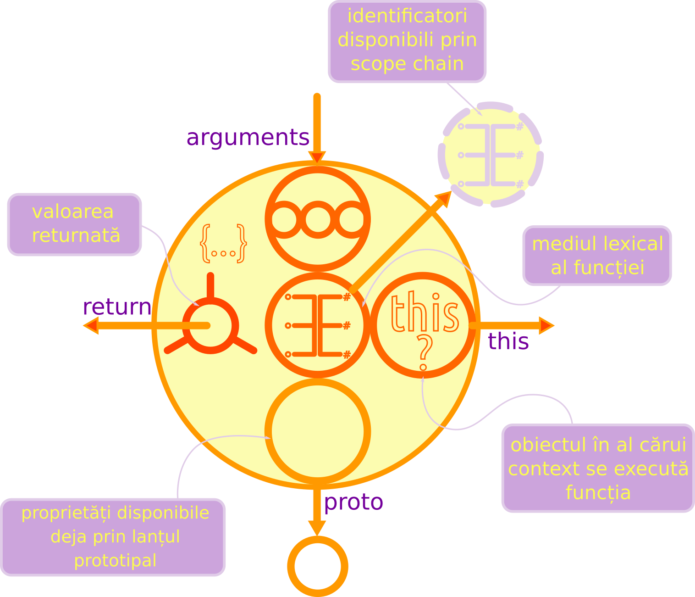

# Funcții în ECMAScript

O perspectivă simpatică ar fi dacă-ți închipui o funcție ca o dronă dintr-un joc de strategie pe care dai clic și iese din bază ca să o pui să facă ceva. Când ai nevoie să producă mâncare, o pui să facă o fermă. O trimiți după lemne ca să aibă cu ce și așa mai departe. Dacă ajunge la un punct de pe hartă, unde concurează cu alte drone pentru o resursă, pur și simplu așteaptă cuminte să-i vină rândul la tufa cu fructe sau la minerit aur. Imediat ce termină treaba, drona nu are inițiativă și se retrage în bază fără să o mai vezi. În tușe foarte groase așa sunt și funcțiile ca și comportament.

O funcție este declarată folosind cuvântul cheie `function` urmat de un șir de caractere, care este numele funcției urmate de paranteze rotunde. Între paranteze sunt declarate valori care constituie argumentele funcției (acestea formează așa-numitul antet), urmate apoi de acolade. Acoladele delimitează **blocul de cod** ce va fi executat la invocarea funcției.

```javascript
function faCeva (arg1, arg2) {
  var oValoare = arg1 + arg2;
  return oValoare;
}; faCeva(1, 3); //4
```

**Moment ZEN**: O funcție este un obiect care poate fi invocat.

Funcțiile oferă toate capabilitățile obiectelor pentru că sunt obiecte. Dacă privești la modul de redactare, chiar arată precum o declarație de obiect literal, având în plus cuvântul cheie `function` și parantezele rotunde în care poți introduce argumentele.

```javascript
let obi = {};
obi.a = 10;
function fun () {};
fun.a = 10;
// poți introduce proprietăți
// exact ca în cazul obiectelor
```

Ba mai mult, funcțiile au chiar metode proprii pe care le poți utiliza în anumite cazuri. Cel mai adesea vei vedea utilitatea lui `call()`, `apply()` sau `bind()`. Din curiozitate, deschide consola în browser și declară o funcție: `function ceva () {};`. Acum scrie identificatorul funcției urmat de punct. Ceea ce vei vedea sunt toate proprietățile și metodele obiectului funcție. Cred că în acest moment ești convinsă că funcțiile sunt obiecte, de fapt.

Veți întâlni funcțiile la orice pas și în combinații diferite ca parte a unor expresii ale unui enunț sau ca declarații directe. Veți mai întâlni funcțiile ca valori care sunt pasate ca argumente unei alte funcții, fie ca identificator, fie declarate direct în antetul altei funcții. Le veți mai vedea la treabă în rolul de constructori de obiecte. Reține faptul că acolo unde este permisă scrierea unei expresii, poți scrie o funcție. Bunele practici îndeamnă programatorii să scrie funcțiile cât mai aproape de locul unde vor fi folosite.

Unul din motivele evidente pentru care există funcțiile este acela al reutilizării în diferite scenarii. De ce? Pentru că ar fi o nebunie să scrii aceeași secvență de cod de 1000 de ori, dacă în diferite părți ale codului este nevoie de un „tratament” identic al unor seturi de valori diferite.

## Unități de execuție

Funcțiile sunt unități modulare de execuție ale codului JavaScript. O funcție poate fi percepută ca un subprogram, ca o subrutină. Veți mai întâlni în alte lucrări și denumirea de „proceduri”. Cel mai sănătos mod de a privi activitatea și efectele unei funcții este gândind întotdeauna că o funcție este un set de instrucțiuni, care se aplică unui set de date primit ca argumente. De ce să faci asta? Pentru că în interiorul funcției vei prelucra datele primite și la final vei dori să oferi rezultatele la care ai ajuns.

## Funcțiile sunt valori

**Moment Zen**: Funcțiile sunt valori în sine care pot fi referențiate printr-un identificator (variabilă).

Funcțiile sunt cunoscute ca fiind de ordin înalt (în engleză îi spune **higher order**), ceea ce simplu înseamnă că sunt la rândul lor valori, că pot fi pasate altor funcții, că pot fi returnate ca rezultat al evaluării unei alte funcții, cam tot ce poți face cu oricare altă valoare. Acest aspect face din JavaScript un limbaj foarte potrivit pentru a lucra cu funcțiile într-o paradigmă numită în limba engleză *functional programming*, adică **programare funcțională**.

## Anatomie

Pentru că este absolut necesară înțelegerea mecanismelor interne pe care le pune la dispoziție o funcție în scopul prelucrării datelor și apoi pentru a le returna, vom examina o funcție pentru a avea o privire generală.



Atunci când este invocată o funcție, se creează un nou mediu lexical propriu acelei funcții. Orice funcție va moșteni automat proprietățile și metodele obiectelor interne `Object` și `Function`. Îți mai aduci aminte de capitolul pe care l-am dedicat Genezei și apoi dualității funcție-obiect? Toate acele informații sunt necesare acum pentru a înțelege natura fascinantă a unei funcții. Dacă vei declara o funcție în consola unui browser, și apoi vei scrie numele funcției urmat de operatorul punct, vei vedea că apar deja proprietăți ale acestei funcții. Aceasta este și semnul că funcția ca și valoare a fost „împachetată” ca obiect, moștenind natural proprietăți de la cele două obiecte interne fundamentale `Object` și `Function`.

**Spune standardul**:

> Atunci când se realizează un context de execuție pentru evaluarea unei funcții ECMAScript, se creează un nou Environment Record pentru aceas funcție, iar legăturile pentru fiecare parametru formal sunt instanțiate în acel Environment Record. Fiecare declarație din corpul funcției este la rândul ei instanțiată. Dacă parametrii formali ai funcției nu includ niciun inițializator de valori implicite, atunci declarațiile din corp sunt instanțiate în același Environment Record ca și parametrii. Dacă inițializatorii de valori implicite există, va fi creat un al doilea Environment Record pentru declarațiile din corp. Parametrii formali și funcțiile sunt inițializate ca parte a FunctionDeclarationInstantiation. Toate celelalte legături sunt inițializate în timpul evaluării corpului funcției. [9.2.12 FunctionDeclarationInstantiation ( func, argumentsList )](https://www.ecma-international.org/ecma-262/8.0/index.html#sec-functiondeclarationinstantiation)

Haideți să disecăm o funcție. Încă o dată: funcțiile sunt valori. Conștientizarea acestei afirmații este una crucială pentru înțelegerea în adâncime a limbajului de programare. Mai înainte de a fi executată și astfel, codul ECMAScript conținut să fie evaluat, aceasta este o valoare în sine. Știm deja că ne putem juca cum vrem noi cu o valoare, chiar o putem pasa ca unei alte funcții sau o putem returna dintr-o funcție.

Pentru ilustrare, am compus o imagine cu simbolurile pe care le-am creat drept ilustrații la capitolul dedicat dualității funcție-obiect. După cum putem urmări, o funcție primește argumente, care devin parametrii de lucru. Aceștia sunt colectați într-o structură de date internă funcției numită **arguments** care este disponibilă la momentul evaluării codului intern.

Aplicarea unei funcții argumentelor sale produce un nou **mediu lexical**, un nou **scope** așa cum mai este denumit în engleză. Acest mediu lexical este ca un registru în care se ține evidența legăturilor între identificatori și valori. În mediul lexical sunt disponibile și identificatorii și valorile primite ca argumente.

**Spune standardul**:

> Mediul unei funcții este un Mediu Lexical care corespunde invocării unui obiect funcție EMCAScript. Un mediu al unei funcții poate crea o nouă legătură `this`. Un mediu al funcției poate captura starea necesară pentru a satisface invocările metodei `super` [ECMAScript® 2017 Language Specification (ECMA-262, 8th edition, June 2017). 8.1 Lexical Environments](https://www.ecma-international.org/ecma-262/8.0/index.html#sec-environment-records).

Ca obișnuință, ar fi de dorit să gândești că funcția se aplică pe argumente, atunci când acestea există. Mult timp am gândit altfel: funcția este un fragment de cod care „primește” pentru că, într-adevăr, introduci niște argumente. Nu este greșit, dar pentru o iluminare rapidă în domeniul funcțiilor, cel mai bine este să gândești în termenii aplicării sale pe argumente primite. În adâncime, trebuie înțeles că acest comportament este posibil pentru funcții pentru că pur și simplu sunt **o-bi-ec-te**. Sunt niște obiecte speciale pentru că pur și simplu pot executa codul din interior ori de câte ori se dorește.

**Moment Zen**: O funcție, de fapt, „se aplică” argumentelor pasate care sunt valori, le va prelucra și le va oferi apelantului prin returnare.

Mai observăm din imagine că unei funcții îi sunt puse la dispoziție două lanțuri de conectare cu obiectele în contextul cărora sunt executate. O scurtă paranteză aci. Spuneam din deschiderea lucrării că totul în JavaScript este un obiect. Chiar și o funcție, care este un obiect special, la momentul execuției sale lansată în urma unui apel, aceasta nu rulează așa în vid absolut. Există un obiect pe fundalul căruia aceasta lucrează. Vorbim despre un obiect context, cu care funcția noastră stabilește niște legături speciale. Una dintre legături este chiar la proprietățile obiectului context, care sunt adunate într-un borcan cu eticheta `this`, iar cealaltă este la mediul lexical format prin declararea variabilelor și a celorlalte funcții și obiecte ale programului. Pentru că vorbirăm de mediul lexical, o funcție, la momentul evaluării declanșată în urma unui apel, creează propriul său mediu lexical. Dacă un identificator necesar evaluării codului funcției, nu a fost găsit, se va proceda la o căutare „în afara” funcției, în mediul lexical exterior ei și așa mai departe până când se ajunge la mediul global. Această procedură se numește în limba engleză **scope lookup** și pentru faptul că din bula lexicală la funcției se caută în bula mai mare a mediului lexical ce înconjoară funcția, iar dacă există unul superior, va căuta și în acela, programatorii au numit acest lucru **scope chain**, cu o traducere în limba română: **căutare pe lanț**. De ce? Pentru că pur și simplu căutarea identificatorului străpunge bula mediului funcției, în cea mai mare ș.a.m.d. ca și cum ai parcurge verigile unui lanț.

În afară de aceste două legături foarte importante pe care le strabilește o funcție: la `this` și cea la mediul lexical extern, mai este una foarte importantă prin care orice obiect, fie că este funcție sau obiect, primește niște puteri, niște caracteristici din prima. Ca și în domeniul geneticii, obiectele create în JavaScript, vor **moșteni** automat o serie de proprietăți și metode direct de la obiectele fundamentale și dacă se dorește, de la alte obiecte create de noi. Acest lucru se numește în programare **moștenire prototipală** și este baza unor prelucrări de date având deja la îndemână intrumente croite cu care să te ajuți. Poți să-ți închipui obiectele interne ale JavaScript precum lădițele cu scule dintr-un atelier auto. Sunt pline deja cu instrumente și piese, gata de a fi folosite. Funcțiile create de noi nu fac nicio excepție și moștenesc și ele. Acest lucru este mi-nu-nat. De ce? Pentru că nu numai că sunt utile atunci când le execuți, dar le poți manipula ca și date, ca și valori înainte de a fi executate.

### Funcțiile returnează rezultate

Funcțiile în JavaScript trebuie să returneze un rezultat fără excepție. Chiar de la momentul declarării, funcțiile returnează ceva, iar acel ceva este valoarea `undefined`. Următoarele enunțuri sunt echivalente ca rezultat.

```javascript
function facCeva () {};
function facAltceva () {
  return;
};
function facLucruri () {
  return undefined;
};
```

Adesea vom dori returnarea rezultatelor ca un array sau ca un obiect. Pe lângă faptul că putem returna array-uri și obiecte, pot fi returnate chiar alte funcții. Nu voi înceta să repet faptul că o funcție mai întâi de toate este ea însăși o valoare. Iar funcțiile în JavaScript pot primi drept valori la argumente, alte funcții și pot returna mai apoi alte funcții. Acest aspect interesant al funcțiilor definește capacitatea acestora de a fi **de ordin înalt**. Returnarea datelor dintr-o funcție înseamnă și încheierea execuției acesteia și revenirea sa la starea de valoare. Poți să-ți imaginezi o funcție precum un bec, care în sine este o valoare, dar care alimentat, acesta transformă curentul electric în lumină și căldură, după care, la deschiderea circuitului redevine doar un bec.

Următorul exemplu expune o funcție care conține la rândul său o altă funcție. Acest scenariu este unul care introduce și conceptul de **closure** (în limba română poți traduce ca **portiță** sau **breșă**), care este o funcție internă ce „face o ancorare” a mediului lexical în care a fost declarată. Acest lucru este absolu necesar pentru că funcția are nevoie de identificatorii necesari propriei execuții. Vom aprofunda **closure-urile**, dar pentru te știu fire curioasă, hai să privim la următoarea secvență de cod drept exemplu.

```javascript
function ex (unu, doi) {
  console.log(this);  // Window
  this.trei = 3;      // se creează prop trei: window.trei care este 3
  console.log(ex.arguments);
  // Arguments {0:1,1:2,calee:ex(),length:2,__proto__:Object}
  function intern (patru, cinci) {
    console.log(this.trei);    // 3
    console.log(ex.arguments);
    // Arguments {0:1,1:2,calee:ex(),length:2,__proto__:Object}
    console.log(unu); // 1
  };
  intern();
}; ex(1,2);
console.log(window.trei);
```

Codul sursă a acestei funcții este considerat a fi `Global code`, adică nu a fost „împachetat” în altă funcție sau într-un bloc de cod.
Această funcție a fost declarată în primul mediu lexical (adică nu are părinte) pe care-l generează motorul JavaScript: `global environment` sau `global scope`. În cazul browserelor, acesta este obiectul global `window` cu toate proprietățile sale printre care și obiectele interne specifice JavaScript.
Pentru a testa care este mediul lexical, se face un `console.log` pe `this`, care relevă cine este contextul în care funcția este evaluată. Contextul în cazul nostru este acest obiect `window` creat de browser.
Pentru că `this` este un identificator pentru contextul în care se face evaluarea, care la rândul său este un obiect, se pot introduce din interiorul funcției, la momentul evaluării, proprietăți noi cu valorile dorite: `this.trei = 3`. Chiar și după ce funcția a fost evaluată deja și nu mai este în execuție, proprietatea setată obiectului context, va exista în continuare. Poți verifica printr-o interogare simplă: `console.log(window.trei);`.
Pentru ambele funcții `this` este obiectul global.
Pe lângă `this`, funcția mai are acces la un obiect la momentul evaluării: `arguments`, care este un obiect ce seamănă cu un array. Acesta cuprinde toate argumentele pasate funcției. Poate fi accesat chiar și dintr-o funcție internă după sintaxa `numeFunctieGazda.arguments`, dacă acest lucru este necesar sau direct fiecare parametru separat: `console.log(unu);`.
Funcția `intern()` are posibilitatea de a accesa proprietățile funcției gazdă pentru că la momentul evaluării face **o poză** cu toți identificatorii pe care-i are gazda în `Environment Record`. Această **poză** se numește **closure**.

## Magie pură - hoisting

Am numit eu **magice** aceste acțiuni ale compilatorului la momentul când interpretează codul pentru că se petrec câteva lucruri cu adevărat uimitoare.

Declararea unei funcții are ca efect declanșarea **hoising**-ului. Declarația este introdusă în registrul inventar al mediului lexical existent la momentul compilării codului. Magia rezidă din faptul că poți invoca o funcție înainte ca aceasta să fie declarată, dacă privești la modul în care este redactat codul în fișierul sursă. Superciudățel, nu?! Psst! Secretul este legat chiar de compilarea codului. Adu-ți mereu aminte că înainte de a fi rulat, codul este compilat. Dacă ai uitat ce se petrece în acel moment, merită să te întorci să mai citești o dată. Concluzia este că totul este deja disponibil încă din faza de compilare.

Poți să-ți imaginezi funcțiile ca niște vapoare care transportă și prelucrează valori. Toate vasele pe tot mapamondul se află deja în plutire la nivelul mării. Pot comunica unele cu altele și sunt diponibile scopurilor pentru care există. Așa sunt și funcțiile. Pur și simplu sunt disponibile deodată, nu pe măsură ce codul este executat.

Am aflat mai devreme că la executarea unei funcții, aceasta creează și un mediu lexical propriu (*scope*), dar mai e o chestie supertare: dacă într-un bloc de cod simplu introduci o declarație sau o expresie, se va crea un nou scope pentru respectivul cod. Ciudățel și super-interesant, nu?

```javascript
var x = 100, y = 'ceva';
{ var x = 10; console.log(this.x, this.y) }; // 10 ceva
```

## Funcția ca valoare poate fi redusă la nimic cu `void`

Utilizarea operatorului `void`, care precedă o expresie, o golește de valoarea pe care o avea.

```javascript
void 1; // undefined
void (function ki(){return 'energie';})(); // undefined
```

Și acum, vom face un exercițiu Zen și vom privi la exemplul perfect de funcție, care se poate executa, dar a cărei esență este golul, nedefinitul. Vom folosi un alt tip de funcții introduse de curând și care se numesc  fat arrow. Ceea ce le face le face perfecte pentru această mică demonstrație, este formula de scriere concisă.

```javascript
() => {}; // returnează constructorul
// executând privim Ensō
( () => {} )(); // undefined
```

Cred că ai observat că am folosit operatorul de grupare, care *strânge* enunțurile, iar dacă acesta este chiar o funcție, punând după parantezele rotunde `()` pentru apelare, chiar va executa acea funcție.

## Apelare / invocare / rulare = evaluare!

Înainte de a merge mai departe, trebuie să facem o diferență clară între apelare și referențiere. O funcție este apelată prin scrierea identificatorului urmat de `()` iar referențierea este doar introducerea identificatorului ceea ce va returna funcția ca valoare, adică chiar conținutul său. Acest lucru se întâmplă pentru că o funcție este o valoare, de fapt.

Nimic din conținutul unei funcții nu produce niciun rezultat până când funcția nu este apelată și evaluată. Apelare, invocare și rulare sunt sinonime și înseamnă același lucru: momentul de inițiere a evaluării codului dintre acolade.

La momentul apelării (a invocării), funcția evaluează codul său intern și returnează un rezultat pe baza operațiunilor specificate în **codul funcției**. De fapt, ar trebui să pornim de la 0 și să spunem că mai întâi de toate o funcție este o expresie pe care motorul JavaScript are nevoie să o evalueze, dar această expresie are în componența ei alte expresii, care la rândul lor au nevoie să fie evaluate, pentru ca funcția să poată fi evaluată. Deci, se vor evalua expresiile până când se va ajunge la valorile de care funcția are nevoie să se execute.

Această concluzie vă va ajuta să înțelegeți mai repede ce sunt și cum funcționează un „closure”, adică o funcție returnată dintr-alta și care ține minte mediul lexical al celei în care a fost declarată indiferent unde este apelată. Nițel confuz? Nu-i nicio problemă. Le vom lămuri încet pe toate.

Pentru că știm deja că o funcție este o valoare, o funcție care a fost evaluată (reducerea sa la o valoare) este diferită de valoarea pe care o reprezintă în forma sa literală.

```javascript
var faCeva = function () {return 10;};
faCeva() === faCeva; // false
```

Am introdus deja ultima noutate introdusă de standardului ES6: „fat arrow”. În limba română s-ar traduce ca *săgeată grasă*, dar pe mai departe, vom folosi denumirea în limba engleză. Numele îi vinde de la felul în care se prezintă vizual combinația dintre egal și semnul mai mare decât: `=>`. Aceasta returnează imediat rezultatul. Acesta nu are nevoie să fie folosit cuvântul rezervat `function`. De regulă, veți vedea aceste funcții lucrând din poziția de ***callback-uri*** (funcții trimise ca valoare printr-un argument, care sunt apelate după ce întreaga funcție a fost evaluată).

```javascript
(() => 'ceva')(); // ceva
```

După cum se observă, sintaxa aplicată este ceva mai specială: `() => 'ceva'`. Fat arows au nevoie de un eveniment care să declanșeze execuția. Pentru a face exemplul să funcționeze, am împachetat funcția într-o structură `()()`, ceea ce are drept efect executarea funcției dintre parantezele de grupare imediat ce a fost compilat codul. În comunitatea coderilor JavaScript aceste structuri care sunt executate imediat se numesc **Immediately Invoked Function Expressions** - expresii de funcții invocate imediat. Pe scurt: IIFE.

Pentru că am deschis o fereastră în interiorul funcțiilor, trebuie menționat faptul că returnarea directă a unei expresii are drept efect returnarea valorii, dar dacă expresia este introdusă într-un bloc funcțional, va fi returnat `undefined`.

```javascript
(() => 1 + 1 )(); // 2
(() => {1 + 1})(); // undefined
```

Acesta este motivul pentru care pentru a obține o valoare în urma evaluării unei funcții care are expresiile într-un bloc de cod delimitat de acolade, se va folosi cuvântul rezervat `return`.

```javascript
(function () { return 1 + 1; })(); // 2
```

Comanda `return` termină aplicarea funcției evaluând rezultatul expresiei de după cuvântul cheie.

**Moment Zen**: Funcțiile returnează rezultatul evaluării expresiilor.

```javascript
(function ex () { return 10 + 1; })(); // 11
```

În cazul folosirii funcțiilor fat arrows, dacă introduci codul dintre acolade, nu se va mai face returnarea automat. Va trebui să faci returnarea prin menționarea cuvântului cheie.

```javascript
(() => { return 10 + 1; })(); // 11
(() => return 11 )(); // SyntaxError: expected expression, got keyword 'return'
```

Motivul pentru care avem o eroare de sintaxă este că toate expresiile trebuie să stea într-un bloc dedicat `{}`.

În inventarul expresiilor care pot fi returnate putem adăuga array-uri, care pot fi multidimensionale și care la rândul lor ca elemente pot conține alte expresii ș.a.m.d. Ceea ce doresc să accentuez este faptul că poți returna structuri întregi, fie ca obiecte, fie ca array-uri.

```javascript
((x, y, z) => [++x, ++y, ++z])(1, 2, 3); // [ 2, 3, 4 ]
// poți returna chiar funcții ca valori a unui array
(() => [() => 'ceva', () => 'altceva'])(); // [ function (), function () ]
```

**Moment Zen**: Dacă funcțiile pot returna evaluarea expresiilor, atunci pot returna la rândul lor alte funcții pentru că o funcție tot o expresie este.

Returnarea unei expresii de funcție este posibilă pentru că o funcție este o valoare perfect valabilă pentru a fi returnată ca oricare altă valoare.

```javascript
() => () => true; // function ()
var x = (y) => () => y; x(1)(); // 1; același lucru cu bloc
var a = (b) => () => { return b; }; a(2)(); // 2
```

După cum ai observat, am ales să lucrez cu funcțiile **fat arrow** în ultimele exemple. Am făcut acest lucru pentru a vă obișnui cu ele și pentru a le integra în practica personală. Feriți-vă să înlocuiți declararea funcțiilor în favoarea unei practici doar cu **fat arrow**. Fiecare are rolul ei și analiza caz cu caz, va releva buna practică.

## Funcțiile sunt obiecte

Standardul numește funcțiile `function objects`. O funcție produce o instanță a unui **function object**, fapt care conduce la concluzia logică că în JavaScript, funcțiile au metode. Fain, nu?! Da hai să-ți mai spun una. Standardul le spune `callable objects`, adică în limba română **obiecte apelabile**.

**O funcție este un obiect apelabil**. O funcție care este asociată unui obiect prin intermediul unei proprietăți, este numită *metodă*.

Funcțiile sunt **obiecte first-class**, adică pot fi pasate ca argumente altor funcții și pot fi returnate din funcții. Funcțiile în JavaScript sunt de ***ordin înalt***, adică pot fi pasate ca valori și pot primi ca argumente alte funcții, dar acest lucru tot de faptul că sunt **first class** ține.

## Funcțiile moștenesc

Funcțiile moștenesc din `Function.prototype` și `Object.prototype`, dar chiar și proprietăți directe ale lui `Object` și `Function`.

**Moment Zen**: Funcțiile sunt efemere, fiind mecanismul prin care sunt preluate date, sunt prelucrate și apoi sunt returnate apelantului.

Spre deosebire de restul obiectelor, funcțiile pot fi invocate. Funcțiile sunt un subtip de obiecte numit tehnic *callable object*, iar acest lucru înseamnă că pentru acea funcție, motorul care implementează standardul ECMAScript are o metodă internă `[[Call]]`, care permite apelarea funcției dar și recursivitatea. Am introdus termenul de recursivitate. Acesta se referă la capacitatea ca o funcție să se autoapeleze la momentul evaluării codului intern.

O funcție care se apelează din interiorul său se numește funcție recursivă. Sunt trei modalități de a apela o funcție din interiorul ei:

-   după numele său,
-   folosind `arguments.callee`, o funcție proprietate a obiectului `arguments`,
-   folosind un identificator din scope care trimite la funcție.

Funcțiile care pot deveni constructori prin apelarea cu `new`, au, de fapt, o metodă internă `[[Construct]]`, care permite ca acestea să „construiască” obiecte. Nu toate funcțiile au această metodă internă. `Arrow functions` nu au `[[Construct]]`.

## Spune standardul

> Funcțiile obiecte încapsulează cod parametrizat care ține minte mediul lexical («closed over»), permițând evaluarea dinamică a codului.
> O funcție obiect este un obiect comun care are aceleași sloturi interne și aceleași metode interne ca orice alte obiecte comune.
> Codul dintr-o funcție obiect poate fi în „strict mode” sau nu. O funcție care rulează codul în strict mode se numește „strict function”. Cele care nu rulează în „strict function” se cheamă că sunt „non-strict function”.

Funcțiile obiecte au sloturi interne și merită menționat `Realm`, care este o înregistrare a tărâmului în care a fost creată funcția și care oferă un obiectele interne care au fost accesate la momentul evaluării funcției.

## Argumente și parametri

Argumentele sunt valori pe care le trimitem funcției atunci când o invocăm și care sunt atașate unor identificatori menționați deja la momentul declarării funcției.
Pe scurt, argumentele sunt valorile pasate funcțiilor. Numărul de argumente pasate unei funcții se numește în jargonul programatorilor **arity**.

Fiecare argument trebuie pasat funcției în ordinea corectă pentru că valoarea sa se va lega de numele desemnat de programator între parantezele rotunde. Aceste nume, de fapt identificatori, sunt taman parametrii de lucru a funcțiilor.

Profesorul Christopher Strachey spune:

> Aplicarea unei funcții argumentelor sale implică evaluarea expresiei care o definește după ce au fost date valori variabilelor conectate la acestea din lista argumentelor.
> Astfel, valoarea-R a funcției conține două părți: o regulă pentru evaluarea expresiei și un mediu care să-i ofere variabilele libere.

Ne amintim că, o funcție este aplicată argumentelor sale și că, la momentul apelării acesteia, se creează și un mediu lexical nou. În acest nou mediu lexical (inventarul identificatorilor), argumentele sunt variabile care identifică, de fapt, expresii ce vor fi „legate” de o valoare.

```javascript
((x) => x)(2 + 3); // 5
```

Valoarea este obținută prin evaluare mai înainte ca funcția să se execute. Abia după această etapă, funcția se aplică valorii primite ca argument.
Acum începe executarea funcției pe argumentul al cărui valoare este 5. Următorul pas este generarea unui mediu lexical nou pentru funcție în care valoarea 5 este „legată” de variabila `x`. La final, valoarea variabilei `x` din scope-ul intern funcției, este returnată.

```javascript
// #1 Fără asignare
((diametru) => diametru * 3.1415)(2); // 6.283
// #2 Cu asignare
var circumferinta = (diametru) => diametru * 3.1415; circumferinta(2);
/* 6.283, adică Tau (curios? vezi The Tau Manifesto) */
// #3 Sintaxă convențională
(function (diametru) { return diametru * 3.1415; })(2);
```

Începând cu EcmaScript 2015 (ES6), unui parametru îi poți atribui direct o valoare la momentul definirii:

```javascript
function facCeva(a, b = "o valoare"){
  return b;
};
facCeva(); // "o valoare"
```

Parametrii pot fi mai mulți față de ceea ce o funcție poate primi. Fiecare valoare primită va fi introdusă și asignată parametrilor precizați în ordine.

La invocarea unei funcții sunt disponibile `this`, care formează contextul de execuție și `arguments`, care este un obiect. Obiectul `arguments` seamănă cu array-urile prin faptul că pot fi accesate valorile în mod similar, dar nu este un array.

```javascript
(function adunare () {
  var cumulator = 0, i;
  for(i = 0; i < arguments.length; i++){
    cumulator += arguments[i];
  };
  return cumulator;
})(2, 3); // 5
```

ES6 introduce un nou mod de a introduce parametrii folosind operatorul trei puncte urmat de identificatorul unei structuri de date. Această nouă modalitate se numește `rest parameters` și permite preluarea ca argumente a unui număr necunoscut de argumente dintr-un array, de exemplu.

```javascript
function operatiune (...argumente) {
  console.log(argumente.length);
};
operatiune(23,145,83); // 3
```

Un exemplu cu o mică variație.

```javascript
function operatiune (a, b, ...valori) {
  console.log(a, b, valori.length);
};
operatiune(2, 4, 20, 32, 110); // 2 4 3
```

Această nouă sintaxă o vom trata distinct în curând. Poți face acum un salt dacă te mână curiozitatea.

## Mantre

-   Funcțiile sunt obiecte care incapsulează cod parametrizat cu o legătură la mediul lexical în care a fost declarată funcția („closed over a lexical environment”).
-   Funcțiile a căror corp este o ***expresie***, vor returna chiar evaluarea acelei expresii - „fat arrows”.
-   Constructorul lui Function este chiar o funcție. În schimb, Function este constructor pentru Object. Cele două sunt contructorii pentru restul obiectelor interne.
-   Începând cu ES6, este posibilă declararea funcțiilor în blocuri (de exemplu, în `if`-uri).
-   Funcțiile sunt invocate într-un loc care determină rezultatul, adică într-un anumit *context*.
-   Orice funcție poate fi apelată cu oricâte argumente de orice tip în orice moment.
-   Toate funcțiile sunt de fapt obiecte instanțe ale tipului `Function` (obiecte interne).
-   O funcție este declarată de o expresie care începe prin cuvântul rezervat limbajului: `function`.
-   Când funcțiile sunt executate mediul lexical folosit este cel de la momentul definirii, nu cel de la momentul invocării (asta înseamnă de fapt mediul lexical).
-   La momentul declarării, funcțiile sunt doar trecute în inventarul scope-ului existent printr-un identificator cu care se face o referință. În spate, se creează obiectul funcție care va conține codul intern al său și alte proprietăți între care chiar o referință către scope-ul existent la momentul declarării - **lexical scope**. La invocarea funcției se creează un nou obiect scope care moștenește proprietăți din cel la care s-a făcut referință la momentul declarării.
-   `this` și `arguments` sunt disponibile automat la invocarea unei funcții.
-   Când invoci funcția ca metodă a unui obiect, acel obiect devine **contextul** funcției, fiind disponibil funcției prin intermediul `this`. Obiectul este `this`.
-   `this` este un obiect-context: pentru funcții simple este `window`, pentru metode este obiectul în care se execută iar pentru noile obiecte create este chiar noul obiect generat.
-   Funcțiile care nu sunt invocate ca metode, vor avea `this` setat la global object.
-   Funcțiile returnează o valoare prestabilită: `undefined`.
-   Funcțiile sunt ele însele valori.
  -Funcțiile pot fi pasate ca argumente altor funcții (function expression).
  -Funcțiile pot returna alte funcții (function expression).
-   Pentru o funcție poți vedea câți parametri au fost declarați (`nume_functie.length`) și câte argumente i-au fost pasate (apelând din interiorul ei: `arguments.length`).
-   Funcțiile sunt obiecte („first-class objects”). Asta înseamnă că au conectări `[[Prototype]]`, fiind parte a lanțului prototipal.
-   Toate funcțiile au la dispoziția lor un set de utilități preexistent, care poate fi apelat prin `[[Prototype]]`. Cele mai evidente sunt `call()`, `apply()` și `bind()`.
-   Funcțiile sincrone procedează la execuție fără a lăsa programul să execute altceva (comportament ce induce blocaje).
-   Funcțiile asincrone returnează imediat, iar rezultatul este pasat unei funcții specializate (callback). În cazul buclei evenimentelor, pasarea rezultatului se face la un ciclu viitor, adică de îndată ce stiva de execuție este liberă.
-   O funcție are acces și poate performa operațiuni asupra obiectului în interiorul căruia a fost invocată.
-   În cazul tuturor funcțiilor, motorul JavaScript generează un obiect prototype (`numeFunctie.prototype`), care la rândul său se leagă automat la `Object.prototype`.
-   Funcțiile sunt legate de obiectul prototip prin metoda `.constructor`.
-   Fiecare funcție are un obiect prototip diferit.
-   O funcție apelată cu `new` în fața sa este un constructor. Numele funcției care va fi constructor, se scrie cu literă mare.
-   Funcțiile generează un mediu lexical propriu (scope).
-   Funcțiile care joacă rol de metode într-un obiect, de fapt nu aparțin obiectului, ci sunt doar invocate în contextul obiectului. Ceea ce „aparține” obiectului este, de fapt, referința către funcție. ATENȚIE! investighează mereu call-site-ul pentru a afla ce este în `this`.
-   Atunci când funcția este un callback, ține minte că tot o referință către funcție este (implicit assignment), nu este valoarea sa.
-   Dacă definești o funcție în interiorul altei funcții, atunci funcția internă trebuie să fie recreată de fiecare dată când funcția externă este executată (acest lucru se întâmplă pentru că funcțiile, de fapt, sunt obiecte). Acest comportament trebuie evitat. Definește funcția în afară și referențiaz-o sau execut-o în context local prin `call()` / `apply()` / `bind()`.
-   Orice funcție publică poate fi invocată cu `call()`, `apply()` sau `bind()`.

## Dependințe cognitive

Pentru a înțelege funcțiile ai nevoie să înțelegi următoarele:

-   identificatori
-   primitive
-   obiecte
-   obiecte interne
-   lexical environment (noțiuni elementare)

## Alonje

-   closures
-   programare funcțională

## Resurse

-   [Wikipedia Subroutine](https://en.wikipedia.org/wiki/Subroutine)
-   [CHRISTOPHER STRACHEY, Fundamental Concepts in Programming Languages, Accesat 18 septembrie](https://www.itu.dk/courses/BPRD/E2013/fundamental-1967.pdf)
-   [A Foreword to ‘Fundamental Concepts in Programming Languages’, Accesat 18 septembrie](http://repository.readscheme.org/ftp/papers/plsemantics/oxford/strachey_forward.PDF)
