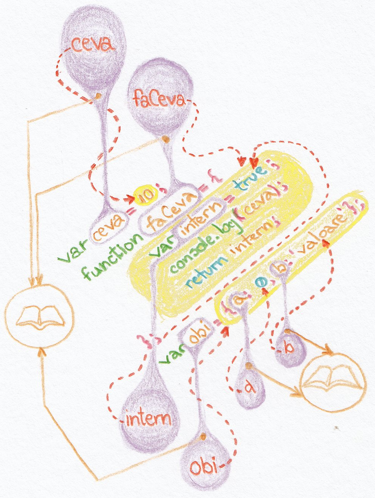

# Lexical environment - scope

Mediul lexical sau scope-ul poate fi foarte ușor înțeles ca un „registru inventar” al tuturor identificatorilor care au valori „legate” de aceștia.



În acest demersul nostru, vom folosi interșanjabil următoarele: „mediu lexical”, „scope” și „lexical scope”. Toate au același sens. Termenul standardului este mediu lexical.

> „Este porțiunea de cod sursă pentru care este disponibilă o legătură între un nume și o entitate” (definiție pentru limbajul de programare ALGOL 60, 1960).

Această definiție explică cel mai bine conceptul de „legătură”. De fapt, acesta este menirea mediului lexical, de a ține evidența acestor legături. De ce? Pentru că valorile legate de un anume identificator se pot modifica în timp, un identificator se poate lega de un alt identificator care este legat la o valoare. Da! Ai intuit perfect; unii identificatori se comportă ca referințele bibliografice. Trimit la alți identificatori.


În cazul funcțiilor, atunci când sunt pasate valori, reține faptul că JavaScript, de fapt copiază valoarea în **lexical environment** care poate fi comparat pentru o ușoară referință comună cu un „registru inventar al mediului”. Acum putem spune că ***o valoare este în scope***.

Atunci când unei funcții îi sunt pasate referințe către valori drept argumente, valorile către care se face referința, nu mai sunt copiate în **lexical environment**, ci doar referința, care va fi utilizată pentru a ajunge la valoare. Mai multe referințe pot trimite către aceeași valoare.

Astfel, putem spune că există „tipuri” asociate valorilor (**value types**), adică „tipuri de valori” și „tipuri de referințe” (**reference types**).

## Definiții

Este **locul** unde te uiți după lucruri.
Locul unde definești variabilele determină zona unde le poți folosi și astfel scope se stabilește în funcție de structura codului.
Este **perimetrul** din cuprinsul codului în care au efect funcțiile și sunt disponibile variabilele.
Global scope este locul de unde pot fi accesate funcții și variabile în întreg codul.

## Formarea scope-ului

Există câteva situații disctate de modul de redactare a codului sursă care are ca efect direct formarea mediului lexical (scope).

1. Prin crearea unei funcții. În acest caz, variabilele declarate în interiorul funcțiilor sunt vizibile doar în interiorul funcțiilor și funcțiilor imbricate
2. Prin declararea variabilelor cu `let` și `const` în interiorulul unui bloc de cod delimitat de acolade `{}`.
3. Prin crearea unui bloc `Catch`.

## Spune standardul

Lexical environment este asociat cu structura lexicală a codului așa cum este declararea funcțiilor, blocurile de cod dintre acolade și secvența `Catch` din blocurile `Try...Catch`.

Mediul lexical 0, cel după care nu mai există nimic, de fapt, este un **enviroment record** global (o înregistrare descriptivă pentru mediul lexical), care este un spațiu, un **tărâm** comun tuturor elementelor unui program care vor fi procesate.

Valorile lui **lexical environment** și a lui **environment record** sunt mecanisme interne stabilite de specificația standardului și este posibil să nu se regăsească în implementare.

Un **lexical environment** este un **tip al specificațiilor standardului**, care este utilizat pentru a defini asocierea `identificatorilor` cu variabilele și funcțiile specifice pe baza structurii lexicale de organizare pe niveluri (imbricare - în engleză: „nesting”) a codului.
Un **lexical environment** constă dintr-un „environment record” (un domeniu declarativ pentru toate valorile legate de un identificator) și o **referință** la un „lexical environment extern”, dacă există unul.

Un **environment record** (descriere de mediu sau harta mediului) este un mecanism prin care este ținută evidența legăturilor realizate prin identificatori. Acest conectări se formează în **lexical environment**. Se mai poate spune că este **environment record-ul** **lexical environment-ului**. Traducem aceasta ca fiind înregistrarea descriptivă aferentă mediului lexical. Vă puteți închipui o fișă de evidență pentru o mulțime de lucruri care ține socoteala cui, ce îi este atribuit.

Câte medii lexicale (**lexical environments**) se pot stabili:

- **global environment** cel global la care cele imbricate fac conexiuni. Nu are un alt mediu extern."the portion of source code in which a binding of a name with an entity applies",
- **module environment** conține legăturile la declarațiile de prim nivel ale unui **Module**. Conține legături importate în mod explicit de Module. Mediul extern al unui Module este **global environment**,
- **function environment** este un mediu care se stabilește **la invocarea** unei funcții. Mediul funcției poate să stabilească o nouă legătură la „this”. Un **function environment** este un **lexical environment** care corespunde momentului invocării funcției. Mediul funcției capturează și starea necesară pentru a suporta invocații ale metodei **super**.

Un **global environment** este un **lexical environment** care nu mai are vreun alt mediu extern (outer environment). Spunem că mediul extern al lui global environment este `null`. Un **environment record** pentru global environment poate fi prepopulat cu legături de identificatori și include și un obiect global asociat ale cărui proprietăți fac parte din setul de legături de identificatori din mediul global (global environment). Pe măsură ce avansează execuția codului se pot adăuga sau șterge proprietăți în **global object**.

În obiectul **environment record** există două tipuri de valori:

- ***declarative Enviroment Records*** și
- ***object Environment Records***.

***Declarative Enviroment Records*** definește efectele unor elemente precum declarații de funcții, de variabile și structuri `Try...Catch`.
***Object Environment Records*** definește efectele unor elemente precum declarația `with` care asociază legătura identificatorului cu proprietățile unui obiect.

Fiecare obiect **environment record** este legat de un obiect numit **binding object**. Un obiect **environment record** are drept sarcină să lege șirurile de caractere care sunt numele identificatorilor proprietăților obiectului pentru care se stabilește acest **environment record**. Cheile proprietăți care nu sunt numere nu vor fi considerate în obiectul **environment record**. În setul legăturilor (bindings) sunt incluse deopotrivă proprietățile moștenite, cât și cele proprii indiferent de setarea atributului „enumerable”. Setul identificatorilor legați de environment record poate varia în funcție de șteregerea sau adăugarea proprietăților și sunt considerate a fi „legături schimbătoare” - ***mutable bindings***.

Toate legăturile din obiectul environment records se pot schimba.

## Lexical environment în practică

Scope (lexical environment) trebuie înțeles ca totalitatea identificatorilor din zonele menționate anterior.

Un mediu lexical (scope) este un registru constituit la momentul scrierii codului în care identificatorii sunt asociați unor valori și în consecință poți ști ce există la un moment dat.

```javascript
var ceva = 1;
var faCeva = function redau(){
  var altceva = 10;
  console.log(altceva);
  var prelucrez = function adunare(){
    return ceva + altceva;
  };
};
```

În exemplul de mai sus GEC (Global Execution Context) ține evidența identificatorilor `ceva` și `faCeva`. `faCeva` ține evidența identificatorilor `altceva`, `console.log` și `prelucrez`.

Mediul lexical (scope-ul) depinde de gradul de imbricare a codului (o funcție care conține o alta ș.a.m.d. înseamnă **code nesting**).

După cum spuneam, mediul lexical se stabilește chiar și la nivelul `catch` din constructul `try-catch` al limbajului.

Scope-ul nu se realizează la nivel de bloc în JavaScript pentru declarațiile `for`, `while`, `if` și `switch`.

```javascript
function faCeva (){
  if(!oVar){
    var oVar = 30;
  }
  console.log(oVar);
};
faCeva(); //-> 30
```

Este observabil faptul că variabila declarată în `if` este accesibilă în afara blocului if. Acest lucru se petrece datorită mecanismului de hoisting.

## Mantre

- JavaScript are o fază de compilare urmată de o fază de execuție.
- JavaScript are un **scope lexical** generat la faza de compilare. De fapt, acesta este un set de reguli pentru a determina cum se face căutarea după un anume identificator.
- La momentul rulării codului scope-urile există deja. Doar „this”, care se apropie de ideea de scope dinamic caracteristic altor limbaje se consituie la momentul rulării codului, relectând cum a fost apelată funcția.
- Declararea funcțiilor generează SCOPE-ul - **lexical environment**.
- Când funcțiile sunt executate SCOPE-ul folosit este cel de la MOMENTUL DEFINIRII (faza de compilare), nu cel de la momentul invocării (asta înseamnă LEXICAL SCOPE, de fapt).
- De fiecare dată când este **evaluat** codul, scope-ul este asociat în funcție de structurile de cod (blocuri sau funcție sau catch).
- La invocarea unei funcții se generează o referință către **lexical environment**. Dacă funcția a fost definită în global, se va ține o referință la ce se află în global, se face o cartografiere a tuturor identificatorilor din global. Definirea unei alte funcții interne, va crea o referință către toți identificatorii funcției gazdă.
- Un context de execuție are un „lexical environment” asociat, adică un scope, care conține toți identificatorii definiți în acel context.
- Variabilele au ca scope funcția.
- Variabilele locale sunt stocate în scope, care poate fi perceput ca o hartă de identificatori la a căror valori ai access. Atunci când în execuție interpretorul caută o proprietate în obiectul scope curent. Dacă nu o găsește, atunci interpretorul va căuta mai sus în obiectul scope părinte și tot așa până când nu mai există un alt obiect părinte. Această secvență de obiecte scope se numește **scope chain**. Atenție, scope-ul se formează la momentul declarării, nu la momentul execuției.
- **Scope chain** este totalitatea obiectelor care definesc variabilele existente în scope pentru o secvență de cod. Când motorul are nevoie să găsească valoarea unei variabile, se uită la primul obiect din lanț. Operațiunea se mai numește „walking up the scope chain".
- Când este definită o funcție, aceasta stochează scope chain-ul care era în efect în acel moment.
- Obiectul creat de invocarea unei funcții este adăugat scope chain-ului existent.
  - Scope chain-ul astfel rezultat reprezintă scope chain-ul de la acel moment.
  - Obiectul rezultat de fapt are rolul de a face legăturile tuturor variabilelor funcției în scope chain.
- Când funcția returnează, obiectul care face binding-ul variabilelor este scos din **scope chain**.
- Dacă nu există funcții interne, nu mai există nicio legătură spre obiectul care face binding-ul variabilelor și se face GARBAGE COLLECTING.
- Când sunt definite funcții interne, acestea la rândul lor generează referințe în scope chain.
- **Dacă o funcție internă este returnată sau introdusă într-o variabilă**, atunci va exista o referință către aceasta și nu se va face garbage collecting (avem un closure).
- Scope chain-ul unui closure este unul viu; funcțiile interne nu fac copii private ale scope-ului și nici nu fac snapshoturi ale binding-urilor variabilelor.
- Câtă vreme există o referință către o proprietate din scope acest obiect scope exista. Este principiul din spatele funcționării closure-urilor. Când o funcție returnează, scope-ul creat de ea dispare, doar dacă nu cumva avem un closure (o altă funcție este găzduită). Funcția va rămâne ca referință în scope-ul părinte.

## Ce conține scope-ul (**lexical environment**)?

- variabilele locale,
- parametrii funcției,
- declarații de funcții,
- scope-ul blocului părinte (se face lanțul prin care se caută „pe fir” mai sus identificatorul pentru care a fost definită o variabilă)

## Variabilele „în scope”

Scope-ul unei variabile poate fi înțeles setul de linii de cod sursă pentru care este definit un identificator.
Variabilele locale sunt disponibile funcției în care au fost declarate și tuturor funcțiilor interne.
Variabilele locale sunt reatribuite cu valori de fiecare dată când o funcție este invocată.
Nu uita, parametrii unei funcții sunt la rândul lor variabile locale.

```javascript
var ceva = 1000;
function scope1 (){takes note of all of your variable names
  // pot accesa ceva aici
  function scope2 (){
    // pot accesa ceva și aici
    var altceva = 1; // nu poate fi accesat din scope1 și nici din global; pot returna o referință către altceva
  };
};
```

Declarațiile de variabile se află în scope de la momentul în care au fost declarate, până la închiderea blocului funcției în care au fost declarate indiferent de imbricarea altor blocuri `{}`.

Funcțiile care poartă nume se află în scope-ul întreg al funcției în care au fost declarate indiferent de adâncimea blocurilor imbricate.

## Mediul lexical al funcțiilor

Motorul JavaScript atunci când este pus să evalueze o funcție, consultă mai întâi „lexical environment” - o zonă delimitată de felul în care rânduit codul ca și text, care este cunoscută în jargonul limbajului ca „scope”. Veți remarca că în cuprinsul acestei lucrări se vor folosi interșanjabil termenii de „scope” cu cel de „mediu lexical”.

Acest lexical environment este în strânsă legătură cu diferite structuri de cod cum ar fi blocurile de cod delimitate în mod obișnuit de acolade: `{}`. Începând cu versiunea ES6 - „block scoping” este posibil ori de câte ori încadrezi enunțuri între acolade, anterior fiind limitat doar la funcții. În mod tradițional, funcțiile au fost singurele mecanisme care generau un mediu lexical propriu și astfel permiteau și ideea de „spații private” pentru date și funcționalități ce nu trebuie expuse. Puteți să vă închipuiți funcțiile în contextul mediului lexical realizat ca pe niște grădini private din interiorul cărora poți privi „lumea” de afară, dar invers niciodată.

Înainte de ES6 block scope-ul se realiza doar printr-un IIFE (Immediately-invoked function expression), care produce propriul său lexical scope izolat de restul codului.

```javascript
// cele două stiluri de a scrie IIFE-uri
(function () { … })(); // dog balls
(function () { … }()); // stilul Douglas Crockford
```

În ES6 pur și simplu ai nevoie doar de acolade și declarare folosind `let`.

```javascript
{
  let x = 1;
}
```

### Momentul declarării unei funcții

La momentul declarării, identificatorul funcției este adăugat la obiectul scope existent deja, care să spunem că ar fi `Global Object`.
Identificatorul acestei noi funcții, care doar a fost declarată, referă un obiect funcție care tocmai s-a generat.

Când o funcție este adăugată scope-ului existent la momentul declarării, o altă proprietate internă care este scope-ul preexistent la momentul declarării este accesibil funcției noi la momentul invocării. Dacă declarăm o funcție în `Global Object`, scope va fi chiar `Global Object`.

### Momentul invocării funcției

Când o funcție este invocată, se creează un nou obiect scope, care va conține variabilele locale pentru acea funcție. Acest nou scope creat, moștenește din obiectul scope preexistent.

## Mediul lexical al obiectelor

```javascript
function Obi(){
  var obi = new Object();
  obi.token = 100;
  obi.mesaj = function(){
    console.log('Esti un om de nota ' + this.token);
    console.log(this);
  };
  setInterval(obi.mesaj, 2000);
  return obi;
};
Obi();
// Object { token: 100, mesaj: Obi/obi.mesaj(), ceva: Obi/obi.ceva() }
// Esti un om de nota undefined
```

Atenție!
În cazul invocării lui `setInterval`, `this` este setat la obiectul global, care este, de regulă, `window`. Acest lucru se întâmplă pentru că `setInterval` se execută într-un context diferit de cel în care este invocat. `setInterval` va căuta o funcție `obi.ceva` în obiectul `window`. Acest lucru se întâmplă pentru că `setInterval` schimbă contextul la global și astfel taie calea către funcția cu rol de metodă din obi. Bineînțeles, funcția care există în obi cu rol de metodă nu există în obiectul global. Pentru ca referința să se facă corect, `obi.mesaj` trebuie apelată ca metodă: `obi.ceva()`. Când `setInterval` va invoca `obi.ceva` ca funcție și nu ca metodă, nu va avea acces la `this`. Doar metodele au acces la `this`. În cazul de mai sus `Obi()` își va încheia execuția imediat după returnarea obiectului.

```javascript
function Obi(){
  var obi = new Object();
  obi.token = 100;
  obi.mesaj = function(){
    console.log('Esti un om de nota ' + this.token);
    console.log(this);
  };
  setInterval(function(){obi.mesaj();}, 2000);
  return obi;
};
Obi();
// Object { token: 100, mesaj: Obi/obi.mesaj(), ceva: Obi/obi.ceva() }
// Esti un om de nota 100
// blocul se repetă
```

În acest al doilea caz, invocăm funcția cu rol de metodă dintr-un callback. Motivul pentru care se scope-ul este corect este pentru că funcția care invocă metoda trăiește în același scope cu obiectul pentru care invocă metoda. Funcția anonimă (callback-ul) oferă posibilitatea de a executa metoda și de a ne asigura că nu va executa ca funcție. Dacă s-ar invoca direct metoda `obi.mesaj()`, aceasta s-ar executa o singura dată la momentul execuției lui `Obi()` și apoi ar pierde scope-ul la a doua invocare în favoarea lui global. În acest caz `Obi()` va continua execuția până când `setInterval` va fi întrerupt.

## Înlănțuirea mediilor lexicale - scope chain

Metoda de a căuta o variabilă în **scope chain** este similară cu cea care se face în **lanțul prototipal** cu o diferență notabilă. Dacă încerci să accesezi o proprietate care nu există într-un obiect, dacă pe lanțul prototipal nu este găsită proprietatea, nu este returnată o eroare, ci `undefined`. Dacă încerci să accesezi o proprietate care nu există în **scope chain**, adică o variabilă care nu există, atunci este returnată eroarea `ReferenceError`.

Ultimul element din **scope chain** este Obiectul Global.

## Alonjă

Constituie baza pentru înțelegerea closure-urilor.

## Q\&A

**Întrebare**: Când se formează scope?
**Răspuns**: La faza de compilare.

Iată cum arată scope-ul ca reprezentare și ca arie în care are efect o variabilă sau o funcție.


## Resurse

[Wikipedia, Scope](https://en.wikipedia.org/wiki/Scope_(computer_science))
[Wikipedia, Immediately-invoked function expression](https://en.wikipedia.org/wiki/Immediately-invoked_function_expression)
