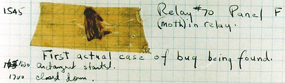

# Instrumentar sau cum gustul vine mâncând

## Introducere - labirintul cu mai multe porți de intrare

Vom lucra foarte mult cu secvențe de cod pe care vei dori să le testezi pentru a vedea efectul imediat și astfel pentru a consolida ceea ce înveți. În ceea ce privește instrumentarul de bază, veți auzi cel mai adesea acronimul REPL, care înseamnă `read–eval–print loop` (o buclă citește-evaluează-afișează), adică un instrument software, care preia fragmentul tău de cod, îl evaluează (îl rulează) și îți oferă rezultatul. La o simplă căutare online după cheia JavaScript REPL, veți găsi și o grămadă de instrumente online cu ajutorul cărora puteți să testați codul.

Pentru scopul de învățare al acestei lucrări, vom lua contact cu unul de bază: consola web. O accesați din browserul pe care-l folosiți. Am ales pentru acest manual browserul Firefox. Pentru a accesa consola web, pur și simplu apăsați tasta F12 și apoi alegeți **Console**.

Aici puteți introduce fragmentele de cod pentru a urmări rezultatele și pentru a experimenta din curiozitate.

Un alt instrument de test pentru cod este și Node.js, care odată instalat, poate fi utilizat ca un REPL foarte capabil. Acesta se folosește apelând comanda `node` în Terminal, dacă folosiți Linux/GNU sau în PowerShell, dacă utilizați Windows. Odată apelată comanda, se deschide consola Node.js. Nu uita, ca să o închizi apeși de două ori combinația `CTRL + C`.

Pe lângă acestea mai există o suită de instrumente online pentru evaluarea codului JavaScript, care mai de care mai utile. Câteva exemple: [repl.it](repl.it), [jsbin.com](jsbin.com), [jsfiddle.net](jsfiddle.net) sau [codepen.io](codepen.io). La ce sunt bune acestea? Vă oferă posibilitatea de a schița rapid cod pentru a fi testat.

## Locuitorii tărâmului

Mă voi întoarce pentru scurt timp la conceptele cheie cu care vom lucra în JavaScript pentru că este nevoie să avem mai mult context. Menționam anterior că atunci când privești prin prisma standardului, motorul JavaScript trebuie să creeze un tărâm. Întrebarea care se pune este: care sunt locuitorii acestui tărâm pe care trebuie să-i cunoaștem mai întâi? Să pornim un minim inventar.

### Primitivele

Primitivele sunt blocurile constructive. La ce mă refer este faptul că avem nevoie să lucrăm în mod curent cu numere, cu șiruri de caractere și cu valori de adevăr. Dar mai mult, în programare, mai este nevoie să exprimi și realități care se leagă în mod direct de felul cum este alocată memoria și *mediul lexical* pe care codul îl formează și astfel avem primitive, precum valorile nule (`null`), cele nedefinite încă (`undefined`),  numere, fragmente de text, `true`/`false`.

### Variabile

Primitivele despre care discutam mai sus trebuie să fie luate cumva în evidență. Să presupunem că avem un instrument pentru măsurarea gradului de poluare, care are 2 senzori: unul pentru emisii de azot, iar altul pentru numărul de particule. Acest post de măsurare emite datele culese în flux continuu, datele culese de senzori fiind numere întregi. Întrebarea este următoarea: cum separăm noi ce emite un senzor de celălalt atâta vreme cât pe *firul* de comunicații vine un șuvoi neîntrerupt de numere? Răspunsul logic ar fi să punem câte o etichetă pentru fiecare număr care să indice numele senzorului, nu?

```text
azot: 142.23
azot: 141.89
part: 12
```

Ce observăm? Eticheta este partea fixă. Este ancora noastră pentru a lega inteligibil numerele de proveniența lor, de senzor. Eticheta rămâne ca o ancoră, iar valorile vor varia în timp. Deci, asta este o variabilă. Este o etichetă care identifică o valoare care variază în timp.

În JavaScript există un cuvânt dedicat care indică faptul că urmează identificatorul pentru o variabilă. Pe lângă var mai ai `let` și `const`, care au fost introduse de curând.

```javascript
var x = 10;
```

### Obiecte

Când folosim browserul web al sistemului de operare, cel mai important locatar este obiectul global, iar acesta poartă numele de `window`. Curioasă din fire, vei deschide repede browserul, vei apăsa `F12` și în linia consolei vei scrie `window.` (`window` urmat de punct). De îndată ce ai scris numele obiectului global, vor *țâșni* toate proprietățile acestui obiect... obiectul care oferă tot ce spune standardul că ar trebui să fie. În Node.js chiar se numește `global`. Dacă ești curiozitatea personificată, având Node.js instalat pe sistem deja, deschizi un `Terminal` sau `Command Prompt` și inițiezi o sesiune de Nodejs. Scrie `global` și vei vedea o descriere amănunțită a acestui obiect.

De fapt, în JavaScript totul este o proprietate a unui obiect și/sau o metodă a unuia. Vorbim despre o metodă atunci când o funcție joacă un rol activ în interiorul unui obiect.

Și acum, că tot am vorbit de obiecte anterior, vom depăși viziunea unei rodii pe care am propus-o în introducere pentru simplitate și vom folosi-o pe cea a unui robot. Un robot, chiar este un **obiect**.

Acum că avem la îndemână un robot, poți să-ți imaginezi o metodă ca pe un semnal transmis unui membru pentru a-l mișca. Hai să ne uităm nițel cum arată scris un mic robot care are o codiță ca mijloc de locomoție căruia îi dăm comanda să se miște.


Codul complet pentru un obiect este o listă de perechi cheie - valoare. Cum adică cheie - valoare? O cheie este un fragment de text care identifică o valoare: `ceva: 10`. Pentru cheia `ceva`, am valoarea `10`. O cheie are chiar sensul de cheie de acces la o valoare.

```javascript
var robotel = {
  ochi: 2,
  sunet: 'bing',
  deplasare: function miscCoada () {
    console.log(`mișc coada și fac ${this.sunet}`);
  }
};
robotel.deplasare();
// mișc coada și fac bing
```

După cum se vede, am trimis o comandă robotului meu printr-un apel la funcția destinată mișcării. Ai observat cum se face? Prin enunțarea obiectului cu care lucrez, apoi un punct ca să-i spun că vreau ceva de la el și apoi invocarea acțiunii. Hai să numim acțiunea **metodă**. Cred că te-ai prins deja că o metodă e o funcție... îmi place, te miști repede.

Toată execuția codului JavaScript se leagă de obiecte și felul cum interacționează obiectele unele cu celelalte. Sunt convins că ați reacționat citind acestea și întrebarea privind cui am lăsat funcțiile a apărut instant.

Funcțiile nu au fost uitate, dar le-am amânat introducerea pentru acest moment deoarece și ele sunt obiecte, dar foarte speciale. Spre deosebire de restul, acestea pot fi invocate, pot fi apelate să facă ceva cu niște valori date.

Sper că acum nu ești confuz. Toate detaliile cu privire la acești membri ai ecosferei tărâmului JavaScript, vor fi lămurite în mare amănunt, fiecare la timpul lor.

Pentru a putea pătrunde aspectele de funcționare fără nici o altă întârziere, mai avem nevoie de ceva foarte important: instrumente de investigare. Odată revelate aceste instrumente, vom explora o secvență de cod pentru a vedea și cum trebuie să le manevrăm.

## O sondă în JavaScript

Sonda despre care doresc să vorbim este un obiect oferit de browser pe care-l vom folosi ca pe un instrument de investigație în codul pe care-l executăm. Este vorba despre `Console`. Acesta este instrumentul primar pentru inspectarea codului în vederea îndreptării erorilor sau pentru a sonda cine, ce conține sau cum arată. Browserul expune `console` ca proprietate a obiectului global `window` și putem avea acces la el introducând în consola browserului `window.console`. Dar cum în practică rădăcina `window` este ignorată, vom apela direct obiectul scriind în consolă `console` (console punct). Acum vei vedea și ce funcționalități oferă în lista derulantă care a apărut.

Pentru a detecta valori sau pentru a inspecta anumite situații, cel mai adesea vom folosi `console.log(expresie)` și/sau `console.dir()`, iar atunci când avem nevoie de o afișare rapidă a felului cum se execută o funcție, vom folosi `console.trace()`, care are ca efect afișarea stivei de apeluri făcute până la momentul în care s-a executat `console.trace()`.

Se înțelege faptul că aceste fragmente de cod cu rol de sondă, vor fi plasate în interiorul codului scris, fix în locurile unde vrei să investighezi ce se întâmplă.

## Cărțile de identitate ale locuitorilor

La fel ca în realitate, fiecare locuitor al tărâmului JavaScript poate fi întrebat ce *hram poartă*. Există o comandă care poate fi dată pentru toți identificatorii pentru a afla ce se află în spatele lor. Aceasta este `typeof` și vă va oferi tipul valorii la care conduce identificatorul.

```javascript
var x = 10; typeof x; // number
```

Când nu este codul scris de tine sau când ai îndoieli asupra unui identificator, poți să-l întrebi la ce tip de valoare face trimitere.

## Inspectarea codului la rulare

În spatele modului de tratare a problemelor apărute la evaluarea codului există o poveste simpatică care explică povestea conexiunii dintre informatică și lumea insectelor. În 1944 în timpul celui de-al Doilea Război Mondial, în America, la Harvard tocmai fusese dat în folosință Mark I (IBM Automatic Sequence Controlled Calculator), un computer proiectat de profesorul Howard Aiken și executat cu sprijinul IBM. Acesta era găzduit în Laboratorul de Cercetări în Fizică al Harvard, dar pentru perioada războiului a intrat în operațiunile Marinei Americane. Grace Hopper, unul dintre ofițerii de marină, care lucra ca programator, a găsit o molie în interiorul computerului. Aripile insectei moarte bloca instrumentul de citire a benzii de hărtie perforată și pentru că în limba engleză insectele sunt numite general *bugs*, prin eliminarea moliei moarte s-a produs primul **debugging** din istoria informaticii moderne.



Pentru a rotunji povestea, profesorul Aiken a fost și cel care a ținut un curs la Harvard, care poate fi numit acum *de informatică* (*computer science*). Harvard Mark I a constituit primul contact pentru câteva generații de studenți.

Refocalizând, pentru momentul când folosești biblioteci de cod care nu-ți aparțin sau atunci când scrii cod care produce erori sau rezultate neașteptate sau pentru propria curiozitate izvorâtă din necesitatea de a vedea cum se comportă codul la rulare, cel mai adesea vei folosi un instrument pe care oricare browser modern îl pune la dispoziție: **debugger**-ul. Erorile de cod se numesc **bug**-uri (insecte deranjante). Acest instrument ajută la identificarea fragmentului de cod care le produce sau ajută la urmărirea valorilor pe măsură ce avansează evaluarea codului.

Debugger-ul am putea să-l traducem în română cu o transliterare unu-la-unu prin **operator de dezinsecție**, dar pentru a fi foarte eleganți îl vom denumi **depanator**. Depanatorul este un instrument care permite parcurgerea unui fragment de cod încărcat în browser pentru a-i vedea comportamentul și efectele.

Chiar dacă multe din elementele cu care vom lucra în continuare pentru a exemplifica, nu vă sunt cunoscute, nu vă impacientați. Pur și simplu doresc să vă arăt care sunt posibilitățile acestui instrument și făcând asta, să reușesc să vă fac să asimilați câteva concepte de lucru în programare cum ar fi variabilele și funcțiile. Promit să explic pas cu pas ce se întâmplă.

Deschide editorul tău de cod preferat. Dacă nu ai unul deja, te invit să folosești editorul Atom (descarcă de la atom.io). Dar să știi că orice editor este bun atâta vreme cât poți salva cu extensia de fișier `.js` și `.html`, fără adaosuri ciudate. Dacă ai deschis deja editorul, te rog, introdu următoarea secvență de cod și salveaz-o într-un director pregătit special dinainte. În același director vom mai introduce un fragment de cod, de data aceasta de html într-un pas următor. Deci, salvează cu denumirea de `primul.js` acum și lasă deschis pentru a privi la cod urmând explicațiile.

```javascript
var a = 10;           // break
function facCeva () {
  var a = 11;         // break
  console.log(a);     // break
  return a;           // break
};                    // break
facCeva();            // break
console.log(a);       // break
```

## Folosirea debugger-ului

Am terminat pregătirea codului JavaScript. Acum este necesar să folosim un fișier **html** care să folosească fișierul sursă pe care tocmai l-am creat drept resursă proprie. Pentru acest lucru deschide un fișier nou pe care-l vom numi `index.html`. Fișierul va fi constituit din următorul fragment HTML.

```html
<!DOCTYPE html>
<html lang="en">
  <head>
    <script src="primul.js" charset="utf-8"></script>
    <title></title>
  </head>
  <body>
    <p>Exemplu pentru folosirea depanatorului.</p>
  </body>
</html>
```

Ai observat cum am făcut legătura cu fișierul JavaScript?

Am folosit tag-ul special `script` (în HTML, informația este codată între niște secvențe de text numite taguri precum `<html>pagina web</html>`), care specifică prin atributul `src="primul.js"`, va trebui să încarce și să ruleze acest fișier sursă de JavaScript.

**Totul e pregătit? Ne lansăm!**

Acum, deschide fișierul `index.html` în Firefox și apasă tasta magică `F12` pentru a accesa **Developer Tools**. Poți folosi și combinația `CTRL + SHIFT + i`. Acesta este un panou care expune o serie de instrumente cu care va trebui să te familiarizezi pentru că este centrul de testare și depanare a codului JavaScript. Este observabil tabul *Console* urmat de *Debugger*. În *Console* poți introduce cod JavaScript pentru a-l testa rapid, dar și pentru a vedea codul încărcat deja de browser. Dacă nu găsești fișierul, folosește combinația `CTRL + P`. Tastezi primele caractere ale numelui fișierului și îl încarci.

Vei vedea deja în consolă (din partea dreaptă sus apasă pe *Toggle Split Toggle*), în zona de consolă rezultatele execuției codului: `11` și `10`.

Pune cu mouse-ul *break point*-urile pe liniile unde există comentariul `// break`. Comentariul l-am pus eu să vă vină mai ușor pentru a vă ghida. Ai reușit să pui un break point atunci când va apărea o săgeată albastră peste numărul liniei de cod. Fii foarte atent pentru că ordinea în care pui punctele ține de ordinea în care debugger-ul va urmări execuția codului. Pentru a nu complica povestea, pune break point-urile în ordine linie după linie până la sfârșit.

După ce ai setat toate punctele de inspecție ale codului (*break point*-uri), faci reîncărcare la pagină (apeși săgeata circulară din partea dreaptă imediat după caseta în care introduci adresa web). Astfel, se va porni debugger-ul și vei putea *păși* din punct de întrerupere în altul până la încheierea unei execuții simulate a codului. Vei avansa folosind `F11`. Am ales `F11` pentru că în cazul când este întâlnită o funcție, se va intra și se va parcurge și codul din acea funcție.

Câteva detalii despre posibilitatea de a avansa prin codul scris - butoanele și expunerea funcționalității lor.

-   Comanda **Play** (`F8`), înseamnă rulează tot codul până la următorul break-point setat.
-   Comanda **Step over** (`F10`), spune debugger-ului să avanseze la linia următoare dacă ești în interiorul unei funcții.
-   Comanda **Step in** (`F11`), spune: avansează la linia următoare în cadrul funcției, dar dacă linia următoare este invocarea unei alte funcții, intră mai departe în execuția acelei funcții.
-   Comanda **Step out** (`Shift + F11`), spune: rulează tot codul până la finalul funcției investigate în acest moment.

După cum vedem în exemplul prezentat, vom lucra cu patru enunțuri de cod separate fiecare prin punct și virgulă. Propun să pornim cu parcurgerea codului (hai, ia o piatră în gură dacă ești începător... va fi fain, curaj). Eram să uit, dacă ai dat de mai multe ori clic din greșeală și ai trecut repede pentru un pas, pur și simplu, reîncarcă pagina și ia-o de la capăt.


Acum pornim: dă refresh la pagină apăsând săgeata rotită din dreapta casetei în care scrii adresa web sau pur și simplu apăsând tasta `F5` care are același efect.

## Break-point 1

Evidențiatorul debugger-ului subliniază prima linie de cod, acolo unde este declarată variabila `a`. Culoarea evidențiatorului este verde. Atunci când se încheie parcurgea codului se va preschimba în albastră.

### Variabila

Pornim de la linia unde este declarată variabila `a`. Este creat un identificator `a` căruia i se atribuie valoarea `10`.

-   pentru aceasta, când am scris codul sursă, am folosit cuvântul rezervat `var`. Acesta spune motorului JavaScript că următoarea secvență de caractere de după un spațiu este numele identificatorului căruia, mai târziu puțin îi va fi legată o valoare;
-   Este ca și cum am pregăti totul pentru a pune valoarea `10` într-un borcănel pe care-l etichetăm cu `a`. Legătura este evidentă: borcănelul inscripționat cu `a` va conține valoarea de `10`. Da, dar nu chiar pe loc.

Să ne bazăm puțin pe logica pe care imaginea cu borcănelul etichetat ne-o oferă. Mai întâi de a pune valoarea în borcănel, mai întâi trebuie să avem borcănelul (momentul când ai scris `var`), apoi aplicăm o etichetă pe care scriem denumirea conținutului (momentul când ai scris `a` după `var`).

Acum este un moment cheie, care odată înțeles, multe, chiar foarte multe probleme de programare în JavaScript vor fi evitate.

Avem borcănelul și eticheta inscripționată pe el. Dar ce observăm?! Da, ai dreptate, e simplu: borcănelul este gol. Această observație vă va salva din multe situații de confuzie: variabilele, inițial sunt legate de o valoare specială care se numește `undefined`. Și să-ți mai spun un mare, un imens secret, care te va scoate din bucluc de multe ori. Imediat ce codul sursă a fost citit de motorul JavaScript, tuturor variabilelor declarate cu `var` și funcțiilor le sunt colectate identificatorii care sunt *puși în capul codului* (mecanism de hoisting i spune în JavaScript), iar fiecare dintre ei au valoarea de pornire `undefined`. Pusul acesta în capul codului trebuie să-l imaginezi precum baloanele în apă. Chiar dacă acestea ar fi lansate de un submarin de la diferite adâncimi, ele tot la suprafață ar ajunge, unde ar pluti și ar fi omniprezente.

Ce înseamnă *în capul codului*? Adică sunt disponibile instant întregului cod dintr-un bloc de cod pentru a le atribui valori, modifica, etc. Acei identificatori sunt omniprezenți pentru mediul lexical în care au fost declarați.

Stop joc! Cum?! Nu ți-am povestit ce-i cu mediul lexical? Ba da, recitește atent introducerea. Dacă nu ai chef, e zona de cod delimitată ca bloc de cod prin acolade sau interiorul unei funcții în care căutăm identificatorii.

Același comportament este aplicat și funcțiilor după cum vom vedea pentru că... (tobele bat intens), **funcțiile sunt tot niște valori identificate printr-o «etichetă»** (un identificator). Putem afirma cu multă simplitate că în momentul în care browserul a trecut prin cod încărcându-l, are o fază în care culege toți identificatorii și le atribuie valoarea `undefined`. Abia după acest pas, motorul JavaScript execută codul (traducem execuția ca o evaluare secvențială a expresiilor, care trebuie reduse la valori), se uită la ce există în *partea dreaptă* a operatorului de atribuire `=` și începe să facă legăturile valorilor specificate cu identificatorul care a fost inițializat anterior cu `undefined`.

Există o notabilă excepție de la acest comportament al *hoisting*-ului - al omniprezenței identificatorilor. Acesta este dictat de modificările aduse standardului începând cu ES6. Regula standardului nou spune că variabilele declarate cu `let` în locul lui `var`, vor fi pironite de *locul* în cod unde au fost declarate. Acest nou comportament este încurajat ca practică și este menit să elimine toate problemele de înțelegere a mecanismului de *ridicare în capul codului* (hoisting). De fapt, a fost gândit să dea o mână de ajutor și celor care vin din zona de C și C++ pentru a le da familiaritate.

Mie îmi place `let` pentru că îmi simplifică din procesul de gândire a codului, dar și pentru faptul că tradus are o anumită melodie. Fii atent la următorul enunț: `let a = 10;`. Chiar tradus în română sună foarte fain, ca în matematică: *fie ca `a` să fie legat de valoarea 10*. E aproape de spusele unui magician, nu? Fain!

Să revenim, privind la primul pas făcut cu debugger-ul și vom observa tocmai această *ridicare în capul codului* cu atribuirea valorii `undefined`. Dacă pui mouse-ul pe identificatorul `a` interoghezi valoarea.


Valoarea identificatorului nostru se reflectă și în cele ținute în evidență de `this`.


Ce-o fi `this`?! Mai ții minte când spuneam că în JavaScript totul este un obiect și că din start totul este o proprietate a obiectului global (`window`)?! Atunci, explicația lui `this` e simplă: este referința către obiectul a cărui proprietate este de fapt funcția. Tradus în românește ar fi: *folosește ACEST obiect drept context în care mă execut eu ca funcție*.

Putem privi `this` ca spațiul de unde tot codul rulat își ia valorile de care are nevoie pentru a rula. De exemplu, dacă o funcție folosește un identificator în interiorul ei, dar care nu a fost definit în interiorul ei, ea, funcția se așteaptă ca această valoare să fie disponibilă deja undeva numai bună să fie folosită. Acest *undeva* poate fi în spațiul creat de funcție, fiind declarată acolo, poate fi în spațiul altei funcții cu rol de *container* sau poate fi  `this`. Primul `this` de care te lovești când scrii cod, este cel generat de obiectul global. Reține acest lucru pentru că este de mare ajutor să înțelegi contextul de unde codul tău începe să ruleze.

Ține minte că în afară de **undeva**, mai trebuie dată atenție și lui **cândva** (asta e o chestie faină care ține chiar de felul în care se rulează codul pe *linia timpului*).

### Observații asupra acestui break-point

În tabul `Variables`, dacă *extinzi* caracteristicile lui `this.window`, vei observa că `a` a devenit o proprietate a lui `window`, accesibilă dacă dorești prin adresarea cu `this.a`. Dar cel mai important lucru de observat este că în acest moment, în care variabila `a` a fost declarată, valoarea sa este `undefined`.

Aici, în zona de *Variables*, în `Block scope` (adică mediul lexical curent generat de blocul de cod care rulează), vei vedea toți identificatorii și valorile lor asociate. Această zonă a Debugger-ului va fi lupa sub care veți trece pașii de execuție ai codului. De fapt, vei observa că se deschide instant *Block scope*-ul și nu *Global scope* pentru orice este în afara unei funcții. Când debugger-ul va intra într-o funcție, automat va deschide *Function scope*. Hai că ajungem și acolo și ai să vezi cu ochii tăi.

Mai observăm ceva, dacă ne uităm pe lista proprietăților lui `this`. Găsim că funcția noastră `faCeva` deja a fost luată și ea în evidență ca identificator.

Deci, în acest moment spunem că avem codul sursă compilat, adică au fost recoltați toți identificatorii și au fost generate mediile lexical corespunzătoare ordinii de redactare a codului sursă.

Încă nu am terminat. Mai e ceva în *Variables* foarte important: `Global scope[Window]`. Acesta indică faptul că deja codul nostru rulează într-un mediu lexical inițial, care este generat de obiectul global, în cazul nostru `window`. De ce este important acest Global scope. Pentru că ori de câte ori vei lucra cu un identificator într-o funcție *adâncită* dintr-o structură de cod și nu știi de unde este acel identificator, poți *întreba* dacă nu cumva a fost definit în cel global.

## Break-point 2 (apasă F11)

Evidențiatorul se află pe linia 7.

Ciudat! Un salt enorm la momentul apelării funcției. De fapt, nu-i chiar atât de ciudat, dacă ce amintim pasul de mai sus: au fost recoltați identificatorii, li s-a dat valoarea de *undefined* temporar. A trecut faza de recensământ și a venit momentul când își primesc valorile care au fost specificate de programator. Variabila `a` va primi valoarea sa `10` și aceasta este deja acolo putând fi verificată dacă deschizi `this.Window`. Identificatorul funcției `faCeva` a fost legat și el de valoarea funcției, care, ce să vezi, este însuși conținutul dintre acolade - corpul funcției.

Am uitat să spun că atribuirea valorii se face cu operatorul egal (`=`), care are scopul de a lega valoarea de `10` de identificatorul `a`.

Pentru a putea avansa, mai trebuie să lămurim câteva aspecte privind funcțiile.

### Funcția

Un fragment de cod de întindere mică sau medie care face un lucru precis atunci când este apelat este o funcție. Acest fragment de cod este pus între acolade. Pentru a declara o funcție, folosim cuvântul rezervat `function` urmat opțional de identificatorul pentru această funcție: `function facCeva`. Apoi urmează un spațiu și o pereche de paranteze rotunde în care, dacă se dorește sau este necesar, vor fi pasate argumente. Argumentele acestea sunt la rândul lor niște identificatori accesibili din interior.

**Reține o chestie crucială: numele argumentelor devin variabile interne de lucru ale funcției pe lângă cele declarate în interiorul acoladelor**.

Urmează după un alt spațiu o pereche de acolade în care va fi introdus fragmentul de cod sursă care constituie corpul funcției. Cel mai simplu este să-ți imaginezi o funcție precum un motor care între parantezele rotunde primește combustibil (benzină, aer, NOS), iar între acolade sunt toate părțile sale componente care transformă combustibilul în energie cinetică.

Sper că ai remarcat că fiecare enunț chiar și în interiorul funcției se încheie cu semnul de punctuație punct și virgulă. Câteva repere generale:

-   În interiorul funcției putem introduce orice fragment de cod JavaScript. Ca urmare, vom declara o nouă variabilă.
-   Mai punem o sondă pentru a scoate și în consolă să vedem cu ochii noștri valoarea.
-   Apoi ajung la momentul crucial al unei funcții. Cuvântul rezervat `return` care oferă valoarea variabilei `a`.

### Momentul cheie

Acum, e acum! Pentru ce toată această pregătire? Pentru că sunt sigur că ai observat rapid faptul că identificatorul variabilei declarate în interiorul funcției este fix același cu cel al variabilei declarate *în afara* funcției.

Întrebarea se pune așa: valoarea din interiorul funcției va suprascrie valoarea *din afară*? Tocmai pentru a răspunde la această întrebare, am folosit debugger-ul.

Haideți să terminăm prin apelarea funcției. Dacă nu apelezi funcția, aceasta nu-și produce efectele. Urmând analogia cu motorul, dacă nu învârți cheia în contact din poziția de staționare în cea de pornire, motorul va sta oprit.

### Apelarea funcției

Apelăm funcția prin scrierea identificatorului funcției urmată de paranteze rotunde. Parantezele rotunde spun motorului JavaScript: pornește execuția funcției. Este momentul când funcția este apelată sau cum ar spune magicienii JavaScript: **invocată**. Muhahaha!!! Ok, mai departe.

## Break-point 3 (apasă F11)

Evidențiatorul se află pe linia 3.

Acesta este momentul în care se justifică alegerea de a parcurge execuția codului cu *Step-in*. Pentru motivul că la apelarea funcției, debugger-ul intră în interiorul funcției apelate și începe faza de compilare urmată de cea de evaluare.

Instant se observă ceva în *Variables*. E ceva diferit de faza anterioară. Vezi că a apărut „Function scope”? Aceasta are trei elemente mari și late:

-   `this`, care ghici cine este,
-   identificatorii luați în evidență la compilare și
-   `arguments`... răbdare, îl lămurim și pe acesta.

Deci, este foarte clar în care mediu lexical (scope) ne aflăm: cel al funcției.

Este faza de compilare din interiorul funcției, fază în care știm deja ce valori au toți identificatorii.

Deci, variabila `a` este `undefined`, dar ceva nou a apărut acolo. Este identificatorul `arguments`, care este un obiect special ca o colecție cu toate argumentele pe care o funcție le primește. Și aici îți mai spun o fază tare despre funcții: chiar dacă am specificat între parantezele rotunde identificatorii pentru valorile care le primește, o funcție poate fi apelată cu multe, mult mai multe argumente. Chiar dacă nu le-a asociat formal cu un identificator, de aici, din această colecție miraculoasă îi poate găsi pe toți. Bun! Gata, am terminat de observat și povestit ce se petrece la break-point-ul 3. Curaj! Apasă butonul!

## Break-point 4 (apasă F11)

Evidențiatorul se află pe linia 4. Tot în `Function Scope` ne aflăm, dar după momentul compilării. Deja variabila internă `a` are asociată valoarea `11`.

În acest moment suntem în pragul execuției metodei log din obiectul console. Acesta este momentul de sondare, când este evaluată valoarea lui `a` în acest moment. Vom folosi *sonda* de care povesteam mai sus pentru a vedea cu ochii noștri rezultatul.

## Break-point 5 (apasă F11)

Evidențiatorul se află pe linia 5.
Apare valoarea `11` în consolă și ești în pragul de a încheia execuția funcției prin returnare.

## Break-point 6 (apasă F11)

Evidențiatorul se află pe linia 6, pe acolada de închiderea a blocului funcției.
Gata! Funcția a returnat, dar ești încă în faza sa de execuție așteptând rezultatul evaluării expresiei de după return.

## Break-point 7 (apasă F11)

Evidențiatorul rămâne pe linia 6. Ai primit rezultatul. Acesta este valoarea `11` și apare în `Function Scope` deja.

## Break-point 8 (apasă F11)

Evidențiatorul se află pe linia 7.
Am terminat cu funcția și am revenit de unde am plecat, adică chiar de unde s-a întrerupt execuția codul extern funcției pentru a o executa.

Ne mutăm cu observația în `Block scope`.

## Break-point 9 (apasă F11)

Evidențiatorul se află pe linia 8.
Suntem în pragul execuției sondei `console.log()` pentru a verifica dacă nu cumva valoarea s-a modificat în urma executării funcției.

## Break-point 10 (apasă F11)

Evidențiatorul se află pe linia 8, așteptând evaluarea lui `console.log(a)`.

Pentru că metoda log a obiectului `console` nu returnează, vom avea în urma execuției sale un marcaj al lui `return` cu `undefined`, dar în urma execuției sale vom obține în consolă valoarea legată de identificatorul `a`. Observăm cu satisfacție că a rămas la fel: 10.

## Break-point 11 (apasă F11)

Evidențiatorul se transformă din verde în albastru și rămâne pe linia 8.

Pagina web va terminat de afișat conținutul său pentru că s-a finalizat execuția codului JavaScript. Asta ar trebui să va dea de gândit asupra felului cum încărcați programele JavaScript pentru a nu bloca prea mult afișarea conținutului. Dar... aceasta este o artă în sine despre care vom mai vorbi.

Gata! A fost o cursă nebună, știu! Dar în ce poziție fericită te afli acum pentru a înțelege în mai mare detaliu ce-am experimentat aici.

## Curiozitatea nu a omorât pisica!

Acum e rândul tău să experimentezi. Parcurge cu un creion în mână și pe hârtie pur și simplu treci break-point-urile și scrii ce observi încercând să explici ceea ce se întâmplă cu voce tare. Nu-ți fie teamă să verbalizezi. Ajută enorm. Dialogul cu tine însuți ajută la consolidarea mai rapidă a cunoștințelor și depistarea lucrurilor incerte.

Un exemplu ceva mai dezvoltat urmărește felul în care se face shadowing (suprascrierea) în mediul lexical creat de o funcție. Mai exact, cum o variabilă după declarare (adică crearea identificatorului) este disponibilă întregului cod, apoi valoarea este setată la o valoare, iar mai apoi, valoarea este schimbată. Tot procesul acesta descris în linii mari poate fi urmărit cu debugger-ul pentru a vedea efectiv cum funcționează codul.

```javascript
var a = 10;           // break
function facCeva () {
  a = 12;             // break
  var a = 11;         // break
  console.log(a);     // break
};
facCeva();            // break
console.log(a);       // break
```

Rulează cu debugger-ul pentru a vedea de ce rezultatul afișat este 11 urmat de 10 și nu 11 urmat de 12.

## Un Tărâm al mediilor lexicale

Prin experimentarea modului de lucru cu Debugger-ul, de fapt am privit la microscop felul în care motorul care implemententează standardul, *interpretează* și evaluează cod JavaScript.

Ceea ce am făcut totuși este o acomodare cu majoritatea conceptelor de lucru. Mi-a fost tare teamă să nu introduc subiectele care sunt menite să consolideze cunoștințe fără a avea deja o minimă experiență.

## Resurse

(Photo of "first computer bug" (a moth))[https://en.wikipedia.org/wiki/Grace_Hopper#/media/File:H96566k.jpg]
