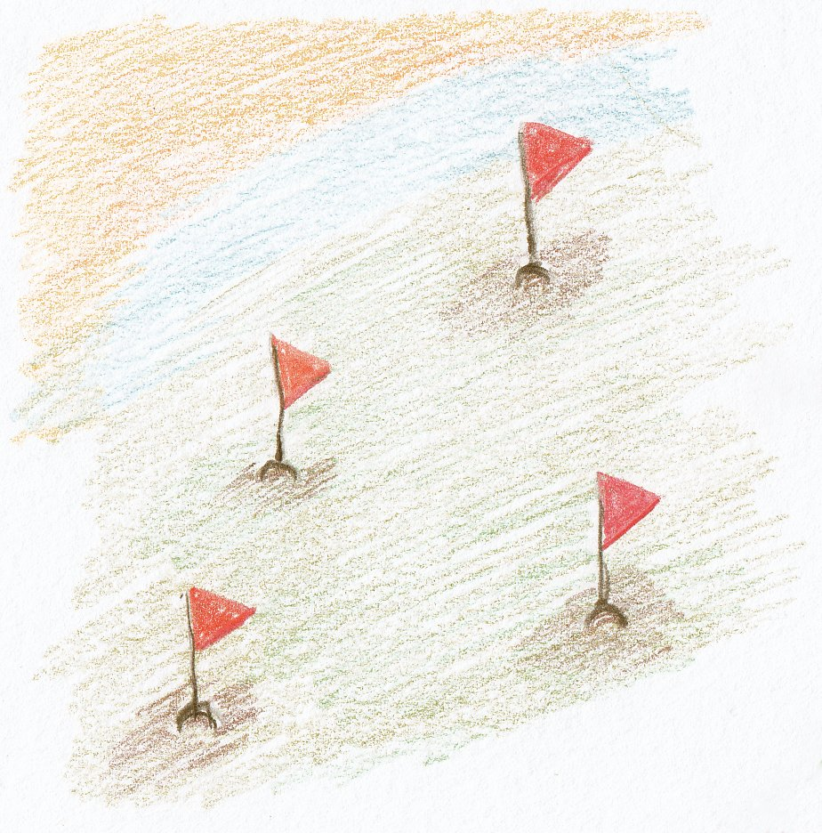
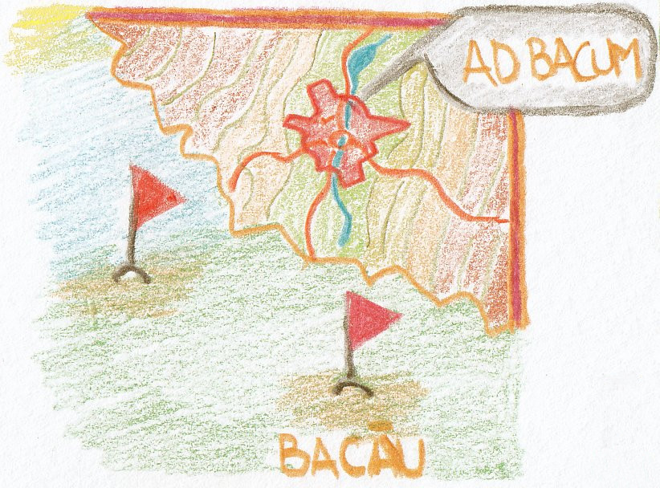

# Introducere

## Pentru voi!

Dedic acest efort copiilor mei, copiilor tuturor celor care vor citi materialele și vouă, celor curioși, care veți învăța mai întâi prin a înțelege.

Este pentru voi, cei care lucrați în biblioteci și în alte instituții de memorie. Motivul pentru care vi se adresează vouă este nevoia unei noi abordări a practicii în contactul permanent cu informația și cu reprezentările atât de bogate ale acesteia.

Speranța mea se îndreaptă către cei care vor reuși să stăpânească limbajul într-atât de bine, încât să intre în etapa creativă fără întârziere. Nu este îndeajuns să folosești ceea ce îți este oferit de ceilalți. Pur și simplu este nevoie să poți rezolva problemele reale cu care te confrunți, fără a încerca adaptarea soluțiilor altora. Nu te îndemn să reinventezi roata, ci să o înțelegi pentru a reuși să faci un vehicul.

Mai dedic acest material celor care trăiesc în solitudine sau încarcerați, celor cărora viața nu le-a fost ușoară și tuturor celor care având timp la îndemână, ar dori să încerce ceva deosebit, ceva ce le-ar aduce satisfacții mari și care i-ar apropia de un tărâm magic cu infinite posibilități.

## O resursă pentru a înțelege ECMAScript, adică JavaScript

Oricine învață mai bine dacă scrie lucrurile pe care dorește să le înțeleagă, iar această carte mă va ajuta și pe mine să înțeleg mai bine concepte și practici care se însușesc uneori cu dificultate, în timp. De cele mai multe ori, atunci când am de învățat ceva nou, desenez, fac scheme, măzgălesc cum ar arăta. Voi continua și aici pentru că doresc să elaborez un material viu ilustrat care să explice și prin imagine.

Am dorit să vă iau cu mine în această călătorie pentru că îmi doresc să vă fac părtași și unui nou model de a scrie cărți: cel incluziv, care expune totul înainte. Materialele pe baza cărora s-a editat cartea pot fi consultate și pe web sub o licență deschisă. Aceasta este o promisiune către comunitatea celor care doresc să învețe.

Ținta este realizarea unui material de învățare pentru limbajul de programare JavaScript, care să fie eficient în înțelegerea aspectelor dificil de pătruns. Și, acestea nu sunt puține.

Sunt cuprinse experiențe și note strânse după ce am citit și am vizionat multe alte lucrări dedicate acestui limbaj de programare. Acesta nu este primul limbaj de programare pe care l-am folosit pentru a rezolva cerințe punctuale. Am început pe vremuri să învăț Pascal dintr-o carte xeroxată, deh, pe vremea aia nu erau nici computere prea multe, iar cartea tehnică în limba română rară... hmmm... ca și acum, parcă. Apoi am trecut prin BASIC folosind primul meu calculator, un HC (o clonă Zilog) și apoi m-am reapucat de programare din nou odată cu avântul Internetului în anii 2000. PHP-ul a fost experiența de programare care m-a pregătit pentru JavaScript și de aici împreună cu voi ce va urma. Nu te abandona gândului că trebui să fi avut experiență în computere înainte. O minimă familiaritate cu utilizarea lor este îndeajuns.

Ceea ce am realizat după un efort de câțiva ani de acumulare personală, este faptul că nu există materiale de învățare în domeniul programării care să explice și cu ajutor vizual extins concepte și situații pe care anumite abstractizări ale unui limbaj le expune celor nefamiliarizați.

Acesta este și un efort de a lărgi baza de acces în limba română către un nou instrument de expresie: programarea. Chiar dacă limbajul de programare își găsește expresia în limba engleză, nu există niciun motiv să nu pornești pentru că există o barieră de limbă. Nu amâna pentru momentul când vei învăța engleza. Toate instrucțiunile vor fi traduse ca înțeles și voi puncta acolo unde este necesară lămurirea termenilor din limba engleză. Restul motivelor le puteți bănui cu ușurință.

Este posibil ca multe dintre interpretările mele sau felul în care explic să nu fie cel canonic, cel predat în școală sau în mediile academice dedicate. Nu este o lucrare orientată către comunitatea de cercetare a domeniului informaticii. Audiența include și pe aceștia, dar baza o constituie cei care au nevoie de o ușă deschisă pentru a scrie primele programe, pentru „a prinde gustul", pentru a realiza un potențial pe care doar îl intuiau.

Ținta este de a căuta cea mai bună asamblare a cunoștințelor în dozele cele mai echilibrate pentru ca doritorii să ajungă la un nivelul cel mai bun de înțelegere. Finalitatea este dobândirea încrederii pentru a scrie ușor cod funcțional și de a lucra cu diferitele biblioteci de cod existente.

Limbajul adoptat este unul dedicat celui care dorește să înțeleagă fenomenul și să ajungă la contextualizare rapidă a anumitor concepte sau abstractizări cu un prag mai ridicat. Pentru a realiza cât mai multe punți între subiectele care au o legătură directă, am ales să repet în anumite puncte cheie câteva informații necesare în defavoarea unor trimiteri seci care să aibă ca efect cât mai puține salturi între segmentele de cunoștințe.

Materialele pot servi și ca date prelucrabile pentru un posibil sistem de învățare dinamic și adaptat pe subiect. În acest sens, unele materiale includ secțiuni intitulate „dependințe cognitive" sau „alonje". Mai toate subiectele tratate conțin o secțiune intitulată „mantre", care are scopul de a realiza liste de „atribute". Acestea descriu aspectele cele mai importante.

Pentru că de curând a apărut noul standard ECMAScript 6, care introduce noi structuri sintactice, am preferat să le introduc în economia explicațiilor. Astfel, veți vedea că în majoritatea cazurilor sunt oferite sintaxele alternative conform ultimelor specificații, care stau alăturat celor familiare din ECMAScript 5.

Cred că v-am zăpăcit nițel cu cele două denumiri: ECMAScript și JavaScript. Nu sunt două lucruri distincte. JavaScript este o marcă înregistrată iar ECMAScript la fel, dar aceasta din urmă aparține creatorilor limbajului. JavaScript este ceea ce întreaga comunitate de programatori înțelege a fi iterațiile standardului ECMAScript. Închei povestea ECMAScript / JavaScript spunându-vă că începând cu ECMAScript 6, toate iterațiile vor purta marca anului în care s-a făcut incrementul. De exemplu, în acest an standardul se numește ECMAScript 2017.

Dacă veți căuta instrumentul perfect pentru a învăța, această lucrare nu este locul potrivit. Chiar dacă tot codul a fost testat, chiar dacă fragmentele care explică funcționalitatea au dimensiuni care să permită înțelegerea, sunt convins că se poate și mai bine. Mă voi strădui.

### Astăzi întrebarea este `cum`, nu `de ce`

Pentru că această lucrare se adresează și specialiștilor din științele informării, accentuez faptul că nu mai poate fi despărțită nevoia de a dobândi noi abilități, de cerința de a le pune în practică. Ceea ce doresc să subliniez este că aproape toate serviciile moderne ale unei instituții de memorie nu mai pot fi gândite fără o formă sau alta de prelucrare a datelor și informațiilor, fie că este prelucrare, fie că este prezentarea lor către comunitate sau pregătirea pentru interconectare.

Întrebarea pentru toți profesioniștii domeniului științelor informării este în acest moment **cum**. Cum să învăț să gestionez date, cum să le manipulez, cum să le prezint pentru a fi mai ușor de înțeles celor care au nevoie de ele. Cum să transform catalogul meu, cum să interconectez baze de date europene și globale la acesta, cum să convertesc dintr-un format în altul, dar mai ales cum să exploatez colecția pentru a o face și mai atractivă din perspectiva unui instrument de lucru care să devină permanență... obișnuință!? Cum să transform instrumentul creat de mine într-un serviciu continuu?

Această carte dorește să ofere o cale prin care să fie dobândite cunoștințe în domeniul programării îndeajuns de avansate cât să permită o a doua natură celor care au nevoie să lucreze cu datele.

Una din țintele acestei cărți este aceea de a explica și însuși cunoștințele necesare pentru a manipula date, transforma, și pentru a le genera dinamic într-o formă de prezentare.

Această lucrare îți este adresată și ție specialistul în umanioare digitale - *digital humanities*. Îți va oferi cunoștințele necesare să pui cap la cap diferite scripturi pentru a eficientiza munca curentă.

Îți va veni ușor să înțelegi de ce funcționează o colecție de software, cum se leagă un framework de un altul și de ce funcționează acest lucru. Capacitatea de expresie și de prelucrare îți va fi ușurată semnificativ prin înțelegerea multor aspecte obscure ale funcționării JavaScript-ului.

Voi încheia pledoaria pentru acest nou drum cu o afirmație care se va dovedi adevărată pe măsură ce veți descoperi bucuria de a lucra cu structuri de cod ce permit prelucrarea.

**Textul în dimensiunea lui digitală este o colecție de date în sine. El se agregă și poate fi demarcat pentru a crea structuri inteligibile și pentru om, dar și pentru mașină.**

Este ca o colecție destructurată cu înțeles doar pentru om, care așteaptă un agent software care să o reordoneze și interconecteze cu alte surse pentru a oferi o nouă dimensiune valorică. De fapt, acesta este și scopul final pentru care învățăm programare: **extragerea valorii indiferent de formă și destinație pentru a ajunge la noi înțelesuri**.

## Anti-introducere

JavaScript a pornit ca motorul dinamicii paginilor web, a prins viteză și a ajuns să devină un limbaj de programare cu uz general. Chiar textul standardului declară ECMAScript ca fiind un limbaj de programare general. Acest lucru înseamnă că poate fi folosit la mult mai multe lucruri în afara intențiilor sale originare. Avantajele folosirii JS pornesc de la server (NodeJs), până la aplicațiile rulate în browserul web al utilizatorului.

Când vorbim de JavaScript, de fapt vorbim despre o implementare, adică de respectarea tuturor regulilor pe care le impune standardul ECMAScript - <http://www.ecma-international.org/memento/TC39.htm>.

Programarea, ca și activitate, ar fi util să fie înțeleasă ca o limbă străină nouă, pe care ai nevoie să o înveți pentru a comunica cu un străin - computerul. De aceea, se numește și limbaj. ECMAScript, Javascript sau JS ca și limbaj are o gramatică proprie cu toate regulile sale, de la modul în care înșiri caracterele, până la modul în care faci enunțurile pentru a avea sens și pentru un computer atunci când le evaluează.

Vă va ajuta să înțelegeți că scrierea unui fragment de cod este precum scrierea unei fraze foarte lungi constituită din propoziții separate prin punct și virgulă. Dar această frază este forma cristalizată a unui algoritm. Să lămurim câteva lucruri de la bun început.

Ai o problemă pe care dorești să o rezolvi și în acest sens, creezi **pașii necesari**. Nu te sfii să scrii acești pași pe o coală de hârtie. Adevărata programare începe de la faza de creion și hârtie. În plus, este dovedit ștințific că soluțiile se văd din lucrul cu obiecte, din interacțiunea gândurilor cu lumea fizică.

Succesiunea tuturor pașilor identificați de tine se numește **algoritm**.

Transpunerea unui algoritm într-o soluție tehnică, se numește **program**.

Pentru a scrie un program, alegi un limbaj de programare, iar în cazul nostru, am ales deja: ECMAScript, adică JavaScript.

Mai adaug doar că o transpunere a unui algoritm într-un program constituie, de fapt, o transpunere într-un **limbaj formal** (regulile sale interne îl formalizează).

Gata, începem! Avem nevoie de o privire generală asupra limbajului.

A, eram să uit. De ceva vreme a ieșit o nouă versiune a standardului. Comunitatea de programatori îi spune ECMAScript 6 iar celei anterioare ECMAScript 5\. În cuprinsul materialelor veți găsi referințe la standard așa sau mai simplu ES5 și ES6.

ECMAScript, ES5, ES6, JavaScript, JS, ECMAScript 2017, toate, fiecare vorbesc de aceeași realitate: limbajul de programare ECMAScript.

## Mică anatomie a limbajului

> Un ansamblu de primitive și o mulțime de reguli care guvernează modul în care aceste primitive pot fi combinate pentru reprezentarea ideilor mai complexe, constituie un **limbaj de programare**
> <cite><a href="http://www.teora.ro/cgi-bin/teora/romania/mbshop.cgi?database=01&amp;action=view_product&amp;productID=%20823&amp;category=" title="Brookshear, J. Glenn. Introducere în informatică. Editura Teora. 1998\. Titlul original: Computer science - An overview, Fifth Edition">J. Glenn Brookshear.1998</a>
> </cite>

Standardul ECMAScript 2016 este un „limbaj de programare" cu aplicativitate largă. Inițial ECMAScript a fost dezvoltat ca un limbaj de scriptare, dar a evoluat în unul care este aplicabil la o paletă foarte largă de aplicații.

JavaScript este un limbaj creat de Brendan Eich în perioada când lucra la compania Netscape. Numele corect este ECMAScript și este rezultatul unui efort colaborativ care a pornit în 1996, un an mai târziu fiind publicată prima ediție. În aprilie 1998 devine standardul internațional ISO/IEC 16262.

Pentru a face o anatomie, vom porni privind la cele mai mici componente precum un fizician din domeniul particulelor, la componentele unui atom.

### Caracterele folosite

Oricât ar părea de bizar, cuvintele cu care scriem comenzi, sunt compuse din litere. Aceste litere, pentru computer nu sunt decât coduri în baza căruia reprezintă un caracter pe ecran.

Caracterele folosite pentru a scrie cod respectă standardul de codare Unicode. Pentru fiecare caracter există un punct de cod specific UTF16.

#### Caracterele cu rol special

Există câteva caractere care necesită chiar acum la început de drum o atenție specială. Acestea sunt `'` (ghilimele simple), `"` (ghilimele duble), `\n` (end of line), `\r` (carriage return), `\t` (tab), `\` (slash) și `/` (backslash).

JavaScript este un limbaj de programare folosit la manipularea șirurilor de caractere indiferent ce reprezintă pentru noi oamenii.

Caracterele de mai sus și combinațiile lor au un înțeles special pentru motorul de JavaScript, dar atunci când ele însele sunt necesare ca și caractere, fie că fac parte dintr-un text analizat, fie că se dorește compunerea unuia într-o manieră dinamică, aceste caractere trebuie să fie precedate de backslash (`\`). În cazul ghilimelelor, ca bună practică, se vor folosi ghilimele simple pentru declararea șirurilor de caractere pentru că, fiind un limbaj strâns legat de markup-ul paginilor web, ar putea cuprinde ghilimele duble ca parte a fragmentelor de pagină web construite dinamic.

Acoladele `{}` au rolul de a indica mediul în care se va executa codul în JavaScript. Cel mai ades veți vedea că indică blocurile de cod ale funcțiilor. Între acolade veți introduce liste de instrucțiuni și expresii specifice JavaScript separate prin punct și virgulă `;`.

Acoladele mai au și un rol special: delimitează spații cu un rol special. Creează niște „grădini private” pentru care doar o parte din cod are acces.

### Atomi lexicali

Toate elementele lexicografice care constituie codul în sine, cu excepția spațiilor și a comentariilor, se numesc `token-uri`, adică `atomi lexicali`.

Acești **atomi lexicali** (token-ii) sunt rezultatul parcurgerii unui fragment de cod (codul sursă) asupra căruia se aplică regulile lexicale specifice gramaticii pe care o impune standardul ECMAScript.

Ca să-ți vină ușor să înțelegi, îți poți imagina un giuvaergiu care dintr-un maldăr de pietre prețioase (codul sursă), ia una câte una (fragmente de cod), pentru a-i identifica caracteristicile și în final pentru a le pune pe fiecare după sortare în cutiuțele pregătite special.

Trebuie să te avertizez de faptul că toate cuvintele speciale folosite de JavaScript sunt în limba engleză. Fondul lexical este cel al limbii engleze.

### Textul sursă

Textul sursă sau codul sursă poate fi de două tipuri: `Script` sau un `Module`. Codul pe care-l scrii poate fi redactat pe mai multe linii pentru că pentru JavaScript **_spațiile_**, **_taburile_** și **_line breaks_**-urile sunt _spații albe_ și nu semnale care să indice un curs de acțiune.

### Elemente de input - faza 0

Spune standardul că mai întâi textul codului este parcurs pentru a-l „converti într-o succesiune de elemente de input" folosindu-se regulile lexicale. Aceste elemente de input sunt:

#### Token-uri

Ceea ce rezultă în urma aplicării regulilor de identificare a componentelor ce formează fragmentele „inteligibile” pentru computer din șirul de text de intrare. Dacă-ți vine mai ușor este ca o analiză gramaticală în care identifici părțile de propoziție, ce sunt acestea din punct de vedere al părților de vorbire și așa mai departe.

#### Line terminators - semnele capetelor de rând

 - `line-feed` - *mergi pe line nouă* (`\n`, abreviat LF sau NL un caracter special care marchează faptul că motorul trebuie să continue citirea de pe o nouă linie de cod: `print("ceva\ncapat");`),
 - `carriage return` ( `\r` abreviat CR) - *trage înapoi tamburul* (un caracter special care spune motorului că trebuie să se întoarcă pe linia curentă pentru o operațiune pe șirul de caractere al rândului. Acest caracter este o reminiscență a utilizării vechilor mașini de scris, care migrând la cele electronice, încă aveau nevoie de un caracter special care să spună mecanismelor electromecanice să se întoarcă pe același rând: `print("ceva\rcapat"); // "ceva
capat"`),
 - `line separator` și
 - `paragraph separator`.

Pentru a înțelege mai bine, accesați și materialul explicativ de la https://en.wikipedia.org/wiki/Typewriter și https://en.wikipedia.org/wiki/Newline.

#### Comentariile

Acestea sunt utile pentru a documenta codul. Sunt două moduri de a introduce comentarii. Se poate folosi dublu slash `// comentariu` sau atunci când ai nevoie de comentarii pe mai multe linii `/* comentariu */`.

#### Spațiile albe

Sunt considerate a fi spații albe următoarele: `tab` (`\t` un spațiu cu o anumită întindere), `space` (spațiu), `non-breakable space` (spațiu care nu poate fi fracționat), `line tabulation` (sau vertical tab - `\v` - referindu-se la mișcarea pe verticală a liniilor), `form feed` (se referă la trecerea pe ceea ce este înțeles a fi o pagină nouă `\f`).

### Recunoașterea structurilor lexicale proprii - faza 1

Imediat după această fază, această succesiune de elemente de input mai este parcursă încă o dată, aplicându-se din nou regulile gramaticale pentru a identifica ce este ce în text, care sunt identificatorii, cuvintele rezervate limbajului, etc.

ECMAScript are un set de cuvinte rezervate care nu pot fi folosite decât în scopul pentru care au fost rezervate.

Le vom enumera aici cu traducerea lor pentru a vă familiariza la un prim contact: `break` (**_întrerupe_** cu sensul de _ieși din execuție_), `do` (**_fă_** cu sensul de _continuă ce faci_), `in` (**_în_** cu sensul _din_), `typeof` (**_de tipul_**), `case` (**_cazul_** cu sensul _în cazul_), `else` (**_altfel_** cu sensul de _în caz contrar_), `instanceof` (**_instanță a lui_**), `var` (**_variabilă_**), `catch` (**_prinde_**), `export` (**_exportă_**), `new` (**_nou_** cu sensul de _instanțiază un nou obiect_), `void` (**_golește_** cu sensul _golește de valoare_), `class` (**_clasă_**), `extends` (**_extinde_**), `return` (**_returnează_**), `while` (**_cât timp_**), `const` (**_constantă_**), `finally` (**_încheie_**), `super` (**super**), `with` (**_cu_**), `continue` (**_continuă_**), `for` (**_pentru_** cu sensul _evaluând următoarea(le) expresie(i) pentru fiecare element din_), `switch` (**_schimbă_** cu sensul _mergi pe ramura_), `yield` (**_produ_**), `debugger` (**_depanare_** cu sensul _activează depanatorul_), `function` (**_funcție_**), `this` (**_acesta_**), `default` (**_inițial_**), `if` (**_dacă_**), `throw` (**_aruncă_** cu sensul de a _scoate la lumină erorile_), `delete` (**_șterge_**), `import` (**_importă_**), `try` (**_încearcă_**), `await` (**_așteaptă_** cu sensul de _în așteptare_).

Cuvintele rezervate poartă în sine o acțiune. Ele numesc o acțiune pentru computerul nostru, un curs de acțiune pe care trebuie să-l urmeze.

Buna practică spune ca toate expresiile (liniile de cod cu instrucțiuni) în JavaScript trebuie să fie încheiate prin punct și virgulă (`;`), chiar dacă motoarele care implementează ECMAScript la momentul evaluării codului, introduc automat prin mecanismul de **_automatic semicolon insertion_** acest caracter. Da, motoarele permit anumite facilități celor grăbiți sau celor care chiar aleg aceasta practică înadins. Eu personal, mă feresc și pun semnele de punctuație pentru că astfel, codul devine lizibil și poți folosi însăși codul pentru a-l prelucra (știi sigur că un enunț s-a încheiat după `;`).

#### Automatic semicolon insertion - introducerea automată a lui punct și virgulă

Enunțurile (_statements_) în JavaScript trebuie să se termine cu punct și virgulă, iar acolo unde semnul grafic nu a fost scris de programator, codul se supune mecanismului ASI - Automatic Semicolon Insertion:

Aceste declarații și instrucțiuni sunt:

- instrucțiuni simple,
- declarații de variabile: `var`, `let`, `const`,
- declarațiile de module: `import`, `export`,
- declararea expresiilor,
- debugger,
- instrucțiunile `continue`, `break`, `throw`,
- și `return`.

#### Operatori

Sunt caractere sau combinații de caractere care au rolul de a stabili o relație între doi operanzi. Este exact ca în matematică. Rolul operatorilor este de a ajunge la un rezultat în urma „evaluării”. De exemplu, când ai expresia `1 > 0;`, operatorul de comparație `>` va oferi rezultatul, care este o valoare boolean de `true`. În esență, putem spune că majoritatea rezultatelor atunci când scriem cod, provin din astfel de evaluări.

#### Expresiile

Continuăm cu o precizare foarte importantă. Atunci când codul sursă este rulat pentru a obține un rezultat, de fapt, ceea ce se petrece este o sesiune de evaluări ale expresiilor care se reduc la o valoare după rezolvarea lor condiționată de diverșii operatori. Totul, dar totul se reduce, de fapt, la a evalua expresii rezolvând operațiunile și ajungând la valori care sunt necesare altor expresii, care, la rândul lor așteptau cuminți ca evaluarea precedentă să se încheie pentru a avea și ele valorile de care aveau nevoie.

#### Instrucțiunile

Instrucțiunile sunt parte a expresilor (`expressions`). Este obsevabil că cel mai adesea veți vedea că o expresie este o instrucțiune. În JavaScript, sunt permise expresii care nu sunt neapărat instrucțiuni: `1 + 1;`

**JavaScript este un limbaj de programare pentru care este de importanță vitală felul în care este redactat codul sursă.**

Acest aranjament de scriere a codului, succesiunea în care sunt introduse instrucțiunile imprimă diferite efecte la momentul evaluării sale.

Rețineți faptul că modul în care redactezi codul are efect direct asupra funcționării programului. Nu uita faptul că poți scrie instrucțiunile pe mai multe linii și astfel îmbunătățești lizibilitatea programului. Ba mai mult, poți indenta (pui spații înaintea fragmentului de cod și ca efect vizual se vor deplasa spre dreapta).

#### Despre identificatori

Acesta este cel mai potrivit moment să explorăm **tărâmul** JavaScript în căutarea reperelor care identifică valori. Nu uita că scriem software pentru a manipula valori.

Reperele de mai sus sunt identificatorii, care odată înțeleși, vor permite accesul la ceea ce înseamnă variabilele ca și concept.

Să ne imaginăm că avem o hartă imaginară pe care avem marcate prin fanioane diferite locații. Locațiile reprezintă valorile pentru care avem nevoie de un nume, de un toponim. De exemplu, pentru orașul (percepem orașul ca fiind valoarea) din centrul regiunii Moldova avem numele Bacău, care este identificatorul. Adică, identificăm orașul ca valoare cu un toponim.

Putem să ne închipuim că identificatorii sunt toponime ale „tărâmului" JavaScript. Identificatorii pot fi orice secvență de caractere care poate să înceapă cu semnul dollar `$`, sau cu liniuță jos `_` (*underscore*) urmate de orice puncte de cod codate numeric respectând schema de codare a caracterelor UTF16.

Am putea spune foarte simplu că un identificator este numele unei valori, iar identificatorul este o înșiruire de caractere.

## Detalii suplimentare despre JavaScript pentru curioși și avansați

JavaScript este un runtime cu un singur fir de execuție. Acest lucru implică existența unei stive unice pentru apeluri (callstack).

JavaScript este un limbaj de programare bazat pe evenimente (event driven).

John Resig (JQuery) spune că JavaScript este o relație între funcții, closure-uri și obiecte, care conduce la înțelegerea cu adevărat a acestui limbaj de programare dinamic.

Motoarele JavaScript au o structură ceva mai complexă. Au o stivă de apeluri cu tot atâtea contexte de execuție, au un event loop - o buclă care capturează evenimente și mai au și o coadă de așteptare a callback-urilor (funcții care se execută când funcția gazdă și-a încheiat execuția), plus API-urile web.

JavaScript nu poate face decât un singur lucru la un moment dat, dar pentru că runtime-ul JS nu este singur, ci mai avem și bucla, dar și [API-urile web](https://www.w3.org/TR/html5/webappapis.html#webappapis), se poate rula cod asincron, ceea ce înseamnă că un eveniment, nu va bloca firul de execuție pentru că nu și-a terminat treaba. Toate aceste lucruri suplimentare care există în browser, de fapt înseamnă tot atâtea fire de execuție și asta înseamnă că poți să te apropii de ceea ce ar fi un mediu care execută mai multe treburi deodată fără să se creeze blocaje.

## Perspectivă peste un tărâm

Atunci când am pornit la scrierea acestei cărți nu am avut nevoia să văd de pe orbită cum arată planeta JavaScript, dar pe măsură ce am avansat, am realizat că este nevoie să privești mai întâi din spațiu pentru a înțelege valoarea tuturor entităților și relațiilor pe care le stabilesc acestea la nivelul solului.

Vorbim despre o adevărată lume, chiar despre un **tărâm** special.

Textul standardului ECMAScript oferă cea mai bună perspectivă atunci când vine vorba despre un program JavaScript care este privit la lucru. Voi parafraza și cita acolo unde este necesar textul standardului pentru a contura un cadru cât mai complet.

Urmând firul unei adevărate geneze, standardul menționează chiar termenul de „realm" - **tărâm**: „înainte de a fi evaluat, tot codul ECMAScript trebuie asociat unui tărâm. Conceptual, un tărâm constă dintr-un set de **obiecte intrinseci** (***built-in***), un **mediu global** (***global environment***) și tot **codul ECMAScript** care este încărcat în cadrul «scope-ul» acelui mediu global, precum și alte stări și resurse asociate". Acesta este cel mai valoros citat al standardului pentru că este ca o fotografie a planetei JavaScript de pe orbită.

Am precizat câțiva termeni deja care fac parte dintr-un adevărat idiom pe care-l impune limbajul. Comunitatea de programatori în JS au propriul limbaj de comunicare, uneori un jargon din care se strecoară în uzul de zi cu zi câte un termen, de exemplu cum este „scope", care formal în ECMAScript se numește „lexical environment". Pentru că deja am intrat într-o mini descriere a limbajului, mai adaug faptul că JavaScript prin varietatea de stiluri dezvoltate în timp, s-au creat chiar dialecte așa cum este TypeScript. Dar asta este o discuție lungă și nu mai zăbovim aici.

**Termenii noi nu trebuie să te descurajeze.**

Fac parte din efortul de a înțelege și chiar dacă apar chiar de la început, vor fi descriși pe parcurs și vei înțelege ce se ascunde în spatele lor. Am spus eu mai sus despre **_obiecte intrinseci_**. Pentru moment înțelege că obiectele sunt niște structuri de date și dacă-ți vine mai la îndemână poți imagina obiectele precum niște fructe de rodie. În interior sunt bobițele care pot fi asociate proprietăților.

Este nevoie să ne aplecăm asupra textului standardului pentru a înțelege ce se întâmplă.

Standardul spune că producătorul browserului trebuie să pună la dispoziție toate mecanismele necesare genezei unui nou tărâm (**realm**), care constă dintr-o zonă ce include totul, iar **totul** însemnând ceea ce am enumerat mai sus: obiectele intrinseci, codul ECMAScript plus „alte stări și resurse asociate".

Am ilustrat acest tărâm ca pe o sferă de activitate (**obiectul global**) în care găsești în zona centrală codul reprezentat de ciorchini de obiecte și date ce stabilesc relații strânse (valori, obiecte și funcții).

Această structură se constituie la momentul executării codului.

Structura eliptică ca o bandă care se rotește continuu imaginează o „buclă” care se rotește (rulează) permanent câtă vreme este rulat întregul cod în care apar „evenimente” (fragmente de cod care trebuie rulate). Pe suprafața sferei sunt disponibile „obiectele intrinseci” reprezentate ca structuri hexagonale și care sunt acolo pentru a oferi funcționalități ciorchinilor din zona centrală.

Atenție, pentru fiecare „context de execuție în efect", adică bucata de cod care este evaluată la momentul în care bagi capul în „căpița de cod care se execută", se creează câte o nouă înregistrare pentru cum arată tărâmul. Este ca și o foaie de observație în spital. Când apare o modificare în starea unui pacient este actualizată foaia de observație.

Un tărâm este constituit dintr-un set de obiecte interne, obiectul global pentru tărâmul la care ne referim, cadrul lexical creat de însăși felul în care este redactat codul („lexical environment") și elemente care au capacitatea de a crea șabloane. Toate tărâmurile care sunt create sunt evidențiate de o înregistrare specială numită de standard `Realm Record`. Din toată această mică listă reține faptul că JavaScript vine cu câteva lucruri din start care împreună cu programul scris de tine construiesc un tărâm.

**Moment Zen**: un program JavaScript este de un grup de obiecte care comunică între ele.

Obiectele acestea sunt niște colecții de proprietăți iar pentru fiecare dintre proprietăți există atribute care determină cum se pot folosi acestea. Proprietățile pot fi considerate ca niște recipiente care conțin la rândul lor **valori primitive**, **funcții** sau chiar alte **obiecte**. Dacă urmăm imaginea rodiei, proprietățile pot fi bobițele, care la rândul lor conțin sâmburele, care este chiar valoarea.

Am mai introdus câteva cuvinte noi. Hai să le lămurim. Primitivele sunt ca niște blocuri elementare de lucru. Sunt chiar datele, forma primară de reprezentare a lor. Funcțiile sunt miniprograme în programul mare. Obiectele, am stabilit: rodii! :).

### Primitive pe scurt

Avem șase primitive:

- `Boolean`. Este denumită după cercetătorul Boole și are două stări: `true`  adevărat sau `false` - fals,
- `Null`. Da, o valoare nulă este considerată o valoare,
- `Undefined`. „Nedefinit” este o valoare în sine chiar dacă pare foarte straniu,
- `String`. „Șir de caractere” este succesiunea de caractere care formează un text,
- `Number`. „Număr” și
- `Symbol`. „Simbol”.

După cum se observă, fiecare primitivă constă din două elemente: sintaxa și semantica. Sintaxa implică „codarea" printr-un cuvând din limbajul natural, care în cazul JavaScript este limba engleză, iar semantica indică conceptul reprezentat.

### Funcțiile pe scurt

Funcțiile sunt un ***tip de obiecte***. Deci, tot niște rodii. Ha ha! În JS acestea sunt de tip `callable` (în rom. *apelabile*), adică niște rodii pentru care se poate iniția un apel pentru a le executa.

Ce înseamnă a le executa? Pur și simplu motorul se va uita între acolade, va compila codul, va face recensământul identificatorilor și îl va evalua returnând un rezultat.

Pentru că lucrurile simple sunt plicticoase, mai completăm cu faptul că funcțiile care sunt proprietăți ale unui obiect, sunt numite **metode** ale acestuia. Nu te lăsa intimidat de noua etichetă: metodă. Funcția rămâne funcție fără a fi atinsă în niciun fel de faptul că „face parte” a unui obiect. Poți să-ți închipui funcția ca fiind separată de obiect, dar execuția ei va fi legată de contextul acelui obiect.

Mai adăugăm că ECMAScript, adică JavaScript are niște obiecte cu care vine el din start (`built-in objects`). Deci, din start browserul ca și instrument care aplică standardul ECMAScript, vine cu propria lădiță de rodii.

Sintetic, acesta este cadrul general.

## Resurse

[ECMAScript® 2017 Language Specification](https://tc39.github.io/ecma262/)
Simpson, Kyle. [You Don't Know JS](https://github.com/getify/You-Dont-Know-JS)
Haverbeke, Marijn. [Eloquent JavaScript](http://eloquentjavascript.net/)
Brookshear, J. Glenn. [Computer science - An overview](https://www.amazon.com/Computer-Science-Overview-Global/dp/1292061162)

[1]: http://www.teora.ro/cgi-bin/teora/romania/mbshop.cgi?database=01&action=view_product&productID=%20823&category= "Brookshear, J. Glenn. Introducere în informatică. Editura Teora. 1998. Titlul original: Computer science - An overview, Fifth Edition"
