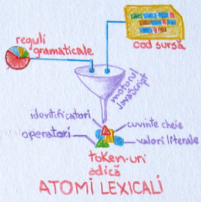
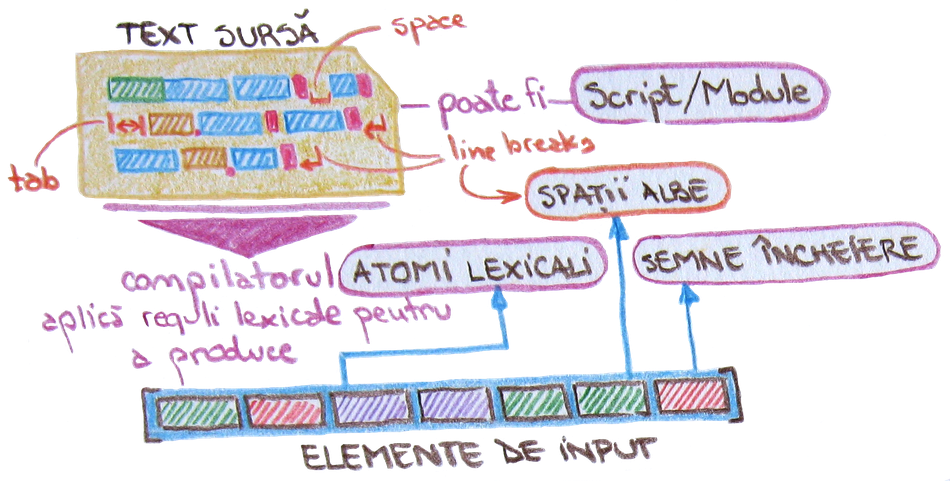
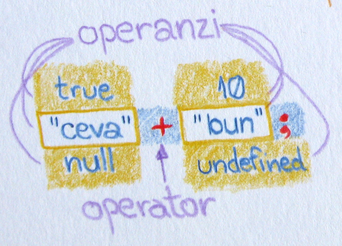
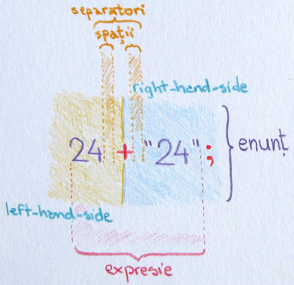
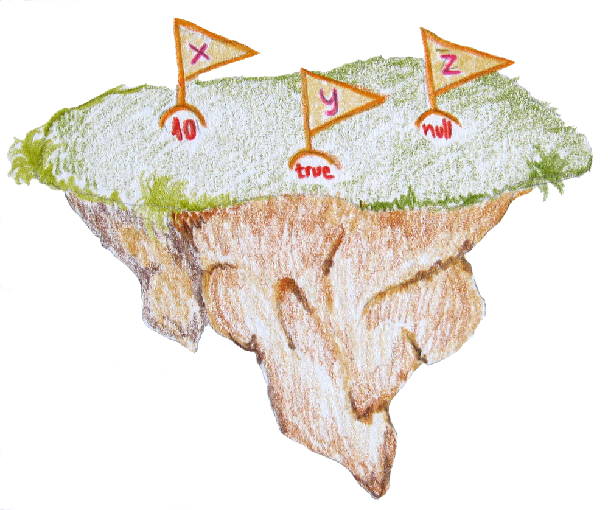
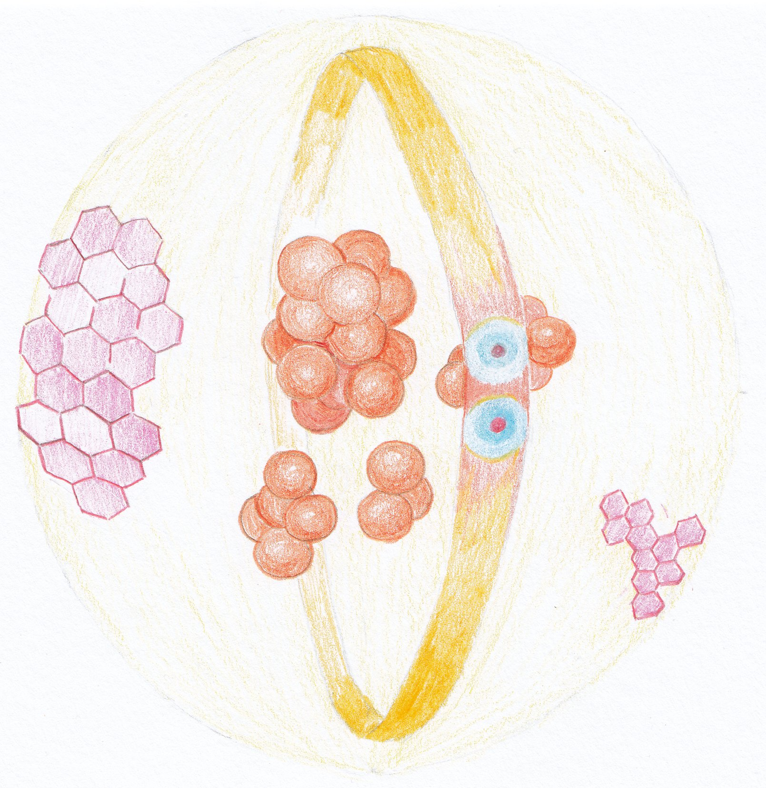
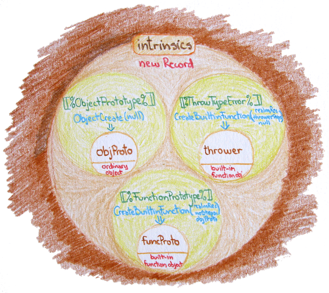
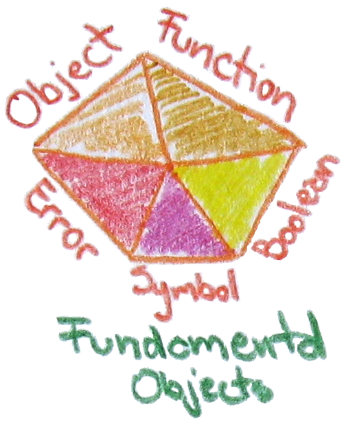

# Introducere

## Pentru voi!

Dedic acest efort copiilor și vouă, celor curioși, care veți învăța mai întâi prin a înțelege.

Este pentru voi, cei care lucrați în biblioteci și în alte instituții de memorie. Motivul pentru care vi se adresează vouă este nevoia unei noi abordări a practicii în contactul permanent cu informația și cu reprezentările atât de bogate ale acesteia.

Speranța mea se îndreaptă către cei care vor reuși să stăpânească limbajul foarte bine pentru a intra în etapa creativă fără întârziere. Nu este îndeajuns să folosești ceea ce îți este oferit de ceilalți. Pur și simplu este nevoie să poți rezolva problemele reale cu care te confrunți, fără a încerca adaptarea soluțiilor altora. Nu te îndemn să reinventezi roata, ci să-i înțelegi principiile pentru a reuși să faci un vehicul.

Mai dedic acest material celor care trăiesc în solitudine sau sunt privați de libertate, celor cărora viața nu le-a fost ușoară și tuturor celor care având timp la îndemână, ar dori să încerce ceva deosebit, ceva ce le-ar aduce satisfacții mari și care i-ar apropia de un tărâm magic cu infinite posibilități.

## O resursă pentru a înțelege ECMAScript, adică JavaScript

Oricine învață mai bine dacă scrie lucrurile pe care dorește să le înțeleagă, iar această carte mă va ajuta și pe mine să înțeleg mai bine concepte și practici care se însușesc uneori cu dificultate, în timp. De cele mai multe ori, atunci când am de învățat ceva nou, desenez, fac scheme, măzgălesc cum ar arăta. Voi continua și aici pentru că doresc să elaborez un material viu ilustrat care să explice și prin imagine.

Am dorit să vă iau cu mine în această călătorie pentru că îmi doresc să vă fac părtași și unui nou model de a scrie cărți: cel incluziv, care expune totul înainte. Materialele pe baza cărora s-a editat cartea pot fi consultate și pe web sub o licență deschisă. Aceasta este o promisiune către comunitatea celor care doresc să învețe.

Ținta este realizarea unui material de învățare pentru limbajul de programare JavaScript, care să fie eficient în înțelegerea aspectelor dificil de pătruns. Și, acestea nu sunt puține.

Sunt cuprinse experiențe și note strânse după ce am citit și am vizionat multe alte lucrări dedicate acestui limbaj de programare. Acesta nu este primul pe care l-am folosit pentru a rezolva cerințe punctuale. Am început pe vremuri să învăț Pascal dintr-o carte xeroxată. Deh, pe vremea aia nu erau nici computere prea multe, iar cartea tehnică în limba română rară... hmmm... ca și acum, parcă. Apoi am trecut prin BASIC folosind primul meu calculator, un HC (o clonă Zilog) și apoi m-am reapucat de programare din nou odată cu avântul Internetului în anii 2000. PHP-ul a fost experiența de programare care m-a pregătit pentru JavaScript și de aici împreună cu voi ce va urma. Nu te abandona gândului că trebuie să fi avut experiență în computere înainte. O minimă familiaritate cu utilizarea lor este îndeajuns.

Ceea ce am realizat după un efort de câțiva ani de acumulare personală, este faptul că nu există materiale de învățare prea multe în domeniul programării care să explice și cu ajutor vizual extins concepte și situații pe care anumite abstractizări ale unui limbaj le expune celor nefamiliarizați. Vizualizare nu înseamnă să te filmezi cum scrii cod pe care îl povestești. Aici mă gândesc la faptul că este nevoie să desenezi, să vezi cu ochii minții posibilele reprezentări ale abstractizărilor. Această lucrare dorește să ofere îndeajuns de mult suport vizual pentru a realiza scopul de învățare.

Acesta este și un efort de a lărgi baza de acces în limba română către un nou instrument de expresie: programarea. Chiar dacă limbajul de programare își găsește expresia prin cuvintele limbii engleze, nu există niciun motiv să nu pornești pentru că există o barieră de limbă. Setul acestora este mic și nu este nimic dificil în a le înțelege. Amânarea pentru momentul când vei învăța engleza este neproductivă și ce-ar fi o experiență de învățare a unui lucru nou fără mici provocări? Toate cuvintele rezervate în limba engleză vor fi traduse ca înțeles și voi puncta acolo unde este necesară lămurirea termenilor. Nu vei fi singur, te voi seconda acolo unde știu că e greu, unde nu face sens din prima.

Este posibil ca multe dintre interpretările mele sau felul în care explic să nu fie cel canonic, cel predat în școală sau în mediile academice dedicate. Nu este o lucrare orientată către comunitatea de cercetare a domeniului calculatoarelor. Audiența include și pe aceștia, dar baza o constituie cei care au nevoie de o ușă deschisă pentru a prinde curaj să scrie primele programe, pentru „a prinde gustul", pentru a realiza un potențial pe care doar îl intuiau.

Ținta este de a căuta cea mai bună asamblare a cunoștințelor în dozele cele mai echilibrate pentru ca doritorii să ajungă la nivelul cel mai bun de înțelegere. Finalitatea este dobândirea încrederii pentru a scrie ușor cod funcțional și pentru a lucra cu diferitele biblioteci de cod existente.

Limbajul adoptat este unul dedicat celui care dorește să înțeleagă fenomenul și să ajungă la contextualizare rapidă a anumitor concepte sau abstractizări cu un prag mai ridicat. Pentru a realiza cât mai multe punți între subiectele care au o legătură directă, am ales să repet în anumite puncte cheie câteva informații necesare în defavoarea unor trimiteri seci care să aibă ca efect cât mai puține salturi între segmentele de cunoștințe.

Materialele pot servi și ca date prelucrabile pentru un posibil sistem de învățare dinamic și adaptat pe subiect. În acest sens, unele materiale includ secțiuni intitulate „dependințe cognitive" sau „alonje". Mai toate subiectele tratate conțin o secțiune intitulată „mantre", care are scopul de a rememora, consolida și enumera caracteristicile, atributele și efectele cele mai importante.

Pentru că de curând a apărut o nouă versiune a standardului ECMAScript care introduce noi structuri sintactice, am preferat să le introduc în economia explicațiilor chiar dacă pentru unele suportul browserelor nu este încă finisat. Pentru cei care veți citi în timp această carte, bucurați-vă! Veți vedea că în majoritatea cazurilor sunt oferite sintaxele alternative conform ultimelor specificații, care stau alăturat celor familiare din ECMAScript 5.

Cred că v-am zăpăcit nițel cu cele două denumiri: ECMAScript și JavaScript. Nu sunt două lucruri distincte. JavaScript este o marcă înregistrată iar ECMAScript la fel, dar aceasta din urmă aparține creatorilor limbajului. JavaScript este ceea ce întreaga comunitate de programatori înțelege a fi iterațiile standardului ECMAScript. Închei povestea ECMAScript / JavaScript spunându-vă că începând cu ECMAScript 6, toate iterațiile vor purta marca anului în care s-a făcut incrementul. De exemplu, în acest an standardul se numește ECMAScript 2017.

Dacă veți căuta instrumentul perfect pentru a învăța, această lucrare nu este locul potrivit. Chiar dacă tot codul a fost testat, chiar dacă fragmentele care explică funcționalitatea au dimensiuni care să permită înțelegerea, sunt convins că se poate și mai bine. Mă voi strădui pe viitor.

**Fii răbdător!** Te invit să citești pentru a înțelege. Oferă-ți timp așa cum ai proceda cu cea mai dragă activitate a ta. **Ai nevoie de timp**! Dacă poți, caută un loc fără distrageri. Focalizează-te înainte de a te apuca de lucru și ori de câte ori întâlnești greutăți în înțelegere, respiră adânc, cu ochii închiși eliminând toate gândurile parazite ce nu țin de efortul tău de învățare. Inspiră și expiră de cinci ori, fiind foarte atent doar la respirație și nimic altceva. Dacă tot nu înțelegi ceea ce citești, desprinde-te! E semnul că e nevoie de o pauză ca mintea ta să prelucreze tot ce ai acumulat până la momentul blocajului. Întoarce-te fără amânare și fii răbdător cu tine, cu erorile pe care le faci. Fii răbdător, ai nevoie de timp!

**Moment ZEN**: Programarea începe de la creion, hârtie și liniște.

### Astăzi întrebarea este `cum`, nu `de ce`

Pentru că această lucrare se adresează și specialiștilor din științele informării și prin extensie tuturor celor din domeniul umanioarelor digitale, accentuez faptul că nu mai poate fi despărțită nevoia de a dobândi noi abilități, de cerința de a le pune în practică. Ceea ce doresc să subliniez este că aproape toate serviciile moderne ale unei instituții de memorie sau de cercetare nu mai pot fi gândite fără o formă sau alta de prelucrare a datelor și informațiilor, fie că este remodelare, regăsire după șabloane sau prezentarea lor către comunitate ori interconectarea cu alte seturi ori sisteme de gestiune.

Întrebarea pentru toți profesioniștii domeniului este în acest moment **cum**? Cum să învăț să gestionez date, cum să le manipulez, cum să le prezint pentru a fi mai ușor de înțeles celor care au nevoie de ele. Cum să transform catalogul meu, cum să interconectez baze de date europene și globale la acesta, cum să convertesc dintr-un format în altul, dar mai ales cum să exploatez colecția pentru a o face și mai atractivă din perspectiva unui instrument de lucru care să devină permanență... obișnuință!? Cum să transform instrumentul creat de mine într-un serviciu continuu?

Această carte dorește să ofere o cale prin care să fie dobândite cunoștințe în domeniul programării îndeajuns de avansate încât să permită o a doua natură celor care au nevoie să lucreze cu datele.

Una din țintele acestei cărți este aceea de a explica cunoștințele necesare pentru a manipula, transforma, și a genera dinamic date, precum și care sunt bazele pentru a le încadra într-o formă de prezentare.

Această lucrare îți este adresată și ție specialistul în umanioare digitale - *digital humanities*. Îți va oferi cunoștințele necesare să pui cap la cap diferite scripturi pentru a eficientiza munca curentă, pentru a înțelege și oferi înțelesuri noi unor seturi de date discrete pe care vei ști să le pui cap la cap și să le exploatezi.

Îți va veni ușor să înțelegi de ce funcționează o colecție de software, cum se leagă un framework de un altul și de ce funcționează acest lucru. Capacitatea de expresie și de prelucrare îți va fi ușurată semnificativ prin înțelegerea multor aspecte obscure ale funcționării JavaScript-ului.

Voi încheia pledoaria pentru acest nou drum cu o afirmație care se va dovedi adevărată pe măsură ce veți descoperi bucuria de a lucra cu structuri de cod ce permit prelucrarea.

Textul în dimensiunea lui digitală este o colecție de date în sine. El se agregă și poate fi jalonat pentru a crea structuri inteligibile pentru om cât și pentru mașină.

Textul este o colecție structurată de caractere cu înțeles doar pentru om, care așteaptă un agent software pentru a o reordona și interconecta cu alte surse cu scopul de a oferi o nouă dimensiune valorică. De fapt, acesta este și scopul final pentru care învățăm programare: **extragerea valorii indiferent de formă și destinație pentru a ajunge la noi înțelesuri**.

Pentru că acest material țintește pe cei care lucrează în domeniul umanioarelor, pentru că urmărește un salt la un nou nivel al celor care doresc să stăpânească arta de a manipula date, vă invit să faceți un efort de a înțelege forma și formatele acestora. Cel mai ades veți vedea că exemplele vor fi create folosind HTML5, care este la rândul său văr bun cu XML-ul pe baza căruia multe dintre datele domeniilor noastre sunt „împachetate” și distribuite. De multe ori, de cele mai multe ori vom folosi pentru „împachetare”, transmitere și manipulare formatul JSON, care este un subset chiar a limbajului de programare JavaScript.

## Anti-introducere

JavaScript sau ECMAScript (titlul standardului) a pornit ca motorul dinamicii paginilor web, a prins viteză și a ajuns să devină un limbaj de programare cu uz general. Acest lucru înseamnă că poate fi folosit la mult mai multe lucruri în afara intențiilor sale originare. Avantajele folosirii JS pornesc de la server (Node.js), până la aplicațiile rulate în browserul web al utilizatorului.

Când vorbim de JavaScript, de fapt vorbim despre o implementare, adică de respectarea tuturor regulilor pe care le impune standardul ECMAScript - <http://www.ecma-international.org/memento/TC39.htm>.

Programarea, ca și activitate, ar fi util să fie înțeleasă ca o limbă străină nouă, pe care ai nevoie să o înveți pentru a comunica cu un străin - computerul. De aceea, se numește și limbaj. ECMAScript, JavaScript sau JS ca și limbaj are o gramatică proprie cu toate regulile sale, de la modul în care înșiri caracterele, până la modul în care faci enunțurile pentru a avea sens și pentru un computer atunci când le evaluează.

Vă va ajuta să înțelegeți că scrierea unui fragment de cod este precum scrierea unei fraze foarte lungi constituită din propoziții separate prin punct și virgulă. Dar această frază este forma cristalizată a unui algoritm. Să lămurim câteva lucruri de la bun început.

Ai o problemă pe care dorești să o rezolvi și în acest sens, creezi **pașii necesari**. Nu te sfii să scrii acești pași pe o coală de hârtie. Adevărata programare începe de la faza de creion și hârtie. În plus, este dovedit ștințific că soluțiile se văd din lucrul cu obiecte, din interacțiunea gândurilor cu lumea fizică.

Succesiunea tuturor pașilor identificați de tine se numește **algoritm**.

Transpunerea unui algoritm într-o soluție tehnică, se numește **program**, care este o succesiune de **instrucțiuni** pe care computerul le înțelege.

Pentru a scrie un program, alegi un limbaj de programare, iar în cazul nostru, am ales deja: ECMAScript, adică JavaScript.

Mai adaug doar că o transpunere a unui algoritm într-un program constituie, de fapt, o transpunere într-un **limbaj formal** (regulile sale interne îl formalizează).

Gata, începem! Avem nevoie de o privire generală asupra limbajului.

Aaa, eram să uit. De ceva vreme a ieșit o nouă versiune a standardului. Comunitatea de programatori îi spune ECMAScript 6 iar celei anterioare ECMAScript 5. În cuprinsul materialelor veți găsi referințe la standard așa sau mai simplu ES5 și ES6.

ECMAScript, ES5, ES6, JavaScript, JS, ECMAScript 2017, toate, fiecare vorbesc de aceeași realitate: limbajul de programare ECMAScript.

## Mică anatomie a limbajului

Această parte este necesară pentru a înțelege componentele care, puse cap la cap, formează limbajul de programare JavaScript. Vom pune sub microscop atomii, moleculele și însăși substanța din care este alcătuit tărâmul ECMAScript.

Am identificat o definiție a ceea ce este un limbaj de programare și vom debuta cu ea pentru a vă oferi imaginea completă de la bun început.

> Un ansamblu de primitive și o mulțime de reguli care guvernează modul în care aceste primitive pot fi combinate pentru reprezentarea ideilor mai complexe, constituie un **limbaj de programare**
> <cite><a href="http://www.teora.ro/cgi-bin/teora/romania/mbshop.cgi?database=01&amp;action=view_product&amp;productID=%20823&amp;category=" title="Brookshear, J. Glenn. Introducere în informatică. Editura Teora. 1998\. Titlul original: Computer science - An overview, Fifth Edition">J. Glenn Brookshear.1998</a>
> </cite>


Standardul ECMAScript 2016 este un „limbaj de programare" cu aplicativitate largă. Inițial ECMAScript a fost dezvoltat ca un limbaj de scriptare (fragmente de cod de mici dimensiuni cu aplicativitate strictă pentru a dinamiza paginile web), dar a evoluat într-unul care este aplicabil de la pagini web la roboți.


JavaScript este un limbaj de programare creat de Brendan Eich în perioada când lucra la compania Netscape. ECMAScript, adică numele standardului în baza căruia avem JavaScript, este rezultatul unui efort colaborativ care a pornit în 1996, un an mai târziu fiind publicată prima ediție. În aprilie 1998 devine standardul internațional ISO/IEC 16262.

Orice limbaj de programare este caracterizat de o sintaxă proprie (un set de reguli care îmbină cuvintele astfel încât să le înțeleagă compilatorul), un înțeles al combinațiilor de cuvinte (semantică) care să reflecte ceea ce intenționezi cu programul și un set de cuvinte pe care compilatorul să le înțeleagă a fi ale limbajului de programare (vocabular sau cuvintele cheie).

Pentru a face o anatomie, vom construi tărâmul JavaScript de la cele mai mici componente precum un fizician din domeniul particulelor pornește de la componentele unei substanțe, de la atomi și și mai jos de la componentele atomului.

### Caracterele folosite

Mergând pe aceeași analogie cu cea a domeniului fizicii particulelor, am putea spune că **atomii** limbajului de programare, adică fragmentele de text care fac sens pentru computer, sunt formați din **protoni**, adică caractere care împreună formează cuvintele cu înțeles pentru limbajul de programare și **neutroni**, adică caractere care joacă un rol special. Să ne intrăm deja în rolul de programator.

Ești în fața editorului de text preferat gata să redactezi primul tău program. În fereastra editorului, pentru a te face înțeles computerului vei redacta codul prin înșiruirea de caractere în cuvinte, sintagme, enunțuri și așa mai departe.

Literele, pentru computer nu sunt decât niște coduri alfanumerice în baza căruia sunt capabile să afișeze un anume caracter pe ecran.
Caracterele folosite pentru a scrie codul sursă ca și reprezentare alfanumerică, ca și codare, respectă standardul internațional Unicode, care asociază coduri individuale pentru fiecare caracter aparținând diferitelor seturi de caractere cu care poate fi redactat codul nostru sursă (Latin, Chirilic, etc.). Mai exact, fiecare secvență alfanumerică de codare se numește *punct de cod specific UTF16* (Unicode Transformation Format). Reține faptul că toate caracterele de lucru pentru un computer sunt pur și simplu coduri convenite la nivel internațional.

#### Caracterele cu rol special

JavaScript este un limbaj de programare folosit îndeosebi la manipularea șirurilor de caractere indiferent ce reprezintă acestea pentru noi oamenii.

Există câteva caractere care necesită chiar acum, la început de drum, o atenție specială. Acestea sunt: `'` (**ghilimele simple**), `"` (**ghilimele duble**), `\n` (***new line*** - **linie nouă**), `\r` (***carriage return*** - **retur de car**), `\t` (**tabulator orizontal**, acest caracter apare când apeși tasta TAB), `\v` (**tabulator vertical**), `\b` (***backspace*** - **înapoi spre stânga cu ștergerea unui caracter**), `\f` (***form feed*** - **salt pagină nouă la dispozitivul de imprimare**), `/`(**slash**) și `\` (**backslash**).

De ce necesită o atenție specială? Pentru că intră în componența șirurilor de caractere de lucru. Le vom întâlni în analiza textelor și vor crea probleme prin obținerea unor rezultate neașteptate dacă acum, la acest moment de început, nu le dăm cea mai mare atenție. De ce sunt speciale? Pentru că aceste caractere au însemnătate și pentru text, dacă acestea fac parte dintr-un fragment de text analizat din care fac parte și fac sens în economia lui, dar în egală măsură au valoare și pentru motorul JavaScript la momentul analizei codul sursă.

Un exemplu pentru a înțelege efectele acestor caractere cu rol de semnal pentru motorul care interpretează codul JavaScript. Să spunem că avem următorul fragment de text pe care dorim să-l prelucrăm cu un program.

> Acesta este un text demonstrativ care va enumera caracterele cu înțeles special pentru JavaScript. Problema apare când în text folosim 'citat în engleză cu ghilimele simple', poate "un citat în engleză între ghilimele duble", poate folosim un slash: /, ori un backslash \ sau vorbim despre carriage return \n sau despre new line \n, etc.

Acum avem o problemă. Dacă am introduce acest text într-o variabilă în vederea prelucrării, folosind ghilimelele simple, să zicem, motorul JavaScript, la momentul în care va citi conținutul variabilei, va întâlni primul caracter ghilimele simple și va considera că acolo se închide fragmentul de text pentru analiză.

```javascript
var textDeAnalizat = '';
// între ghilimele simple
// intră textul exemplu
```

Ceea ce se va întâmpla este că restul, pur și simplu va fi trunchiat și ignorat ca ceva neinteligibil. De aceea este nevoie să marcăm în text aceste caractere cu însemnătate specială printr-un **caracter de exceptare** (în engleză *escape sequence*), care să semnaleze motorului faptul că acel caracter face parte din text și nu este un semnal adresat lui ca un semnal că trebuie să facă o anumită operațiune. **Caracterul de exceptare este un backslash** care se aplică înaintea caracterelor cu înțeles special. Da, da, chiar și în cazul lui backslash pui un backslash înainte pentru ca JavaScript să-l considere un caracter al resursei text și nu un semnal. Pe românește îi spui computerului: prietene, caracterul precedat de backslash, te rog să nu-l interpretezi la valoarea sa specială pentru limbajul de programare, ci consideră-l parte a fragmentului de text analizat.

```javascript
var textDeAnalizat = 'Acesta este un text demonstrativ care va enumera caracterele cu înțeles special pentru JavaScript. Problema apare când în text folosim ' citat în engleză cu ghilimele simple', poate "un citat în engleză între ghilimele duble", poate folosim un slash: /, ori un backslash \ sau vorbim despre carriage return \r sau despre new line \n, etc.';
```

Dacă veți încerca exemplul de mai sus în `Console` (deschide browserul preferat, apasă F12, mergi în tabul Console), adică dacă veți pune acest fragment în Console, chiar veți genera și o eroare de sintaxă pentru că toate caracterele acelea cu rol special pentru JavaScript, au darul să creeze erori dacă sunt întâlnite în fragmentele de text pe care le alegeți pentru a lucra cu ele. Hai, poți spune că ai întrat bine în pâine: ai aflat ce-i o variabilă și că aceasta poate ține fragmente de text și ai experimentat puțin și cu instrumentul care-ți va fi cel mai bun prieten de acum înainte: *Console*.

Cum ar arăta exemplul nostru corectat?

```javascript
var textDeAnalizat = 'Acesta este un text demonstrativ care va enumera caracterele cu înțeles special pentru JavaScript. Problema apare când în text folosim \' citat în engleză cu ghilimele simple\', poate "un citat în engleză între ghilimele duble", poate folosim un slash: /, ori un backslash \ sau vorbim despre carriage return \r sau despre new line \n, etc.';
```

Acum, că nu avem nicio eroare, aflându-te în Console, pur și simplu apelează numele variabilei pentru a vedea textul și ce-a mai rămas din el (pur și simplu scrii numele variabilei `textDeAnalizat` și dai ENTER).

Am corectat doar până la `\r` pe care l-am lăsat așa înadins. Pune așa fragmentul și vezi ce se întâmplă. Da, combinația `\r` pur și simplu a dispărut din text. De ce? Pentru că indică faptul că în cazul în care se va trimite la imprimată acel text, el fa fi tăiat de dinaintea lui `\r` și reluat pe următoarea linie. Asta înseamnă retur de car, adică capul de imprimare trece pe o nouă linie. Uneori, citind literatură de specialitate veți mai vedea și secvența CR/LF (Carriage return/Line feed), care este aceeași comandă trimisă unei imprimante: pune capul de imprimare (carriage) la capul liniei (adică la stânga - imprimarea caracterelor se face de la stânga la dreapta) și ridică pagina cu o linie, adică cu un rând (line feed).

Acum corectează tu textul fiid aflat în Console. Ca să aduci în vizor variabila, chemi din istoricul operațiunilor linia în care introduceai textul în variabilă (apăsarea de două ori a tastei săgeată sus ar trebui să aducă în linia de comadă variabila) și pur și simplu corectează `\r` adăugându-i un backslash în față chiar lângă cel existent deja și dă ENTER. Variabila va fi rescrisă ca și conținut și apelându-i numele încă o dată vei vedea la locul său combinația `\r`.

Ce ai mai observat? Că am omis să pun backslash la combinația `\n`. Acest lucru a produs un efect interesant: `\n` a dispărut din text, dar restul textului a trecut pe o linie nouă. Acesta este efectul `new line`, dacă nu are backslash în față. Dă comandă computerului să înlocuiască combinația `\n` cu o rupere a textului afișat pe o nouă linie de ecran.

Să trecem în continuare prin câteva cazuri fără de care nu poți scrie cod care să și funcționeze corect.

Cazul ghilimelelor. În JavaScript, fragmentele de text pot fi introduse în variabile folosind două tipuri de ghilimele care marchează modul de redactare a citatelor în limba engleză, adică ghilimele simple și ghilimele duble. Ai observat și tu că nu am insistat la exemplul analizat asupra combinației tipurilor de ghilimele. De ce? Pentru că atunci când avem un caz simplu în care avem un text introdus ca resursă de lucru într-o variabilă în interiorul ghilimelelor simple, vom avea grijă ca doar ghilimelelor simple din text ca parte a sa, să fie **exceptate**. Ghilimelele duble nu au nevoie de **exceptare**, dar buna practică spune ca toate aceste caractere cu înțeles special să fie **exceptate**. Eu am fost mai leneș la exemplificare pentru că m-am bazat pe mecanismul de lucru al JavaScript și anume că în cazul în care în text am doar ghilimele duble pot să le las fără a le **excepta** cu backslash.

În cazul ghilimelelor, ca bună practică, se vor folosi ghilimele simple pentru declararea șirurilor de caractere pentru că, fiind un limbaj strâns legat de markup-ul paginilor web, ar putea cuprinde ghilimele duble ca parte a fragmentelor de pagină web construite dinamic.

```javascript
var fragmentHTML = '<a href = "http://ceva.ro">Siteul Ceva.ro</a>';
```

Exemplul cu fragmentul de cod HTML este exemplificarea perfectă cu imbricarea acceptată a unor perechi de ghilimele duble între ghilimelele simple care delimitează resursa de text.

### Separatoarele sintactice pentru delimitarea fragmentelor de cod

Se pune întrebarea: cum știe JavaScript să citească corect codul sursă, care este la rândul său un text pentru a face inteligibile unitățile sale funcționale, cele care produc înțeles pentru computer. În acest sens, nu numai JavaScript, ci toate limbajele de programare folosesc ceea ce se cheamă **separatoare**. Poți să ți le imaginezi precum separatoarele colorate din dosare, care fragmentează vizual părțile componente ale conținutului. Să vedem care sunt acestea.

Acoladele `{}` au rolul de a indica mediul în care se va executa codul în JavaScript. Cel mai adesea veți vedea că indică **blocurile de cod ale funcțiilor**. Între acolade veți introduce liste de instrucțiuni și expresii specifice JavaScript separate prin punct și virgulă `;`. Acoladele și parantezele rotunde împreună cu punct și virgulă împart codul în calupuri ușor de urmărit vizual, dar mai mult de atât oferă „sens”, face „lizibil” codul și pentru computer prin *separarea* fragmentelor componente.

Acoladele mai au și un rol special: delimitează spații cu un rol special. Creează niște „grădini private” care sunt **blocuri de cod** la care accesul se poate face doar dacă ești în acea grădină.

### JavaScript este un limbaj atent la diferența între majuscule și minuscule

JavaScript este un limbaj de programare **case sensitive**, adică ține cont dacă scrii folosind majuscule. Pe scurt, șirul de caractere `ceva` este fundamental diferit de șirul de caractere `Ceva`. Și să-ți spun un mic secret de ce este diferit. Mai ții minte când mai sus spuneam că fiecare caracter pentru computer este un număr? În cazul nostru codul din spatele lui `c` mic este diferit de codul din spatele lui `C` ca majusculă.

### Textul sursă / cod sursă

Vorbeam mai devreme despre codul sursă, despre textul pe care-l introduci tu într-un fișier și pe care-l consideră computerul a fi codul sursă pentru programul creat. După felul în care este *consumat* de motorul JavaScript, textul sursă sau **codul sursă** poate fi de două tipuri: `Script` (un script) sau un `Module` (modul).
Codul sursă, sau mai simplu **sursa** este scrisă de tine în editorul preferat, pe care ai salvat-o ca fișier cu extensia `.js`: `ceva.js`.

Codul pe care-l scrii poate fi redactat pe mai multe linii deoarece pentru JavaScript **spațiile**, **taburile** și **line breaks**-urile (trecerile pe linie nouă) sunt pur și simplu considerate a fi **spații albe** care nu au puterea să influiențeze evaluarea codului în niciun fel.

### Elemente de input - elemente de intrare în vederea evaluării

Spune standardul că mai întâi textul codului sursă este parcurs pentru a-l „converti într-o succesiune de elemente de input" folosindu-se regulile lexicale. Aceste elemente de input sunt: **atomii lexicali**, **semnele de încheiere a rândului** și **spațiile albe**.

#### Atomi lexicali

Toate elementele lexicografice care constituie codul în sine, cu excepția spațiilor și a comentariilor, se numesc `token-uri`, adică pe românește `atomi lexicali`.

Acești **atomi lexicali** (*token*-ii) sunt rezultatul parcurgerii unui fragment de cod (codul sursă) căruia i se aplică regulile lexicale specifice gramaticii impuse de standardul ECMAScript.



Ca să-ți vină ușor să înțelegi, îți poți imagina un giuvaergiu care dintr-un maldăr de pietre prețioase (codul sursă), ia una câte una (fragmente de cod), pentru a-i identifica caracteristicile și în final pentru a le pune pe fiecare după sortare în cutiuțele pregătite special pentru a le asambla într-o diademă deosebită (programul nostru care tocmai a făcut ceva spectaculos).

Ceea ce rezultă în urma aplicării regulilor de identificare a componentelor ce formează fragmentele „inteligibile” pentru computer din șirul de text de intrare. Dacă-ți vine mai ușor este ca o analiză gramaticală în care identifici părțile de propoziție, ce sunt acestea din punct de vedere al părților de vorbire și așa mai departe.

Atomii sunt de mai multe tipuri: **cuvintele cheie**, **operatorii**, **identificatorii** și **valorile literale**.

Trebuie să te avertizez de faptul că toate **cuvintele speciale** folosite de JavaScript sunt în limba engleză. Fondul lexical este cel al limbii engleze.

#### Line terminators - combinațiile semnal pentru încheierea rândurilor

Ne-am mai întâlnit cu aceste combinații de caractere atunci când am explorat caracterele cu rol special. Vom suplimenta informațiile pe care le avem deja prin detalii privind natura și comportamentul fiecărei combinații în parte după cum urmează:

**line-feed** s-ar traduce în română ca o comandă: *mergi pe line nouă* este combinația de caractere `\n`, abreviat uneori ca LF (prescurtare de la *Line Feed*) sau NL (prescurtare de la *New Line*). Acesta este un caracter special (combinația dintre cele două caractere `\` și litera `n` este considerat în acest caz un singur caracter), care marchează faptul că motorul trebuie să continue afișarea saur prelucrarea aplicată unui fragment de text începând cu o nouă linie pe ecran. Hai, rulează în Console următorul fragment pentru a vedea cu ochii tăi ce se petrece: `print("ceva\ncapat");`. Fragmentul `ceva` a rămas pe o linie în timp ce fragmentul `capăt` a ajuns pe o nouă linie sub cel anterior.

**carriage return** este reprezentat prin combinația `\r` și mai este întâlnit ca abrevierea CR - *carriage return*). Se comportă ca o comandă directă care spune: *trage înapoi carul de imprimare* și începe să imprimi textul începând cu o nouă linie. Acest caracter este o reminiscență a utilizării vechilor mașini de scris, care migrând la cele electronice, încă aveau nevoie de un caracter special care să spună mecanismelor electromecanice să se întoarcă pe același rând și apoi „săltând” pagina de imprimare cu un rând: `print("ceva\rcapat");`. Efectul este vizibil, dacă fragmentul care conține caracterul special ar fi trimis către o imprimantă. S-ar produce aceeași rupere ca în cazul caracterului special `\n` numai că de această dată pe hîrtia imprimată. Efectul în Console este că `\r` dispare din text iar cele două cuvinte vor fi lipite. Efectul vizibil pe ecran este alipirea fragmentelor de text acolo unde era `\r`. Caracterul s-a păstrat și în limbajele de programare cu toate că îl veți întâlni mai rar în cazul conținutului unor fișiere precum cele cu extensia TXT mai vechi. Dacă ești curios, poți replica acest lucru salvând din LibreOffice ca txt cu menționarea formatului ASCII. Da, știu, este greu de crezut, dar nu am avut UTF dintodeauna. Ce-i UTF? Citește în continuare și vei afla minunea care o oferă acest standard de codare a caracterelor.


**line separator**: uneori este reprezentat prin combinația de caractere `\n`, iar alte ori în funcție de sistemul de operare este `\r\n`. Efectul este trecerea pe o nouă linie a textului.

**paragraph separator** este o combinație de caractere care depinde de sistemul de operare utilizat. De exemplu, pe Windows ai un CR urmat de un LF (*line feed*).

Pentru a înțelege mai bine, accesați și materialul explicativ de la https://en.wikipedia.org/wiki/Typewriter și https://en.wikipedia.org/wiki/Newline.

#### Comentariile

Acestea sunt utile pentru a documenta codul. Sunt două moduri de a introduce comentarii. Se poate folosi dublu slash `// comentariu` sau atunci când ai nevoie de comentarii pe mai multe linii `/* comentariu */`.

#### Spațiile albe - whitespace

Acestea sunt caracterele „invizibile” cum ar fi spațiul, tasta space, pentru a separa vizual anumite fragmente de cod. Cel mai adesea sunt folosite spațiile (introduse de tasta SPACE) pentru a separa cuvintele pentru a da înțelesul semantic al acestora și taburile pentru a introduce „pauze” vizuale pe ecran cu scopul de a crește gradul de înțelegere și lizibilitate.

Sunt considerate a fi spații albe următoarele: `tab` (`\t` *tabulator orizontal*, fiind un spațiu cu o anumită întindere), `space` (spațiu), `non-breakable space` (spațiu care nu poate fi fracționat), `line tabulation` (sau vertical tab - `\v` - referindu-se la mișcarea pe verticală a liniilor), `form feed` (se referă la trecerea pe ceea ce este înțeles a fi o pagină nouă `\f`).



## Structurile lexicale proprii JavaScript și recunoașterea lor

Imediat după faza de constituire a **elementelor de input**, acestea mai sunt parcurse încă o dată, aplicându-se din nou regulile gramaticale pentru a identifica cine și ce funcție îndeplinește: care sunt **identificatorii**, **cuvintele rezervate** limbajului, etc.

Să analizăm împreună ce conțin elementele de intrare.

### Cuvintele cheie sau vocabularul limbajului

ECMAScript are un set de **cuvinte rezervate** din limba engleză, care nu pot fi folosite decât în scopul pentru care au fost rezervate. Cuvintele cheie sunt unul din tipurile de **atomi lexicali** și se scriu întotdeauna fără majuscule.

Le vom enumera aici cu traducerea lor pentru a vă familiariza la un prim contact: `break` (**_întrerupe_** cu sensul de _ieși din execuție_), `do` (**_fă_** cu sensul de _continuă ce faci_), `in` (**_în_** cu sensul _din_), `typeof` (**_de tipul_**), `case` (**_cazul_** cu sensul _în cazul_), `else` (**_altfel_** cu sensul de _în caz contrar_), `instanceof` (**_instanță a lui_**), `var` (**_variabilă_**), `catch` (**_prinde_**), `export` (**_exportă_**), `new` (**_nou_** cu sensul de _instanțiază un nou obiect_), `void` (**_golește_** cu sensul _golește de valoare_), `class` (**_clasă_**), `extends` (**_extinde_**), `return` (**_returnează_**), `while` (**_cât timp_**), `const` (**_constantă_**), `finally` (**_încheie_**), `super` (**super**), `with` (**_cu_**), `continue` (**_continuă_**), `for` (**_pentru_** cu sensul _evaluând următoarea(le) expresie(i) pentru fiecare element din_), `switch` (**_schimbă_** cu sensul _mergi pe ramura_), `yield` (**_produ_**), `debugger` (**_depanare_** cu sensul _activează depanatorul_), `function` (**_funcție_**), `this` (**_acesta_**), `default` (**_inițial_**), `if` (**_dacă_**), `throw` (**_aruncă_** cu sensul de a _scoate la lumină erorile_), `delete` (**_șterge_**), `import` (**_importă_**), `try` (**_încearcă_**), `await` (**_așteaptă_** cu sensul de _în așteptare_).

**Moment ZEN**: Cuvintele rezervate poartă în sine o acțiune.

Ele numesc un curs de acțiune pentru computerul nostru pentru a-și realiza sarcina. Pur și simplu, instruiesc computerul în a face ceva, iar de aici încolo putem vorbi despre unele dintre ele ca instrucțiuni, cu sensul de comenzi ferme.

Buna practică spune că toate exprimările intenției programatorului, hai să le numim **enunțuri** (liniile de cod cu instrucțiuni - *statements*), în JavaScript trebuie să fie încheiate prin punct și virgulă (`;`), chiar dacă motoarele care implementează ECMAScript, la momentul evaluării codului, introduc automat prin mecanismul de **automatic semicolon insertion** acest caracter.
Da, da. Programatorii sunt creaturi comode și motoarele permit anumite facilități, care aleg această practică înadins. Personal, mă feresc și pun semnele de punctuație pentru că astfel, codul devine lizibil, ochii deprind automatisme de citire și de aici și o mai mare eficiență.

Bine, bine. Da' care-i treaba cu **momentele ZEN**? Pe parcursul acestei călătorii de descoperire și autodescoperire, voi jalona conținutul cu astfel de momente, care vor fi propoziții sau fraze cu o sarcină precisă: să fie chintesența informației analizată defalcat. De ce moment ZEN? Pentru că este ca un exercițiu de meditație, care conduce la identificarea cu informația prin asimilarea ei.

### Automatic semicolon insertion - introducerea automată a lui punct și virgulă

În JavaScript, enunțurile (*statements*), care sunt echivalentul propozițiilor din limbajul nostru de zi cu zi, trebuie să se termine cu punct și virgulă, iar acolo unde semnul grafic nu a fost scris de programator, codul se supune mecanismului ASI - **Automatic Semicolon Insertion**, care introduce de la sine putere semnul grafic.

Reguli de introducere:

- imediat înaintea acoladei de închidere `}`,
- atunci când șirul de token-uri nu poate fi tratat unitar `x - y`, de exemplu,
- imediat după operatorii și sintagmele care nu mai permit altă dezvoltare la nivelul expresiei sau a programului: sufixurile de operare `++` și `--` și cuvintele cheie `continue`, `break`, `return`, `yield` și `yield*` și `module`.

Declarațiile și instrucțiunile beneficiare ale acestui mecanism sunt:

- instrucțiuni simple,
- declarații de variabile: `var`, `let`, `const`,
- declarațiile de module: `import`, `export`,
- declararea expresiilor,
- declararea intenției de a folosi depanatorul de cod (`debugger`),
- instrucțiunile `continue`, `break`, `throw`
- și `return`.

Există mai multe ciurente de opinii care au condus la diferite stiluri de redactare a codului sursă. Veți întâlni foarte mult cod scris fără punct și virgulă care să marcheze finalitatea enunțului. Unii consideră acest lucru acceptabil, dar vă invit în partea cealaltă, a celor care scriu foarte corect codul și care vor pune întotdeauna punct și virgulă la încheierea unui enunț după cum ne-a intrat în sânge ca atunci când încheiem o propoziție în scris să punem punct.

### Operanzii

Pentru a ajunge la un rezultat avem nevoie mai întâi de niște valori, de niște date cu care să lucrăm. Operanzii, ca denumire, vine din matematică. Mda, știu, nu scăpăm... Nu te descuraja așa ușor, pur și simplu programarea este o dezvoltare a matematicii și de acolo își trage și denumirile pentru „chestiile” cu care operăm. Am zis operăm, nu?! Păi ce poți face cu niște operanzi altceva în afară de a opera cu ele? Ce? Nu știu. O adunare, o înmulțire... mai multe operațiuni, unele grupate cu paranteze. Hai că mai vedem ce și cum putem combina în expresiile formate.



### Operatorii (***operators***)

Sunt caractere sau combinații de caractere care au rolul de a stabili o relație între doi operanzi. Este exact ca în matematică. Rolul operatorilor este de a ajunge la un rezultat în urma „evaluării”. De exemplu, când ai expresia `1 > 0;`, operatorul de comparație `>` va oferi rezultatul, care este o valoare boolean `true` (ești încă aici? nu te-am pierdut, nu?!).


În esență, putem spune că majoritatea rezultatelor atunci când scriem cod, provin din astfel de evaluări. Ăăă, cum **boolean**, prietene? Da, e o valoare care testează adevărul și poartă numele de boolean în cinstea cercetătorului George Boole. El a dezvoltat o întreagă ramură a algebrei, care a impulsionat progresul în direcția creării computerelor. Nu uita că într-un computer, la nivelul cel mai de jos, totul este 1 și 0, adevărat sau fals, adevărat ȘI fals, adevărat NU fals. Hahaha...

De cele mai multe ori, operatorii stabilesc o evaluare a expresiilor de la stânga la dreapta. Putem verbaliza, de exemplu `1 + 1` ca „unu plus unu”, ceea ce înseamnă că am citit enunțul de la stânga la dreapta. Am spus de cele mai multe ori pentru că avem și cazurile când un operator, de exemplu ***egal*** (`=`), care este citit de la dreapta la stânga. Spre exemplu, în enunțul `a = 1`, citim: „valoarea 1 este atribuită variabilei a”. Operatorul egal împarte cei doi operanzi în expresii aflate în partea stângă (***left-hand-side***) și expresii aflate în partea dreaptă (***right-hand-side***).

### Expresiile (***expressions***)

O expresie este o combinație rezolvabilă de operatori și operanzi. Finalizarea rezolvării unei expresii se numește **evaluare**. Asta înseamnă că la momentul evaluării combinației, aceasta se va finaliza cu obținerea unei valori.

Dicționarele explicative spun că o expresie este un **grup de numere, litere etc. legate între ele prin simboluri de operații matematice (adunare, înmulțire etc.)** (DEX 98) sau **formulă care exprimă raporturi matematice** (NODEX 2002).

O mică paranteză utilă pentru curiozitatea ta. Sunt convins că te-ai întrebat cum s-a ajuns la forma actuală de scriere a codului. Am găsit un răspuns.

Odată, demult prin anii 60, odată cu apariția limbajului de programare ALGOL, a debutat un efort colaborativ de formalizare a sintaxei limbajelor de programare. Rezultatul a fost o formă de exprimare sintactică cunoscută acum sub titulatura de **Bakus Naur**.

Conform **Backus Naur Form** (BNF), notația care formalizează sintaxa unui limbaj de programare indiferent care ar fi el, o expresie ***este definită ca*** un „termen”, care poate fi la rândul său urmat de alt termen și așa mai departe. Așa arată formalizarea BNF: `expression ::=  term { "|" term }`. Simbolul `::=` înseamnă „este definit ca”, iar <code>&#124;</code> (caracterul *pipe*) înseamnă „ȘI-ul” logic.

Expresiile mai complexe cer folosirea unor semne grafice care să indice motorului unde se încheie acestea. Aceste semne grafice sunt **separatorii**.

#### Separatorii

I-am amintit mai sus. Sunt folosiți pentru **a separa** fragmentele cu înțeles pentru compilator. De exemplu, cel mai simplu separator este un spațiu (adu-ți mereu aminte că un spațiu este și el un caracter) sau un TAB, care sunt folosite pentru a despărți cuvintele între ele. Un alt separator este punct și virgulă, care este ca punctul din limbajul natural.
Enter-ul pe care-l dai pentru a trece pe o nouă linie, de fapt este tot un separator.

Instrucțiunile pot fi grupate în JavaScript în blocuri care sunt „separate” de restul codului prin acolade.

#### Categorii de expresii

JavaScript are următoarele categorii de expresii:

- aritmetice, care se rezumă la un număr. Este și cazul folosirii operatorilor aritmetici;
- de șiruri de caractere, care se rezumă chiar la o înșiruire de caractere. Este și cazul folosirii operatorilor pe șiruri;
- logice, care se rezumă ori la `true` ori la `false`;
- expresii de bază cum ar fi cuvintele cheie sau expresiile de uz general și
- expresiile din partea stângă a operatorului de atribuire (`=`), adică la ce trebuie să se lege evaluarea a ceea ce este în partea dreaptă.

Cea mai simplă expresie este o `valoare literală` scrisă direct, ori o variabilă, dacă e mai pe gustul tău.

```javascript
1;      // expresie de valoare literală
var x;  // expresie de variabilă
```

După cum spuneam, combinarea operanzilor cu operatorii, creează expresii. Este necesară o mică precizare. Valorile de lucru sunt de două feluri. Cele care sunt fixe, care așa cum le-ai scris, așa rămân. Mai sunt numite și **literale**. Și valorile care se pot modifica în funcție de dinamica programului și care se numesc **variabile**, care pornesc de la o valoare dată sau nu.

```javascript
var x = 1 + 1;  // expresie de atribuire a unei expresii aritmetice
```

În exemplul dat, avem litera `x`, care ține locul unei valori ce va apărea în urma evaluării expresiei `1 + 1`. Tehnic, `x` este definit prin cuvântul special `var` ca fiind o variabilă. Litera `x` o numim identificator al variabilei. E ca o etichetă pe un borcănel (variabila) a cărui conținut se va schimba când expresia din partea dreaptă a egalului va fi evaluată la executarea codului.

**Moment ZEN**: Tot ce este în partea dreaptă a egalului, este o valoare.

Aceasta este adunată cu o valoare de sine stătătoare numită **valoare literală**. Am lămurit deja mai sus că o valoare literală este pur și simplu valoarea introdusă direct prin reprezentarea sa literală, adică cifre pentru numerale și caractere între ghilimele pentru text. Deci, ca să indici computerului că folosești o variabilă care este inițializată cu valoarea trei vei scrie cifra: `var trei = 3;`. Ce se întâmplă când îl pui pe trei între ghilimele? Da, ai intuit perfect, se transformă în text: `var text = '3';`.

Mai sunt și altele, dar le vom lămuri pe parcurs. De ce este nevoie de o precizare de acest fel? Pentru că de nu ai pune între ghilimele textul, motorul nostru de JavaScript ar înțelege că faci o referință către un identificator al unei variabile, constante, funcții sau obiect. Reține acest aspect foarte important. Pe scurt, cifrele sunt evidente în sine, iar textul trebuie între ghilimele simple sau duble.

**Moment ZEN**: Dacă textul din partea dreaptă nu este între ghilimele, acesta este o referință către o altă valoare.

Adu-ți mereu aminte că `var ceva = "altceva";` este o variabilă care identifică valoarea text `"altceva"`, ceea ce este complet diferit de `var ceva = altceva;`, care transformă variabila cu identificatorul `ceva` într-o referință către identificatorul `altceva`. Acesta poate fi o altă variabilă, o funcție sau un obiect.

**Moment ZEN**: Expresiile sunt evaluate după reguli.

Este ca în matematică când respectam regulile dictate de prioritatea operatorilor. Mai ții minte? Mai întâi ce-i în paranteze; dacă ai înmulțiri sau împărțiri, acestea primează, apoi adunările și scăderile...

**Moment ZEN**: Evaluarea, adică rezolvarea expresiilor se face de la stânga la dreapta.

O mică mențiune: în cazul programării acoladele și parantezele pătrate pe care le foloseam în matematică pentru a separa expresiile imbricate, sunt numai paranteze rotunde. De exemplu, pentru expresia: `{1 + [2 - (2 * 3)]}` din notația convențională matematică, în programare este scris astfel: `1 + (2 - (2 * 3))`.

**Moment ZEN**: O expresie nu va fi tratată niciodată ca operand, ci **rezultatul evaluării sale**.

```javascript
// un enunț format din mai multe expresii
1 + 1 * (5 - 1); // 5
```

Să revenim, focalizându-ne pe enunțul de mai sus. Începem de la stânga spre dreapta să facem evaluarea expresiei. Buuuun! Și avem: 1 plus 1 egal? Stop joc! Cel de-al doilea unu (cel din dreapta operatorului plus) este implicat într-o operațiune pe care va trebui să o rezolvăm mai întâi pentru că așa spune prioritatea operatorului ori (`*`). Pentru moment, lăsăm în suspans prima operațiune de adunare și sărim să facem înmulțirea. Surpriză majoră: 1 este înmulțit cu o altă expresie care este între parantezele rotunde. Deci, abandonăm și înmulțirea și facem operațiunea dintre parantezele rotunde pentru a ajunge la o valoare. Gata! Avem valoarea `4`. Perfect, acum că avem valoarea, putem face înmulțirea: `1 * 4`. În urma evaluării ajungem la valoarea `4`. Acum este permisă evaluarea primei operațiuni de la care am plecat: `1 + 4`. Ajungem la rezultatul `5`. Hai că nu a fost greu, doar nițică matematică... știu, de mate nu scăpăm, dar nu ne lăsăm.

**Moment ZEN**: Pentru că expresiile sunt evaluate la o valoare, o expresie poate fi combinată cu altă expresie pentru a forma o expresie mai complexă și așa mai departe.

Continuăm cu o precizare foarte importantă pentru a întări ceea ce am rememorat. Atunci când codul sursă este rulat pentru a obține un rezultat, de fapt, ceea ce se petrece este o întreagă succesiune de evaluări a expresiilor care se reduc la o valori rând pe rând prin evaluarea condiționată de diverșii operatori. Totul, dar totul se reduce la o valoare. De fapt, evaluăm expresii rezolvând **operațiunile** și ajungând la **valori** care sunt necesare altor **expresii**. Acestea, la rândul lor așteptau cuminți ca evaluarea precedentă să se încheie pentru a avea și ele valorile de care aveau nevoie și așa mai departe.

#### Tratarea expresilor cu operanzi diferiți - transformarea (coercion)

JavaScript este un limbaj de programare care oferă o flexibilitate fantastică. În ceea ce privește operanzii, aceștia pot fi chiar de tipuri diferite iar JavaScript este forțat să ofere totuși un răspuns.

**Moment ZEN**: Totul în JavaScript este evaluat în final la o valoare boolean, fie ceva care poate fi considerată a fi o valoare **adevărată**, fie ceva care poate fi considerat a fi o valoare **falsă** - truthy și falsey, cum ar zice în engleză.

Hai să ne uităm la următoarea expresie: `true + 10;` pe care o dăm motorului JavaScript spre evaluare. Ce crezi că se va întâmpla pentru că în acest moment operezi cu o valoare boolean și un număr?

JavaScript va recurge la un mecanism de transformare (în limba engleză **coercion**) aplicat valorilor și în acest caz, va „transforma” valoarea boolean în echivalentul său numeric, adică 1. Da, da, `true` este 1, iar `false` este 0.

Bun, acum a fost rezolvată dilema. Se va face evaluarea care va avea drept rezultat valoarea 11. Nebunie, nu?! Vom trata mai atent aceste „transformări”.

Pentru că expresiile sunt evaluate la o valoare, acestea pot fi asignate unor variabile, constante sau proprietăți ale unui obiect: `var ceva = 2 + 2;`.

Dacă ai amețit, e perfect normal. Respiră de cinci ori foarte adânc cu ochii închiși concentrându-te adânc la fiecare respirație. Dacă nimic nu se leagă, mergi într-un parc. Eu te aștept aici.

### Enunțuri (***statements***)

Este echivalentul unei propoziții în limbaj uman. Componentele unui enunț pot fi **valori**, **operatori**, **expresii**, **cuvinte cheie** și **comentarii**.

**Moment ZEN**: Un program este o listă de enunțuri.

Cel mai simplu enunț este introducerea unei **valori literale** (literal înseamnă că menționezi prin caractere valoarea - cifre pentru numerale, șiruri de caractere între ghilimele pentru text):

```javascript
3;
```

Dicționarele explicative spun că un enunț este o **regulă după care se face un calcul sau se aplică o construcție matematică; executare a unui calcul.** (DEX 09).

Cel mai simplu enunț, care nu este folosit pentru că nu are utilitate, dar care este bun pentru a ilustra, este cel al unei simple expresii. Deocamdată înțelege expresia ca pe o combinație de operanzi și operatori care evaluată oferă o valoare.

```javascript
a + 1; // enunțul unei expresii (expression statement)
```

Crede-mă, nu vreau să te zăpăcesc, dar o expresie poate fi în același timp un enunț așa cum avem cazul simplu de mai sus. O expresie este un enunț care este evaluat întotdeauna la o valoare. Enunțul este ca fraza din analiza gramaticală cu diferența în cazul nostru că nu se termină cu punct, ci cu punct și virgulă.



Exemplul oferit nu este cel mai util. În schimb, există un enunț al celei mai utile expresii întâlnite în întreg limbajul: *enunțul expresiei de apelare* al unei funcții (***call expression***): `făCeva();`. Chiar dacă nu am învățat nimic despre funcții, ține minte că apelarea acestora este nimic mai mult decât **un enunț al unei expresii**, dar care declanșează executarea acelei funcții. Nu te las așa în suspans... consideră un obiect în JavaScript ca pe un pistol iar gloanțele lui ca pe niște proprietăți. Folosind această imagine, o funcție este un cartuș care a fost pușcat iar apelul funcției este trăgaciul. Apăsând trăgaciul (apelezi funcția), puști capsa cartușului și iese glonțul pe țeavă (funcția returnează un rezultat celui care a apelat-o). Cam militaristă comparația, dar e târziu în noapte și asta mi-a venit la îndemână pe ecranul minții.

```javascript
alert('salut');
```

Ei, abia acum te-am zăpăcit. Nu?!

Hai să facem o mică „analiză gramaticală” pe „text” dacă tot știm în acest moment ce sunt expresiile și ce sunt enunțurile.

```javascript
var x;  // enunț declarativ - declaration statement
x = 2 * 3;
```

Pe prima linie avem un enunț declarativ pentru variabila x. Pe a doua linie avem două expresii. Una a înmulțirii și alta a asignării valorii rezultate.

**Moment ZEN**: Enunțurile sunt încheiate cu punct și virgulă cu excepția notabilă aplicată prin mecanismul ASI.

Enunțurile pot sta singure sau pot fi adunate într-un bloc distinct. Acest bloc distinct se numește în limba engleză **block statements** și se înțelege în limba română a fi un set de enunțuri grupate într-un bloc delimitat de acolade.

```javascript
{
  var mesaj = 'Salut!';
  console.log(mesaj);
}
```

Vei vedea mai târziu cât de utile sunt în cazul scrierii enunțurilor care controlează execuția codului, cum ar fi deciziile prin `if...else` sau buclele, cum ar fi `while(expresie){bloc de enunțuri}`.

### Instrucțiunile

O instrucțiune poate fi o expresie, invocarea unei funcții, a unei metode sau pur și simplu o declarație. O instrucțiune este un pas al unui algoritm. Instrucțiunile vor fi executate în ordinea în care au fost scrise.

```javascript
if (sentimente = true) { console.log('Caută-mă tu!') };
```

Instrucțiunile sunt parte a expresiilor. Cel mai adesea veți vedea că o expresie este chiar o instrucțiune. În JavaScript, sunt permise expresii care nu sunt neapărat instrucțiuni. De exemplu, `1 + 1;`

**JavaScript este un limbaj de programare pentru care este de importanță vitală felul în care este redactat codul sursă.**

Acest aranjament de scriere a codului, succesiunea în care sunt introduse instrucțiunile imprimă diferite efecte la momentul evaluării.

Modul în care redactezi codul are efect direct asupra funcționării programului. Nu uita faptul că poți scrie instrucțiunile pe mai multe linii și astfel îmbunătățești lizibilitatea programului.

```javascript
if (sentimente = true) {
  console.log('Caută-mă tu!');
};
```

Ba mai mult, poți indenta (pui spații înaintea fragmentului de cod și ca efect vizual se vor deplasa spre dreapta). Despre indentare spune *Marele Dicționar pentru Neologisme* din 2000: „plasare a programelor pe linii, pentru scrierea cât mai clară a acestora”.

### Declarațiile

Folosind cuvintele cheie ale limbajului faci declarații, care de fapt ceea ce menționează este tipul datelor cu care vei lucra în programul tău. Un exemplu foarte simplu este declararea unei variabile: `var x = 10;`.
Un program JavaScript este o colecție de declarații de variabile și funcții.

### Blocurile de cod

Blocurile grupează enunțurile. În JavaScript poți declara un bloc de cod foarte simplu deschizând acolade. Scrii codul între acolade și poți considera că acest cod aparține unui bloc de cod distinct. Blocurile au rolul de a grupa una sau mai multe enunțuri.

Gruparea declarațiilor într-un bloc, se comportă ca **o unitate de cod** menită să evalueze expresii, să apeleze funcții și metode, să afișeze rezultate și să returneze rezultate.

```javascript
{ var ceva = 'Salut!' }
```

Cel mai adesea vei vedea blocurile de cod ca parte a unor sintaxe mai elaborate cum ar fi deciziile ori ca parte a funcției, chiar indicând corpul funcției.

```javascript
if (true) {
  console.log('Salut');
};
function facCeva () { return 'Salutare!'; };
```

Partea cea mai valoroasă în gruparea cu ajutorul blocurilor este că se realizează și o separare a fragmentelor de cod în cadrul programului. Aici mă refer la faptul că declararea unei variabile va avea ca „domeniu de existență” acel bloc de cod.

Aceasta a fost mica lecție de anatomie aplicată codului sursă JavaScript pentru a înțelege foarte bine și cele mai mici părți ale sale.

## Despre identificatori

Declararea variabilelor și a funcțiilor se leagă organic de conceptul identificatorilor. O mică introducere în ceea ce reprezintă identificatorii deja am făcut, dar acesta este cel mai potrivit moment să explorăm mai mult ceea ce înseamnă.

**Moment ZEN**: identificatorii sunt denumirile după care putem accesa valorile.

Adu-ți aminte că scopul pentru care scriem software este pentru a manipula valori. Operațiunile au efecte în manipularea anumitor resurse.



Reperele de mai sus sunt identificatorii, care odată înțeleși, vor permite accesul la ceea ce înseamnă variabilele ca și concept.

Să ne imaginăm că avem o hartă imaginară pe care avem marcate prin fanioane diferite locații. Locațiile reprezintă valorile pentru care avem nevoie de un nume, de un toponim. De exemplu, pentru orașul (percepem orașul ca fiind valoarea) din centrul regiunii Moldova avem numele Bacău, care este identificatorul. Adică, identificăm orașul ca valoare administrativă cu un toponim.

Putem să ne închipuim că identificatorii sunt toponime ale „tărâmului" JavaScript. Identificatorii pot fi orice secvență de caractere care poate să înceapă cu semnul dollar `$`, sau cu liniuță jos `_` (*underscore*) urmate de orice puncte de cod codate numeric respectând schema de codare a caracterelor UTF16.

Am putea spune foarte simplu că un identificator este numele unei valori, iar identificatorul este o înșiruire de caractere.

## Perspectivă peste tărâmul JavaScript

Atunci când am pornit la scrierea acestei cărți nu am avut nevoia să văd de pe orbită cum arată planeta JavaScript, dar pe măsură ce am avansat, am realizat că este nevoie să privești mai întâi din spațiu pentru a înțelege valoarea tuturor entităților și relațiilor pe care le stabilesc acestea la nivelul solului.

Am înțeles deslușind standardul că vorbim despre o adevărată lume, chiar despre un **tărâm** special.

Textul standardului ECMAScript oferă cea mai bună perspectivă atunci când vine vorba despre un program JavaScript care este privit la lucru. Voi parafraza și cita acolo unde este necesar textul standardului pentru a contura un cadru cât mai complet.

Urmând firul unei adevărate geneze, standardul menționează chiar termenul de „realm" - **tărâm**: „înainte de a fi evaluat, tot codul ECMAScript trebuie asociat unui tărâm”.

> Un tărâm constă dintr-un set de **obiecte interne** (în englezește li se spune ***built-in*** și mot-a-mot ar fi tradus *construite-intern*), un **mediu global** (***global environment***) și tot **codul ECMAScript** care este încărcat în cadrul «interiorul (pe englezește *scope*)» acelui mediu global, precum și alte stări și resurse asociate”.

Acesta este cel mai valoros citat al standardului pentru că este ca o fotografie a planetei JavaScript de pe orbită. Este fotografia `Tărâmului` nostru.

Am precizat câțiva termeni deja care fac parte dintr-un adevărat idiom pe care-l impune limbajul. Comunitatea de programatori în JS au propriul limbaj de comunicare, uneori un jargon din care se strecoară în uzul de zi cu zi câte un termen, de exemplu cum este „scope", care formal în ECMAScript se numește „lexical environment" - tradus în română: *mediu lexical*.

Pentru că deja am intrat într-o mini descriere a limbajului, voi continua adaugând faptul că de la JavaScript prin varietatea de stiluri dezvoltate în timp, s-au distins chiar dialecte așa cum este TypeScript sau CoffeeScript. Dar asta este o discuție lungă și nu mai zăbovim aici. Adaug doar că există aproape 300 de limbaje care sunt compilate la final în JavaScript.

**Termenii noi nu trebuie să te descurajeze**. Fac parte din efortul de a înțelege și chiar dacă apar chiar de la început, vor fi descriși pe parcurs și vei înțelege ce se ascunde în spatele lor pe deplin. Înțelegerea unui limbaj de programare este ca un desen al unei rețele de noduri care comunică între ele. Am reflectat mult la balansul pe care trebuie să-l realizez în materialul pe care tocmai îl citești. Dacă aș fi urmat manualele clasice, acest desen complex (matematicieni îl numesc *graf*) ar fi trebuit pur și simplu să explodeze în fața ta deodată și cel mai dificil lucru mi-a fost să caut o cale prin care să te ghidez cât mai lin fără șocurile unei ascensiuni dificile ale unei curbe de învățare pe care eu însumi am urmat-o și tare mult am transpirat. Să revenim.

Am spus eu mai sus despre ***obiecte interne***.

Pentru moment înțelege că *obiectele sunt niște structuri de date* și dacă-ți vine mai la îndemână, poți asocia obiectele cu niște fructe de rodie. În interior sunt bobițele care pot fi considerate a fi proprietățile obiectului nostru. Hai să o iau ceva mai academic acum... Un obiect în JavaScript este o colecție de date și de acțiuni care pot fi invocate. Pentru că datele servesc acțiunilor și invers, această interacțiune trebuia să fie găzduită de un concept. Acesta este cel de obiect. De ce obiect? Pentru că noi oamenii avem nevoie să copiem realitatea naturală și să organizăm cunoașterea după tiparul material. Iar cel mai facil model la care ne putem referi este cel al obiectelor. Obiectele în natură au proprietăți și expun privirii noastre acțiuni (curg, emit sunete, apucă alte obiecte, etc.). Așa și în cazul obiectelor din domeniul programării: colecții de proprietăți, fie că sunt date, fie că sunt acțiuni.

Obiectele acestea ca niște colecții de proprietăți pot fi considerate drept recipiente care conțin la rândul lor **valori**, **funcții** sau chiar alte **obiecte**. Dacă urmăm imaginea rodiei, proprietățile pot fi bobițele, care la rândul lor conțin sâmburele, care este chiar valoarea.

Am mai introdus câteva cuvinte noi. Hai să le lămurim. Primitivele sunt ca niște blocuri elementare de lucru. Sunt chiar datele, forma primară de reprezentare a lor. Funcțiile sunt mini-programe în programul mare. Obiectele, am stabilit: rodii! :).

Obiectele în sine nu ar putea fi prea utile dacă sunt doar niște pomelnice de proprietăți, nu? Chestia superfaină cu obiectele este că urmând tiparul naturii, acestea pot moșteni de la părinți, adică obiectele în interiorul cărora au fost create. Adu-ți mereu aminte că tot codul nostru rulează în interiorul **obiectului global**. L-am reprezentat ca pe o sferă mare. Pe cale de consecință, toate entitățile create de noi, fie că sunt funcții, fie că sunt alte obiecte, vor moșteni automat metode și proprietăți de la obiectul global.

**Moment ZEN**: Toate obiectele în JavaScript moștenesc de la părinți.

Forța acestui limbaj de programare rezidă din faptul că obiectele noastre pot moșteni, adică pot folosi ca și cum ar fi ale lor acțiuni și date din obiectul global sau cel părinte. Hai să devenim mai atenți la cum denumim proprietățile din interiorul unui obiect și vom numi acțiunile *metode*, iar datele trebuie să le percepem ca valori pe care le introducem, modificăm și le transmitem unui alt obiect dacă e cazul. Metodele (adică acțiunile) sunt funcțiile în limbajul nostru de programare.

Acum că am lămurit în mare despre ce este vorba cu obiectele, avem nevoie să ne aplecăm asupra textului standardului pentru a înțelege ce se întâmplă la momentul în care începem să folosim codul JavaScript cu instrumentele care permit exploatare lui. În mare parte, în acest moment acestea sunt browserele noastre, dar ritmul de diversificare crește și apar și multe alte utilizări, în alte zone ale sferei programării JavaScript.



### Tărâmul de sub lupă

Un **tărâm** este constituit din **obiectul global** pentru tărâmul la care ne referim, un set de **obiecte interne** și cadrul lexical creat de însăși felul în care este redactat codul („lexical environment"). Toate tărâmurile care sunt create sunt evidențiate de o înregistrare specială numită de standard `Realm Record`. Din toată această mică listă reține faptul că JavaScript vine cu câteva obiecte din start, care împreună cu programul scris de tine construiesc „un tărâm” - Realm.

> Înainte să fie evaluat, tot codul ECMAScript trebuie asociat unui *tărâm*. (**8.2 Realms**)

Se înțelege clar faptul că pentru a evalua codul propriu mai întâi trebuie să fie creat un `Tărâm`, care va fi asociat codului propriu la momentul în care debutează evaluarea.

Am ilustrat tărâmul JavaScript ca o sferă dinamică (**obiectul global**), în care găsești în zona centrală codul scris de programatori reprezentat de ciorchinii de obiecte și date ce stabilesc relații strânse (valori, obiecte și funcții).

Structura este deja gata de a fi utilizată fără a interveni mai mult decât deschiderea browserului. Chiorchinii din zona centrală se constituie la momentul executării codului. După cum bine ai intuit, obiectul global formează contextul în care codul nostru JavaScript, programul nostru este evaluat. Am spus *evaluat*! Reține mereu ca o mantră internă când te apuci de scris JavaScript: tot codul pe care-l scriu va fi evaluat ca un set de expresii, care va fi redus la valorile finale.

#### Când se formează un `Realm`, tărâmul? Geneză à la carte

Recomand maximă atenție acestei secțiuni pentru că indiferent cât de complex pare ca informație, are darul prin povestea sa să vă lămurească chiar de la bun început cum se formează întreg universul JavaScript, cum se compune și din ce este constituit `Realm`-ul ECMAScript, adică `Tărâmul`. Vei vedea cum se naște lanțul moștenirii folosind prototipurile, care sunt obiectele interne (așa-numitele `intrinsics`), cum apare *obiectul prototip* pentru toate obiectele subsecvente (chiar am putea să-l numim obiectul arhetip de la care toate moștesc) și cum apar obiectele care sunt indispensabile pentru a avea mediul gata pregătit pentru a rula propriul nostru cod.

Pentru a înțelege geneza unui Tărâm în JavaScript, vom apela la textul standardului, care la punctul `8.2.1 Create Realm` spune că orice motor JavaScript, va rula o operațiune internă a cărei rezultat este apariția unui `Realm`. Pașii, adică algoritmul urmat pentru crearea unui `Realm` aduc informații foarte importante, care o dată înțelese, mai departe va fi ușor de înțeles întreg limbajul. Hai să enumerăm și noi pașii algoritmului `CreateRealm()`, pentru că este ca și cum am asista la geneza universului JavaScript, aaadică, a `Tărâmului` JavaScript.

Și acum, povestea. Cui nu-i place o poveste bună despre începuturi: Universul, Soarele, planetele și tot ce mișcă în lumea materială. Vom ambala într-o poveste părțile algoritmice, care aplicate conduc la apariția unui `Tărâm` - `Realm`. Povestea pornește pe când nimic nu exista. Familiar? :). În cazul nostru, este `momentul` acela când încă nu am deschis browserul sau un tab nou :)... Odată deschis, Demiurgul inițiază geneza unui `Tărâm` în care codul nostru sau cel accesat de la un server poate să-și înceapă evaluarea.

.jpg "Hieronymus Bosch - The Garden of Earthly Delights - The exterior. Resursă în Public Domain de la: https://en.wikipedia.org/wiki/The_Garden_of_Earthly_Delights#/media/File:Hieronymus_Bosch_-_The_Garden_of_Earthly_Delights_-_The_exterior_(shutters).jpg")

`CreateRealm()` !!! spuse **Demiurgul** și dictă materiei (motorul JavaScript):

1. Din *neant* va fi constituită o nouă înregistrare prin care să identificăm noului tărâm. Numele ei este `realmRec`. Tipologic vorbind, `realmRec` este un nou `Realm Record`”. Un `Realm Record` trebuie înțeles ca un container, ca un obiect descriptiv în care vom avea mai multe proprietăți asociate noului `Realm`. Să-l gândim ca pe un obiect care încă nu este populat.
Hai că pe `Realm` l-am lămurit a fi `Tărâmul`, dar pe bună dreptate mă vei întreba ce este `Record` din combinația `Realm Record`. Record, în traducere românească ar fi o „înregistrare” cu sensul de „mijloc de ținere a unei evidențe”. Standardul vine și ne lămurește la 6.2.1 că un `Record` este un tip de valoare ce „constă dintr-unul sau mai multe câmpuri care poartă o denumire”. Și încă o mențiune foarte prețioasă pentru a înțelege notațiile folosite mai departe: „numele câmpurilor sunt întotdeauna încadrate între paranteze pătrate duble, de exemplu [\[Value]]”.

Pentru că acum `Tărâmul` este gol, neîmplinindu-și menirea, **Demiurgul** spune: `CreateIntrinsics(realmRec)`!!! Porunca sa vine ca al doilea pas al comenzii primare `CreateRealm()`. Această comadă de inițiere este întreruptă temporar pentru a obține un rezultat din invocarea `CreateIntrinsics(realmRec)`. Ține minte: `CreateRealm()` nu s-a încheiat.

Înainte de acest pas al doilea, care de fapt este o altă comandă, să lămurim nițel termenii. Standardul ne expune denumirea de `intrinsics` pentru toate entitățile care sunt create înainte de a rula propriul cod și de care are nevoie  pentru a fi evaluat. În limba română traducerea implică trei sinonime: intrinseci, interioare, proprii. Pentru că termenul de **intrinsec** este cel mai apropiat și ca fonetică, îl vom utiliza și noi în acest material.


2. Porunca Demiurgului `CreateIntrinsics` ia noul obiect creat, `realmRec`, care tocmai a fost creat și îl supune unei proceduri numită «`CreateIntrinsics()`» pentru a-l înzestra cu proprietăți utile. Tehnic vorbind, pur și simplu, este pasat obiectul `realmRec` procedurii `CreateIntrinsics` obținându-se «`CreateIntrinsics(realmRec)`». Acest pas al genezei este cel mai important, pentru că, urmând firul algoritmului `CreateIntrinsics(realmRec)`, vom asista la maiestuoasa naștere a tuturor entităților ECMAScript relevante și care sunt necesare pentru a rula codul propriu. Să urmărim pașii algoritmului intern `CreateIntrinsics(realmRec)`:
  2.1 „Fie «intrinsics» un `Record`”. Identificatorul `intrinsics` va face legătra la Record prin care se înțelege o valoare sau un set de valori. În acest moment ne putem imagina `intrinsics` ca un container, gata să fie mobilată cu proprietățile necesare. Acest container va fi populat în următorii pași cu ceea ce standardul numește `entități` JavaScript: obiectele intrinseci, de fapt.
  2.2 Se va crea în obiectul descriptiv al noului nostru tărâm un câmp identificat prin `realmRec.[[Intrinsics]]`. Acest câmp - `[[Intrinsics]]` poate fi privit ca un slot în care se va „conecta” obiectul `intrinsics` abia creat. Ce s-a întâmplat este că obiectul `intrinsics` a devenit parte a containerului `realmRec`.
  2.3 Acum urmează un pas crucial. Ești pregătit? Algoritmul nostru va crea obiectului care va fi prototipul tuturor celorlalte care vor urma a fi create prin evaluarea codului nostru. Zice textul genezei: fie ca identificatorul `objProto` să aibă drept valoare un nou obiect ordinar. Demiurgul prunci: `ObjectCreate(null)`. Și astfel, prin evaluarea tuturor pașilor procedurii `ObjectCreate(null)` apăru un obiect ordinar, care nu va avea un alt obiect (argumentul `null` indică acest fapt), care să-i fie părinte, fiind cel arhetipal, cel care va fi prototipul tuturor celorlalte care vor fi generate prin evaluarea codului scris de tine. Concluzia simplă este că în acest moment s-a născut obiectul prototip zero, arhetipul tuturor celorlalte. Arhetipul este un obiect ordinar.
  2.4 Obiectul prototip devine proprietate a obiectului `intrinsics`, fiind identificat prin `intrinsics.[[%ObjectPrototype%]]`.
  2.5 Am avansat îndeajuns de mult cu geneza pentru a constitui un prim mecanism de raportare a erorilor. Zis și făcut. În acest moment, avem nevoie de o funcție care să existe deja pentru a verifica mai târziu erorile în folosirea tipurilor de date. Acest mecanism se bazează pe executarea unei funcții obiect anonime din familia entităților `intrinsics` și care este definită o singură dată pentru un `Realm`. Toate instrucțiunile care vor testa o stare de excepție poartă identificatorul %ThrowTypeError%, dar pentru acest moment al genezei, toți pașii pe care îi va face %ThrowTypeError% vor fi atribuiți identificatorul `throwerSteps`. Pe scurt, avem un identificator pe numele său `throwerSteps`, care trimite la pașii pe care-i urmează `%ThrowTypeError%` atunci când este apelată.
  2.6 Demiurgul a privit și a înțeles că nu este îndeajuns să „captureze” algoritmul prin care se `aruncă` (în engleză: `throw`) erorile... de fapt în limbajul de programare se referă la excepții. De ce excepții? Pentru că semantic chiar asta înseamnă, că a apărut o excepție de la regulile limbajului. Adu-ți mereu aminte că un limbaj de programare este ca și gramatica un set de reguli prin care urmărim, în cazul nostru, o bună comunicare cu mașina. Să revenim la momentul când Demiurgul va lua pașii algoritmici capturați prin identificatorul `throwerSteps` și îi va folosi dictând o nouă poruncă: `CreateBuiltinFunction(realmRec, throwerSteps, null)`. Această poruncă, de fapt o operațiune abstractă ia trei argumente: înregistrarea de tărâm, care în cazul nostru este referențiată prin identificatorul `realmRec`, pașii algoritmici, care în cazul nostru au fost plasați sub identificatorul `throwerSteps` și obiectul prototip, care în cazul nostru nu este necesar, fiind setat la `null`. Ceea ce oferă înapoi pe baza acestor ingrediente, este un obiect-funcție intern (în engleză `built-in function object`). Încă nu ai realizat ce minune s-a întâmplat? Tocmai s-a creat o primă funcție în micul nostru univers, pardon, `Tărâm`. Această funcție când va fi apelată, va urma pașii algoritmului atribuit mai sus lui `throwerSteps`. Ceea ce mai trebuie observat este faptul că această funcție-internă spre deosebire de altele, fiind prima, nu are prototip... al treilea argument după cum bine observi este `null`. Pentru că am creat această primă funcție-internă, va trebui să o atribuim unui identificator pentru a o putea referenția. În acest sens, standardul numește identificatorul `thrower`. Funcția internă anonimă care face parte din elemetele intrinseci este o funcție-obiect care este definită o singură dată pentru câte un tărâm.
  2.7 Introducem funcția de verificare identificată prin `thrower` ca valoare a slotului containerului `intrinsics` la `intrinsics.[[%ThrowTypeError%]]`.
  2.8 Mai sus am pus un identificator pe un algoritm, acum vom pune un identificator pe un algoritm care nu are niciun pas, în esență care nu face nimic. Identificatorul acestuia este `noSteps`.
  2.9 Este creat identificatorul `funcProto` pentru a-i atribui obiectul rezultat din evaluarea lui `CreateBuiltinFunction(realmRec, noSteps, objProto)`. Ce se întâmplă este că obiectul `realmRec` atât cât este el în acest moment, este trimis împreună cu o secvență algoritmică vidă și cu obiectul prototip zero - arhetipul pentru a se crea modelul arhetipal al obiectului care va juca rolul de prototip pentru funcții. De fapt, acest obiect este un obiect-funcție intern, dar care nu se execută pentru că nu există specificat niciun pas prin `noSteps`. Dacă am face o disecție acestui obiect-funcție care tocmai a devenit obiectul prototip al oricărei funcții, vom găsi că ține minte cărui `Tărâm` aparține, are un obiect prototip, care este obiectul ordinar creat mai sus și identificat prin `objProto` și că acest obiect-funcție cu rol de prototip este extensibil.
  2.10 Ca parte o obiectului `intrinsics` intră obiectul-funcție cu rol de prototip pentru funcții identificat ca `intrinsics.[[%FunctionPrototype%]]`.
  2.11 Demiurgul face o verificare pentru `objProto` folosind obiectul-funcție de verificare creat la pasul 2.5 și adaugă rezultatul evaluării ca proprietate chiar la obiectul-funcție creat la 2.5.
  2.12 Acest pas este dictat de rezultatul împlinirii comenzii `AddRestrictedFunctionProperties(funcProto, realmRec)`, care are drept scop adăugarea unor proprietăți fundamentale obiectelor-funcție prin adăugarea a două proprietăți în obiectul-funcție cu rol de prototip al tuturor funcțiilor: posibilitatea de a fi invocate (`caller`) și `arguments`, care este o colecție a tuturor argumentelor pe care o funcție le poate primi. Pe scurt, proprietatea care face funcțiile apelabile și cea care le face capabile de a ține evidența argumentelor primite sunt adăugate în obiectul-funcție cu rol de prototip.

  

  2.13 Obiectului `intrinsics` i se adaugă restul de proprietăți care sunt obiecte și obiecte-funcție intrinseci:
    - Obiecte fundamentale pentru rularea codului: `Object`, `Function`, `Boolean`, `Symbol` și `Error`;
    - Obiecte pentru procesarea textelor: `String`, `RegExp`;
    - Obiecte pentru reprezentarea și manipularea numerelor și datelor calendaristice: `Math`, `Number`, `Date`;
    - Obiecte pentru manipularea datelor structurate: `DataView`, `JSON`, `ArrayBuffer`;
    - Obiecte pentru manipularea colecțiilor indexate automat: `Array` și familia sa;
    - Obiecte pentru manipularea colecțiilor indexate cu ajutorul cheilor: `Map`, `Set`;
    - Obiecte pentru controlul operațiilor abstracte: `funcțiile generator` și `Promise`;
    - Obiectele cu reflexie: `Proxy` și `Reflect`.
    

    2.14 Obiectul `intrinsics` este creat pe deplin și gata de a primi viață prin aportul adus de codul propriu.

În acest moment, obiectul `intrinsics` este întregit și pregătit pentru a prelua creația noastră - codul sursă scris de noi pe care-l vom evalua. Dar nu am terminat. Abia suntem la pasul 2 al Genezei noastre. Odată create obiectele intrinseci, vom continua cu întregirea și finalizarea obiectului `realmRec`.

3. Este setată proprietatea `realmRec.[[GlobalObject]]`, care inițial are valorea `undefined`.
4. Este setată proprietatea `realmRec.[[GlobalEnv]]`, care inițial are valorea `undefined`.
5. Proprietatea `realmRec.[[TemplateMap]]` este setată ca o listă goală.
6. Este încheiată geneza `Tărâmului` prin returnarea obiectului `realmRec`.

Acum Geneza unui `Tărâm` s-a încheiat. Demiurgul se odihnește pentru că mai are să creeze întreaga natură a tărâmului nostru. În cazul nostru „natura” se numește `obiectul global` și este locul în care va sta codul nostru pentru a fi rulat și evaluat.
Poți să-ți imaginezi `obiectul global` în acest moment precum „Grădina deliciilor pământene” a lui Hyeronimous Bosch, dar fără bestiar și oameni.

Spre deosebire de orice alt mit al Genezei așa cum le cunoști, tot bestiarul care va popula `obiectul global` (natura) va fi creat de noi, semizeii :D.

#### Obiectul global

Acest obiect generic - obiectul global este pus la dispoziție din start fără niciun apel sau vreo declarație specifică. Doar deschizi browserul și el deja există. Ai să mă întrebi curios: când se formează obiectul global, dacă spui matale că el există deja. Aici lămurirea vine de la textul standardului, care spune cristal că obiectul global „este creat înainte de intrarea controlului în orice context de execuție”. Concluzionând, el preexistă momentului de debut al evaluării codului nostru. Știu te-am făcut foarte curioasă... hai să-ți mai zic așa o chestie să se uite mâțu'n leuștean: însuși obiectul global care oferă funcționalități codului scris de noi, are nevoie de un mâner, de o etichetă, de propriul său identificator prin care să putem face referință la el însuși și la proprietățile sale. În cazul browserelor, dacă deschizi consola (aici ai să lucrezi cel mai mult timp, iar în următorul capitol, chiar te pun să te distrezi nițel acolo), și scrii `window`, care este identificatorul obiectului global, și: BUM! Apare ca din senin o listă parcă nesfârșită de funcționalități gata să le folosești în codul tău. Curioasă rău!? Bine. Sunt peste 900 de elemente gata de a fi folosite.
Nu te speria, nu trebuie să le memorezi, să le știi pe toate... totul va veni natural pe măsură ce nevoia te împinge de la spate.

**Geneza Obiectului Global**

După ce un `Tărâm` s-a format, următorul în linia creației este obiectul global. Acesta la momentul creării unui `Realm` are asociată valoarea `undefined`, dar imediat ce sunt atașate proprietățile `[[GlobalEnv]]` și `[[TemplateMap]]` la `realmRec`, debutează în forță crearea obiectului global prin rularea unui algoritm abstract intitulat: `SetRealmGlobalObject ( realmRec, globalObj, thisValue )`.

Urmărirea pașilor de formare a Obiectului Global aduce multiple lămuriri asupra mecanismelor de formare a lui `this` și multe clarificări privind moștenirea. Pentru a înțelege pașii acestui algoritm, trebuie să fi trecut prin pașii de formare a unui `Tărâm`. Altfel, nu vei înțelege de unde vin anumiți identificatori și proprietăți ale obiectului `intrinsics` sau cine este `realmRec`.

Demiurgul tună: `SetRealmGlobalObject ( realmRec, globalObj, thisValue )`.

1. Verifică dacă identificatorul `globalObj` este setat la valoarea `undefined` iar dacă da, urmează următoarea secvență:
  a. atribuie identificatorului `intrinsics`, valoarea lui `realmRec.[[intrinsics]]`.
  b. atribuie identificatorului `globalObj` rezultatul operațiunii `ObjectCreate` căreia îi trimitem drept prim parametru `intrinsics.[[%ObjectPrototype%]]`. Acesta, dacă-ți mai aduci aminte este un obiect ordinar, care este arhetipul prototipului tuturor obiectelor (prototype este setat la null). Acesta va deveni valoarea lui `globalObj`.
2. Este verificat dacă valoarea lui `globalObj` chiar este un obiect.
3. Aceste pas este foarte important prin precizările pe care le aduce. Pur și simplu, pe scurt valoarea lui `this` va fi setată la valoarea lui `globalObj`. Dar hai să o luăm cu începutul. Mai întâi de toate este verificată valoarea identificatorului `thisValue`, iar dacă aceasta este `undefined`, se va face legătura între `thisValue` și valoarea lui `globalObj`.
4. Se va seta ca valoarea identificatorului `realmRec.[[GlobalObject]]` să fie valoarea identificată de `globalObj`.
5. Este pasul la care este creat mediul lexical propriu pentru *obiectul global*. Acesta este identificat prin `newGlobalEnv` și este rezultatul operațiunii `NewGlobalEnvironment(globalObj, thisValue)`. Reținem din pașii oprațiunii `NewGlobalEnvironment` faptul că mediul lexical extern al obiectului global este setat la `null`, adică nu mai există altul mai sus. Obiectul pasat va fi considerat obiectul care va constitui registrul mediului lexical format, adică locul unde vor fi introduse legăturile dintre identificatori și valorile lor.
6. Identificatorul `realmRec.[[GlobalEnv]]` primește drept valoare obiectul lui `newGlobalEnv`. Și în acest chip, se vor fi completat și proprietățile obiectului `intrinsics` schimbându-și valoarea de la `undefined` la cele desemnate aici.
7. Obiectul `realmRec` este returnat cu aceste îmbogățiri.

Trebuie precizat un detaliu foarte important. Fiecare dezvoltator de motor  JavaScript alege care va fi obiectul prototip al obiectului global.

**Moment ZEN**: Toate obiectele și funcțiile unui program sunt membri ai obiectului global.

Pe suprafața sferei obiectului global sunt dispuse spre a rezolva diferite cerințe „obiectele interne” asociate obiectului global pe care JavaScript le pune la dispoziție din start și care sunt reprezentate ca structuri hexagonale în imaginea creată. Am spus aici că *obiectele interne* sunt asociate celui global. Acest lucru este corect pentru că *obiectele interne* nu aparțin obiectului global. Nu te lăsa păcălit de imagine. Obiectele interne reprezentate prin haxagoane oarecum *plutesc* ușor deasupra obiectului global reprezentat ca sfera galbenă. Standardul spune foarte clar că „ECMAScript definește o colecție de obiecte interne care întregesc definiția de «entități ECMAScript»” (4.2 ECMAScript Overview).

**Moment ZEN**: un program JavaScript este de un grup de obiecte care comunică între ele.

Acestea oferă funcționalități și date ciorchinilor din zona centrală, care reprezintă funcțiile și obiectele introduse de noi la evaluarea coului sursă. Dar la execuția codului unele dintre datele și funcționalitățile obiectului global pot fi modificate. Asta uneori creează neplăceri pentru că în cadrul aceluiași obiect global este posibil să rulezi codurile sursă a mai multor programatori și fiecare dintre acestea să se aștepte ca proprietățile native ale obiectului global să fie nemodificate.

Structura eliptică reprezentată vertical precum o bandă care se rotește continuu imaginează o activitate antrenată de execuția programului cunoscută ca *event loop* (bucla evenimentelor), în care apariția unui eveniment declanșează executarea unor fragmente de cod rulate în funcție de evenimentul declanșator. Vom vedea ulterior cât de utilă este acestă „buclă a evenimentelor”.

## Detalii suplimentare despre JavaScript pentru curioși și avansați

Introduc aceste informații pentru că la un moment dat, vă veți aduce aminte că există chiar la început și pentru că multora dintre voi vă place să vedeți cam cât de adâncă este vizuina iepurelui înainte de a plonja. Sau pentru că sunteți curioși și vă plac provocările.

JavaScript are un runtime cu un singur fir de execuție. Acest lucru implică existența unei stive unice pentru apeluri (callstack). Acesta este un fel de registru de intrări - ieșiri.

JavaScript este un limbaj de programare bazat pe evenimente (***event driven***). De aici natura dinamică și originile sale privind dinamicitatea paginilor web. De exemplu, când dai click pe un buton, acest eveniment determină un anumit comportament.

John Resig (creatorul bibliotecii de cod JQuery) spune că JavaScript este o relație între funcții, closure-uri și obiecte, care conduce la înțelegerea cu adevărat a acestui limbaj de programare dinamic. Programatorii numesc o colecție de surse de cod bibliotecă.

Motoarele JavaScript au o structură ceva mai complexă. Au o stivă de apeluri cu tot atâtea contexte de execuție (când rulezi o funcție, de exemplu, se creează un context în care aceasta este apelată), au un event loop - o buclă care capturează evenimente și mai au și o coadă de așteptare a callback-urilor (funcții care se execută când funcția gazdă și-a încheiat execuția), plus API-urile web.

JavaScript nu poate face decât un singur lucru la un moment dat, dar pentru că runtime-ul JS nu este singur, ci mai avem și bucla, dar și [API-urile web](https://www.w3.org/TR/html5/webappapis.html#webappapis), se poate rula cod asincron, ceea ce înseamnă că un eveniment, nu va bloca firul de execuție pentru că nu și-a terminat treaba. Toate aceste lucruri suplimentare care există în browser, de fapt înseamnă tot atâtea fire de execuție și asta înseamnă că poți să te apropii de ceea ce ar fi un mediu care execută mai multe treburi deodată fără să se creeze blocaje.

### Tipurile de date - *language types*

În JavaScript valorile sunt de două feluri: **primitive** și **obiecte**.

Valorile primitive nu pot fi transformate în sensul că o valoare numerică 3 va fi întotdeauna 3. În plus, o *primitivă* nu are metode atașate. Pur și simplu nu pot avea și pe cale de consecință nici nu pot fi modificate, nu suferă mutații

**Moment ZEN**: Primitivele permit accesarea directă a valorilor, iar obiectele pot fi accesate printr-o referință.

Dar să vedem toate valori le cu care putem opera. Spune standardul că aceste tipuri ale limbajului (referindu-se la valori) sunt direct manipulabile de către programator.

- `undefined`. „Nedefinit” este o valoare în sine chiar dacă pare foarte straniu; „orice variabilă care nu are o valoare asignată are valoarea `undefined`” (ECMA-262). De fapt exprimă starea de dinaintea legării identificatorului la o valoare (las că-ți explic povestea asta mai încolo).
- `null`. Da, o valoare nulă este considerată o valoare și este utilă când vrei să pornești de la zero barat. Chiar asta e: zero barat... ce să mai, o nulitate.
- `boolean`. Este denumită după cercetătorul Boole și are două stări: `true`  adevărat sau `false` - fals,
- `string`. „Șir de caractere” este succesiunea de caractere care formează un text,
- `number`. „Număr” reprezintă valori reprezentate pe 64 de biți în virgulă mobilă (format al standardului IEEE 754‐2008),
- `Object`. „Obiect” este o colecție de proprietăți; o proprietate are o cheie de acces către valoarea sa care poate fi o valoare de tip string sau Symbol. Ține minte că un șir gol este o cheie validă. „Numele unei proprietăți” este cheiea unei proprietăți care este o valoare string.
- `Symbol`. Este o valoare care nu este string dar care poate fi utilizată drept cheie a unui Obiect. Este foarte utilă atunci când dorești să treci de barierele cheilor convenționale ale obiectelor, care te forțează să folosești un șir de caractere.

După cum se observă, fiecare tip este expresia a două elemente: sintaxa și semantica. Sintaxa implică „codarea" printr-un cuvânt din limbajul natural, care în cazul JavaScript este limba engleză, iar semantica indică conceptul reprezentat.

**Spune standardul**: „O valoare a limbajului ECMAScript este o valoare caracterizată de un tip al limbajului ECMAScript”.

În ceea ce privește numerele, la un moment dat, te vei lovi de apariția unei valori ciudate numite `NaN` (este prescurtarea de la **Not a Number**) și este reprezentarea unui număr în virgulă mobilă mai special. JavaScript îl folosește mai mult pentru a indica o stare a unui calcul care avea intenția să ajungă la un număr, dar din diverse motive, nu s-a finalizat corespunzător. Rezultatul este ceva non-numeric.

Mai avem introdus de curând (noul standard), numărul special `Infinity` și infinitate negativă `-Infinity`.

#### Valorile literale

Am vorbit mai devreme despre aceste valori. Valorile literale sunt de fapt exprimarea în scris a datelor cu care lucrează ECMAScript. Literalele sunt tipurile de date cu care lucrăm. Se numesc literale pentru fără a folosi caractere nu am putea spune computerului ce vrem să folosim. Păi dacă nu scrii `3`, cum altfel să știe compul că vrei să-i dai ca operand valoarea trei? Logic!


Valorile literale sunt tipuri de date care pot fi definite fără să fie ceva instanțiat în mod special sau să creezi vreun obiect special pentru a lucra cu ele.

Haideți să le trecem în revistă tipurile de literale sau cum scriem valorile:

- **String**: `'ceva';` (cu ghilimele simple) și `"altceva";` (cu ghilimele duble),
- **Boolean**: `true;` sau `false;`,
- **Număr**: `3;`, `3.1415;`, un binar `0b1101;`, un hexazecimal `0x00F`, un octal `0o324`,
- **Array**: `[];`; iată un array care include două literale de tip număr: `[2,7];` sau care include un literal string și unul număr `['ceva', 2];`,
- **Obiect**: `{};` - obiect literal gol sau obiect literal care are un literal string și unui număr numite `primo` și `secundo`: `{primo: 'ceva', secundo: 3};`,
- **Regular Expression**: `/ceva/;`,
- **Funcție**: `function () {};`,
- **Funcție cu nume**: `function faCeva () {};`,
- **Null**: `null;`,
- **Undefined**: `undefined;`
- **template string**: <code>&#96;</code>`un text ${variabila}`<code>&#96;</code>. Observă că pentru a construi un template string am pus tot textul nostru între două <code>&#96;</code>, care este caracterul pentru reprezentarea accentului grav (grave accent, în engleză).

Pentru cei foarte curioși vom explora nițel și diferența dintre valorile literale declarate simplu și cele instanțiate folosind constructorul corespondent lor.

Vom prezenta doar cazul șirurilor. Pentru a vedea și diferențele vom „stoca” în variabile rezultatele evaluărilor.

```javascript
var a = 'ceva'; // string literal identificat prin a
var b = new String('ceva'); // string creat cu ajutorul constructorului
typeof a; // "string"
typeof b; // "object"
```

La suprafață `a` și `b` conțin același lucru, dar în adâncime sunt două tipuri diferite pentru motivul că s-au „născut” altfel.

Toate aceste valori literale le putem identifica prin „introducerea” lor într-o variabilă, rețetă folosită și de noi.

### Variabile pe scurt

Care este funcția variabilelor în economia unui program? Acesta este întrebarea care intuiește un răspuns. Ca și oamenii care au nevoie să-și aducă aminte lucruri, la fel și software-ul are nevoie de o „memorie” proprie pe care să o folosească pentru a ține pentru propriul uz diferite valori sau stări.

```javascript
var x = 1;
```

**Moment ZEN**: JavaScript este un limbaj redactat dinamic (*dynamically typed language*), ceea ce înseamnă că nu trebuie să specifici tipul de valoare al variabilei așa cum în alte limbaje este cerut: `int x = 1`.

Variabilele sunt mai ales necesare pentru „a prinde” valorile returnate din anumite procesări sau evaluări ale expresiilor.

```javascript
var identificValoarea = 2 + 1;
```

JavaScript folosește trei cuvinte cheie pentru acest scop: `var`, `let` și `const`. Pot părea cam multe la prima vedere pentru o aceeași funcționalitate, dar fiecare are specializarea sa. Până la actualizarea recentă de standard a existat doar `var`. Unii spun că în curând nu va mai fi nevoie să mai folosim `var`.

Ceea ce observăm atunci când am definit o variabilă este că am folosit un cuvânt cheie `var` urmat de un nume care va identifica unic „legătura” către o valoare. După atribuirea valorii, însăși numele acelei variabile devine o expresie care poate fi folosită apoi în operațiuni diverse.

```javascript
var ceva = 10;
ceva * 2; // 20
```

Ai observat? `ceva` are capacitatea de a fi operand.

În plus, poți folosi o singură dată cuvântul cheie și apoi să declari câte variabile vrei separate prin virgulă. Chiar este practica cea mai eficientă.

```javascript
var a = 10, b = true, x, y, z;
```

Pentru a citi repede codul, practica pune fiecare declarație pe o linie separată.

```javascript
var a = 10,
    b = true,
    x, y, z;
```

Închei cu o precizare. Chiar dacă vei întâlni adesea comparația unei variabile cu o cutie sau cu un vas care „găzduiește” o valoare, aceasta este doar o convenție. Cel mai de folos ar fi să-ți imaginezi o variabilă ca pe o legătură dintre o etichetă (identificator) și un obiect de care este atașată (valoarea). Îți mai amintești imaginea cu fanioanele?

Atunci când definești o variabilă care nu trimite la nicio valoare, îi va fi legată automat una și aceasta este `undefined`.

### Funcțiile pe scurt

Funcțiile sunt bucăți de program „ambalate” ca valori. Au și ele un nume ca și variabilele și pot evaluate în expresii. Te poți gândi la ele ca la programe mai mici în programul mare.

```javascript
function faCeva () { return 'Salve!' };
```

Funcțiile sunt un ***tip de obiecte***. Deci, tot niște rodii. Ha ha! În JS acestea sunt de tip `callable` (în rom. *apelabile*), adică niște rodii pentru care se poate iniția un apel pentru a executa bucata de program conținută. Reține faptul că termenii „a apela”, „a invoca”, „a invoca” și „a rula” o funcție sunt interșanjabili și înseamnă același lucru: execută codul din funcție. Ce le face deosebite față de celelalte obiecte este că au două proprietăți specifice: `constructor` și `call`.

**Moment ZEN**: formula de apelare a unei funcții este o expresie, care după cum bine știm, va fi evaluată, adică codul din funcție va fi executat.

Ce înseamnă a le executa? Pur și simplu motorul se va uita între acolade, va compila codul, va face recensământul identificatorilor și îl va evalua returnând un rezultat.

Pentru că lucrurile simple sunt plicticoase, mai completăm cu faptul că funcțiile care sunt proprietăți ale unui obiect, sunt numite **metode** ale acestuia. Nu te lăsa intimidat de noua etichetă: *metodă*. Funcția rămâne funcție fără a fi atinsă în niciun fel de faptul că „face parte” a unui obiect. Poți să-ți închipui funcția ca fiind separată de obiect, dar execuția ei va fi legată de contextul acelui obiect.

Mai adăugăm că ECMAScript, adică JavaScript are niște obiecte cu care vine el din start (`built-in objects`). Deci, din start browserul ca și instrument care aplică standardul ECMAScript, vine cu propria lădiță de rodii.

### Cum se rulează software-ul scris în JavaScript?

Ce înseamnă că un software scris în JavaScript se execută?
Codul sursă JS este procesat de fiecare dată când este rulat. Acest lucru înseamnă că sursa este citită de sus în jos enunț cu enunț, iar pentru fiecare dintre aceste linii se face o „interpretare” a ceea ce înseamnă.
Pentru JavaScript se întâmplă că sursa este parcursă înainte de a fi rulată pentru a fi „compilată”, asta însemnând că motorul JavaScript va seta cadrul în care va rula codul... va constitui mediile lexicale, le va popula cu identificatori și așa mai departe.

## Resurse

[ECMAScript® 2017 Language Specification](https://tc39.github.io/ecma262/)

[Standard ECMA-262 ECMAScript® 2016 Language Specification](http://www.ecma-international.org/publications/standards/Ecma-262.htm)

Simpson, Kyle. [You Don't Know JS](https://github.com/getify/You-Dont-Know-JS)

Haverbeke, Marijn. [Eloquent JavaScript](http://eloquentjavascript.net/)

Brookshear, J. Glenn. [Computer science - An overview](https://www.amazon.com/Computer-Science-Overview-Global/dp/1292061162)

Ce este notația BNF [What is BNF notation?](http://cui.unige.ch/db-research/Enseignement/analyseinfo/AboutBNF.html)

Backus–Naur form [Backus–Naur form](https://en.wikipedia.org/wiki/Backus%E2%80%93Naur_form)

A brief history of JavaScript [A brief history of JavaScript](https://auth0.com/blog/a-brief-history-of-javascript/)

ViewSource 2015 - Allen Wirfs-Bock [ViewSource 2015 - Allen Wirfs-Bock](https://www.youtube.com/watch?v=_oqkhslhNQU)

[1]: http://www.teora.ro/cgi-bin/teora/romania/mbshop.cgi?database=01&action=view_product&productID=%20823&category= "Brookshear, J. Glenn. Introducere în informatică. Editura Teora. 1998. Titlul original: Computer science - An overview, Fifth Edition"

https://en.wikipedia.org/wiki/George_Boole
https://en.wikipedia.org/wiki/George_Boole#/media/File:George_Boole_color.jpg

[List of languages that compile to JS, Jeremy Ashkenas, jashkenas/coffeescript git repo](https://github.com/jashkenas/coffeescript/wiki/List-of-languages-that-compile-to-JS)
