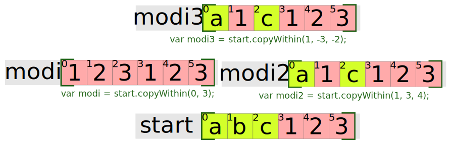

# Array

Este o funcție Constructor existentă în limbaj.

## Metode aplicabile obiectului Array

| to               | încărcare/descărcare | extragere/încărcare | identificare    | parcurgere/mutații | altele         | creare       |
|:-----------------|:---------------------|:--------------------|:----------------|:-------------------|:---------------|:------------ |
| toSource()       | push()               | splice()            | lastIndexOf()   | map()              | copyWithin()   | Array.from() |
| toString()       | pop()                | slice()             | indexOf()       | reduce()           |                | Array.of()   |
| toLocaleString() | shift()              | concat()            | find()          | reduceRight()      | entries()      | |
|                  | unshift()            |                     | findIndex()     | filter()           | includes()     | |
|                  | fill()               |                     | keys()          | some()             |                | |
|                  |                      |                     | Array.isArray() | every()            |                | |
|                  |                      |                     | sort()          | copyWithin()       | [@@iterator]() | |


## Arrray.prototype.join() - nu afectează array-ul

Concatenează elementele unui array într-un string a cărui carater de separare poate fi setat.

```js
var a = ['Wind', 'Rain', 'Fire'];
var myVar1 = a.join();      // assigns 'Wind,Rain,Fire' to myVar1
var myVar2 = a.join(', ');  // assigns 'Wind, Rain, Fire' to myVar2
var myVar3 = a.join(' + '); // assigns 'Wind + Rain + Fire' to myVar3
var myVar4 = a.join('');    // assigns 'WindRainFire' to myVar4
```

## Arrray.prototype.concat() - nu afectează array-ul

Realizează o „copie simplă” (shallow copy) formată din elementele array-ului asupra căruia se invocă metoda și elementele care se doresc a fi adăugate.

Elementele array-urilor originale sunt copiate în noul array format respectându-se următoarele reguli:
- în cazul obiectelor sunt copiate referințe către acestea, nu obiectele în sine. Dacă un obiect referențiat este modificat, se va reflecta în array-ul original și cel nou format.
- în cazul șirurilor și numerelor, acestea vor fi copiate în noul array. Modificarea valorilor din array-urile originale nu se vor răsfrânge în cel nou constituit.


Se poate chiar construi o funcție concat folosind slice, dar care să facă concat pe argumentele pasate.

```js
function concat () {
  return Array.prototype.slice.call(arguments).join(' ');
}
var sirNou = concat('ceva', 'text', 'pentru', 'a', 'fi', 'unit')
console.log(sirNou);
```

## Arrray.prototype.slice() - nu afectează array-ul

Slice în limba engleză se referă la a tăia, la a decupa, la a extrage o bucată. Pentru a înțelege slice, cel mai bine este să vă imaginați un croitor care măsoară stofa cu un centimetru, face semne pentru bucata pe care o dorește și apoi taie materialul.

Slice pentru array-uri este o metodă care returnează un nou array. Acesta este o copie a unei porțiuni delimitate prin argumentele pasate. Slice nu alterează array-ul original în niciun fel.

Ca parametri acceptă:
- indexul de la care să pornească.
- indexul la care să se oprească

Dacă indexul de pornire este o valoare negativă, atunci se va porni de la finalul array-ului spre indexul 0. Dacă nu este menționat indexul (`undefined`), atunci `slice` pornește de la 0. Dacă nu se menționează capătul, atunci va „tăia” până la capăt.

ATENȚIE! Slice se duce până la limita menționată, dar nu include și valoarea de la indexul menționat.

Menționarea unui index negativ indică limita către coada listei. De exemplu, un slice(2, -1), va extrage începând cu al treilea element până la penultimul element.

Această metodă este folosită și pentru a converti obiecte care seamănă cu array-urile în Array-uri noi. Pur și simplu se face un binding al metodei la obiect. Cel mai folosit exemplu este cel al folosirii lui slice() pentru a transforma `arguments` într-un array:

```js
var converteste = function(){
  return Array.prototype.slice.call(arguments);
};
var unArrayNou = converteste(1, "ceva", 23); // Array [ 1, "ceva", 23 ]
```

În loc de `Array.prototype.slice.call(arguments)` se poate folosi pur și simplu `[].slice.call(arguments)`.

```js
var converteste = function(){
  return [].slice.call(arguments);
};
var unArrayNou = converteste(1, "ceva", 23); // Array [ 1, "ceva", 23 ]
```


## Arrray.prototype.splice() - afectează definitiv

Elimină elementele din intervalul de indecși menționat și opțional introduce ceva între.

Dacă indexul de start este negativ, acesta se va scădea din length pentru a determina valoare indexului de start. De exemplu, dacă indexul este -1, atunci operațiunea de splicing începe de la array.length - 1, adică chiar ultimul element în acest caz. Dacă al doilea argument care indică câte elemente să fie scoase este omis, atunci se vor scoate toate elementele pornind cu indexul de start inclusiv.

```js
var tablou = ["unu", "doi", "trei", "patru", "cinci"];
tablou.splice(-2);   // Array [ "patru", "cinci"]
console.log(tablou); // Array ["unu", "doi", "trei"]
```


## Array.from() - ECMAScript 2015

Creează o instanță ``new Array`` din orice obiect care arată ca un array sau care iterabil.
Obiectele din care se creează array-urile trebuie să aibe o lungime și elemente indexate.

```js
function f() {
  return Array.from(arguments);
}

f(1, 2, 3);
// [1, 2, 3]

// String
Array.from("foo");
// ["f", "o", "o"]
```

`Array.from()` are trei argumente:

- obiectul iterabil pe care vrei să-l transformi
- o funcție de mapping, care să fie apelată pentru fiecare dintre elementele din input
- `this` necesar la apelarea funcției de mapare.

Cu Array.from() nu se poate face slice(), dar poți să indici ce sunt părțile: dice!

```js
function ceEste(){
  return Array.from(arguments, valoare => typeof valoare);
};
ceEste("ceva", null, true, undefined, NaN, 23);
```

Polyfill - ul pentru ES5 arată astfel:

```js
function transforma (){
  return Array.prototype.slice.call(arguments);
}
transforma('a', 'b'); // <- ['a', 'b']
```
iar forma și mai scurtă:

```js
function transforma(){
  return [].slice.call(arguments);
};
```

Un operator nou introdus de ECMAScript 2015 care face același lucru. Este vorba despre operatorul spread. Acest operator folosește protocolul de iterare ceea ce înseamnă că obiectele pe care dorim să le transformăm, trebuie să aibe implementat @@iterator prin intermediul lui Symbol.iterator. `arguments` are deja implementat protocolul de iterare în ECMAScript 2015.

```js
function transforma(){
  return [...arguments];
};
transforma("unu","doi",3); // Array [ "unu", "doi", 3 ]
```

ATENȚIE! Operatorul spread se bazează pe existența implementării protocolului de iterare, pe când `Array.from()`, nu se bazează doar pe acesta. Această metodă are capacitatea de a procesa și structuri de date „array-like”.

De exemplu, jQuery la momentul redactării acestui material, nu are implementat protocolul de iterare, dar produce o structură „array-like”:

```js
Array.from($('div')); // în unele cazuri: Array.from(jQuery('div'));
```

## Array.isArray()

Este testat un obiect pentru a vedea dacă este un array.

```js
var test = ['unu', 'doi', 'trei', 'patru'];
Array.isArray(test); // true
```

## Array.of()

Metoda creează o instanță `new Array` cu un număr variabil de argumente indiferent de numărul sau tipul argumentelor.

Diferența dintre metoda Array.of() și constructorul Array este în felul în care sunt gestionate argumentele ca numere întregi. Array.of(42) creează un array cu un singur element în vreme ce Array(42) creează un array cu 42 de elemente.

## Arrray.prototype.shift() - afectează definitiv

Scoate primul element din array și-l returnează.
Dacă `length` este 0 este returnat `undefined`. `shift()` este generic și funcționează pe orice seamănă cu un array folosind call sau apply.

## Arrray.prototype.unshift() - afectează definitiv

Introduce un element sau mai multe în array chiar în cap. `unshift()` este generic și funcționează pe orice seamănă cu un array folosind call sau apply.

## Arrray.prototype.push() - afectează definitiv

Adaugă la finalul array-ului unu sau mai multe elemente.
ATENȚIE! Returnează noul `length` al array-ului.

Același efect îl poți obține folosind `apply()`.

### Merging de array

```js
var tabel1 = ['veverita', 'liliac'];
var tabel2 = ['fluture', 'cărăbuș'];

Array.prototype.push.apply(tabel1, tabel2);
console.log(tabel1); // Array [ "veverita", "liliac", "fluture", "cărăbuș" ]
```

## Arrray.prototype.pop() - afectează definitiv

Scoate din array ultimul element și îl returnează. `pop()` este generic și funcționează pe orice seamănă cu un array folosind call sau apply.

## Arrray.prototype.copyWithin()

Această metodă copiază o secvență de elemente din array și le inserează în același array la o poziție specificată suprascriind valorile existente.
Obiectele vor fi copiate începând de la indexul specificat de al doilea parametru cu limita menționată de cel de-al treilea parametru.
Cel de-al treilea argument este opțional și în lipsa lui secvența de valori va conține tot restul array-ului.



## Arrray.prototype.entries()

Returnează un obiect care poate fi iterat.

```js
var arr = ['a', 'b', 'c'];
var eArr = arr.entries(); // acesta este un Iterator

console.log(eArr.next().value); // [0, 'a']
console.log(eArr.next().value); // [1, 'b']
console.log(eArr.next().value); // [2, 'c']
```

## Arrray.prototype.every()

Metoda testează dacă elementele din array trec un test care se face printr-un callback.

Funcția de test poate primi trei argumente:
- valoarea curentă (obligatoriu) - elementul care este procesat,
- indexul (opțional) - indexul elementului care este procesat,
- array-ul pentru care ``every`` a fost invocat.

Pe lângă argumente, poate seta ``this`` diferit.

Metoda every execută callback-ul pentru fiecare element al array-ului până când returnează o valoare cu valoare de fals (falsy - valoare care transformată în Boolean este false). Odată întâlnit un astfel de element, every va returna ``false`` imediat. Callback-ul va fi invocat doar pentru elementele care au valori.

``every`` nu modifică array-ul pentru care este apelată.

```js
function isBigEnough(element, index, array) {
  return element >= 10;
}
[12, 5, 8, 130, 44].every(isBigEnough);   // false
[12, 54, 18, 130, 44].every(isBigEnough); // true
```

## Arrray.prototype.fill()

Umple un array cu o valoare fixă.

```js
[1, 2, 3].fill(4);               // [4, 4, 4]
[1, 2, 3].fill(4, 1);            // [1, 4, 4]
[1, 2, 3].fill(4, 1, 2);         // [1, 4, 3]
[1, 2, 3].fill(4, 1, 1);         // [1, 2, 3]
[1, 2, 3].fill(4, -3, -2);       // [4, 2, 3]
[1, 2, 3].fill(4, NaN, NaN);     // [1, 2, 3]
Array(3).fill(4);                // [4, 4, 4]
```

## Arrray.prototype.find()

Returnează valoarea căutată într-un array, dacă un element al array-ului satisface condițiile unei funcții de test. Dacă nu este găsit, este returnat undefined.

Funcția de test poate primi trei argumente:
- elementul care este procesat,
- indexul elementului care este procesat,
- array-ul pentru care ``find`` a fost invocat.

Pe lângă argumente, poate seta ``this`` diferit.

Nu modifică array-ul pentru care este apelată metoda.

```js
var inventory = [
    {name: 'apples', quantity: 2},
    {name: 'bananas', quantity: 0},
    {name: 'cherries', quantity: 5}
];

function findCherries(fruit) {
    return fruit.name === 'cherries';
}

console.log(inventory.find(findCherries)); // { name: 'cherries', quantity: 5 }
```

## Arrray.prototype.findIndex()

Este returnat indexul unui element al array-ului dacă elementul din array satisface anumite condiții de test.
În caz contrar, adică elementul nu este găsit, este returnat -1.

```js
function isPrime(element, index, array) {
  var start = 2;
  while (start <= Math.sqrt(element)) {
    if (element % start++ < 1) {
      return false;
    }
  }
  return element > 1;
}

console.log([4, 6, 8, 12].findIndex(isPrime)); // -1, not found
console.log([4, 6, 7, 12].findIndex(isPrime)); // 2
```

## Arrray.prototype.lastIndexOf()

Returnează ultimul index al unui element căutat în array. Returnează -1 dacă elementul nu există.
Opțional se poate menționa un al doilea parametru care indică indexul de unde să se facă căutarea pornind dinspre coadă.
Din start acest parametru opțional este lungimea array-ului -1.

```js
var array = [2, 5, 9, 2];
array.lastIndexOf(2);     // 3
array.lastIndexOf(7);     // -1
array.lastIndexOf(2, 3);  // 3
array.lastIndexOf(2, 2);  // 0
array.lastIndexOf(2, -2); // 0
array.lastIndexOf(2, -1); // 3
```

### Găsirea tuturor indicilor la care apare valoarea căutată

```js
var indices = [];
var array = ['a', 'b', 'a', 'c', 'a', 'd'];
var element = 'a';
var idx = array.lastIndexOf(element);
while (idx != -1) {
  indices.push(idx);
  idx = (idx > 0 ? array.lastIndexOf(element, idx - 1) : -1);
}

console.log(indices);
// [4, 2, 0]
```

## Arrray.prototype.forEach()

Execută o funcție pentru fiecare element din array.

Funcția care va fi executată poate avea trei argumente:
- currentValue; elementul din array care este procesat,
- index; indexul elementului din array care este procesat,
- array; array-ul pentru care se aplică forEach().

Opțional se mai poate pasa o valoare care să reprezinte ``this`` la executarea callback-ului.

***Este implementarea naturală a ES5 pentru utilitățile _.each și $.each din Underscore și jQuery.***

Metoda nu poate fi înlănțuită (chainable).
Spre deosebire de map() și reduce(), forEach() returnează întotdeauna ``undefined``.

```js
function logArrayElements(element, index, array) {
  console.log('a[' + index + '] = ' + element);
}

// A se nota faptul că index 2 este sărit pentru că
// nu există element la acea poziție în array.
[2, 5, , 9].forEach(logArrayElements);
// logs:
// a[0] = 2
// a[1] = 5
// a[3] = 9
```

## Arrray.prototype.includes()

Metoda verifică dacă într-un array există un anume element returnând true sau false după caz.
Se poate menționa și indexul de la care să se facă căutarea.

```js
[1, 2, 3].includes(2); // true
[1, 2, 3].includes(4);     // false
[1, 2, 3].includes(3, 3);  // false
[1, 2, 3].includes(3, -1); // true
[1, 2, NaN].includes(NaN); // true
```

## Arrray.prototype.indexOf()

Returnează primul index pentru primul element care se potrivește cu cel căutat.
Dacă nu este găsit, este returnat -1.
Căutarea se face folosind egalitatea strictă ( === ).
Se poate menționa și indexul de la care să se facă căutarea.

```js
var array = [2, 9, 9];
array.indexOf(2);     // 0
array.indexOf(7);     // -1
array.indexOf(9, 2);  // 2
array.indexOf(2, -1); // -1
array.indexOf(2, -3); // 0
```

### Caută și scoate unde apare și se repetă un element.

```js
var indices = [];
var array = ['a', 'b', 'a', 'c', 'a', 'd'];
var element = 'a';
var idx = array.indexOf(element);
while (idx != -1) {
  indices.push(idx);
  idx = array.indexOf(element, idx + 1);
}
console.log(indices);
// [0, 2, 4]
```

### Căutarea unui element în array, iar dacă nu există, introducerea acestuia

```js
function adaugLaArray(arrayDeOrigine, elementDeIntegrat){
  if(arrayDeOrigine.indexOf(elementDeIntegrat) === -1){
    arrayDeOrigine.push(elementDeIntegrat);
  } else if (arrayDeOrigine.indexOf(elementDeIntegrat) > -1){
    console.log(elementDeIntegrat + ' deja există în colecție');
  }
};

var unelte = ["ciocan", "nicovală", "clești", "foarfeci"];

adaugLaArray(unelte, 'foale');
adaugLaArray(unelte, 'ciocan');

unelte; // Array [ "ciocan", "nicovală", "clești", "foarfeci", "foale" ]
```

## Arrray.prototype.map()

Metoda creează un nou array care cuprinde rezultatele rezultate din executarea unei funcții callback pentru fiecare dintre elementele acestuia.

Callback-ul primește trei argumente:
- currentValue - elementul procesat,
- index,
- array.

Opțional se mai poate pasa o valoare care să reprezinte ``this`` la executarea callback-ului.

``map()`` construiește un array nou din rezultate.

Callback-ul este invocat doar pentru indexurile care au valori chiar dacă sunt `undefined`.

Un exemplu super privind ce se poate obține folosind metoda este construirea unui mic utilitar care să transforme valorile unui obiect într-un șir url-encoded.

```js
var obiect = {paraunu: "unu", paradoi: "doi trei"};

var stringCodat = Object.keys(obiect)
                        .map(function(key){
                          return key + "=" + window.encodeURIComponent(obiect[key]);
                        })
                        .join("&");

console.log(stringCodat); // paraunu=unu&paradoi=doi%20trei
```

## Arrray.prototype.filter()

Returnează un array care conține valori ce au trecut de verificările unei funcții callback.

```js
var data = [ "bar", "foo", "", 0 ],
    filtered = data.filter(function( item ){
      return !!item;
    });
console.log( filtered ); // ["bar", "foo"]
```

## Arrray.prototype.sort() - afectează definitiv

Sortează elementele unui array și returnează acel array.
Dacă nu este pasat un argument, de fapt o funcție care să îndeplinească sortare, aceasta se va face prin compararea codurilor de caractere Unicode.

Pentru șiruri funcția de comparare poate fi astfel:

```js
// atenție, acesta este pseudocod
function compare(primulCaracter, aldoileaCaracter) {
  if (primulCaracter este mai mic decât aldoileaCaracter folosind un criteriu de ordonare) {
    return -1;
  }
  if (primulCaracter este mai mare decât aldoileaCaracter folosind un criteriu de ordonare) {
    return 1;
  }
  // primulCaracter trebuie să fie egal cu aldoileaCaracter
  return 0;
}
["c", "a", "d"].sort(compare);
```

### Compararea și sortarea numerelor

```js
[-23, -2, 102, 3, -54].sort(function(x, y){
  if(x < y){return -1}; // sortează x comparativ cu y, dacă x este mai mic decât y, pune-l pe x pe un index mai mic decât y: se deplasează spre stânga.
  if(x > y){return 1};  // dacă y este mai mic decât x, acordă un index mai mic.
  return 0;             // dacă valorile sunt sortate lasă neschimbată poziția unuia față de celălalt.
});                     // Array [ -54, -23, -2, 3, 102 ]
```

Se poate condensa folosindu-se operatorul ternar:

```js
[-23, -2, 102, 3, -54].sort(function(x, y){
  return x < y ? -1 : ( x > y ? 1 : 0 );
});
```

O altă variantă de comparator pentru numere este pur și simplu scăderea unuia din celălalt:

```js
[-23, -2, 102, 3, -54].sort(function(x,y){
  return x - y;
}); // Array [ -54, -23, -2, 3, 102 ]
```

Și obiectele pot fi sortate dacă este dată o valoare a uneia dintre proprietăți.

```js
var colectie = [
  {nume: 'Gina', valoare: 20},
  {nume: 'Dobrin', valoare: 16},
  {nume: 'Sanda', valoare: -12},
  {nume: 'Nicolae', valoare: 40},
  {nume: 'Pavel', valoare: -6}
];

// sortare după o valoare arbitrară
colectie.sort(function(x,y){
  if(x.valoare > y.valoare){return 1};
  if(x.valoare < y.valoare){return -1};
  return 0;
});

// sortare după o valoare text
colectie.sort(function(x,y){
  var numeX = x.nume.toUpperCase(); // uniformizezi caracterele
  var numeY = y.nume.toUpperCase();
  if(numeX < numeY){return -1};
  if(numeX > numeY){return 1};
  return 0;
});
```

## Arrray.prototype.reverse() - afectează definitiv

Inversează ordinea dintr-un array și returnează o referință către array-ul modificat definitiv.

```js
var tablou = ["unu", "doi", 3];
tablou.reverse(); // Array [ 3, "doi", "unu" ]
```

## Arrray.prototype.reduce()

Este o metodă care returnează produsul valorilor dintr-un array. Metodei i se dă un array, o funcție callback și o valoare opțională pentru a fi folosită la prima invocare.

Funcția callback primește patru argumente și se va aplica pe fiecare element al array-ului:
- previousValue: este valoarea returnată de invocarea anterioară a callback-ului. Poate fi valoarea de la care se pornește dacă o astfel de valoare este dată (initialValue).
- currentValue: este elementul curent din array care este procesat.
- currentIndex: indexul elementului care tocmai este procesat.

Pe lângă callback mai poți da o valoare opțională, iar aceasta va fi folosită ca prim argment la prima invocare a callback-ului.
Dacă nu este dată o valoare inițială previousValue va fi prima valoare din array iar currentValue va fi cea de-a doua din array. Numai dacă este dată initialValue, aceasta devine previousValue.

Dacă array-ul este gol și nu este dată o valoare de pornire initialValue, atunci va fi emisă o eroare TypeError.
Dacă array-ul are o singură valoare indiferent de poziția acesteia și nu este oferită o valoare initialValue sau dacă initialValue este dată, dar array-ul este gol, atunci valoarea unică va fi returnată fără a fi invocat callback-ul.

```js
[0, 1, 2, 3, 4].reduce(function(previousValue, currentValue, currentIndex, array) {
  return previousValue + currentValue;
}); // 10
```

|                  | previousValue | currentValue  | previousIndex | array           | valoarea returnată  |
| :--------------- | :------------ | :------------ | :------------ | :-------------- | :------------------ |
| prima invocare   | 0             | 1             | 1             | [0, 1, 2, 3, 4] | 1                   |
| a doua invocare  | 1             | 2             | 2             | [0, 1, 2, 3, 4] | 3                   |
| a treia invocare | 3             | 3             | 3             | [0, 1, 2, 3, 4] | 6                   |
| a patra invocare | 6             | 4             | 4             | [0, 1, 2, 3, 4] | 10                  |

Rezultatul lui reduce este la final 10.

Varianta ES6 a aceleiași funcții reduce arată astfel:

```js
[0, 1, 2, 3, 4].reduce( (prev, curr) => prev + curr );
```

Dacă s-ar oferi o valoare inițială ca al doilea argument:

```js
[0, 1, 2, 3, 4].reduce(function(previousValue, currentValue, currentIndex, array) {
  return previousValue + currentValue;
}, 10);
```
|                  | previousValue | currentValue  | previousIndex | array           | valoarea returnată  |
| :--------------- | :------------ | :------------ | :------------ | :-------------- | :------------------ |
| prima invocare   | 10            | 0             | 0             | [0, 1, 2, 3, 4] | 10                  |
| a doua invocare  | 10            | 1             | 1             | [0, 1, 2, 3, 4] | 11                  |
| a treia invocare | 11            | 2             | 2             | [0, 1, 2, 3, 4] | 13                  |
| a patra invocare | 13            | 3             | 3             | [0, 1, 2, 3, 4] | 16                  |
| a patra invocare | 16            | 4             | 4             | [0, 1, 2, 3, 4] | 20                  |

Însumarea valorilor dintr-un array:

```js
var total = [0, 1, 2, 3].reduce(function(a, b) {
  return a + b;
}); // total 6
```

### Aplatizarea unui array de array-uri:

```js
var plat = [[0, 1], [2, 3], [4, 5]].reduce(function(a, b) {
  return a.concat(b);
}, []);
// flattened is [0, 1, 2, 3, 4, 5]
```

```js
var texte = [["Gică", "Georgică"], "Abramburica", ["Nadia", "Ana"]].reduce(function(previousValue, currentValue, currentIndex, array){
  return previousValue.concat(currentValue);
}, []);
texte ; // Array [ "Gică", "Georgică", "Abramburica", "Nadia", "Ana" ]
```

Există în ECMAScript 2015 conceptul de `rest parameters`, adică o sintaxă ce permite extragerea unui Array din argumentele pasate unei funcții. Această sintaxă constă în adăugarea unui nume de parametru prefixat de trei puncte de suspensie. Această sintaxă generează un Array adevărat, nu un array-like așa cum este `arguments`.

Un exemplu de transformare a funcționalității unei funcții construite clasic, care foace suma tuturor argumentelor (`arguments`) cu excepția primului, care va fi folosit drept multiplicator pentru suma obținută. Acest exemplu este oferit de Nicolás, un consultant JavaScript din Buenos Aires, Argentina în explicarea conceptelor noi pe care le introduce ECMAScript 2015 - [ES6 Spread and Butter in Depth](https://ponyfoo.com/articles/es6-spread-and-butter-in-depth)

```js
function faSumaSiDubleaza(){

  var setNumere = Array.prototype.slice.call(arguments); // constituie array-ul transformand arguments; slice „taie” de la 0 până la capăt

  var multiplicator = setNumere.shift();                 // setarea cifrei care va reprezenta multiplicatorul
  var referinta = setNumere.shift();                     // reținerea primei cifre din array

  var insumare = setNumere.reduce( (previousValue, currentValue) => previousValue + currentValue, referinta );

  return multiplicator * insumare;
};

var total = faSumaSiDubleaza(34,10,2,30,12);

console.log(total);
```

## Arrray.prototype.values()

Returnează un nou obiect `Array Iterator`, care conține valorile pentru fiecare index din array.
La momentul redactării materialului spuportul este limitat. Doar Chrome.

```js
// testează doar în Chrome
var colectie = ["unu", "doi", "24", {unu: 1}];
var iterabil = colectie.values();

for(let elem of iterabil){
  console.log(elem);
};
```

## Arrray.prototype[@@iterator]()

Valoarea inițială a lui `@@iterator` este același obiect funcție ca și valoarea inițială a proprietății value().

## Menționarea resurselor folosite pentru documentare:
[MDN>Web technology for developers>JavaScript>JavaScript reference>Standard built-in objects>Array](https://developer.mozilla.org/en-US/docs/Web/JavaScript/Reference/Global_Objects/Array?redirectlocale=en-US&redirectslug=JavaScript%2FReference%2FGlobal_Objects%2FArray)
