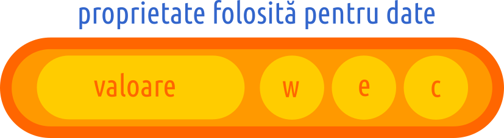
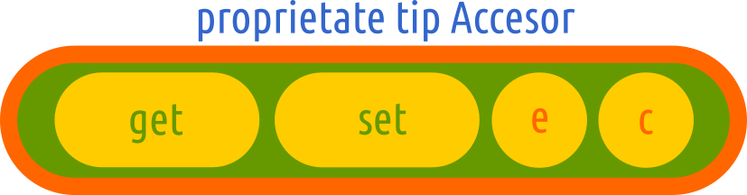

# Obiecte

## Ce sunt obiectele?

Standardul spune că **un obiect este un membru al tipului built-in Object** al limbajului.

Pentru a realiza natura limbajului de programare JavaScript, care este unul orientat pe obiecte, vom cita standardul din nou care aduce următoarea lămurire:

> ECMAScript este bazat pe obiecte: limbajul de bază și toate funcționalitățile sunt oferite de obiecte iar un program ECMAScript este un ciorchine de obiecte care comunică.

Obiectele sunt și ele valori. Aceste valori sunt pasate prin referință în contrast cu valorile primare care sunt pasate prin valoare. Ceea ce doresc să subliniez pentru a reține ca regulă generală este că atunci când trimitem ca argument identificatorul unui obiect, nu trimitem obiectul în sine, ci o referință către acesta. O adresă! Obiectele sunt structuri de date dinamice ale căror proprietăți se modifică și atunci spunem că obiectul își modifică starea. Reține faptul că atunci când pasezi un obiect unei funcții pentru a opera asupra datelor sale, trebuie la final să returnezi referința către obiect pentru a-i modifica starea.

Tot la standard vom apela pentru a lămuri natura unui obiect. Obiectele sunt:

> colecții de zero sau mai multe proprietăți fiecare având atribute care determină cum poate fi folosită.

Mai departe, părțile componente, mai exact proprietățile trebuie înțelese ca niște:

> containere care pot conține alte obiecte, valori primitive sau funcții.

Atunci când un obiect este creat, toate caracteristicile sale sunt moștenite de la un alt obiect cu rol de prototip. Să nu vi se pară ciudat că un prototip este un obiect, iar acesta la rândul lui are un prototip. E ca un lanț care are drept limită superioară obiectele interne `Object` și `Function`.

Pentru că ești nerăbdătoare am să-ți dau două indicii privind crearea obiectelor. Poți folosi notația literală folosind acoladele ca în `var obiect = {a: 1}` sau poți apela cu operatorul `new` funcții cu rol de constructor. Aceste două metode sunt și cel mai des întâlnite. O regulă de scriere care este foarte utilă este aceea că toate valorile text, vor fi introduse în obiecte cu textul între ghilimele simple, iar restul valorilor așa cum sunt ele. Proprietățile se redactează precum listele, fiind delimitate prin virgulă.

```javascript
var obi = {
  a: 'ceva text',
  b: true,
  c: 10
};
```
Exemplul oferit înfățișează cea mai uzitată notație pe care o numim notația literală: `var obi = {};`. Acum poți să-ți pui o întrebare foarte simplă: cât timp „trăiește” un obiect? Un obiect trăiește atâta vreme cât există o referință către acesta.

Am menționat constructorii deja?

## Ce sunt constructorii?

Constructorii sunt niște funcții, care sunt redactate special ca la momentul execuției, să genereze un obiect. După cum am văzut în capitolul dedicat genezei Tărâmului, atunci când s-au format **intrinsics**, a fost creat și obiectul prototip al tuturor obiectelor, care o fracțiune mai târziu a fost folosit pentru crearea obiectului-funcție ce va juca rolul de prototip al tuturor funcțiilor. Un mic exemplu nu ar strica.

```javascript
function MatrițăAvionVuiaI (tip = 'experimental', an = '1906') {
  this.nume = 'Vuia 1';
  this.deschidereAripi = 4; // în metri
  this.distanțăMaximă = 0.012; // în kilometri
};
var VuiaI = new MatrițăAvionVuiaI();
console.log(VuiaI);
// { nume: 'Vuia 1', deschidereAripi: 4, 'distanțăMaximă': 0.012 }
```

Atunci când un obiect este instanțiat folosindu-se operatorul `new` așa cum am făcut și noi în exemplu, se va genera automat o proprietate numită `constructor`, care indică funcția care a generat obiectul.

JavaScript este un univers al obiectelor care sunt generate de constructori sau prin folosirea notației literale așa cum deja am văzut la capitolul dedicat valorilor. Dacă avem deja o ideea despre notația literală, trebuie să lămurim natura constructorilor. Aceștia sunt pur și simplu niște funcții care au o proprietate numită `prototype`. Această proprietate este un obiect care prin însăși existența sa face posibilă moștenirea prototipală. De ce există această proprietate în funcția-obiect care este constructorul? Pentru că în cazul apelării folosind operatorul `new`, se va genera legătura prototipală.

Este astfel asigurat accesul la proprietăți pe care obiectul creat la apelararea funcției constructor cu operatorul `new` le pune la dispoziție de la bun început fără a fi fost setate la nomentul creării.

Ceea ce mai trebuie să știi din start despre constructori este că la apelarea cu operatorul `new`, generează obiectul și apoi execută codul. Nu uita că un constructor este totuși o funcție. Execuția codului dintr-un constructor are ca efect asignarea proprietăților inițiale ale obiectului nou creat. Invocarea unui constructor fără operatorul `new` are efecte diferite pentru fiecare dintre aceștia.

**Spune standardul**: *Fiecare obiect creat de un constructor are o referință implicită (numită prototipul obiectului) către valoarea proprietății «prototype» a constructorului*.

Mai mult de atât fiecare `prototype` poate avea drept referință un alt `prototype`, realizându-se ceea ce se numește *lanț prototipal*. Modul de funcționare a lanțului prototipal se bazează pe un mecanism de delegare utilizat de motor atunci când se caută o proprietate a unui obiect. De exemplu, dacă vei căuta o proprietate într-un obiect, iar aceasta nu aparține obiectului, există o bună șansă să fie moștenită prin lanțul prototipal de la constructorul pe baza căruia a fost instanțiat. Astfel, se face căutarea mai departe din obiect în obiect până când proprietatea este găsită sau nu.

## Alcătuirea obiectelor

Obiectele au **proprietăți** și **metode**. Împreună formează membrii obiectului.

Proprietățile sunt valori primitive - numere, boolean-uri, șiruri de caractere, funcții sau chiar obiecte. Proprietățile **sunt ceva**! Prin contrast, metodele **fac ceva**. Metodele sunt de fapt niște funcții. Un aspect care vă va face viața ușoară odată înțeles este acela că toate funcțiile definite în obiectul global, de fapt, devin automat metode ale acestuia, adică lui `window` în cazul browserelor.

Hai să facem un obiect. Vă mai aduceți aminte de la valori că obiectele pot fi exprimate literal prin precizarea unei simple perechi de acolade.

```javascript
// un object literal
var obi = {a: 10, b: 20};
```

Începând cu ECMAScript 2015 se poate folosi și notația prescurtată.

```javascript
var unu = 1, este = true; // în loc de
var obi = {unu: unu, este: este}; // putem scrie mai concis
var obi = {unu, este}; // efectul este același
console.log(obi); // {"unu":1,"este":true}
```

**Moment ZEN**: Obiectele pot fi privite ca array-uri asociative pentru că poți accesa valoarea folosind notația cu paranteze drepte: `obi['b']`.

Proprietățile pot fi adăugate dinamic unui obiect deja existent fără a fi nevoie să mergi la constructorul său pentru a le adauga acolo. Am menționat deja un concept foarte important: constructor. Pe cât de pretențios sună, pe atât de simplă este misiunea sa: o funcție care să genereze un obiect. Vom trata distinct și în amănunt constructorii.

```javascript
function Constructorul () { this.ceva = 1; };
var obi = new Constructorul();
console.log(obi); // {"ceva":1}
obi.altceva = 10;
console.log(obi); // {"ceva":1,"altceva":10}
```

Acest mod de a adăuga proprietăți noi fără a interveni asupra constructorului este unic și este o marcă a limbajului de programare JavaScript.

## Categorii de obiecte

În textul standardului, obiectele se încadrează următoarelor categorii:

- „Ordinary object” (*obiecte comune*), care au comportamentul comun tuturor obiectelor în JavaScript.
- „Exotic object” (*obiecte exotice*), care au comportamentul comun obiectelor în JS, dar cu mici diferențe.
- „Standard objects” (*obiecte standard*) sunt toate obiectele JS. Obiectele „ordinary” și cele „exotice” fac parte din setul obiectelor standard.
- „Built-in objects” (*obiecte interne*) sunt toate obiectele pe care le expune din start motorul de JavaScript. Toate obiectele comune (*ordinary*) fac parte din setul celor interne.

## Obiecte interne (*built-in*)

Am menționat că JavaScript vine din start cu obiectele care se numesc „built-in object”, pe care le-am tradus ca **obiecte interne** limbajului. Pentru a avea acces la ele nu-i nevoie să faci ceva. Pur și simplu ele sunt acolo deja, gata de a fi folosite. Există un detaliu pe care aș dori să-l remarcați cu atenție. `Obiectul global` este parte a obiectelor interne. Am putea concluziona că `obiectul global` plus `obiectele standard` constituie setul mare al celor `interne`. O nuanță pe care trebuie să o fi realizat deja este aceea că obiectul global nu este containerul tuturor obiectelor oricât de tentant ar fi să-l imaginăm astfel. Dar este „containerul”, dacă vrei să-l închipui astfel, al întregului cod pe care-l scrii tu și al entităților care se formează la momentul evaluării acestuia.

### Metodele obiectelor interne

Modul în înțelegem un obiect este determinat și de un set de algoritmi care sunt oferiți de orice motor care implementează standardul ECMAScript. Acești algoritmi sunt numiți `metode interne`. Metodele interne definesc comportamentul la momentul în care este rulat codul pentru acel obiect. Reține faptul că aceste metode interne cad în responsabilitatea celor care fac implementarea unui motor de JavaScript. Reține acest aspect pentru a nu fi surprins când vei auzi sau citi discuții despre performanțele unui anume motor în comparație cu altul. Aceste metode interne, sunt toate procesele care se petrec în inima unui motor atunci când, de exemplu, apelezi o metodă a unui obiect intern cum ar fi `Object.create()` sau `String.split()`. Aceste adevărate biblioteci de cod scrise în alte limbaje de programare precum C++ sau Rust sunt, de fapt executanții „comenzilor” pe care noi le scriem în JavaScript. De aici și atributul pus acestui limbaj ca fiind de scripting. Un script fiind un set de instrucțiuni, care la momentul execuției angajează adevărate biblioteci de cod precompilate în limbaje de programare de nivel mai jos sau chiar binare, care comunică 1 și 0 direct cu mașina noastră. Am menționat acest lucru pentru a înțelege că noi operăm la un nivel foarte înalt, iar JavaScript poate fi perceput ca pe un rețetar ce se aplică într-un mediu dedicat interpretării respectivelor rețete.

Câteva astfel de rețete oferite de limbajul nostru de programare sunt foarte utile lucrului cu obiecte. De exemplu, metoda `Object.getPrototypeOf()` returnează un obiect sau `null` și indică obiectul care oferă proprietățile moștenite, precum și pe cel asupra căruia se face interogarea cu `Object.getPrototypeOf(obiSursă)`. Returnarea lui `null` indică faptul că obiectul curent nu moștenește nicio proprietate. M-am oprit la această metodă pentru că obiectele prototip sunt pivoții pe care se realizează mecanismul de moștenire în JavaScript.

Aceste metode, de fapt, aceste **rețete** prestabilite, pot fi și ele alterate pentru că în flexibilitatea JavaScript permite chiar modificarea rețetelor originale (vezi obiectul intern `Reflect`). Este ca și cum ai modifica o carte de bucate așa cum vrei tu după necesitățile tale. Atingerea unui astfel de nivel implică un aspect negativ, iar acesta este pierderea compatibilității cu programele scrise de restul comunității. Închipuiește-ți ce s-ar întâmpla dacă aș modifica **rețeta** `Object.setPrototypeOf()`, dar alt programator dorește o interfațare cu software-ul scris de mine, fiind bun bazat că metoda lui `Obiect` respectă comportamentul așteptat prin standard? Ar fi un haos desăvârșit. Totuși, sunt momente când mici modificări îmbunătățesc performanța sau îmbogățesc programele.

## Mantre

- ECMAScript vine cu obiectele sale din start care se numesc obiecte `built-in` în care este inclus și `global object` - obiectul global.
- Totul în JavaScript are comportamentul unui obiect cu două excepții: `null` și `undefined`.
- Toate obiectele în JavaScript descind din `Object`, adică își au originea în `Object`.
- Toate obiectele moștenesc metode și proprietăți din `Object.prototype`, iar acestea pot fi suprascrise sau poți adăuga propriile proprietăți și metode.
- În cazul tuturor funcțiilor, motorul JavaScript generează un obiect prototype (numeFunctie.prototype). Acest obiect (prototype), este gol și este creat de constructorul lui `Object()`.
- Fiecare funcție obiect are un obiect prototip diferit.
- Un obiect poate fi creat cu `new Object()`:
  1. acestă modalitate **nu va crea și constructor**.
  2. Accesarea `numeObiect.__proto__.constructor` răspunde cu `function Obiect()` la care s-a ajuns prin delegare.
- O funcție apelată cu `new` în fața sa este un constructor.
- Obiectele pot moșteni alte proprietăți direct din alte obiecte.
- Când introduci o proprietate nouă într-un obiect care generează prototipul pentru alte obiecte, obiectele legate prin lanțul prototipal, vor moșteni noile proprietăți.
- [\[Prototype]], adică proprietatea `prototype` este o legătură internă, care se stabilește de la un obiect la altul. Pentru aflarea prototipului se apelează `Object.getPrototypeOf(obiect)`.
- Un obiect literal are prototype `undefined`. Cu toate acestea la interogare cu `instanceof` trimite la Object.
- Legătura prototipală se poate obține și prin utilizarea metodei `Object.create()`, având două efecte:
  1. **creează un obiect**,
  2. **stabilește legătura prototipală**.
- Legătura prototipală creează un lanț de delegare pentru cazurile în care nu găsești o proprietate sau o metodă într-un anumit context de execuție.
- Obiectele cu un prototip și proprietăți prestabilite, se pot construi cu `Object.create(obi, {exemplu: 'proprietate'})`.
- Metodele nu fac parte din obiect; referința către acestea este parte a obiectului.
- Relațiile prototipale pot cauza probleme atunci când este nevoie de enumerarea proprietăților obiectelor.
- Dacă dorești „înghețarea” obiectelor pentru a nu fi modificate, se va folosi `Object.freeze()`.

## Crearea obiectelor

Obiectele pot fi create în două feluri: prin declararea acestora sau prin construirea lor.

1. `var ObiNou = new Object();` la execuție cu `new` se respectă cele patru reguli: (1) crearea obiectului; (2) stabilirea lanțului prototipal; (3) legarea lui `this` la noul obiect; (4) obiectul nou creat este returnat. Sintaxa este echivalentă cu `var newObj = {}`.
2. `var ObiNou = Object.create(null);`, unde `prototype` este setat la `null`. Acest model este supranumit `dict pattern`, adică șablonul de creare a unui dicționar.
3. `var ObiNou = Object.create(Object.prototype);`, fiind echivalent sintaxei `var newObj = {}`.
4. `var ObiNou = {};`, fiind echivalentă cu sintaxa `new Object()`.
5. `function x () { return {a: 1} }; var y = x();`, returnează un obiect în urma execuției unei funcții.

Toate variantele au același efect: creează un obiect gol.

Atenție, obiectele create cu `new` și cu `Object.create(null)` nu au constructor. Proprietatea `.constructor` va trimite la funcția la care a fost atașat `prototype` la momentul declarării. Am amintit de șablonul **dict**, o prescurtare de la dicționar. Câteva lămuriri sunt necesare. Acum câțiva ani, nu aveam la îndemână obiectele interne `Map` și `Set`, iar programatorii trebuiau să găsească o alternativă pentru obiecte, care să fie folosite precum un siloz, mai corect precum un dicționar

Am zis dicționar pentru că ajută până și sintaxa la asemănarea cu unul (**cuvânt cheie: valoare**). Astfel, folosindu-se `Object.create(null)` puteai crea un obiect fără legătură prototipală ceea ce ar fi complicat lucrurile prin apariția multor alte valori moștenite în anumite scenarii. Ceea ce rămânea era o structură care putea fi folosită precum un **dicționar**.

Modalitatea de a crea obiecte care implică returnarea unui obiect la executarea unei funcții constituie un tipar foarte des întâlnit în practica de programare. Acest model, șablon, tipar, spune-i cum îți place pentru că englezii îi spun **pattern**, se comportă ca o mică făbricuță de făcut obiecte. De fiecare dată când o astfel de funcție va fi apelată, tot atâtea obiecte vor fi returnate.

```javascript
function Făbricuță (valoarea) {
  // voi folosi notația prescurtată ES6 pentru a scrie obiectul
  return {
    a: 1,
    valoarea
  };
};
// inițiem două colecții ca să fie mai amuzant de urmărit
// una cu valori pentru care se creează Obiectele
// pentru că vom introduce valoarea fiecărui index într-un obiect
// si a doua care va fi containerul în care încărcăm cu push
// obiectele generate de Făbricuță
var colTest = ["x", "y", "z"], colObi = [];
for (let i = 0; i < colTest.length; i++) {
  colObi.push(Făbricuță(colTest[i]));
};
colObi[0];
```

Am făcut un pas important către înțelegerea unei perspective lărgite asupra limbajului. Datele sunt așezate și sunt structurate în diferitele tipuri de agregări necesare unor scenarii diferite aplicate la anumite momente ale execuției unui program.

## Membrii obiectului

### Proprietățile unui obiect

Proprietățile obiectului sunt datele pe care dorim să le organizăm cu acel obiect și fac parte din membrii obiectului.

După ce instanțiezi un obiect, ai nevoie să-l faci funcțional populându-l. Putem să ne imaginăm un obiect ca pe un container pentru un set de lucruri ce stabilesc împreună un sens, o unitate proprie gata să fie prelucrată. Până la apariția noilor obiecte interne `Map` și `Set`, obiectele erau folosite și pentru a stoca date, fiind numite de programatori **dicționare**. De ce? Pentru că modul de a scrie obiectul aduce cu aranjamentul editorial al unui dicționar. Ai termenul, pui două puncte și apoi explicația. Reține pe viitor faptul că pentru a stoca date, poți folosi cu mare succes `Map` și `Set`.

#### Atributele proprietăților unui obiect

Atributele sunt folosite pentru a defini și a explica starea proprietăților unui obiect. Vom vedea că o singură proprietate a unui obiect are mai multe atribute, care pot fi manipulate pentru a realiza anumite condiții pentru datele primite și analizate în cadrul unui obiect. Proprietățile unui obiect sunt niște membri care pot fi accesați, setați și pot fi modificați pentru a putea prelua valori. Sau dimpotrivă, poți să le blochezi. Ba mai mult, poți să pui o setare prin care să interzici configurarea unei anumite proprietăți sau a tuturor proprietăților printr-o așa-zisă „înghețare” a obiectului. Am structurat atributele proprietăților după ceea ce oferă util acestea.



|Numele atributului|Valoarea returnată|Descriere|
|:-----------------|:------|:--------|
|`value`|oricare tip ECMAScript|Este valoarea obținută prin accesarea proprietății|
|`writable`|Boolean|Dacă este setat la `false`, atributul `value` nu va putea fi scris folosind `set`|
|`enumerable`|Boolean|Dacă este setat la `true`, proprietatea va putea fi enumerată într-un `for..in`|
|`configurable`|Boolean|Dacă este setat la `false`, orice încercare de a modifica atributele, de a șterge proprietate, va fi destinată eșecului. Tot ce permite este modificarea lui `value` și setarea lui `writable` la `false`.|

#### Atributele unei proprități de tip **accessor**



|Numele atributului|Valoarea returnată|Descriere|
|:-----------------|:------|:--------|
|`get`|Obiect sau `undefined`|Dacă valoarea este un obiect acesta este o funcție-obiect|
|`set`|Obiect sau `undefined`|Dacă valoarea este un obiect acesta este o funcție-obiect|
|`enumerable`|Boolean|Dacă este setat la `true`, proprietatea va putea fi enumerată într-un `for..in`|
|`configurable`|Boolean|Dacă este setat la `false`, orice încercare de modificare, va eșua|

Un exemplu practic:

```javascript
var newObj = {};
Object.defineProperty(newObj, 'numeCheieNoua', {
  value: 'Salutare',
  writable: true,
  enumerable: true,
  configurable: true
});
```

### Metodele unui obiect

O funcție care este declarată într-un obiect sau care este referențiată de o cheie a unui obiect, devine metodă și parte a membrilor acelui obiect. Atenție! este totuși o funcție în sine, o valoare, care atunci când este declarată pentru o proprietate, poate fi accesată doar prefixându-i identificatorul cu numele obiectului. Este exact ca în cazul unei adrese (`oraș: 'Corabia'`).

```javascript
var obi = {
  jeton: 10,
  faCeva: function faCeva () { console.log(this.jeton); }
};
obi.faCeva(); // 10
```

Funcția identificată prin `faCeva` este o metodă a obiectului `obi`. Identificatorul `faCeva` este de fapt o referință către funcția ce afișează în consolă valoarea lui `jeton`. Sintaxa `obi.faCeva` poate fi considerată o referință către funcție. Nu uita faptul că o funcție cu rol de metodă are setat `this` automat la obiectul a cărui metodă este sau a devenit. Am spus că „a devenit” ca posibil scenariu pentru că poți avea o funcție declarată în afara obiectului, dar pe care o asociezi unei proprietăți a unui obiect, cu scopul de a o face parte, de a face instrument de lucru pentru respectivul obiect. Folosirea unei funcții într-un obiect drept „metodă”, nu este decât apelarea unei funcții în cadrul obiectului. Nu se poate spune că obiectul „conține” funcția. Obiectul doar face o referință. Funcției cu rol de metodă i se pasează `this`, care este obiectul unde joacă rol de metodă.

Modalitatea de a crea o metodă într-un obiect este perfect echivalentă cu următoarea alternativă.

```javascript
var obi = { jeton: 10 };
obi.faCeva = function faCeva () { console.log(this.jeton); };
obi.faCeva(); // 10
faCeva(); // faCeva is not defined
```

Dar și această alternativă este perfect identică cu următoarea:

```javascript
var jeton = 1000;
var obi = { ceva: 10 };
function faCeva () { console.log(this.jeton); };
obi.faCeva = faCeva;
obi.faCeva(); // 10
faCeva(); // undefined
// e undefined pentru că JS creează automat
// variabila token in global,
// dar nu are valoare pentru ea
// sau 1000, dacă ai token declarat în global.
```

Aici este un element în plus. Funcția `faCeva` a fost declarată în obiectul global, ceea ce înseamnă că `scope`-ul său lexical se află în `global scope`. În cazul în care în global scope ar fi fost declarată valoarea `jeton`, la invocarea funcției în sine, nu ca metodă, ar fi fost adusă valoarea acesteia.

Odată cu apariția noii versiuni ECMAScript, metodele au fost definite în mod formal. Standardul definește o metodă ca fiind **o funcție care are o proprietate internă `[[HomeObject]]`**. Această proprietate indică obiectul căruia îi aparține metoda. De curând a fost introdusă o simplificare a scrierii sintaxei:

```javascript
var obi = {
  x: 10,
  faCeva () { console.log(this.x); }
};
obi.faCeva(); // 10
```

Observați faptul că declararea metodei `faCeva` s-a făcut cu notația prescurtată. Este o contragere a scrierii unei metode folosind o funcție anonimă: de la `faCeva: function () {console.log(this.x);}`, am ajuns la forma prescurtată `faCeva () { console.log(this.x); }`. În limba engleză, programatorii numesc această formă prescurtată **concise method** - *metodă prescurtată*. Ar fi bine să vă obișnuiți cu această notație pentru că o veți vedea din ce în ce mai des.

Cazul cel mai util în care prescurtările strălucesc este cel al inițializării directe a proprietăților (în engleză programatorii ver numi această tehnică **property initializer**) prin valorile parametrilor unei funcții de tip fabrică.

```javascript
function construiesteObi (unu, doi) {
  return { unu, doi };
};
var obiNou = construiesteObi(1, 2);
// Object { unu: 1, doi: 2 }
```
## Adăugarea membrilor în obiect

### Folosirea operatorul punct

Englezul îi spune **dot notation** și este cea mai facilă modalitate de a adăuga proprietăți unui obiect existent cu mențiunea ca acel obiect să nu fie înghețat sau protejat total la scriere.

```javascript
var newObj = {};            // Creează obiectul
newObj.oCheie = 'Salutare'; // Scrie proprietăți
var cheie = newObj.oCheie;  // Accesează proprietățile
```

### Folosirea sintaxei cu parante drepte

```javascript
var newObj = {};                // Creează obiectul
newObj['oCheie'] = 'Salutare';  // Scrie proprietăți
var cheie = newObj['oCheie'];   // Accesează proprietățile
```

### Folosirea metodei `Object.defineProperty()`

Această variantă de a introduce proprietăți într-un obiect este de o forță colosală pentru că astfel, poți controla atributele fiecărei proprietăți introduse.

```javascript
var newObj = {}; // Creează obiectul literal
Object.defineProperty(newObj, 'numeCheieNoua', {
  value: 'Salutare',
  writable: true,
  enumerable: true,
  configurable: true
});
```

### Folosirea metodei `Object.defineProperties()`

Această metodă este utilizată în cazul în care trebuie introduse mai multe proprietăți deodată.

```javascript
Object.defineProperties(obiNou, {
  'oCheie': {
    value: 'Salutare',
    writable: true
  },
  'oAltaCheie': {
    value: 'Ce mai faci?',
    writable: true
  }
});
```

### Proprietăți computate

Și dacă tot am introdus sintaxele binevenite ale versiunii ES6, cred că este momentul cel mai potrivit pentru a vă prezenta **proprietățile computate**. Dacă ai un obiect literal, poți să-i pui ca și cheie a proprietății o valoare tip șir (string) oferită de o variabilă, de fapt orice expresie validă care poate fi evaluată:

```javascript
var prop = 'identificator';
var comp = 'primul';
var obi = {
  [prop]: 189439,
  [comp + ' lucru']: 'o balenă'
};
console.log(obi[prop]); // 189439
console.log(obi['primul lucru']); // o balenă
```

### Getters și setters

Javascript oferă posibilitatea de a defini funcții specializate cu ajutorul cărora să poți manipula o valoare din interiorul unui obiect, fără a accesa direct, brut acea valoare prin sintaxa cu punct sau paranteze pătrate. În limba engleză **get** înseamnă să obții valoarea, iar **set**, să o introduci. Acest lucru este util atunci când lucrezi cu o colecție de valori  folosind un array, de exemplu.

```javascript
var obiect = {
  colectie: [],
  set ceva (valoare) { this.colectie[this.colectie.length] = valoare; },
  get ceva () { return this.colectie.join(', '); }
};
obiect.ceva = 10;
obiect.ceva = 'un ceva';
obiect.colectie // "un ceva, 10"

delete obiect.ceva; //true
obiect // Object { colectie: Array[2] }
```

Reține faptul că funcțiile în JavaScript sunt obiecte și că, orice funcție în JS, poate face referință la variabile definite în scope-ul extern. Înțelegerea acestui exemplu, ne indică cât de necesară este înțelegerea closure-urilor. Poți simula astfel geterii și setterii construindu-i ca parte a unui obiect returnat la execuția unei funcții. Acest mecanism permite manipularea unor valori la care altfel nu ajungi ușor sau la valori care s-a dorit să fie protejate ori ascunse, de-a dreptul.

```javascript
function unObiect () {
  var oValoare;
  return {
    set: function (modVal) { oValoare = modVal; },
    get: function () { return oValoare; },
    tip: function () { return typeof oValoare; }
  };
};
let x = unObiect();
x.get();    // undefined
x.set(10);  // undefined
x.get();    // 10
x.tip();    // "number"
```

Poți defini un setter/getter pe un obiect folosind metoda `Object.defineProperty()`.

```javascript
var obiect = { colectie: [] };
Object.defineProperty(obiect, 'ceva', {
  set: function (valoare){this.colectie[this.colectie.length] = valoare;},
  get: function () { return this.colectie.join(', '); }
});
obiect.ceva = 'test';
obiect.colectie; // [ "test" ]
```

## Accesarea membrilor unui obiect

Accesarea proprietăților se poate face folosind sintaxa cu punct și cea cu paranteză pătrată:

1. obiect.proprietate
2. obiect\["proprietate"]

Operatorul punct permite citirea proprietăților, dar încercarea de a citi o proprietate care nu există, returnează `undefined`. Dacă o proprietate nu există, aceasta va fi creată: `obiect.oProprietate = 'ceva';`.

Metodele pot fi și ele la rândul lor accesate folosind cele două tipuri de sintaxă, fie ca valori, fie ca apeluri.

1. obiect.metoda()
2. obiect\["metoda"]()

Atunci când invoci o metodă folosind notația cu punct, ai acces la proprietățile obiectului folosind cuvântul cheie `this` deoarece obiectul în cadrul căruia se execută funcția este `this`.

Pentru că sintaxa cu paranteze pătrate (`["proprietate"]`), folosește un șir de caractere (**string**), acest lucru înseamnă că o secvență de cod poate fi folosită pentru a construi valoarea acelui string, de exemplu prin concatenare. Dacă pentru accesare se va folosi orice altceva în afară de stringuri, numărul sau obiectul vor fi transformate în stringuri (folosindu-se mecanismul de coercion). ES6 introduce o nouă sintaxă care ușurează modul de constituire a numelui cheii unui obiect. Până acum, acest lucru se făcea astfel:

```javascript
var numeCheieNoua = "special";
var obi = {
  cheie1: 10,
  cheie2: "ceva"
};
obi[numeCheieNoua] = 1000;
```
ECMAScript 2015 propune următoarea sintaxă:

```javascript
var numeCheieNoua = "special";
var obi = {
  cheie1: 10,
  cheie2: "ceva",
  [numeCheieNoua]: 1000
};
// { cheie1: 10, cheie2: "ceva", special: 1000 }
```

Parcă-i familiar, nu? Dacă te uiți, mai devreme am amintit de **proprietățile computate**. Operatorul paranteză pătrată permite să faci referință către un membru printr-o expresie.

```javascript
var obiect = { unu: "primul", doi: "al doilea" };
obiect['u' + 'nu']; // "primul"
// sau
var cheieProprietate = 'doi';
obiect[cheieProprietate]; // "al doilea"
```
Acest operator permite accesarea proprietăților a căror chei nu sunt identificatori. Iată un exemplu în care poate fi un întreg fragment de text.

```javascript
var obiect = {'aceasta cheie nu este identificator': 10};
obiect['aceasta cheie nu este identificator']; // 10
```

Trebuie spus că operatorul paranteză dreaptă constrânge, transformă automat (prin **coercion**) ceea ce are în interior la string.

```javascript
var obiect = { 23: 10 };
obiect[20 + 3];
// se rezolvă adunarea și se
// face constrângere la string
```

Se pot seta și proprietăți folosind notația paranteză pătrată la fel ca în cazul operatorului cu punct:

```javascript
var obiect = { unu: 1 };
obiect['doi'] = 2;
obiect; // { unu: 1, doi: 2 }
```

Se pot și șterge exact ca și în cazul operatorului cu punct:

```javascript
delete obiect['doi']; // true
```

**Moment Zen**: În obiecte, numele proprietăților sunt stringuri sau simboluri.

## Eliminarea membrilor unui obiect

Operatorul `delete` permite eliminarea unei proprietăți, adică a perechii cheie-valoare din obiect. Operatorul `delete` are efect doar asupra proprietăților care aparțin obiectului (`own`). Prototipul nu este afectat. Delete returnează `false` dacă proprietatea nu poate fi ștearsă dar care este deținută de obiect, și va returna `true` dacă proprietatea a fost ștearsă cu succes.

```javascript
let obiect = { prima: 1, aDoua: 2 };
delete obiect.prima; // true
console.log(obiect); // Object { aDoua: 2 }
```

Dacă o proprietate este ștearsă, atunci și cheia sa va fi ștearsă. Dacă o bibliotecă de cod ar introduce o proprietate nouă în prototipul obiectului general `Object`, atunci la parcurgerea obiectului, vom avea o proprietate suplimentară care apare.

```javascript
"use strict";
var obiect = { unu: "primul", doi: "al doilea" },  cheie;
for ( cheie in obiect ) { console.log( cheie, obiect[cheie] ); };
Object.prototype.trei = "al treilea";
for ( cheie in obiect ) { console.log( cheie, obiect[cheie] ); };
```

## Moștenirea prototipală

### Ce-i cu moștenirea asta?

Pentru a înțelege cu adevărat natura și specificitățile limbajului de programare JavaScript, trebuie să fie înțeles modul în care proprietățile unui obiect sunt „moștenite” de un altul. Nu uita nicio secundă faptul că JavaScript este un limbaj de programare care este o continuă comunicare între diferite obiecte, fie că acestea sunt cele interne, fie că sunt cele create de noi. Simplificând în tușe foarte groase, creatorii limbajului au dorit o modelare a structurilor de prelucrare a datelor după modul în care lumea reală funcționează: copii au părinți, iar aceștia moștenesc caracteristicile părinților pe lângă cele care definesc propria persoană.

***JavaScript este un limbaj bazat pe moștenire prototipală - prototypal inheritance***

În alte limbaje de programare așa cum este Java, de exemplu, pentru a genera un obiect ai nevoie de un fragment de cod care are rolul de plan de construcție pentru viitoarele obiecte. Pur și simplu este o secvență de cod care descrie care sunt valorile și tipul lor pentru proprietățile viitorului obiect.

Astfel, între obiecte se creează această legătură numită „legătură prototipală”. Aceste legături realizează „moștenirea prototipală” - `prototypal inheritance`. Obiectul preexistent constituie prototipul pentru cel nou creat care poate adăuga noi membri, noi comportamente. De fapt, vorbim despre o *delegare* pe lanțul prototipal format. Acest lucru înseamnă că atunci când ceri o proprietate care nu există, delegi solicitarea către prototip să o analizeze și să servească o valoare sau să delege mai sus cererea dacă mai există un obiect prototip părinte.

Unul din motivele pentru care ai folosi acest lanț prototipal este acela de a realiza șabloane care structurează funcționalități prin ascunderea sau relevarea anumitor detalii. Acest lucru este posibil prin introducerea de funcții în prototip. Avantajul major al acestui lucru este că funcția este creată o singură dată în obiectul prototip.

Un avantaj extraordinar pe care-l oferă moștenirea prototipală este că odată cu modificarea obiectului prototip, toate funcționalitățile noi vor fi disponibile tuturor celor care le moștenesc.

Pentru a reutiliza cod, se creează obiecte care se bazează pe cele existente prin exploatarea unui lanț prototipal care se formează între obiecte și care poate fi interogat prin proprietatea oricărui obiect `__proto__`. Proprietatea `__proto__` nu este același lucru cu `prototype`. În cazul lui `__proto__` vorbim despre o proprietate a obiectului instanțiat, iar în cazul lui `prototype` vorbim despre o proprietate a constructorului folosit pentru crearea obiectului instanțiat.

```javascript
var obi = {ceva: 'salve'};  // crearea unui obiect
function Salut () {};       // declararea unei funcții
Salut.prototype = obi;      // setarea lui obi drept prototip
var inst = new Salut();     // instanțierea unui obiect
typeof inst.__proto__;      // "object"
typeof inst.prototype;      // "undefined"
typeof inst.constructor.prototype;  // "object"
```

Poți inlocui oricând obiectul cu rol de prototip după instanțierea obiectelor, iar legătura lui `__proto__` va fi la obiectul tocmai înlocuit pentru toate obiectele instanțiate după înlocuire. Obiectele instanțiate mai vechi, de dinaintea înlocuirii obiectului prototip, vor avea `__proto__` care trimite la cel vechi. Constructorul, de fapt proprietatea constructor a noilor obiecte instanțiate după înlocuire, nu va mai returna identificatorul funcției constructor de la care s-a pornit, ci pe „Object()”. Pentru a repara acest lucru, va trebui, manual să fie setată proprietatea constructor: `NumeFuncțieConstructorOriginală.prototype.constructor = NumeFuncțieConstructorOriginală.prototype.constructor;`

Două obiecte care conțin fix aceiași membri, nu sunt identice; au identități diferite și acest lucru le face unice.

```javascript
var a = { 0: 'ceva' },
    b = { 0: 'ceva' };
a === b; // false
```

Obiectele sunt structuri care pot fi modificate chiar dacă identitatea rămâne neschimbată și spunem că din acest motiv pot suferi **mutații**. Același comportament îl au și array-urile. Și mai este un lucru pe care obiectele îl împărtășesc cu array-urile. Membrii unui obiect pot fi accesați prin folosirea parantezelor drepte.

```javascript
var obi = { a: 10 };
obi['a']; // 10
```

Folosirea moștenirii prototipale introduce o ierarhie, o taxonomie prealabilă în aplicație, care este posibil să intre în conflict cu realitățile ulterioare. Acest mod de a scrie cod nu este încurajat în contextul actual care se orientează mai degrabă către programarea funcțională. În contextul programării funcționale, este încurajată compoziția obiectelor opusă mecanismului de moștenire.

De fapt, se poate vorbi de o „delegare comportamentală” și nu de o moștenire în sensul clasic. Obiectele stabilesc legături prototipale prin care se pot face delegări pe lanțul prototipal atunci când se caută ceva.

Spune standardul:

> Toate **obiectele ordinare** au „un slot intern” numit `[[Prototype]]`.

Valoarea acestui slot poate fi `null` sau un obiect care va oferi tuturor descendenților funcționalități și valori. `Object.getPrototypeOf()` returnează valoarea din proprietatea internă `[[Prototype]]` iar `Object.setPrototypeOf()` o schimbă.

Toate obiectele comune au „un slot intern” numit `[[Extensible]]`, care controlează dacă pot fi adăugate sau nu proprietăți la obiect. Dacă valoarea acestui slot este `false`, atunci nu se mai pot adăuga proprietăți noi.

Legătura cu `[[Prototype]]` este aceea că în cazul unui `[[Extensible]]` cu valoare `false`, valoarea slotului intern `[[Prototype]]` a obiectului, nu poate fi modificată. În plus, de vreme ce a fost pusă pe `false`, nu o mai poți modifica la `true`.

### Mantre

- \[[Prototype]], adică proprietatea `.prototype` este o legătură care se stabilește de la un obiect la altul.
- Legătura prototipală se poate obține și prin `Object.create()`.
- Legătura prototipală se obține și prin invocarea cu `new`.
- Legătura prototipală creează un lanț de delegare pentru cazurile în care nu găsești o proprietate sau o metodă într-un anumit context de execuție.
- Relațiile prototipale pot cauza probleme atunci când este nevoie de enumerarea proprietăților obiectelor. Ambalează într-o funcție de verificare cu `Object.hasOwnPropery()`;
- Obiectele interne ale JavaScript pot fi augmentate prin modificări ale obiectului prototip.
- Nu te baza niciodată pe ceea ce returnează `prototype.constructor`; investighează atent.
- Poți înlocui oricând obiectul cu rol de prototip după instanțierea obiectelor, iar legătura lui `__proto__` va fi la obiectul tocmai înlocuit pentru toate obiectele instanțiate după înlocuire.
- Când suprascrii sau înlocuiești obiectul prototip, trebuie să setezi manual și proprietatea `constructor` pentru a avea o referință corectă.
- JavaScript nu are clase. Există doar o sintaxă nou introdusă, care permite și niște lucruri suplimentare, dar care se bazează pe mecanismul existent al moștenirii.

### Verificarea prototipului

Există două situații în care ai nevoie să afli informații despre un obiect: atunci când ai nevoia de confirmare că un anume obiect este prototipul altuia în diferite scenarii și al doilea caz când vrei să știi numele obiectului care este prototipul celui investigat.

#### Confirmarea prototipului pentru cel investigat

```javascript
ObiectInvestigat.prototype.isPrototypeOf(obiectulBanuitAFiPrototipul);
```

#### Cine este obiectul prototipal pentru cel investigat?

```javascript
ObiectDeLucru.__proto__ // sau folosind Object.getPrototypeOf(ObiectDeLucru)
```

### Modele de realizare a moștenirii prototipale

#### A. Prototip gol, care nu moștenește

Crearea unui obiect al cărui prototip este gol. Gol înseamnă că nu va moșteni nicio proprietate de la obiectul prototip pe care `Object.prototype` îl oferă.

```javascript
let obiect = Object.create({}, {ceva: {value: 1}});
Object.getPrototypeOf(obiect);
// Object {  } prototipul este gol

// Obiectele care vor fi create în baza lui obiect,
// vor avea un prototip gol
var obiect2 = Object.create(
  Object.getPrototypeOf(obiect),
  Object.getOwnPropertyDescriptors(obiect)
);
Object.getPrototypeOf(obiect2);
// Object {  } prototipul este gol
```

#### B. Crearea unui obiect literal

Prin crearea directă a unui obiect literal, se generează o legătură automată către prototipul impus de `Object.prototype`

```javascript
let matrita = {ceva: 1};
Object.getPrototypeOf(matrita); // Object { , 15 more… }
Object.getPrototypeOf(matrita) === Object.prototype; // true
```

#### C. Clonarea obiectelor și moștenirea prototipului de către clonă

```javascript
let obiect = {
  ceva: 10,
  faCeva: function(){
    console.log('Salut!');
  }
};
Object.getPrototypeOf(obiect2); // Object { , 15 more… } de fapt Object.prototype

let obiect2 = Object.create(
  Object.getPrototypeOf(obiect),
  Object.getOwnPropertyDescriptors(obiect)
);

Object.getPrototypeOf(obiect2); // Object { , 15 more… }
Object.getPrototypeOf(obiect2) === Object.prototype; // true
```

### Apelarea unei metode din `prototype`, clasic și cu `super`

Uneori ai nevoie să accesezi direct metode sau valori din obiectul prototip de la care moștenești. Soluția „clasică” până la varianta curentă a standardului este să „obții” obiectul prototip de la care moștenește al tău aplicând `Object.getPrototypeOf(this)` chiar pe `this`, iar apoi obținând această referință, vei aplica metoda, dar cu apelare prin `call()` pe obiectul context în care evoluezi în acest moment.

```javascript
Object.getPrototypeOf(this).numeMetodaDinPrototip.call(this); // varianta ES5
super.numeMetodaDinPrototip() // varianta ES6
```

După cum observi, această metodă vechi a fost prescurtată la `super`, ceea ce reduce din verbozitate. Pentru cei cu ochiul ager, nu-i așa că aduce nițel a Java? `super` este o referință câtre obiectul prototip al obiectului de lucru curent. Este echivalentul lui `Object.getPrototypeOf(this)`. Nu uita faptul că `Object.getPrototypeOf()` returnează valoarea din proprietatea internă `[[Prototype]]`. Orice referință la `super` folosește proprietatea internă `[[HomeObject]]` pentru a determina pașii următori cum ar fi `Object.getPrototypeOf()` asupra valorii stocate de `[[HomeObject]]` cu scopul de a obține, de fapt prototipul.

```javascript
var obi1 = {
  faceva(){
    return 'ce-i returnat din obi1 ';
  }
};
var obi2 = {
  faAltceva(){
    return super.faceva() + ' este oferită aici';
  }
};

// setezi prototipul lui obi2 la cel a lui obi1.
Object.setPrototypeOf(obi2, obi1);
obi2.faAltceva(); // "ce-i returnat din obi1  este oferită aici"
```

## Crearea obiectelor cu un constructor

Mai este numită de o parte a programatorilor „moștenire clasică”. De fapt, este vorba tot despre moștenire prototipală, dar care face uz de un constructor. Acesta este modelul cel mai des întâlnit și acceptat ca practică istorică:

1. Creezi o funcție constructor (este o practică acceptată ca funcțiile constructor să aibă numele începând cu literă mare).
2. Adaugi metode în obiectul `prototype` al funcției cu rol de constructor.
3. Instanțiezi obiectul folosind cuvântul cheie `new`.

```javascript
var Ceva = function (info) { this.info = info; };
Ceva.prototype.difuzor = function () { console.log(this.info); };
var instanta = new Ceva('Salve!');
instanta.difuzor(); // Salve
```

Odată cu evoluția standardului a fost oferită alternativa elegantă a metodei `Object.create()`, cu ajutorul căreia putem evita instanțierea cu `new`.

```javascript
var Ceva = function (info) { this.info = info; };
Ceva.prototype.difuzor = function () { console.log(this.info); };
var instanta = Object.create(Ceva.prototype, {
  info: {
    value: 'Salut!',
    writable: true
  }
});
instanta.difuzor(); // Salut!
```

Standardul spune că un constructor, **este un obiect funcție care suportă metoda internă `[[Construct]]`**.

### Ce se întâmplă când folosești `new`?

Invocarea unei funcții constructor folosind operatorul `new`, are drept urmare parcurgerea unor etape esențiale. Rezultatul este un obiect. Reține faptul că acest nou obiect trebuie referențiat printr-o expresie de tipul `var obiNou = new FacObiecte();`. Să urmărim pașii prin care un constructor creează un obiect atunci când se evaluează expresia cu operator `new`. Când ajunge la `new`, motorul JavaScript înțelege că este momentul să creeze un obiect după cum urmează.

1. Se creează un obiect nou.
2. Se creează o legătură prototipală la obiectul prototype al funcției constructor.
3. Obiectul generat automat este pasat funcției cu rol de constructor ca fiind `this` și astfel, devine contextul de execuție al funcției constructor invocate. După ce va fi înzestrat cu proprietățile dorite prin execuția corpului funcției constructor, obiectul `this` va fi returnat ca fiind noul obiect.
4. Dacă funcția constructor nu returnează ceva, atunci înainte de a se închide blocul („}”) se va returna automat obiectul constituit la pasul 1 și după ce a fost „înzestrat” la pasul 3.

Cel mai simplu exemplu:

```javascript
var Salut = function euSalut () {};
Salut.prototype.glas = function euVorbesc (vorbe) { console.log(vorbe); };
var unObiect = new Salut();
unObiect.glas('o vorbă să-ți mai spun');
// unObiect.__proto__.constructor returnează: function Salut()
```

Fragmentul de cod debutează printr-o expresie de funcție referențiată prin identificatorul `Salut`. Reține că buna practică în domeniul programării spune că funcțiile constructor trebuie să aibe identificatori scriși cu majusculă. Mai este o mică observație aici: observi că am numit funcția cu `euSalut`. Am făcut acest lucru pentru că este tot o bună practică să te ferești de funcții anonime. De ce? Pentru cele numite, vor apărea în sesiunile de depanare a codului atunci când apar probleme. Cele anonime sunt greu de depistat. În cazul nostru, sincer, puteam pur și simplu să redactăm direct o declarație de funcție fără a mai crea o variabilă prin care să o referențiem: `function Salut () {};`. Era mai simplu, dar am dorit să vă expun la stilul cel mai ades întâlnit în fragmentele de cod scrise de alții.
Pentru că știm faptul că o funcție este de fapt o funcție-obiect, știm că are un obiect prototype. Deseori veți vedea că programatorii preferă să introducă proprietăți noi în obiectul prototipal prin formula `Salut.prototype.glas`. Obiectul care va fi creat mai poate fi dotat de la naștere cu proprietăți folosindu-se `this` în corpul funcției constructor după cum am mai văzut. În cazul nostru, am introdus o metodă `euVorbesc`, care va prelua prin parametrul `vorbe` date „externe” obiectului și le va prelucra. În acest moment, am dotat obiectul prototype al funcției-obiect `Salut` cu metoda `glas`. Putem verifica acest lucru interogând consola cu `Salut.prototype`, fiind returnat `{  glas: Salut.prototype.glas(), constructor: Salut() }`. Dacă vei avea curiozitatea să interoghezi funcția cu `Salut.__proto__`, vei observa ceva diferit. Va fi returnat constructorul general pentru toate funcțiile limbajului de programare, adică `function ()`. Pentru că avem nevoie de obiect, setăm o referință pe care o vom folosi pentru a-l apela `var unObiect` și construim mai departe o expresie cu atribuirea unei viitoare evaluări cu operatorul `new` a funcției constructor `Salut`. O interogare cu `unObiect.prototype`, va returna `undefined` pentru că obiectul nostru nu are un obiect prototipal, dar poți vedea pe lanțul prototipal format prin efectul operatorului `new`, de la cine moștenește: `unObiect.__proto__`. Buna practică ne indică faptul că interogarea prin `unObiect.__proto__` să fie abandonată în favoarea utilizării metodei obiectului fundamental `Object.getPrototypeOf(unObiect)`. Totuși, folosind `unObiect.__proto__.constructor` poți afla care a fost funcția cu rol de constructor pentru un anumit obiect. De ce sunt utile aceste instrumente? Pentru că sunt scenarii care necesită depanarea codului și poate că este nevoie să investighezi cum s-a format un anumit obiect.

Atenție! Aici există ceva foarte important de lămurit. Proprietatea `prototype` aparține funcției constructor (`Function.prototype`). Această legătură vizibilă, care poate fi „întrebată”, expune o legătură internă referită de standard ca [[Prototype]].

Spuneam deja că, la nevoie, poți adăuga în prototipul funcției proprietăți pentru a fi moștenite mai târziu de obiectele create. Să spunem că avem o funcție cu rol de constructor și se instanțiază un obiect. Dar mai târziu, pentru că este nevoie de o proprietate care să fie moștenită de toate obiectele generate, se poate introduce direct în obiectul `prototype` al funcției.

```javascript
function BenziDesenate(titlu){
  this.tip = "aventuri";
  this.titlu = titlu;
  this.identificare = function dauID () {
    return `Acum citești ${titlu}, care este de ${this.tip}`
  };
};
let rahan = new BenziDesenate("Rahan");
console.log(rahan.identificare());
BenziDesenate.prototype.apreciere = function () {
  return `Sunt un mare fan ${this.titlu}`;
};
rahan.apreciere();
```

Exemplul de mai sus este ceea ce Douglas Crockford numește moștenire „presudoclasică” și argumentează că ar fi o practică ce ar trebui evitată. Am menționat acest model pentru că este întâlnit adesea în aplicații. Dacă dorești să înțelegi noua sintaxă care introduce conceptul de clase în JavaScript, acest model trebuie reținut. Ca și deficiență a acestui model este că ori de câte ori vei crea un obiect nou, funcția `dauID` va fi creată și ea, poluându-se memoria.

Crockford indică faptul că în practică mai sunt întâlnite și situații „nebune”, când se înlocuiește prototipul unui obiect funcție cu un obiect creat din apelarea cu `new` a unei funcții constructor.

```javascript
function SuntUnContructor(){
  this.oProprietate = 10;
};
SuntUnContructor.prototype.oFunctie = function oFunctie(){
  return this.oProprietate;
};
function UnConstructorNou () { this.oValoare = 1000; };
UnConstructorNou.prototype = new SuntUnContructor();
UnConstructorNou.prototype.propNoua = function(){
  return oValoare;
};
```

### Introducerea de proprietăți în prototipul unui obiect gol - obiect literal

Acesta este cazul simplu de moștenire care se poate realiza. Dacă avem un obiect, folosești metoda `create` a obiectului intern `Object` pentru cazul special în care ai nevoie să deturnezi legătura implicită la obiectul protipal setat de motor și să pui alt obiect în loc cu rol de prototip.

```javascript
let obiect = {};
Object.getPrototypeOf(obiect); // Object { , 15 more… }
Object.setPrototypeOf(obiect, {ceva: 10});
// Object.getPrototypeOf(produs2) => Object { ceva: 10 }
```

### Crearea și accesarea membrilor unui obiect creat cu un constructor

Funcțiile cu rol de constructor pot defini întern metodele, iar acestea devin niște metode tip „accessor”, adică „getteri” și „setteri”, care te ajută să ajungi din scope-ul extern la valorile din constructor.

```javascript
function Sablon () {
  var cantitate = 10;
  this.getCantitate = function obtine () {
    return cantitate;
  };
  this.incrementare = function adauga () {
    cantitate++;
  };
};
var obiect = new Sablon();
obiect.getCantitate(); // 10
obiect.incrementare(); // undefined
obiect.getCantitate(); // 11
```

Pentru a ajunge la `cantitate` este nevoie de metode de acces („accessors”). Acesta este și unul din cazurile de realizare a unui closure.

## Crearea unui obiect printr-o declarație literală

Un obiect poate fi creat foarte simplu folosind acoladele. Este expresia literală fiind și cel mai ades întrebuințată pentru a crea obiectele.

```javascript
var obiectNou = {};
```

Ce s-a întâmplat chiar în acest moment este o legătură prototipală la obiectul fundamental `Object`.

```javascript
var obiectNou = {};
obiectNou.__proto__.constructor // returnează: function Object()
```

Atunci când creezi un obiect printr-un literal, se generează automat un „domeniu” separat de restul codului. Un domeniu sub un nume acesta fiind numele obiectului și care este cunoscut în lumea programării ca **namespace**.

```javascript
var aplicatie = {};
// tocmai s-a creat un namespace
```

Poți crea un namespace doar dacă acesta nu există. Acest lucru este foarte util pentru a separa fragmente mai mari sau mai mici în zone unic identificabile. Este foarte util dacă te gândești că atunci când scrii o aplicație este posibil ca multe funcționalități să le rolosești din alte programe scrise de alți colegi. Dacă nu ar exista un mecanism de separare, ar fi o bună șansă să suprascrii fără să vrei valori, care, potențial, ar purta același nume. Ceea ce se realizează este o modularizare a codului. Tu ca și programator aduci la lumină un obiect nou, al tău, care va performa în strânsă legătură cu obiectele scrise de alții.

```javascript
var aplicatie = aplicatie || {};
```

În fragmentul de mai sus am apelat la o expresire de inițializarea a unei aplicații, care prin utilizarea operatorului logic SAU, se va verifica existența unui identificator `aplicatie`, iar dacă acesta nu există, va fi creat un obiect care să fie containerul a ceea ce va fi. Această expresie este o practică foarte des întâlnită pentru a „rezerva” un „nume de domeniu” (**namespace**) pentru propria aplicație.

## Crearea obiectelor cu `Object.create()`

Create este o metodă a obiectului intern fundamental `Object` și a fost introdusă odată cu versiunea ES5 a standardului. Permite atribuirea directă a unui prototip unui obiect eliberând prototipul din legătura sa cu propriul constructor, dacă acest lucru este dorit. Un lucru foarte interesant și important de reținut este că prin pasarea valorii `null`, ai posibilitatea să creezi un obiect care să nu aibă legătură prototipală. Foarte interesant, nu? Știind faptul că această legătură se face automat la `Object` atunci când nu creezi obiecte în baza unui constructor.

```javascript
var obiect = Object.create(null);
Object.getPrototypeOf(obiect); // null

var obiect2 = {};
Object.getPrototypeOf(obiect2); // {}
// echivalent cu
obiect = Object.create(Object.prototype);
```

Echivalența este evidentă pentru că un obiect literal este un obiect ordinar, care stabilește imediat o legătură la obiectul prototip a lui `Object` identificat prin `Object.prototype`.

Construirea unui prototip care să stea la baza unui nou obiect construit poate fi des întâlnită în practică.

```javascript
var prototip = {
  prop1: "salut",
  prop2: function compun () {
    console.log('Te ' + this.prop1);
  }
};
// prototip.__proto__.constructor răspunde: function Object()
var instanta = Object.create( prototip );
// instanta.__proto__.constructor răspunde: function Object()

instanta.prop2(); // Te salut
instanta.salutNou = function compunSalut () {
  console.log('Te ' + this.prop1 + ' iar');
};
instanta.salutNou(); // Te salut iar
```

`Object.create()` permite inițializarea proprietăților obiectului folosind un argument suplimentar. Cu ajutorul lui `Object.create()` se poate realiza chiar și o moștenire prototipală „clasică”.

```javascript
var ObiectZero = function ConstructorDeObiect () {
  this.name = "Obiectul zero";
};
ObiectZero.prototype.actiune = function EmitOAfirmatie () {
  this.afirmatie = this.name + "are o acțiune";
};

function ObiectUnu () { ObiectZero.call(this); };
ObiectUnu.prototype = Object.create(ObiectZero.prototype);
ObiectUnu.prototype.constructor = ObiectUnu;

var ObiectTrei = new ObiectUnu(); // se constituie legătura prototipală clasică
ObiectTrei instanceof ObiectUnu;   // true
ObiectTrei instanceof ObiectZero;  // true
```

Să parcurgem exemplul. Este construită o expresie a unei funcții cu rol de constructor (`ObiectZero`). Apoi, obiectul prototipal al funcției constructor este îmbogățit cu o proprietate nouă, care este o metodă. Reține faptul că până acum, ceea ce am reușit să facem este un constructor, ce va genera un obiect. Acest obiect va fi folosit pentru a seta prototipul și proprietățile altuia sau altora. Poți privi acest prim constructor ca pe schița tehnică în baza căreia se va iniția un obiect ce va fi folosit drept matriță pentru multe altele ulterioare. Imediat vom scrie un nou constructor pentru un obiect ce va fi generat în baza primului. După cum ai remarcat, invoci primul constructor, `ObiectZero` în contextul obiectului în care se va executa cel de-al doilea constructor. Mai exact, cheia realizării obiectului care îl va imita pe primul se află în invocarea cu `call()`. În continuare specifici că prototipul obiectului pe care vrei să-l creezi, va fi chiar obiectul prototip al matriței, iar imediat, un pas extrem de important este setarea numelui constructorului distinct de cel al matriței. Ceea ce s-a realizat la momentul invocării cu `new` în scopul creării unui prim obiect derivat din cele două anterioare, este mecanismul de moștenire „clasic” între două obiecte - `ObiectZero` și `ObiectUnu`.

Atenție! Valorile din prototip nu pot fi modificate, dar pot fi suprascrise în obiectul care le moștenește pentru că, de fapt, devin a lor. Prototipul obiectului șablon poate fi modificat pentru ca toate obiectele moștenite să aibă acces la noile proprietăți. În final, avem exemplul propus de Kyle Simpson care este ceva mai elaborat.

```javascript
function Bunica (nume) { this.persoană = nume; };
Bunica.prototype.cineSunt = function identificare () { return "Eu sunt " + this.persoană; };

function Mamă (cine) { Bunica.call(this, cine); };
Mamă.prototype = Object.create(Bunica.prototype); // se „injectează” prototipul Bunicii în Mamă
// ATENȚIE! proprietatea .contructor se face de acum către Bunică()
Mamă.prototype.anunță = function euSunt () { console.log("Salut " + this.cineSunt() + "."); };

var obi1 = new Mamă("obi1");
var obi2 = new Mamă("obi2");

obi1.anunță();
obi2.anunță();
```

`Object.create()` permite o implementare simplă a conceputului de „moștenire diferențială” în care obiectele sunt capabile să moștenească direct din alte obiecte. Kyle Simpson numește această modalitate de a crea obiecte: Objects Linked to Other Objects, pe scurt OLOO. Acest model se bazează pe faptul că `Object.create()` are posibilitatea de a adăuga și în același timp de a configura proprietăți ale obiectului. Este de fapt un caz de șablon tip `Prototype`. Pentru că tot am amintit despre șabloane, ar fi foarte potrivită mențiune faptului că toate aceste elemente de bază pe care le aprofundăm acum, conduc la realizarea unor structuri mai complexe de cod, care permit o mai mare plasticitate atunci când apare nevoia de a modela date.

```javascript
var vehicul = {
  getModel: function ceModel () {
    console.log('Tipul este: ' + this.model);
  }
};

var stație = Object.create(vehicul, {
  // Sintaxa este similară cu Object.defineProperties și Object.defineProperty
  'id': {
    value: 'ISS - 01',
    enumerable: true
    // anterior: writable:false și configurable:false
  },
  'model': {
    value: 'Stație spațială',
    enumerable: true
  }
});
console.log(stație);
// { id: 'ISS - 01', model: 'Stație spațială' }
stație.getModel();
```

Atunci când vrei să creezi un obiect în baza altuia, folosește acest OLOO. După cum observi, este mult mai ușor de redactat și este ușor de urmărit ceea ce se întâmplă.

## Crearea obiectelor cu valori deja computate

Această metodă este introdusă de ECMAScript 2015. De fapt, creezi obiecte literale, dar de această dată se pot introduce valori computate (**computed property names** îi spune în limba engleză) chiar la momentul în care este constituit obiectul.

```javascript
// cel mai simplu exemplu
const a = 10;
const b = 20;
const obi = {a, b};

// un alt exemplu
const namespace = 'moz';
const webObi = {
  [namespace + 'box-sizing']: 'border-box',
  [namespace + 'box-shadow']: '25px25px10px #888888'
};
```

## Extinderea obiectelor

Obiectelor li se pot adăuga proprietăți și metode pentru a le extinde funcționalitatea. Extinderea unui obiect este simplă atunci când software-ul este scris de o singură persoană sau atunci când este singurul stăpân al codului. Lucrurile se complică atunci când trebuie să îmbogățești funcționalitățile unui obiect cu unele care au fost scrise deja și care au nevoie doar de o preluare în propriul obiect. De fapt, acesta este și scopul. Să preiei ceea ce a fost scris deja de alții pentru a realiza un compus software mult mai valoros.

### Ce este un „mixin”?

Este un obiect care îmbogățește obiectul `this` cu funcții și obiecte aparținând altor obiecte. La final, rezultă un obiect nou care este o variantă „extinsă” a obiectului original. Atenție, obiectul rezultat va îngloba referințe, nu obiectele în sine, care vor continua să existe separat.

Pornești de la un obiect pe care vrei să-l „mixezi” cu un altul.

```javascript
var functiiCerc = {
  arie: function facAria () { return Math.PI * this.raza * this.raza; },
  creste: function crescRaza () { this.raza++; },
  descreste: function descrRaza () { this.raza--; }
};
```

Pentru a simplifica adăugarea metodelor și proprietăților, se poate scrie o funcție specializată:

```javascript
function extinde (obi, obiSursa) {
  for (var x in obiSursa) {
    if ( obiSursa.hasOwnProperty(x) ) { obi[x] = obiSursa[x]; };
  };
  return obi;
};
```

Această funcție poate fi invocată pentru a extinde funcționalitatea prototipului unui alt obiect. O schiță pentru o astfel de extindere ar fi:

```javascript
var ElementRotund = function facElemRotund (raza, identificator) {
  this.raza = raza;
  this.identificator = identificator;
};
extinde(ElementRotund.prototype, functiiCerc);
```

O altă variantă pentru funcția de extindere:

```javascript
function extinde (proprietati) {
  var prop, obi;
  obi = Object.create(this);
  for(prop in proprietati) {
    if(proprietati.hasOwnProperty(prop)) {
        obi[prop] = proprietati[prop];
    };
  };
  return obj;
};
```

În acest caz se creează un nou obiect cu `this` (de fapt, face o copie a lui însuși), la care bucla `for` adaugă proprietățile de la obiectul care se dorește a fi integrat. De fapt, din punct de vedere tehnic, se face o copie a referințelor către proprietățile obiectului de integrat. Astfel se face extinderea obiectului original.

Dacă funcțiile definite de un mixin sunt destinate a fi folosite de un alt obiect, se pune întrebarea dacă nu ar fi mai simplă apelarea mixinului într-un `call()`.

```javascript
var functiiCerc = function (){
  this.arie = function () { return Math.PI * this.raza * this.raza; };
  this.creste = function() { this.raza++; };
  this.descreste = function() { this.raza--; };
  return this;
};
var ElementRotund = function(raza) { this.raza = raza; };
functiiCerc.call(ElementRotund.prototype);
var cerc1 = new ElementRotund(10);
cerc1.arie(); //
```

## În JavaScript nu există clase!

În ciuda introducerii unei sintaxe care seamănă cu obișnuințele de programare din alte limbaje, de fapt nu este decât un aranjament sintactic, care ascunde o implementare specifică JavaScript. Dacă vei crede că existența sintaxei `class` implică și un comportament intern care să se plieze cu ceea ce știi din alte limbaje de programare, te afli într-o adâncă eroare. JavaScript este un limbaj de programare bazat pe obiecte care nu și-a bazat niciodată crearea acestora în baza unei clase. Istoric vorbind, JavaScript nu a avut drept țintă crearea obiectelor în baza unor clase, dar mulți programatori obișnuiți cu această practică, au simțit nevoia să-și poată exprima propriile rutine de lucru forțând conceptul de clase și în JavaScript. Funcțiile, prin modul lor de lucru au oferit calea către implementarea claselor.

### Drumul către clase - studiu

#### Funcție simplă

Modelarea unei clase rudimentare se poate realiza prin introducerea de funcționalități și date în obiectul `this` al unei funcții. Adu-ți aminte că la executarea unei funcții constructor folosind operatorul `new`, primul lucru pe care-l face motorul este să creeze un obiect în contextul căruia să execute corpul funcției.

```javascript
function VehiculSpatial (identificator) {
  this.id = identificator;
  this.functie = '';
  this.an = '';
  this.prezentare = function afisez () {
    return this.id + " " + this.an;
  };
};
var Santinel = new VehiculSpatial('Santinel');
Santinel.functie = 'satelit';
Santinel.an = 2015;
console.log(Santinel.prezentare());
// ca deficiență, funcția care joaca rol de metodă, este recreată
// ori de câte ori este creat un nou obiect prin new
```

Partea deficitară a unei astfel de soluții este că funcțiile care joacă rol de metode în obiectul `this` (obiectul context în care va rula funcția când va fi apelată cu new), vor fi recreate ori de câte ori este creat un nou obiect. Accest fapt implică probleme de performanță a codului poluându-se memoria cu aceeași funcție recreată ori de câte ori este instanțiat un nou obiect.

#### Funcție simplă cu metode adăugate direct la prototip

Modelarea unei clase rudimentare se poate realiza și prin introducerea de funcționalități și date în obiectul prototip al funcției. Astfel, prin mecanismul de moștenire prototipală, toate obiectele instanțiate cu `new`, vor beneficia de acces direct la toți membrii obiectului prototip.

```javascript
function VehiculSpatial(identificator){
  this.id = identificator;
  this.functie = '';
  this.an = '';
};
VehiculSpatial.prototype.prezentare = function(){
  return this.id + " " + this.an;
};
var Santinel = new VehiculSpatial('Santinel');
Santinel.functie = 'satelit';
Santinel.an = 2015;
console.log(Santinel.prezentare());
```

Este rapid observabil faptul că simularea clasei s-a realizat prin introducerea de proprietăți și în `this`, dar și în `prototype`.

#### Folosirea unui obiect literal - un Singleton

Așa cum ai intuit din denumire, un Singleton este un obiect care este instanțiat o singură dată pentru a servi diferitelor scopuri. Un astfel de obiect ar putea fi modelat având proprietăți ce vor aștepta să fie completate cu valori.

```javascript
var VehiculSpatial = {
  id: '',
  functie: '',
  an: '',
  prezentare: function descriu () {
    return this.id + " " + this.an;
  }
};
VehiculSpatial.id = 'Santinel';
VehiculSpatial.functie = 'satelit';
VehiculSpatial.an = 2015;
console.log(VehiculSpatial.prezentare());
```

Comparația cu o clasă este ușor forțată în acest caz pentru că oricine, oricând poate suprascrie valorile obiectului ceea ce conduce la o serie de probleme.

### Sintaxa `class`

Prin introducerea acestei sintaxe se intenționează crearea claselor pe baza moștenirii prototipale. Să observăm un prim exemplu.

```javascript
class Test {
  constructor(val){
    this.val = val; // proprietăți interne
  };
  // proprietăți în prototype:
  ecou () {
    console.log(this.val);
  };
};
let unTest = new Test('Salut!');
// câteva verificări
console.log(unTest instanceof Test);    // true
console.log(unTest instanceof Object);  // true
console.log(typeof Test); // function
console.log(typeof Test.prototype.ecou); // function
```
Echivalent lui `constructor(val){}`, este `function Test (val){ this.val = val }`. Urmează o listă a membrilor viitorului obiect care menționează direct identificatorul fără cuvântul cheie `function` și nici nu este folosită formula consacrată `Test.prototype.actiune`. Instanțierea se face folosind operatorul `new`. Atenție, obiectul prototype al clasei va fi protejat la scriere (**read-only**). Nu se comportă ca în cazul funcțiilor din modelul clasic în care poți adăuga ulterior în obiectul prototype.

### Mantre

- Spre deosebire de funcții, declarația de clasă nu beneficiază de mecanismul de hoisting indiferent că este o declarație sau o expresie de clasă. Deci, până când execuția nu ajunge la locul de declarare, clasa se află în Temporal Dead Zone (TDZ).
- Tot codul din clasă rulează automat în `strict mode`.
- Toate metodele create sunt automat non-enumerabile.
- Apelarea constructorului fără `new` conduce la o stare de eroare.
- Numele clasei nu trebuie folosit în interiorul acesteia pentru o reasignare. Conduce la eroare.
- În cazul folosirii expresiilor de clasă, nu este necesară introducerea unui identificator după cuvântul cheie `class`.
- `super()` setează legătura la `this` în cazul claselor derivate. Dacă folosești constructorul, adu-ți mereu aminte să invoci mai întâi de toate `super()`.
- clasele permit moștenirea din toate obiectele built-in: `class ArraySpecial extends Array {}`.

### Declarare și expresii de clase

Ca și în cazul funcțiilor, clasele pot fi declarate, dar pot fi și expresii.

#### Declarație de clasă

```javascript
class Plan {
  constructor(extern){
    this.ceva = extern;
  };
  ecou () {
    console.log(this.ceva);
  };
};
```

Este util să menționăm faptul că în clase sunt acceptate „numele computate” pentru identificatorii proprietăților.

```javascript
var pentruOProprietate = 'metoda x';
var OClasa = class {
  constructor (ceva) {
    this.interna = ceva;
  };
  [pentruOProprietate] () {
    console.log(this.interna);
  };
};
var Una = new OClasa('Inima');
Una['metoda x'](); // Inima
```

#### Expresie de clasă

Expresia pentru clase în JavaScript este una din modalitățile prin care se pot declara clasele. Similar funcțiilor, clasele pot să aibe nume sau nu. Dacă poartă nume, acesta este disponibil în blocul de cod al clasei. Testul cu `typeof` va fi întotdeauna `function`.

```javascript
var Plan = class {
  constructor (extern) {
    this.ceva = extern;
  };
  ecou () {
    console.log(this.ceva);
  };
};
```

### Clasele ca valori de prim-rang

Ca orice valoare de „primă-clasă”, și clasa poate fi pasată drept valoare unei funcții.

```javascript
function creatorDeCeva (ClasaMea) {
  return new ClasaMea();
};
var obi = creatorDeCeva(
  class {
    ecou () {
      console.log('bing-bang!');
    }
  };
);
```

O aplicație practică a claselor este crearea din zbor a Singleton-urilor (acestea sunt obiecte care sunt unice în economia unei aplicații - un singur obiect de acest fel poate exista la un moment dat). Acest lucru se poate realiza prin aplicarea directă a lui `new` pe expresia de clasă.

```javascript
let avion = new class {
  constructor(indicativ){
    this.id = indicativ;
  };
  transmite () {
    console.log(this.id);
  };
}('IAR 99');
avion.id();
```

### Metodele statice

Metodele statice există doar în corpul clasei și nu pot fi apelabile din instanțele clasei. Metodele statice sunt folosite adesea pentru a crea funcții cu rol de utilitar.

Poți apela o metodă statică din altă metodă statică folosind `this`.

```javascript
class Test {
  constructor (val) {
    this.val = val;
  }
  static ceva () {
    return 'ceva';
  }
  static altceva () {
    return this.ceva() + ' din alt apel static';
  }
};
Test.ceva(); // "ceva"
Test.altceva(); // "ceva din alt apel static"
```

Metodele statice nu pot fi accesate folosind `this` din metodele non-statice. După cum se observă în exemplu, pot fi accesate cu sintaxa `nume_clasă.nume_metodă_statică()`.

### Clasele permit proprietăți accesor

Cu ajutorul accesorilor se poate comunica direct cu proprietățile obiectului instanțiat pe baza clasei.

```javascript
class AccesibilDeAfara {
  constructor (valoare) {
    this.val = valoare;
  };
  get elem () {
    return this.val;
  };
  set elem (externa) {
    this.val = externa;
  };
};
var obi = new AccesibilDeAfara('miau');
obi.elem; // val: miau
obi['elem'] = 12; // val: 12
```

### Extinderea claselor

Clasele pot fi extinse. Este indicată extinderea unei clase folosindu-se cuvântul cheie `extends`.

```javascript
'use strict';
class Ceva {
  constructor (primo, secundo) {
    this.ceva = 'o proprietate';
    this.altceva = 'alte proprietăți';
    this.primo = primo;
    this.secundo = secundo;
  }
}

class Altceva extends Ceva {
  constructor (terzo) {
    super(primo, secundo);
    this.ceva = 'Halal';
  }
}
```

### Clase derivate - extends

Derivarea obiectelor înainte de facilitățile pe care le pune la dispoziție noul standard ES6 era un proces laborios de creare a unui obiect și apoi crearea unui altuia căruia îi era setat prototipul îmbogățit al primului. Mai jos este modelul „istoric” comparat cu ceea ce propune `extends`. Să pornim de la modelul istoric.

```javascript
// PRIMUL OBIECT
function Stramos (val) {
  this.statica = val;
};
Stramos.prototype.oriDoi = function () {
  return this.statica * 2;
};

// AL DOILEA
function Copil (deinmultit) {
  Stramos.call(this, deinmultit);
};

Copil.prototype = Object.create( Stramos.prototype, {
  constructor: {
    value: Copil,
    enumerable: true,
    writable: true,
    configurable: true
  }
});
var rezultat = new Copil(2);
console.log(rezultat.oriDoi()); // 4
```

Este observabil cu cât efort s-a realizat acest lucru.
Mai întâi am executat funcția Stramos în contextul lui Copil pasându-i `this` pentru a seta corect contextul de execuție, adică în interiorul lui `Copil`. Au fost pasate atributele așteptate de Stramos. A trebuit să „rescriem” obiectul prototip al lui Copil setându-l artificial la cel pe care dorim să-l moștenim folosind această posibilitate oferită prin `Object.create()`. A mai trebuit să facem un pas suplimentar setând ca proprietatea constructor să trimită totuși înapoi la `Copil` pentru a consolida originea sa.

În cazul claselor, mare parte din aceste operațiuni complexe sunt rezolvate prin introducerea sintagmei `extends` în declarația funcției care dorești să fie o derivare a alteia. Prototipul este setat automat și poți accesa constructorul folosind metoda `super()`. Pentru a reține mai ușor, `super()` are rolul de a apela constructorul părintelui. În clasele derivate `super()` trebuie apelat înainte de a folosi `this` în constructor pentru că `super()` este cel care-l setează.

```javascript
class Stramos {
  constructor (val) {
    this.ceva = val;
  }
  oriDoi () {
    return this.ceva * 2;
  }
}
class Copil extends Stramos {
  constructor (val) {
    super(val);
  };
};
var inmultire = new Copil(2);
inmultire.oriDoi(); // 4
console.log(inmultire instanceof Copil); // true
console.log(inmultire instanceof Stramos); // true
```

Clasele care moștenesc de la altele, se numesc clase derivate. Adu-ți mereu aminte că pentru clasele derivate, în cazul în care dorești să folosești constructorul, trebuie să-l folosești în combinație cu `super` căruia îi pasezi argumentele pe care le preia constructorul. Dacă nu dorești să folosești constructorul, adică să formulezi o clasă derivată fără a menționa constructorul, `super()` este apelat automat cu toate argumentele necesare la momentul instanțierii clasei.

### Moștenirea din obiectele interne prin clase derivate

Clasele permit moștenirea din obiectele predefinite intern din JavaScript, ceea ce se poate dovedi foarte util atunci când vei dori niște funcționalități mai speciale pornind de la un obiect intern al limbajului.
Acest lucru se realizează prin extinderea lor.

```javascript
class ArrayulMeu extends Array {
  // deocamdată nimic
};
var unArraySpecial = new ArrayulMeu('ceva', 'altceva');
console.log(unArraySpecial); //[ "ceva", "altceva" ]
console.log(ArrayulMeu instanceof Array); // false
```

Toate metodele din obiectul prototip al lui Array sunt disponibile noului obiect creat în baza clasei care a derivat obiectul built-in. Responsabil pentru accesul la metodele din prototipul lui `Array` este un simbol `Symbol.species`, un simbol „binecunoscut” (**well-known**).

`Symbol.species` definește o proprietate accesor, care returnează o funcție. Funcția este un constructor gata de a fi utilizat în locul constructorului.

## Tratarea obiectelor care seamănă cu array-uri

Cel mai la îndemână exemplu sunt nodurile DOM. Parcurgerea (traversing) DOM-ului se numește „walking the DOM”.
DOM-ul este o colecție de noduri. Cel mai ades pentru accesarea informației din nodurile de interes, mai întâi acestea trebuie identificate. Se folosesc clasicele:
- document.getElementById("#idfolosit"),
- document.getElementsByTagName,
- document.querySelector (pot fi tag-uri, class, id-uri, attributes, pseudoclase, elemente).

```javascript
"use strict";
var noduriDOM = document.querySelectorAll("div"),   // se constituie o colecție array-like
    arrayLike = Array.prototype.slice.call(noduriDOM);    // transformarea într-un array-like

arrayLike.forEach(function(element){
  console.log(element);
});
```

Cu o simplificare:

```javascript
var noduriDOM = document.querySelectorAll("div"),   // se constituie o colecție array-like
    arrayLike = [].slice.call(noduriDOM);           // transformarea într-un array-like

arrayLike.forEach(function(element){
  console.log(element);
});
```

Atenție, pentru că o țintire a elementelor de interes cu ajutorul lui querySelector poate fi confuză uneori, cel mai bine este să fie folosit atributul de selecție „data-ceva="formular"”.

```html
<ul data-target="lista">
  <li data-target="element">unu</li>
  <li data-target="element">doi</li>
  <li data-target="element">trei</li>
</ul>
```

Țintele de selecție devin mult mai clare nefiind afectate de schimbările posibile aduse elementelor DOM sau CSS

```javascript
var lista = document.querySelector('[data-target=\"lista\"]');
var colectia = document.querySelectorAll('[data-target=\"element\"]');

var caAr = [].slice.call(colectia);
console.log(caAr);            // Array[li, li, li]
caAr.forEach(function(elem){
  console.log(elem);          // <li data-target="element">
});
```

Elementele găsite sunt de fapt o colecție de noduri, care este dinamică în sensul că, de fiecare dată când DOM-ul va suferi o modificare, se va actualiza și aceasta. În ES6 există o aceeași abordare: `arrayLike = Array.from(nodes)`. ES6 introduce un nou tip de obiecte iterabile - obiecte ale căror elemente pot fi extrase rând pe rând.

## Folosirea unui obiect ca un dicționar de valori (`map`)

JavaScript nu are structuri de date specifice unei „hărți” de valori - ceea ce se înțelege în alte limbaje de programare a fi un `map`. Singura modalitate este aceea de a folosi un obiect. În acest caz sunt anumite probleme care trebuie luate în considerare:

### Moștenirea - o problemă

Adică lanțul prototipal care se stabilește, poate afecta citirea proprietăților. Unele operațiuni, se uită la tot lanțul prototipal și „văd” proprietăți moștenite. Alte operațiuni accesează doar proprietățile pe care obiectul le are fără a se uita la cele moștenite. Atunci când folosești un obiect drept colecție (`map`), trebuie operat asupra lui cu mare atenție.

```javascript
var matrita = {proprietate: 'ceva'};
var obiect = Object.create(matrita);
obiect.altaProprietate = 'altceva';
```

## Verificări

### Testare cu `in`

Pentru a testa dacă o proprietate există se poate folosi operatorul `in`. Problema cu `in` este aceea că ia în calcul și ceea ce este în prototip, în cazul nostru în matrita.

```javascript
'altaProprietate' in obiect; // true
// din nefericire in se uită și în prototip
'toString' in obiect; // true -> e foarte rău
// pentru că se uită și în Object.prototype.
'proprietate' in obiect; // true
```

### Testare cu `Object.hasOwnProperty()`

Pentru a verifica dacă o proprietate aparține obiectului se va folosi `hasOwnProperty()`:

```javascript
obiect.hasOwnProperty('altaProprietate'); // true
obiect.hasOwnProperty('proprietate'); // false
obiect.hasOwnProperty('toString'); // false
```

### Radiografierea obiectelor cu `Object.getOwnPropertyNames()`

Această metodă poate fi utilizată pentru a extrage informațiile care descriu un obiect. Mă refer la faptul că uneori avem nevoie să aflăm tot ce se poate afla despre un obiect pentru a ne face o idee generală despre ce oferă. Să vedem cum am putea obține toate informațiile despre un obiect.

```javascript
console.log(Object.getOwnPropertyNames(window));
```

La momentul redactării acestui material, o astfel de interogare a returnat un array cu 904 chei reprezentând toate proprietățile și metodele obiectului `window` al browserului. Putem merge mai departe pentru a separa care sunt metodele. Această procedură nu poate fi aplicată pe obiectul global `window`, dar funcționează pe oricare obiect, fie el global sau nu.

```javascript
console.log(Object.getOwnPropertyNames(String).filter(function(p){
  return typeof String[p] === 'function';
}));
```

Pentru obiecte care nu sunt foarte stufoase, se poate folosi cu succes și `console.dir(nume_obiect)`.

### Testare cu `for..in`

Dacă folosești un `for..in` vei obține toate cheile, adică și pe cele din prototip. Deci, nu funcționează corect. De ce se întâmplă acest lucru? Pentru că sunt luate în considerare și proprietățile moștenite prin prototip, care sunt setate ca `enumerable`. Motivul pentru care proprietățile lui `Object` nu apar este că acestea nu sunt `enumerable`.

```javascript
for (key in obiect) console.log(key);
// altaProprietate
// proprietate
```

### Accesează și citește cheile obiectului

Pentru a avea acces la cheile unui obiect și numai la cheile pe care respectivul obiect le deține, se va folosi `Object.keys(obiect)`.

```javascript
Object.keys(obiect); // Array [ "altaProprietate" ]
```

#### Obținerea unui array cu numele tuturor proprietăților

Dacă vrei să obții numele tuturor proprietăților, se va folosi `Object.getOwnPropertyNames(obiect)`;

```javascript
obiect.artefact = ['vază', 'statuetă'];
Object.keys(obiect); // Array [ "altaProprietate", "artefact" ]
```

#### Obținerea valorii asociate unei proprietăți

Se poate opta pentru una din două modalități posibile de a face acest lucru:

- folosind **operatorul cu punct**
- folosind **operatorul cu paranteză pătrată**

Operatorul cu punct nu poate fi folosit pentru că avem de a face cu diverse chei care ar putea avea asociate diferite tipuri de date. Din nefericire, operatorul cu paranteză dreaptă ia în considerare și proprietățile moștenite.

```javascript
obiect['toString']; // function toString()
```

Pentru că nu există o operațiune built-in pentru a citi doar proprietățile proprii. Este nevoie de a scrie o funcție care să facă chiar asta:

```javascript
function accesProprietatiProprii(obiectul, proprietatea){
  return (obiectul.hasOwnProperty(proprietatea)) ? obiectul[proprietatea] : undefined;
};
accesProprietatiProprii(obiect, 'altaProprietate'); // "altceva"
accesProprietatiProprii(obiect, 'artefact');        // Array [ "vază", "statuetă" ]
accesProprietatiProprii(obiect, 'toString');        // undefined
```

Varianta de mai sus are o problemă atunci când o proprietate a obiectului se numește exact `hasOwnProperty`. Atunci aceasta va înceta să mai lucreze și este recomandabil să se facă un `call()`.

```javascript
function accesProprietatiProprii(obiectul, proprietatea){
  return (Object.prototype.hasOwnProperty.call(obiectul, proprietatea)) ? obiectul[proprietatea] : undefined;
};
```

## Destructurarea obiectelor sau destructuring assignment

ES6 introduce posibilitatea de a transfera valorile cheilor unor variabile care trebuie să respecte o singură cerință: numele identificatorilor să fie aceleași cu cele ale proprietăților. Dacă vrem să privim obiectele ca pe niște depozite de valori identificate prin numele cheilor, atunci cu siguranță că asignarea prin destructurare va fi o binecuvântare.

```javascript
var obi = { a: 4, b: true, c: function y () {return 'salut'} };
var {b, c} = obi;
console.log(a); // undefined
console.log(b); // true
console.log(c()); // salut
```

Similar destructurării array-urilor, se poate face același lucru în cazul obiectelor. Cel mai simplu caz este cel de potrivire unu la unu prin asignarea directă a valorilor.

```javascript
var obi = {unu: 1, doi: 2};
var {unu, doi} = obi;
console.log(unu, doi); // 1 2
```

Trebuie ca numele identificatorilor să fie identic cu cel al proprietăților obiectului din care se face „transferul” valorilor, dar se poate face și cu modificarea numelor variabilelor.

```javascript
var obi = {unu: 1, doi: 2};
var {unu: prima, doi: aDoua} = obi;
console.log(prima, aDoua); 1 2
```

La fel de bine ar merge și asignarea directă cu singura condiție ca expresia să fie în interiorul unui operator de grupare.

```javascript
( {a,b,c} = obi );
```
Dacă nu este introdus între paranteze rotunde, motorul JavaScript va considera acoladele ca un bloc de cod distinct.

```javascript
var {unu = 10, doi = 100} = {unu: 1000};
console.log(unu); // 1000
```

Se pot suprascrie valorile unor variable cu valorile proprietăților unui obiect prin mecanismul de destructurare (*destructuring assignment*).

```javascript
var obi = {
  unu: 1,
  doi: 2
};
var unu = 10,
    doi = 20;
// si acum destructurezi folosind operatorul ()
({unu, doi} = obi); console.log(unu, doi); // 1 2
// () este nevoie pentru a indica ca {} nu sunt un bloc de cod, ci o expresie
```

Destructurarea funcționează foarte bine și în cazul array-urilor. În acest caz nu mai este necesară respectarea parității numelor ientificatorilor cu cea a cheilor pentru că nu mai avem chei. Potrivirea se va face în ordinea elementelor din array.

```javascript
var arr = [1, true, function y () {return 'salut'}, 10, 20];
var [nr, bool, igrec, ...valori] = arr;
console.log(nr); // 1
console.log(bool); // true
console.log(igrec()); // salut
console.log(valori); //[Array] [10,20]
```

## Resurse

- [Crockford on Javascript - Functions](https://www.youtube.com/watch?v=lVnnxfdLdlM)
- [A fresh look at JavaScript Mixins, de  Angus Croll](https://javascriptweblog.wordpress.com/2011/05/31/a-fresh-look-at-javascript-mixins/)
