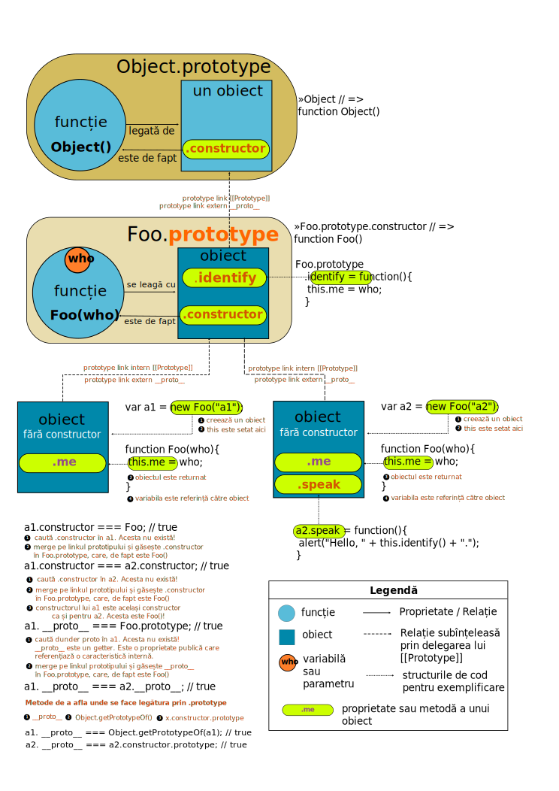

# Obiecte

Standardul spune că obiectele sunt „colecții de zero sau mai multe proprietăți fiecare având atribute care determină cum poate fi folosită”. Atunci când un obiect este creat, toate caracteristicile sale sunt moștenite de la un alt obiect cu rol de prototip. Și oricât ar părea de ciudat, pentru că un prototip este un obiect, acesta la rândul lui are un prototip. E ca un lanț care are drept limită superioară obiectul `Object`.

## Componența obiectelor

Obiectele au **proprietăți** și **metode**.
Proprietățile sunt valori cum ar fi numere, boolean-uri sau șiruri de caractere. Proprietățile ***sunt ceva***.
Metodele ***fac ceva***. Metodele sunt de fapt niște funcții. Toate funcțiile definite în obiectul global, de fapt, devin automat metode ale lui `window` în cazul browserelor.

```javascript
// un object literal
var obi = {
  a: 10,
  b: 20
};
```

**Moment ZEN**: Obiectele pot fi considerate ca array-uri asociative pentru că poți accesa valoarea folosind notația cu paranteze drepte: `obi['b']`.

## Categorii de obiecte

De fapt, în standard obiectele chiar sunt categorisite astfel:
- „Ordinary object” (*obiecte simple*) au comportamentul comun pentru toate obiectele în JavaScript
- „Exotic object” (*obiecte exotice*) au comportamentul comun pentru obiectele în JS, dar cu mici diferențe
- „Standard objects” (*obiecte standard*) sunt toate obiectele JS iar cele „ordinary” și cele „exotice” sunt parte a obiectelor standard
- „Built-in objects” (*obiecte interne*); toate obiectele standard fac parte din obiectele built-in


## Obiecte interne (*built-in*)

JavaScript vine din start cu câteva obiecte care se numesc „built-in object” pe care le putem înțelege ca **obiecte interne** limbajului la care ai acces din start fără să faci ceva. Atenție, `obiectul global` este parte a obiectelor interne preexistente.

## Moștenirea prototipală

***JavaScript este un limbaj bazat pe moștenire prototipală - prototypal inheritance***

În JavaScript neexistând clase (cod care se comportă ca un plan pentru construcția obiectelor), pentru a reutiliza cod, se creează obiecte care se bazează pe cele existente prin exploatarea unui lanț prototipal.

Astfel, între aceste obiecte se creează o legătură. Această legătură se numește „legătură prototipală”. Aceste legături realizează „moștenirea prototipală” - `prototypal inheritance`. Obiectul preexistent constituie prototipul pentru cel nou creat care poate adăuga noi membri, noi comportamente. Mai trebuie adăugat că, de fapt, vorbim despre o *delegare* pe lanțul prototipal format. Acest lucru înseamnă că atunci când ceri o proprietate care nu există, delegi solicitarea către prototip să o analizeze și să servească o valoare sau să delege mai sus cererea dacă mai există un obiect prototip părinte.

Unul din motivele pentru care ai folosi aceast lanț prototipal este acela de a realiza șabloane care structurează funcționalități prin ascunderea sau relevarea anumitor detalii. Acest lucru este posibil prin introducerea de funcții în prototip. Avantajul major al acestui lucru este că funcția este creată o singură dată.

Un avantaj extraordinar pe care-l oferă moștenirea prototipală este că odată cu modificarea obiectului prototip, toate funcționalitățile noi vor fi disponibile tuturor celor care le moștenesc.

Două obiecte care conțin fix aceiași membri, nu sunt identice; au identități diferite și acest lucru le face unice.

```javascript
var a = {0: 'ceva'},
    b = {0: 'ceva'};
a === b; // false
```

Obiectele sunt structuri care își pot modifica structura chiar dacă identitatea rămâne neschimbată și spunem că pot suferi mutații. Același comportament îl au și array-urile. Și mai este un lucru pe care obiectele îl împărtășesc cu array-urile. Membrii unui obiect pot fi accesați prin folosirea parantezelor drepte.

```javascript
var obi = {a: 10}; obi['a']; // 10
```

Folosirea moștenirii prototipale introduce o ierarhie, o taxonomie prealabilă în aplicație, care este posibil să intre în conflict cu realitățile ulterioare. Acest mod de a scrie cod nu este încurajat în contextul actual care se orientează mai degrabă către programarea funcțională. În contextul programării funcționale, este încurajată compoziția obiectelor opusă mecanismului de moștenire.

## Mantre

- ECMAScript vine cu obiectele sale din start care se numesc obiecte `built-in` în care este inclus și `global object` - obiectul global.
- JavaScript nu are clase! Atenție, nu vă lăsați amăgiți de formula sintactică introdusă de ES6 pentru a face codul scris să pară că JavaScript are clase.
- Totul în JavaScript are comportamentul unui obiect cu două excepții: `null` și `undefined`.
- În clientul care rulează codul mai întâi de orice există obiectul window.
- Obiectul window are o metodă numită Object [ function Object() ]. Motorul Javascript construiește automat metoda Obiect în obiectul window (window.Object returnează function `Object()`).
- Toate obiectele în JavaScript descind din Object, adică își au originea în Object. Toate obiectele moștenesc metode și proprietăți din `Object.prototype`. Acestea pot fi suprascrise.
- `Object.prototype` este un obiect în care poți adăuga propriile proprietăți și metode.
- Modificările aduse obiectului `Object.prototype` se propagă către toate obiectele. Singura excepție este atunci când proprietățile și metodele supuse modificărilor nu sunt ele la rândul lor modificate mai departe în lanțul prototipal.
- În cazul tuturor funcțiilor, motorul JavaScript generează un obiect prototype (numeFunctie.prototype). Acest obiect (prototype), este gol și este creat de constructorul lui `Object()`.
- Funcțiile sunt legate de obiectul prototip prin metoda .constructor. Acest lucru înseamnă că poți afla în orice moment care este funcția care generează prototipul prin apelarea constructorului cu ***dunder-dunder-proto***: `obiect.__proto__.constructor`
- Fiecare funcție obiect are un obiect prototip diferit.
- Obiectele pot invoca orice funcție publică indiferent de lanțul prototipal.
- Un obiect poate fi creat cu `new Object()`:
  1. acestă modalitate **nu va crea și constructor**.
  2. Accesarea `numeObiect.__proto__.constructor` răspunde cu `function Obiect()` la care s-a ajuns prin delegare.
- JavaScript are și obiecte globale existente deja în limbaj precum `String()`, `Array()`, `Math()`, `Date()` (`var test = new Date()`).
- O funcție apelată cu `new` în fața sa este un constructor:
  1. Se creează un obiect nou.
  2. Se creează o legătură la obiectul prototype al funcției a cărui identificator a fost folosit cu `new`. Se creează legătura prototipală.
  3. Obiectul generat automat este pasat funcției cu rol de constructor ca fiind parametrul `this` și astfel, devine contextul de execuție a funcției constructor invocate (`this` este pasat ca parametru împreună cu `arguments`).
  4. Dacă funcția nu returnează ceva, atunci înainte de a se închide blocul („}”), `this` va fi returnat automat.
- `this` este un obiect-context: pentru funcții simple este `window`, pentru metode este obiectul în care se execută iar pentru noile obiecte create este chiar noul obiect generat.
- Obiectele pot moșteni alte proprietăți direct din alte obiecte.
- Când introduci o proprietate nouă într-un obiect care generează prototipul pentru alte obiecte, obiectele legate prin lanțul prototipal, vor moșteni noile proprietăți.
- [[Prototype]], adică proprietatea `prototype` este o legătură internă, care se stabilește de la un obiect la altul. Pentru aflarea prototipului se apelează la __proto__ (dunder-dunder proto) sau se va folosi `Object.getPrototypeOf(obiect)`.
- Un obiect literal are prototype `undefined`. Cu toate acestea la interogare cu instanceof trimite la Object.
- Legătura prototipală se obține legătura prin `Object.create()` și are două efecte:
  1. **creează un obiect**,
  2. **stabilește legătura prototipală**.
- Legătura prototipală se obține și prin efectul al doilea al folosirii cuvântului cheie `new`.
- Legătura prototipală creează un lanț de delegare pentru cazurile în care nu găsești o proprietate sau o metodă într-un anumit context de execuție.
- Mecanismul pe care-l realizează `.prototype` este unul de delegare a cererii pentru referința unei proprietăți sau metode către un obiect mai sus pe lanțul prototipal către un alt obiect.
- Obiecte cu un prototip și proprietăți prestabilite, se pot contrui cu `Object.create(obi, {exemplu: 'proprietate'})`. Se realizează o legătura prototipală la obiectul obi.
- Obiectele atunci când au metode, nu „dețin” sau „conțin” acele funcții, ci doar referințe către funcțiile pe post de metode. Funcțiile (metodele) nu fac parte din obiect; referința către acestea este parte a obiectului.
- În obiecte numele proprietăților sunt întotdeauna stringuri.
- Relațiile prototipale pot cauza probleme atunci când este nevoie de enumerarea proprietăților obiectelor. Douglas Crockford recomandă „ambalarea” conținutului buclei de ciclare într-o funcție de verificare `hasOwnPropery()`;
- Dacă dorești „înghețarea” obiectelor pentru a nu fi modificate, se va folosi `Object.freeze()` iar în cazul Node.js, modulul `deep-freeze`.

## Crearea obiectelor

Obiectele pot fi create în două feluri: prin declararea acestora sau prin construirea lor.

1. `var newObj = new Object();` se respectă cele patru reguli: (1)crearea obiectului; (2)stabilirea lanțului prototipal; (3)bindingul lui `this` la noul obiect; (4)obiectul nou creat este returnat.
2. `var newObj = Object.create(null);` prototype este setat la `null`. Supranumit `dict pattern`
3. `var newObj = Object.create(Object.prototype);` echivalentă cu `var newObj = {}`.
4. `var newObj = {};` echivalentă cu `new Object()`.
5. `function x(){return{a:1}}; var y = x();`

## Crearea obiectelor cu valori deja computate

Această metodă este introdusă de ECMAScript 2015. De fapt, creezi obiecte literale, dar de această dată se pot introduce valori computate (computed property names) chiar la momentul în care este constituit obiectul.

```javascript
// cel mai simplu exemplu
const a = 10;
const b = 20;
const obi = {a, b};

// un alt exemplu
const namespace = 'moz';
const webObi = {
  [namespace + 'box-sizing']: 'border-box',
  [namespace + 'box-shadow']: '25px25px10px #888888'
};
```

## Atributele proprietăților unui obiect

Atributele sunt folosite pentru a defini și a explica starea proprietăților unui obiect.

Atributele unei proprietăți folosite pentru date.

|Numele atributului|Valoare|Descriere|
|:-----------------|:------|:--------|
|`value`|oricare tip ECMAScript|Este valoarea obținută prin accesarea proprietății|
|`writable`|Boolean|Dacă este setat la `false`, atributul `value` nu va putea fi scris folosind `set`|
|`enumerable`|Boolean|Dacă este setat la `true`, proprietatea va putea fi enumerată într-un `for-in`|
|`configurable`|Boolean|Dacă este setat la `false`, orice încercare de a modifica atributele, de a șterge proprietate, va fi destinată eșecului. Tot ce permite este modificarea lui `value` și setarea lui `writable` la `false`.|

Atributele unei proprități de tip Accessor

|Numele atributului|Valoare|Descriere|
|:-----------------|:------|:--------|
|`get`|Obiect sau undefined|Dacă valoarea este un obiect acesta este o funcție-obiect|
|`set`|Obiect sau undefined|Dacă valoarea este un obiect acesta este o funcție-obiect|
|`enumerable`|Boolean|Dacă este setat la `true`, proprietatea va putea fi enumerată într-un `for-in`|
|`configurable`|Boolean|Dacă este setat la `false`, orice încercare de a a modifica să fie o proprietate de date sau să-i schimbi atributele, va eșua|

Un exemplu practic:

```javascript
var newObj = {};              // Creează obiectul

Object.defineProperty(newObj, 'numeCheieNoua', {
  value: 'Salutare',
  writable: true,
  enumerable: true,
  configurable: true
});
```

## Crearea metodelor

O funcție care este declarată într-un obiect, devine metodă a acelui obiect. Atenție! este totuși o funcție în sine.

```javascript
var obi = {
  token: 10,
  faCeva: function faCeva(){
    console.log(this.token);
  }
};
obi.faCeva(); // 10
faCeva(); // faCeva is not defined
```

`faCeva` este o metodă a obiectului obi. `faCeva` este de fapt o referință către funcția anonimă care afișează în consolă valoare lui token. `obi.faCeva` poate fi considerată o referință către funcție. Nu uita faptul că oricărei funcții îi este pasat `this` automat.

Modalitatea de a crea o metodă într-un obiect este perfect echivalentă cu următoarea alternativă.

```javascript
var obi = {
  token: 10
};

obi.faCeva = function faCeva(){
  console.log(this.token);
};

obi.faCeva(); // 10
faCeva(); // faCeva is not defined
```

Dar și această alternativă este perfect identică cu următoarea:

```javascript
var token = 1000;

var obi = {
  token: 10
};

function faCeva(){
  console.log(this.token);
};

obi.faCeva = faCeva;

obi.faCeva(); // 10
faCeva(); // undefined (e undefined pentru că JS creează automat variabila token in global, dar nu are valoare pentru ea)
          //sau 1000, dacă ai token declarat în global.
```

Aici este un element în plus. Funcția `faCeva` a fost declarată în global, ceea ce înseamnă că `scope`-ul său lexical se află în `global scope`.
În cazul în care în global scope ar fi fost declarată valoarea token, la invocarea funcției în sine, nu ca metodă, valoarea acesteia ar fi fost adusă.

Odată cu apariția noii versiuni ECMAScript, metodele au fost definite în mod formal. Standardul definește o metodă o funcție care au o proprietate internă `[[HomeObject]]`. Această proprietate conține obiectul căruia îi aparține metoda.

```javascript
var obi = {
  x: 10,
  faCeva(){
    console.log(this.x);
  }
}; obi.faCeva();
```

## Metode interne ale obiectelor

Modul în înțelegem un obiect este determinat și de un set de algoritmi care sunt oferiți de orice motor care implementează standardul ECMAScript. Acești algoritmi sunt numiți `metode interne`.
Metodele interne definesc comportamentul la momentul în care este rulat codul pentru acel obiect. Reține faptul că aceste metode interne cad în responsabilitatea celor care fac o implementare, un motor de JavaScript.

În scopul exemplificării vom folosi un obiect literal care are câteva proprietăți și un alt obiect creat folosind `Object.create` pentru care setăm lanțul prototipal la primul creat.

```javascript
let obi = {
  prop1: 10,
  prop2: function(){console.log("Salut");}
};

let obi2 = Object.create(obi);
obi2.stare = 100;
```

### Metoda `Object.getPrototypeOf()`

Returnează un obiect sau null și indică obiectul care oferă proprietăți care sunt moștenite și de cel asupra căruia se face interogarea cu `getPrototypeOf`. `null` indică faptul că obiectul curent nu moștenește nicio proprietate.

```javascript
Object.getPrototypeOf(obi2);
// Object { prop1: 10, prop2: obi.prop2() }
```

Celelalte proprietăți sunt: `setPrototypeOf` și `isExtensible`.

Acestea pot fi consultate în detaliu la secțiunea dedicată obiectului intern `Object`.

## Crearea obiectelor printr-o funcție cu rol de constructor și instanțierea cu `new`

Mai este numită de o parte a programatorilor „moștenire clasică”. De fapt, este vorba tot despre moștenire prototipală, dar care face uz de un constructor.

Acesta este modelul cel mai des întâlnit și acceptat ca practică istorică:
1. Creezi o funcție constructor (este o practică acceptată ca funcțiile constructor să aibă numele începând cu literă mare).
2. Adaugi metode în obiectul `prototype` al funcției cu rol de constructor.
3. Instanțiezi obiectul folosind cuvântul cheie `new`.

```javascript
var Ceva = function (info) { this.info = info; };
Ceva.prototype.difuzor = function () { console.log(this.info); };
var instanta = new Ceva('Salve!');
instanta.difuzor(); // Salve
```

Odată cu evoluția standardului avem acces și la `Object.create`, cu ajutorul căreia putem evita instanțierea cu `new`.

```javascript
var Ceva = function (info) { this.info = info; };
Ceva.prototype.difuzor = function () { console.log(this.info); };
var instanta = Object.create(Ceva.prototype, {
  info: {
    value: 'Salut!',
    writable: true
  }
});
instanta.difuzor(); // Salut!
```

### Standardul spune

Un constructor, de fapt o funcție constructor, este un obiect funcție care suportă metoda internă `[[Construct]]`.

### Ce se întâmplă când folosești `new`

1. Se creează un obiect nou.
2. Se creează o legătură la obiectul prototype al funcției a cărui identificator a fost folosit cu `new`. Se creează legătura prototipală.
3. Obiectul generat automat este pasat funcției cu rol de constructor ca fiind parametrul `this` și astfel, devine contextul de execuție a funcției constructor invocate (`this` este pasat ca parametru împreună cu obiectul `arguments`). `this` va fi obiectul nou construit
4. Dacă funcția nu returnează ceva, atunci înainte de a se închide blocul („}”) se va returna automat obiectul constituit la pasul 1.

Cel mai simplu exemplu:

```javascript
var Salut = function(){};                 // function Salut()

Salut.prototype.glas = function(vorbe){
  console.log(vorbe);
};                                        // Salut.prototype returnează: Object{  glas: Salut.prototype.glas(), constructor: Salut() }
                                          // Salut.__proto__ returnează: function ()
var unObiect = new Salut();               // unObiect returnează: Object {}
                                          // unObiect.__proto__              returnează: Object{  glas: Salut.prototype.glas(), constructor: Salut() }
                                          // Object.getPrototypeOf(unObiect) returnează: Object{  glas: Salut.prototype.glas(), constructor: Salut() }
unObiect.glas('o vorbă să-ți mai spun');  // unObiect.__proto__.constructor returnează: function Salut()
```

Atenție! Aici există ceva foarte important de lămurit. Proprietatea `prototype` aparține funcției constructor (`Function.prototype`). Această legătură vizibilă, care poate fi „întrebată”, expune o legătură internă referită de standard ca [[Prototype]].

La nevoie, poți adăuga în prototipul funcției proprietăți pe care îți dorești să fie moștenite mai târziu de obiectele create. Să spunem că avem o funcție cu rol de constructor după care se instanțiază un obiect. Dar mai târziu, pentru că este nevoie de o proprietate care să fie moștenită de toate obiectele generate, se poate introduce direct în obiectul `prototype` al funcției.

```javascript
function TestInstantiere(){
  this.x = 100;
};
var obi = new TestInstantiere();
console.log(obi.x);
// acum ne-am dat seama că mai e nevoie de o valoare de 1000.
TestInstantiere.prototype.y = 1000;
console.log(obi.y);
```

Cum testezi, cum întrebi care este prototipul unui obiect? Există două metode echivalente ca rezultat returnat (obiectul prototype):

1. `Object.getPrototypeOf(obiectulTestat)`,
2. `obiectulTestat.__proto__`

#### Crearea și accesarea membrilor unui obiect creat cu un constructor

Funcțiile cu rol de constuctori pot defini întern metodele, iar acestea devin niște metode tip „accessor” sau „getter”, care te ajută să ajungi din scope-ul extern la valorile din constructor.

```javascript
function Sablon(){
  var cantitate = 10;

  this.getCantitate = function(){
    return cantitate;
  };

  this.incrementare = function(){
    cantitate++;
  };
};

var obiect = new Sablon();

obiect.getCantitate(); // 10
obiect.incrementare(); // undefined
obiect.getCantitate(); // 11
```

Pentru a ajunge la cantitate este nevoie de metode de acces („accessors”). Acesta este și unul din cazurile de realizare a unui closure.

## Cazuistică de realizare a obiectelor cu `new` și introducerea de metode direct în prototip

Un exemplu ceva mai dezvoltat.

```javascript
function Foo(who){
  this.me = who;
}

Foo.prototype.identify = function(){
  return "I'm " + this.me;
}

var a1 = new Foo("a1");
var a2 = new Foo("a2");

a2.speak = function(){
  alert("Hello, " + this.identify() + ".");
};

a1.constructor === Foo;
a1.constructor === a2.constructor;
a1.__proto__ === Foo.prototype;
a1.__proto__ === a2.__proto_;
```



### Crearea unui obiect printr-o declarație literală

Un obiect poate fi creat foarte simplu folosind acoladele:

```javascript
var obiectNou = {};
```

Ce s-a întâmplat chiar în acest moment este o legătură prototipală la `Object`.

```javascript
var obiectNou = {};
obiectNou.__proto__.constructor // returnează: function Object()
```

Ce se mai realizezi atunci când creezi un obiect printr-o declarație literală este un domeniu separat de restul codului. Un domeniu sub un nume, numele obiectului și care este cunoscut ca `namespace`.

```javascript
var aplicatie = {};
// tocmai s-a creat un namespace
```

Poți crea un namespace doar dacă acesta nu există.

```javascript
var aplicatie = aplicatie || {};
```

### Crearea obiectelor cu Object.create()

Este o metodă a lui `Object` introdusă de ES5.
Permite atribuirea directă a unui prototip unui obiect eliberând prototipul de legătura cu, constructorul.

```javascript
var obiect;

obiect = Object.create(null);   // pasarea lui null conduce la crearea unui obiect nou

obiect = {};
// declararea unui obiect cu forma literală este echivalent cu expresia de mai jos care are același efect:
obiect = Object.create(Object.prototype);
```

Construirea unui prototip care să stea la baza unui nou obiect construit.

```javascript
var prototip = {
  prop1: "salut",
  prop2: function(){
    console.log('Te ' + this.prop1);
  }
};                                          // prototip.__proto__.constructor răspunde: function Object()

var instanta = Object.create( prototip );   // instanta.__proto__.constructor răspunde: function Object()

instanta.prop2(); // Te salut

instanta.salutNou = function(){
  console.log('Te ' + this.prop1 + ' iar');
};

instanta.salutNou(); // Te salut iar
```

Object.create permite inițializarea proprietăților obiectului folosind un argument suplimentar.

Cu ajutorul lui Object.create() se poate realiza chiar și o moștenire prototipală „clasică”.

```javascript
var ObiectZero = function(){
  this.name = "Obiectul zero";
};

ObiectZero.prototype.actiune = function(){
  this.afirmatie = this.name + "are o acțiune";
};

function ObiectUnu (){
  ObiectZero.call(this);  // rulezi ObiectZero în contextul lui this stabilit de ObiectUnu
};

ObiectUnu.prototype = Object.create(ObiectZero.prototype); // declari explicit că prototipul lui ObiectUnu este prototipul lui ObiectZero
ObiectUnu.prototype.constructor = ObiectUnu;               // setezi constructorul să să spundă cu funcția ObiectUnu

var ObiectTrei = new ObiectUnu; // se constituie legătura prototipală clasică

ObiectTrei instanceof ObiectUnu;   // true
ObiectTrei instanceof ObiectZero;  // true
```

`Object.create` permite o implementare simplă a conceputului de „moștenire diferențială” în care obiectele sunt capabile să moștenească direct din alte obiecte. Vezi șablonul Objects Linked to Other Objects (OLOO) a lui Kyle Simpson.

`Object.create` are posibilitatea de a adăuga și în același timp configura proprietăți ale obiectului. Este de fapt un caz de șablon Prototype.

```javascript
var vehicul = {
  getModel: function () {
    console.log('Modelul este: ' + this.model);
  }
};

var car = Object.create(vehicul, {
  // Sintaxa este similară cu Object.defineProperties și Object.defineProperty
  'id': {
    value: 'ISS - 01',
    enumerable: true
    // writable:false, configurable:false by default
  },
  'model': {
    value: 'Stație spațială',
    enumerable: true
  }
});
```
