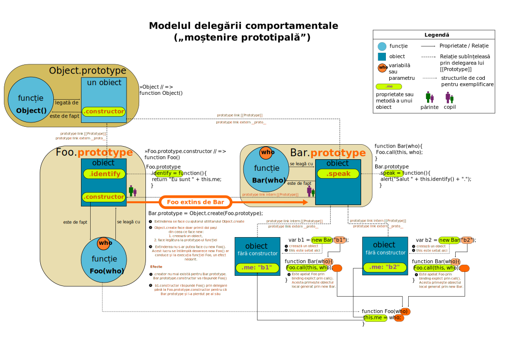

# Moștenirea prototipală

***JavaScript este un limbaj bazat pe moștenire prototipală - prototypal inheritance***

În alte limbaje de programare așa cum este Java, de exemplu, pentru a genera un obiect ai nevoie de un fragment de cod care are rolul de plan de construcție pentru viitoarele obiecte. Pur și simplu este o secvență de cod care descrie care sunt valorile și tipul lor pentru proprietățile viitorului obiect.

Astfel, între obiecte se creează această legătură numită „legătură prototipală”. Aceste legături realizează „moștenirea prototipală” - `prototypal inheritance`. Obiectul preexistent constituie prototipul pentru cel nou creat care poate adăuga noi membri, noi comportamente. De fapt, vorbim despre o *delegare* pe lanțul prototipal format. Acest lucru înseamnă că atunci când ceri o proprietate care nu există, delegi solicitarea către prototip să o analizeze și să servească o valoare sau să delege mai sus cererea dacă mai există un obiect prototip părinte.

Unul din motivele pentru care ai folosi acest lanț prototipal este acela de a realiza șabloane care structurează funcționalități prin ascunderea sau relevarea anumitor detalii. Acest lucru este posibil prin introducerea de funcții în prototip. Avantajul major al acestui lucru este că funcția este creată o singură dată în obiectul prototip.

Un avantaj extraordinar pe care-l oferă moștenirea prototipală este că odată cu modificarea obiectului prototip, toate funcționalitățile noi vor fi disponibile tuturor celor care le moștenesc.

Pentru a reutiliza cod, se creează obiecte care se bazează pe cele existente prin exploatarea unui lanț prototipal care se formează între obiecte și care poate fi interogat prin proprietatea oricărui obiect `__proto__`. Proprietatea `__proto__` nu este același lucru cu `prototype`. În cazul lui `__proto__` vorbim despre o proprietate a obiectului instanțiat, iar în cazul lui `prototype` vorbim despre o proprietate a constructorului folosit pentru crearea obiectului instanțiat.

```javascript
var obi = {ceva: 'salve'};  // crearea unui obiect
function Salut () {};       // declararea unei funcții
Salut.prototype = obi;      // setarea lui obi drept prototip
var inst = new Salut();     // instanțierea unui obiect
typeof inst.__proto__;      // "object"
typeof inst.prototype;      // "undefined"
typeof inst.constructor.prototype;  // "object"
```

Poți inlocui oricând obiectul cu rol de prototip după instanțierea obiectelor, iar legătura lui `__proto__` va fi la obiectul tocmai înlocuit pentru toate obiectele instanțiate după înlocuire. Obiectele instanțiate mai vechi, de dinaintea înlocuirii obiectului prototip, vor avea `__proto__` care trimite la cel vechi. Constructorul, de fapt proprietatea constructor a noilor obiecte instanțiate după înlocuire, nu va mai returna identificatorul funcției constructor de la care s-a pornit, ci pe „Object()”. Pentru a repara acest lucru, va trebui, manual să fie setată proprietatea constructor: `NumeFuncțieConstructorOriginală.prototype.constructor = NumeFuncțieConstructorOriginală.prototype.constructor;`

Două obiecte care conțin fix aceiași membri, nu sunt identice; au identități diferite și acest lucru le face unice.

```javascript
var a = {0: 'ceva'},
    b = {0: 'ceva'};
a === b; // false
```

Obiectele sunt structuri care pot fi modificate chiar dacă identitatea rămâne neschimbată și spunem că din acest motiv pot suferi „mutații”. Același comportament îl au și array-urile. Și mai este un lucru pe care obiectele îl împărtășesc cu array-urile. Membrii unui obiect pot fi accesați prin folosirea parantezelor drepte.

```javascript
var obi = {a: 10}; obi['a']; // 10
```

Folosirea moștenirii prototipale introduce o ierarhie, o taxonomie prealabilă în aplicație, care este posibil să intre în conflict cu realitățile ulterioare. Acest mod de a scrie cod nu este încurajat în contextul actual care se orientează mai degrabă către programarea funcțională. În contextul programării funcționale, este încurajată compoziția obiectelor opusă mecanismului de moștenire.

De fapt, se poate vorbi de o „delegare comportamentală” și nu de o moștenire în sensul clasic. Obiectele stabilesc legături prototipale prin care se pot face delegări pe lanțul prototipal.

## Spune standardul

Toate **obiectele ordinare** au „un slot intern” numit `[[Prototype]]`.

Valoarea acestui slot poate fi `null` sau un obiect care va oferi tuturor descendenților funcționalități și valori.

`Object.getPrototypeOf()` returnează valoarea din proprietatea internă `[[Prototype]]` iar `Object.setPrototypeOf()` o schimbă.

Toate obiectele comune au „un slot intern” numit `[[Extensible]]`, care controlează dacă pot fi adăugate sau nu proprietăți la obiect. Dacă valoarea acestui slot este `false`, atunci nu se mai pot adăuga proprietăți noi.

Legătura cu `[[Prototype]]` este aceea că în cazul unui `[[Extensible]]` cu valoare `false`, valoarea slotului intern `[[Prototype]]` a obiectului, nu poate fi modificată. În plus, de vreme ce a fost pusă pe `false`, nu o mai poți modifica la `true`.

## Mantre

- \[[Prototype]], adică proprietatea `.prototype` este o legătură care se stabilește de la un obiect la altul.
- Legătura prototipală se obține legătura prin `Object.create()` și are două efecte:
  1. **creează un obiect**,
  2. **stabilește legătura prototipală**.
- Legătura prototipală se obține și prin efectul al doilea al folosirii cuvântului cheie `new`.
- Legătura prototipală creează un lanț de delegare pentru cazurile în care nu găsești o proprietate sau o metodă într-un anumit context de execuție.
- Mecanismul pe care-l realizează `prototype` este unul de delegare a cererii pentru referința unei proprietăți sau metode către un obiect mai sus pe lanțul prototipal către un alt obiect.
- relațiile prototipale pot cauza probleme atunci când este nevoie de enumerarea proprietăților obiectelor. Crockford recomandă „ambalarea” conținutului buclei de ciclare într-o funcție de verificare `hasOwnPropery()`;
- Obiectele interne ale JavaScript pot fi augmentate prin modificări ale obiectului prototip ceea ce permite ținerea la zi a unor implementări mai vechi prin polyfill-uri sau shim-uri.
- nu te baza niciodată pe ceea ce returnează `prototype.constructor`.
- lanțul prototipal este unul viu, dar dacă înlocuiești complet obiectul prototip, acesta se rupe.
- poți inlocui oricând obiectul cu rol de prototip după instanțierea obiectelor, iar legătura lui `__prototo__` va fi la obiectul tocmai înlocuit pentru toate obiectele instanțiate după înlocuire.
- când suprascrii sau înlocuiești obiectul prototip, trebuie să setezi manual și proprietatea `constructor` pentru a avea o referință corectă.
- JavaScript nu are clase. Există doar o sintaxă nou introdusă, care permite și niște lucruri suplimentare, dar care se bazează pe mecanismul existent al moștenirii.

## Inspecție și inventar

1. Află dacă un obiect este prototipul unui altuia: `ObiectInvestigat.prototype.isPrototypeOf(obiectulBanuitAFiPrototipul)`.
2. Află care obiect este prototipul pentru cel investigat: `ObiectDeLucru.__proto__` sau folosind `Object.getPrototypeOf(ObiectDeLucru)`.

## Moștenirea prototipală cu exemple

### Prototip gol, care nu moștenește

Crearea unui obiect al cărui prototip este gol. Gol înseamnă că nu va moșteni nicio proprietate de la obiectul prototip pe care `Object.prototype` îl oferă.

```javascript
let obiect = Object.create({}, {ceva: {value: 1}});
Object.getPrototypeOf(obiect);
// Object {  } prototipul este gol

// Obiectele care vor fi create în baza lui obiect,
// vor avea un prototip gol
var obiect2 = Object.create(
  Object.getPrototypeOf(obiect),
  Object.getOwnPropertyDescriptors(obiect)
);
Object.getPrototypeOf(obiect2);
// Object {  } prototipul este gol
```

### Crearea unui obiect literal

Prin crearea directă a unui obiect literal, se generează o legătură automată către prototipul impus de `Object.prototype`

```javascript
let matrita = {ceva: 1};
Object.getPrototypeOf(matrita); // Object { , 15 more… }
Object.getPrototypeOf(matrita) === Object.prototype; // true
```

### Clonarea obiectelor și moștenirea prototipului de către clonă

```javascript
let obiect = {
  ceva: 10,
  faCeva: function(){
    console.log('Salut!');
  }
};
Object.getPrototypeOf(obiect2); // Object { , 15 more… } de fapt Object.prototype

let obiect2 = Object.create(
  Object.getPrototypeOf(obiect),
  Object.getOwnPropertyDescriptors(obiect)
);

Object.getPrototypeOf(obiect2); // Object { , 15 more… }
Object.getPrototypeOf(obiect2) === Object.prototype; // true
```

## Apelarea unei metode din `prototype`

```javascript
Object.getPrototypeOf(this).numeMetodaDinPrototip.call(this); // varianta ES5
super.numeMetodaDinPrototip() // varianta ES6
```

### Cazul constructorilor

Pentru a realiza un prototip, după care vei construi alte obiecte ce vor „moșteni” proprietăți, te vei folosi de o funcție. În `this` al funcției vei introduce proprietățile pe care dorești să le transmiți mai departe prin mecanismul moștenirii. Este cazul constructorului.

```javascript
let Matrita = function(){
  this.ceva = 10;
  this.faCeva = function(){
    console.log('Fac ceva!');
  };
};
// Object.getPrototypeOf(Matrita) => Object { , 15 more… }
// Matrita.__proto__ => Object { , 15 more… }

let produs = new Matrita(); // typeof produs => "object"

Matrita.prototype.isPrototypeOf(produs); // true
Object.getPrototypeOf(produs); // Object { , 1 more… }
```

### Introducerea de proprietăți noi în prototipul unui obiect

Este ceea ce Douglas Crockford numește moștenire presudoclasică și argumentează că ar fi o practică ce ar trebui evitată.

```javascript
function SuntUnContructor(){
  this.oProprietate = 10;
};
SuntUnContructor.prototype.oFunctie = function oFunctie(){
  return this.oProprietate;
};
```

Acest exemplu arată cum practica de zi cu zi oferă exemple de atribuire a unor funcții chiar în constructor.

Crockford indică faptul că în practică mai sunt întâlnite și situații „nebune”, când se înlocuiește prototipul unui obiect funcție cu un obiect creat din apelarea cu `new` a unei funcții constructor. Mergând pe exemplul de mai sus în completare, vom avea:

```javascript
function UnConstructorNou(){ this.oValoare = 1000; };
UnConstructorNou.prototype = new SuntUnContructor();
UnConstructorNou.prototype.propNoua = function(){
  return oValoare;
};
```

### Introducerea de proprietăți în prototipul unui obiect gol - obiect literal

Acesta este cazul simplu de moștenire care se poate realiza. Dacă avem un obiect, folosești metoda `create` a obiectului intern `Object`.

```javascript
let obiect = {};
Object.getPrototypeOf(obiect); // Object { , 15 more… }
Object.setPrototypeOf(obiect, {ceva: 10});
// Object.getPrototypeOf(produs2) => Object { ceva: 10 }
```

### Folosirea unui constructor și adăugarea direct în `prototype`

Este preferabilă folosirea lui `Object.create` pentru a crea un obiect și pentru a seta prototipul.

```javascript
let Matrita = function(date){
  this.ceva = 10;
  this.date = date;
};

let obiect = new Matrita("ceva date"); // Object { ceva: 10, date: "ceva date" }
// în acest moment prototipul lui obiect este Object.prototype (Object { , 15 more… })

Object.setPrototypeOf(obiect, {surpriza: true});
// în acest moment Object.getPrototypeOf(object) este Object { surpriza: true }
```

### Setarea directă a prototipului unui obiect generat cu un constructor

#### Cazul simplu - modificarea obiectului prototype

```javascript
function BenziDesenate(titlu){
  this.tip = "aventuri";
  this.titlu = titlu;
  this.identificare = function(){
    return `Acum citești ${titlu}, care este de ${this.tip}`
  };
};

let rahan = new BenziDesenate("Rahan");
console.log(rahan.identificare());
// Acum citești Rahan, care este de aventuri

BenziDesenate.prototype.apreciere = function () {
  return `Sunt un mare fan ${this.titlu}`;
};
rahan.apreciere();
```

#### Cazul în care o funcție cu rol de constructor la invocarea cu new devine obiect, dare este setat drept prototipul altui obiect.

```javascript
function Matrita(){
  this.vesela = true;
  this.faCeva = function(){
    console.log('Obiecte de veselă');
  };
}; // Object.getPrototypeOf(Matrita) => function ()
// Matrita.prototype.__proto__ => Object { , 15 more… } (adica Object.prototype)

function obiect(material){
  this.dimensiune = 10;
}; // Object.getPrototypeOf(obiect) => function ()

obiect.prototype = new Matrita(); // setezi prototipul la valoarea obiectului generat de constructor
obiect.prototype.contructor = obiect;
// obiect.prototype => Object { vesela: true, faCeva: Matrita/this.faCeva(), contructor: obiect() }

let farfurie = new obiect('porțelan');
console.log(farfurie.vesela); // true
// farfurie.__proto__ => Object { vesela: true, faCeva: Matrita/this.faCeva(), contructor: obiect() }
```

Atenție! Valorile din prototip nu pot fi modificate, dar pot fi suprascrise în obiectul care le moștenește pentru că, de fapt, devin a lor.

Prototipul obiectului șablon poate fi modificat pentru ca toate obiectele moștenite să aibă acces la noile proprietăți.

În final, avem exemplul propus de Kyle Simpson care este ceva mai elaborat.

```javascript
function Foo(who){
  this.me = who;
}

Foo.prototype.identify = function(){
  return "Eu sunt " + this.me;
}

function Bar(who){
  Foo.call(this, who);
}

Bar.prototype = Object.create(Foo.prototype);
// se creează legătura între prototipuri
// .constructor dispare și delegarea pentru .contructor se face la Foo()

Bar.prototype.speak = function(){
  alert("Salut " + this.identify() + ".");
}

var b1 = new Bar("b1");
var b2 = new Bar("b2");

b1.speak();
b2.speak();
```

## În JavaScript nu există clase!

În ciuda introducerii unei sintaxe care seamănă cu obișnuințele de programare ale altor limbaje, de fapt nu este decât un aranjament sintactic, care ascunde o implementare specifică JavaScript. Dacă vei crede că existența sintaxei `class` implică și un comportament intern care să se plieze cu ceea ce știi din alte limbaje de programare, te afli într-o adâncă eroare.

## Lanțul prototipal


## Delegarea comportamentală



## Resurse

[Crockford on Javascript - Functions](https://www.youtube.com/watch?v=lVnnxfdLdlM)
