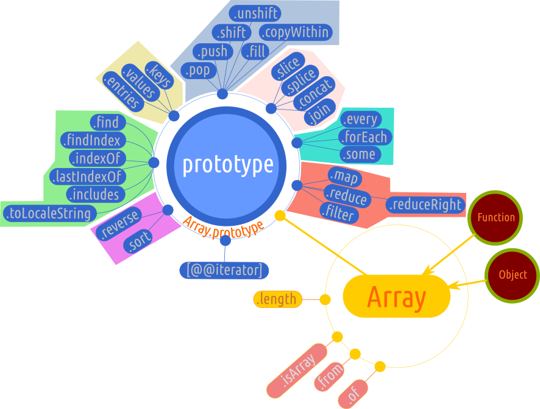
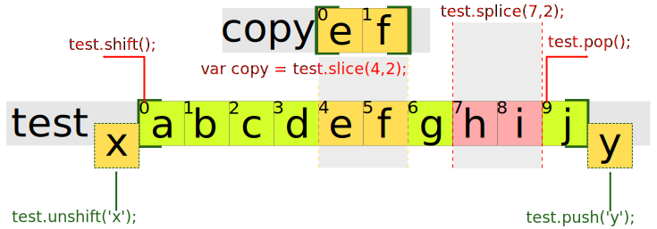

# Array - tablouri, vectori

Este un obiect intern care are și rol de constructor.

Array-urile sunt o bornă centrală a programării indiferent de limbaj. Acestea permit stocarea temporară a unor valori într-o formă ușor accesibilă folosind indecși, dar cel mai important aspect este bogăția metodelor puse la dispoziție de obiectul intern Array pentru a prelucra, aranja, rearanja, filtra elementele conținute de array-uri.

Ori de câte ori veți lucra cu valori simple (în jargonul programatorilor veți mai auzi că sunt numite *scalare*), veți folosi cu siguranță array-urile.

Array-urile mai pot fi folosite și ca structuri de „depozitare” a obiectelor. Spre exemplu, poți constitui un registru pentru elemente DOM cărora le asociezi câte un API.

Această structură capabilă să țină valori este cea mai folosită atunci când suntem confruntați cu nevoia de a prelucra fragmente de date sau pentru a „memora” temporar valorile utile unui anumit context în care se execută codul.

Array-ul este cel mai des întâlnit mecanism de a „prelua” date care vin ca efect al evaluării unei funcții, de exemplu.

În literatura românească de specialitate veți întâlni adesea denumirea de *tablou*. Pentru că este mai simplu și în obișnuința multor programatori români să folosească cuvântul din engleză ca neologism acceptat de practica curentă, vom folosi și în acest material neologismul **array**.

În comunitatea profesională array-ul mai este întâlnit și sub denumirea de *listă* sau *vector*.

**Spune standardul**: Valorarea slotului intern [\[Prototype]] a contructorului Array este obiectul prototype a obiectul intern Function. **Obiectul prototype al lui `Function` este în sine un obiect-funcție intern**.

## Descriere

Array-urile conțin mai multe valori numite `elemente` care sunt ordonate cu niște chei numite indecși de pornesc numărătoarea de la 0.
De fapt, aflăm ce este un array în JavaScript verificând cu `typeof`.

```javascript
typeof []; // "object"
```

## Natura unui array

**Un array este un obiect!**. Este o structură care poate „agrega” date indiferent de tipul lor, pe care le structurează după un sistem de indexare care pornește de la 0 atunci când indecșii nu sunt menționați explicit. Numărul maxim de indici este 2^23 - 1. Pentru a introduce o valoare se va folosi sintaxa cu paranteze pătrate.

```javascript
var colectie = [];
colectie[0] = 'el1';
colectie[1] = 'el2';
colectie[2] = 'el3';
```

Structura generată arată astfel:

| valoare | el1 | el2 | el3 |
|---------|:---:|:---:|:---:|
| index   |  0  |  1  |  2  |

Pentru că este foarte util, poți afla dimensiunea unui array foarte rapid prin utilizarea lui `length`.

```javascript
[1,2,3].length; // 3
```

Pe cale de consecință putem afla indexul ultimului element scăzând 1 din numărul returnat la evaluarea lui `length`. Da, ai intuit perfect. Trebuie făcut acest lucru pentru că indecșii array-ului pornesc de la valoarea 0.

## Shadowing (umbrire) - modificarea / suprascrierea valorilor elementelor

Array-urile sunt structuri care își pot modifica componența chiar dacă identitatea rămâne neschimbată și spunem că pot suferi *mutații*. Folosind sufixul `[]`, este posibil să modificăm elementele interne.

```javascript
var arr = [1, 2];
arr[1] = 5; console.log(arr); // [1, 5]
```

Dincolo de modificarea simplă a unui element, ar fi necesar să vedem cum se petrece acest lucru în cazul mediilor lexicale (scope) create de funcții. Avem un prim caz, în care, în mediul lexical format de o funcție, se face o reasignare a identificatorului (`rebounding`), care până la momentul reasignării trimitea și el tot către **arr**.

```javascript
var arr = [1, 2, 3];
(function (a) {
  a = [2, 3, 4];
})(arr); console.log(arr); // [1, 2, 3]
```

Ca și în cazul „umbririi” simple, se va folosi sufixul `[]` pentru a modifica valorile array-ului original.

```javascript
var arr = [1, 2, 3];
(function (a) {
  a[0] = 10;
})(arr); console.log(arr); // [ 10, 2, 3 ]
```

În cazul array-urilor, valorile sunt copiate prin referință. Acest lucru este util de reținut atunci când în array-uri se vor introduce funcții, de exemplu - o colecție de funcții. Acestea vor fi referențiate și nu declarate direct în array.

```javascript
var faCeva = function () {
  return function () {console.log('salut');};
};
var actiune = faCeva(); // actiune este funcția returnată
var arr = [actiune];
// acum testul
arr[0] === actiune; // true
```

Rezultatul este `true` pentru că valoarea evaluată a expresiei `arr[0]` este `actiune`, care la rândul său ține valoarea evaluată a invocării lui `faCeva()`.

## Ștergerea unei valori

În regulă, ai introdus sau ai deja un array cu valori, dar ai nevoie să ștergi din acest array o valoare. Pentru acest lucru există un operator dedicat: `delete`.

```javascript
delete colectie[2];
```

Uneori array-urile sunt compuse de elemente care la rândul lor sunt array-uri. În acest caz vorbim de array-uri multidimensionale.

```javascript
var multidimensional = [[23,10,4],['a','b']];
```

Întrebarea care se pune în acest moment este cum accesezi o valoare dintr-un array care este de fapt un element al unui array? Pentru a răspunde acestei întrebări trebuie să ne imaginăm locația unei valori ca pe o adresă: București, Uverturii, 90. Ce-ar fi dacă am transcrie adresa ca pe o interogare într-un array în JavaScript? Ar fi așa: `adresa[București][Uverturii][90]`. Nu fi păcălit de structura liniară a sintaxei. De fapt, se face o accesare în adâncime a unei locații, ca și cum am desface o păpușă rusească Matrioșca.

```javascript
var multidimensional = [['unu','doi',[1, 2]], true];
multidimensional[0][2][1]; // 2
```

Un bun exemplu, care să dovedească utilitatea unui array multidimensional, ar fi sistemul de coordonate cartezian. Dacă am asemui array-urile cu matricile, am găsi că array-urile multidimensionale seamănă cu matricile de matrici.

Un array poate conține și expresii care **vor fi evaluate** înainte vreme ca array-ul să fie folosit.

```javascript
var arr = [1 + 2, 4, (2 - 1) + 2]; console.log(arr); // [ 3, 4, 3 ]
```

**Moment Zen**: fiecare array este în sine o entitate distinctă pentru că fiecare array este un obiect.

```javascript
[1, 2, 3] === [1, 2, 3]; // false
['a', 'b', 'c'] === ['a', 'b', 'c']; // false
```



## Verificări

Am indicat mai sus faptul că verificarea unui array cu `typeof` are drept rezultat tipul obiect. Deci este clară natura adâncă a acestui tip de structură. Ce ce ar mai fi foarte util de verificat în lucrul cu array-uri:

1. există un anume index?
2. care este valoarea indexului pentru o anumită valoare?

Pentru a verifica dacă un index cu o valoare anume există în array poți folosi operatorul `in` pentru că un array, de fapt, este un obiect iar indecșii sunt cheile lui.

```javascript
1 in ['a', 'b', 'c']; // true
```

Pentru aceeași verificare poți folosi și metoda dedicată `includes()`. Acesteia îi pasezi la argumente valoarea pe care vrei să o verifici. Răspunsul va fi `true` sau `false`.

```javascript
['a', 'b', 'c'].includes('b');
```

Apoi dacă ai verificat că o cheie există, poți obține indexul pentru o valoare știută.

```javascript
['a', 'b', 'c'].indexOf('b'); // 1
```

Operatorul `in` detectează dacă pentru un anumit index, există o valoare în array.

```javascript
var tablou = [0,1, ,2,4,"unu"];
3 in tablou; // true
2 in tablou; // false
```

Pentru mai multe operațiuni care trec de scopul unor verificări, va trebui să consultați metodele pe care obiectul intern `Array` (care, de fapt, îmbracă orice array), le pune la dispoziție.

Mai sunt și metode general accesibile pe care le poți aplica, iar cel mai rapid exemplu, care vă va fi util adesea, este metoda globală `toString()`. Aceasta transformă un array într-un șir de fragmente de text despărțite prin virgule.

```javascript
['a', 'b', 'c'].toString(); // "a,b,c"
```

## Lanțul prototipal al unui array:

Uneori este necesar să afli care este prototipul unei colecții de care nu ești sigur dacă este array curat sau array-like (*asemănător-cu-array*) - o entitate care are caracteristici apropiate de un array.

```javascript
var tablou = ['prima', 'a doua', 1, 2];

var protoTablou = Object.getPrototypeOf(tablou);
protoTablou; // Array [  ]
var protoLaProtoTablou = Object.getPrototypeOf(protoTablou);
protoLaProtoTablou; // Object { , 15 more… }

Object.getPrototypeOf(protoLaProtoTablou); // null
```

Structura lanțului ar fi: `array` --> `Array.prototype` --> `Object.prototype` --> `null`.

Colecțiile care sunt **asemănătoare-cu-array-urile** (array-like), vor avea un lanț mult mai scurt care-l indică la cap pe `Object`.

Structura lanțului ar fi: `arrayLike` --> `Object.prototype` --> `null`.

## Mantre

- Atunci când `Array` este apelat ca funcție și nu ca un constructor, va creea și va inițializa un nou obiect `Array`.
- Are metodă internă `@@iterator`.
- `Array`-urile sunt **obiecte** și poți adăuga proprietăți în array folosind notația dot `var a = [1,2]; a.i = 23; a.i // 23`. Valorile sunt adăugate indiferent că array-ul are un index numeric prestabilit. Ele sunt acolo.
- Orice obiect `Array` are o proprietate `length`.
- cheia unei proprietăți al unui array se numește `index` al unui array (valorile dintre paranteze pătrate sunt convertite la string).
- o proprietate într-un array care este identificată printr-un index este numită `element`.
- `Array` este un obiect intern limbajului JavaScript. Acesta este folosit pentru crearea array-urilor.
- `Array` este un obiect iterabil pentru că obiectul prototip are o metodă @@iterator (precum String, TypedArray, Map și Set).

## Crearea array-urilor

Obiectele array oferă programatorului o flexibilitate extraordinară, care permite crearea nuanțată a acestor structuri în funcție de neceistăți și de conjuncturi. Vom trece în revistă câteva dintre modalitățile de a crea array-uri de la generarea unuia gol, gata să primească date, până la array-uri care sunt create cu anumite constrângeri de performanță și / sau utilitate.

### Crearea unui array prin menționarea formei literale

Cel mai adesea vei întâlni array-uri create prin forma literală mult mai simplă ca practică (`[]`). Este practică curentă ca un programator să „captureze” valorile rezultate dintr-o iterație, de exemplu într-un array gol. Astfel, de foarte multe ori veți vedea array-uri goale lângă structuri de iterare. Acestea sunt acolo pentru a fi „îndesate” cu valorile rezultate.

```javascript
var colectie = [];
```

Uneori, din motive practice de inițializare a unei structuri de procesare a datelor cu valori de test (fi și numai o funcție simplă), sunt create array-uri literale care vor servi drept colecții de lucru.

```javascript
var colectie = [1,2,3];
```

Dacă nu sunt menționate elementele array-ului, acesta va fi constituit din locuri goale, exact ca o sală de teatru goală. Toate scaunele poartă un număr, dar nu este nimeni așezat pe ele. Pentru introducerea elementelor într-un array, se va folosi metoda `push(elemVal)`, care va „împinge” valorile.

```javascript
var colectie = [];
colectie.push('el1');
colectie.push('el2');
colectie.push('el3');
```

### Folosind constructorul: `new Array()`

Alternativa la folosirea formei literale este oferită de constructor. Să nu uităm nicio clipă faptul că `Array` este un constructor, de fapt. Din motive de performanță, această practică este evitată în lucrul de zi cu zi. L-am amintit pentru că este însuși contructorul.

```javascript
var tablou = new Array('abc','def');
console.log(tablou); // Array [ "abc", "def" ]
```
Dacă ai ales o astfel de practică, cea a lucrului cu funcția constructor, poți să-l folosești pentru a prestabili dimensiunea array-ul. Dacă se poate, acest lucru conduce la eficientizarea alocării memoriei pentru array-uri. Mai departe, vom vedea că o soluție, care ar trebui să primeze, este aceea a utilizării metodei `fill()`. Dar să vedem contructorul la lucru:

```javascript
var test = new Array(5);
console.log(test);
```

S-a creat astfel un array cu cinci spații goale. Efectul este crearea unui array cu un număr fix de elemente, ceea ce ar fi de dorit ca și practică generală din motive de optimizare a performanțelor codului la momentul execuției. Preferabil, fă acest lucru prin utilizarea lui `fill()`.

Mai este un caz al folosirii constructorului în ceea ce privește crearea unui array. Acesta este cazul în care ai nevoie de un array, dar care deja să poarte niște valori prestabilite. Spunem că un astfel de array prepopulat este unul „dens”.



### Array-uri „dense” prin aplicarea lui `apply()` moștenit de la `Function`.

Acesta este un truc pentru a genera array-uri de o dimensiune fixă, dar care, în loc de elemente vide la inițiere, va fi populat cu valori `undefined`. Se folosește `Function.prototype.apply()`, care se poate invoca direct pe `Array` pentru că și `Array`, de fapt este o funcție. Cu rol de contructor, dar o funcție fără niciun dubiu, având acces la `apply()`. Pentru aceasta, contextul va fi obiectul global (în cazul browserului este `window`) sau la `null`, iar drept argumente, va fi invocat `apply()` pasându-i-se numărul de elemente dorit:

```javascript
Array.apply(window, Array(5)); // Array [ undefined, undefined, undefined, undefined, undefined ] echivalent cu Array(5).fill()
Array.apply(null, Array(5)); // Array [ undefined, undefined, undefined, undefined, undefined ]
Array.apply(window, [1,,3]); // Array [ 1, undefined, 3 ]

Array.apply(window, Array(5)).map(function (x, y) { return y + 1; });  // [1, 2, 3, 4, 5]
Array.apply(null, Array(5)).map(Function.prototype.call.bind(Number)); // [0,1,2,3,4,5]

Array.apply(window, Array(26))
     .map( function (x,y){ return String.fromCharCode(y + 65); })
     .join(''); // "ABCDEFGHIJKLMNOPQRSTUVWXYZ"

// si versiunea ECMAScript 2015
[ for (i of Array.apply(window, Array(26)).map((x, y) => y))String.fromCharCode(65 + i) ].join(''); // "ABCDEFGHIJKLMNOPQRSTUVWXYZ"
```

Acesta este un pont de la Brandon Benvie descoperit prin intermediul articolului lui Ariya Hidayat, [Sequences using JavaScript Array](https://ariya.io/2013/07/sequences-using-javascript-array).

Să facem pasul în perioada modernă a limbajului nostru. Ultima iterație a standardului oferă metoda `fill()` pentru a crea array-uri dense (vezi `Array.prototype.fill()`). Cu `fill()` se pot crea array-uri dense care să conțină valori prestabilite, dacă se dorește:

```javascript
[1,2,3].fill();                 // Array [ undefined, undefined, undefined ] echivalent cu Array(3).fill()
Array(3).fill(4);               // [4, 4, 4]
[].fill.call({ length:2, ceva:1 }, `0` + `1`);
// {'0':'01', '1':'01', length: 2, ceva: 1}
```

Ultimul caz din seria de exemple de mai sus, se poate dovedi foarte util în practică. Să presupunem că dorești să generezi un obiect prepopulat cu valori din diferite motive. Acest obiect va avea la bază, între oricare alți membri, o pereche cheie:valoare, care va fi folosit drept indicator al dimensiunii array-ului. Ceea ce se va petrece este că aplicarea lui `fill`, care este aplicat obiectului sămânță în care găsește valoarea dimensiunii viitorului array, va conduce la „umplerea” obiectului cu tot atâția noi membri câți au fost specificați de `length`. Singura limitare este că identificatorii cheilor vor fi indecșii. Valorile care vor popula cheile obiectului, pot fi expresii sau valori simple. Am optat mai sus pentru

### Crearea unui array multidimensional

Realizarea array-urilor multidimensionale sau ceea ce în literatură se mai numește array de array-uri. Putem porni de la un array gol și folosind o structură iterativă imbricată (în interiorul primei, mai introducem una), populăm array-ul cu valori.

```javascript
var arrDeArr = [];                                                   // array-ul care le va conține pe celelalte (un array de array-uri)
for(var contorRanduri = 0; contorRanduri < 3; contorRanduri++) {     // adaugă în array-ul randuri
    arrDeArr[contorRanduri] = [];                                    // cate un array
    for (var contorColoane=0; contorColoane < 3; contorColoane++) {  // generat de bucla interna (ruleaza de 3 ori pentru fiecare iteratie externa)
      arrDeArr[contorRanduri][contorColoane] = '0';
      // cu indexul setat de bucla externă (o singura valoare pentru 3 iteratii interne)
      // și cu 3 indexuri generate intern pentru care atribuie o valoare
    }
};
arrDeArr[0][2] = 'X';  // Arata ca o adresă [rând][coloană]
arrDeArr.forEach(function (arrDeArr) {
  console.log(arrDeArr.join(' '));
});
```

Exemplul de mai sus este perfect echivalent cu următoarea structură de cod introdusă cu un literal.

```javascript
var arrDeArr = [ ['0','0','X'], ['0','0','0'], ['0','0','0'] ];
```

## Indecșii negativi

Indecșii care sunt numere negative vor fi considerați chei pentru valorile introduse în obiectul `Array`.

```javascript
var tablou = [];
tablou[-1] = 'ceva în afară';
console.log(tablou); // Array [ ]
tablou[-1];          // ceva în afară
```

## Ștergerea elementelor dintr-un array

Această metodă creează „goluri” în array. Proprietatea `length` nu va fi afectată.

```javascript
var tablou = [1,2,3,4];
delete tablou[2];
console.log(tablou); // Array [ 1, 2, <1 empty slot>, 4 ]
```

## Manipularea dimensiunii unui array

### Folosirea proprietății `length`

Proprietatea `length` numără toate elementele array-ului chiar dacă acestea au și goluri.

```javascript
var tablou = [0,1,,3]; // conține un element lipsă
tablou.length; // 4
```

Pentru a număra câte elemente chiar există în array se poate scrie o funcție specializată:

```javascript
var tablou = [0,1,,3];
function numaraElementeReale(date){
  var contor = 0;
  date.forEach(function(){
    contor++;
  });
  return contor;
};
numaraElementeReale(tablou); // 3
```

### Creșterea lungimii array-ului prin introducerea valorii

```javascript
var tablou = ['x', 'y'];
tablou.length = 3;
// în acest moment ceea ce s-a întâmplat este că a fost introdus un slot gol în array.
```

### Scăderea dimensiunii unui array menționând `length`

Se poate face simplu prin:

```javascript
var tablou = ['unu', 'doi', 'trei', 'patru'];
tablou.length;        // 4
tablou.length = 2;
tablou.length;        // 2
console.log(tablou);  // Array [ "unu", "doi" ]
```

### Curățarea unui array cu resetarea sa la zero.

Versatilitatea lui `length` merge mai departe oferind posibilitatea de a reseta la 0 un array.

```javascript
var tablou = ['unu', 'doi', 'trei', 'patru'];
tablou.length;        // 4
tablou.length = 0;
console.log(tablou);  // Array [  ]
// mai simplu este suprascrierea cu un array gol
tablou = [];
```

Resetarea array-urilor la 0 - cele referențiate de altele. Există o variantă distructivă și una nedistructivă.
Resetarea la 0 a array-urilor dacă se face cu `length` va avea același efect și pentru toate referințele la acel array. Cine va accesa o referință, va descoperi uimit că este 0.

```javascript
var tablou = ['prima', 'a doua'];
var altTablou = tablou;
tablou.length = 0;
tablou; // []
altTablou; // []
```

Folosirea resetării prin inițializarea variabilei cu un array gol, nu afectează alte referințe. Acestea vor păstra array-ul preexistent.

```javascript
var tablou = ['prima', 'a doua', 1, 2];
var altTablou = tablou;
tablou = [];
tablou; // []
altTablou; // Array [ "prima", "a doua", 1, 2 ]
```

## Tratarea array-urilor după felul lor: **sparse** (în limba română: *cu goluri*) sau **dense**.

Array-urile care au goluri se numesc „sparse”. Un array care nu are goluri se numește „dense”.

```javascript
// array sparce
var arrayCuGoluri = [1,,3,4];
// array dense
var arrayDens = [1,2,3,4];
Array(4).fill(); // Array [undefined, undefined, undefined, undefined]
```

### Trecerea peste goluri

A. Folosind `forEach()`

```javascript
['prima',, 1, 2].forEach(function(element, index){
  console.log(index + ' -> ' + element);
});
// 0 -> prima
// 2 -> 1
// 3 -> 2
```

B. Folosind `every()` se trece peste goluri.
C. Folosind `some()` se trece peste goluri.
D. Folosind `map()` se face un sal peste goluri, dar le păstrează în array-ul rezultat.

```javascript
['prima',, 1, 2].map(function(currentValue, index){
  return currentValue + ' -> ' + index;
});
// Array [ "prima -> 0", <1 empty slot>, "1 -> 2", "2 -> 3" ]
```

E. Folosind `filter()` golurile sunt eliminate.

```javascript
['prima',, 1, 2].filter(function(x){return true});
Array [ "prima", 1, 2 ];
```

F. `join()` convertește golurile, iar valorile `undefined` și `null` la stringul pasat în join.

```javascript
['prima',,1,2].join('X');
// "primaXX1X2"
```
G. `sort()` păstrează golurile.
H. Bucla `for...in` listează cheile array-ului (acestea sunt un superset al indicilor array-ului).
I. Folosirea lui `apply()`.

```javascript
for (var key in ['prima',,1,2]){ console.log(key); }; // 0 2 3
```

## Completarea unui array existent

```javascript
var primul = [1,2,3];
var alDoilea = [4,5,6];

Array.prototype.push.apply(primul, alDoilea);
console.log(primul); // Array [ 1, 2, 3, 4, 5, 6 ]
```

O altă soluție

```javascript
var a = [1,2,3,7,8,9],
    b = [4,5,6],
    insertIndex = 3;
a.splice.apply(a, Array.concat(insertIndex, 0, b));
```

## Accesare pe sărite a elementelor unui array

```javascript
var colectie = [1,2,3,'unu','doi','trei'];
colectie = colectie.sort(function(){return Math.random() - 0.5});
colectie; // Array [ 3, 1, "doi", 2, "unu", "trei" ]
```

## Destructurarea array-urilor

Destructurarea este un procedeu care are drept scop extragerea sau manipularea valorilor asignându-le unor variabile.

```javascript
var arr = ['unu', 'doi'];
var [unu, doi] = arr;
console.log(unu, doi); // 'unu' 'doi'
```

### Potrivire *unu-la-unu*

```javascript
var unu, doi, trei;
[unu, doi, trei] = [1, 2, 3];
console.log(unu, doi, trei); // 1 2 3
```

### Inversarea indentificatorilor

Destructurarea poate fi folosită cu succes pentru a inversa valorile între două variabile.

```javascript
var x = 10, y = 20;
[x, y] = [y, x];
console.log(x, y);
```

### Potrivirea unu-la-unu cu unu array returnat

```javascript
function genArray(){
  return ['unu', 'doi', 'trei'];
};
[x, y, z] = genArray();
console.log(x, y, z); // unu doi trei
```

### Valori implicite

```javascript
var x, y, z;
[x = 1, y = 2, z = 3] = [1000];
console.log(x, y, z); // 1000 2 3
```

### Inversare de valori

```javascript
var x = 10, y = 1000;
[x, y] = [y, x];
console.log(x, y); // 1000 10
```

### Folosirea cu `Regex`

```javascript
let [data, an, luna, zi] = /^(\d\d\d\d)-(\d\d)-(\d\d)$/.exec('1912-12-3');
```

Ceea ce s-a întâmplat este că ai scăpat de sarcina de a crea un array intermediar din care să extragi indice cu indice.

### Folosirea operatorului rest (`...`)

```javascript
var [x, ...restop] = [1, 2, 3];
console.log(x, restop); // 1 și Array [ 2, 3 ]
```

Tot ce generează un array, folosindu-se această sintaxă, se poate transforma în legături la identificatori, adică valorile array-ului se pot asigna unor variabile ce sunt elementele unui alt array.

## Curiozități

### [] egal cu ![]

```javascript
[] == ![] // este true
```

Funcționează pentru că operatorul `!` face o conversie la Boolean și dacă conversia este evaluată la valoarea `true`, cea la care se reduce un obiect. Aceasta va fi inversată la `false` care este interpretat de operatorul `==` ca 0.

## Obiectul intern Array

Tot ce am povestit mai sus abia a reușit să facă un tablou generic al posibilităților de lucru cu datele. Pentru a vedea o paletă mult mai largă de posibilități, vom studia proprietățile și metodele obiectului intern `Array`, precum și metodele oferite de obiectul prototip al acestuia. Abia acum vom vedea întreaga putere pe care o aveți la îndemână pentru a stoca și prelucra date cu ajutorul array-urilor.

Obiectul nostru are trei metode și două proprietăți. Una dintre proprietăți este referința către obiectul prototip, care la rândul său oferă o serie de proprietăți pe care le-am grupat după sfera de aplicare și relația pe care o stabilesc. Vom debuta cu metodele.


Explicații:
- https://www.ecma-international.org/ecma-262/#sec-logical-not-operator
- https://www.ecma-international.org/ecma-262/#sec-abstract-equality-comparison

## Resurse
[MDN Array](https://developer.mozilla.org/en-US/docs/Web/JavaScript/Reference/Global_Objects/Array?redirectlocale=en-US&redirectslug=JavaScript%2FReference%2FGlobal_Objects%2FArray)
