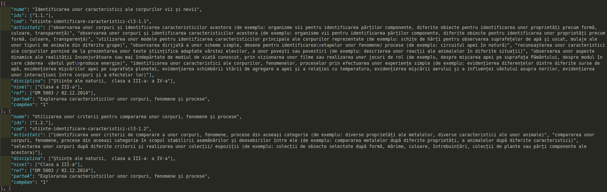

# Array.prototype.reduce()

Metoda ia primul element al array-ului a cărui valoare este procesată de o funcție. Valorii rezultate i se va adăuga rezultatul procesării rând pe rând a tuturor elementelor rămase. Această primă valoare obținută se numește **acumulator**. Fiecare element al array-ului va fi procesat de funcția pasată metodei ca prim argument, iar rezultatul va fi adăugat incremental acumulatorului.

Metoda primește drept argumente o funcție callback și o valoare opțională de pornire, care va fi semnătura acumulatorului, fiind opțională. Trebuie reținut faptul că array-ul pe care se face *reducerea* poate fi constituit din elemente care pot fi orice valoare (number, null, undefined, array, object, promise).

## Mică istorie

Limbajul a avut dintotdeauna enunțul `for`. Folosindu-l, poți parcurge foarte ușor un array aplicând anumite transformări pe fiecare element în parte.

```javascript
var colectie = ["unu", "doi", "trei"];
for (var i = 0; i < colectie.length; i++) {
  console.log(colectie[i]);
};
```

Odată cu versiunea a cincea a standardului, apare `forEach`, ca nouă metodă oferită de prototipul obiectului intern `Array`. Codul de mai sus poate fi rescris astfel:

```javascript
var colectie = ["unu", "doi", "trei"];
colectie.forEach(function(element){
  console.log(element);
});
```

Ce-i nou? Faptul că `forEach` gestionează *modelarea* fiecărui element din array folosind o funcție cu rol de callback.

Reduce construiește pe ceea ce oferă `forEach` și `map`, ducând mai departe posibilitățile de procesare prin utilizarea unei structuri de date cu rol de acumulator și a unor mecanisme ce permit o filtrare a datelor pe măsură ce acestea sunt prelucrate. Pe lângă callback, `reduce` poate primi opțional, o valoare de inițiere.

## Reduce în practică

Funcția callback primește patru argumente și se va aplica pe fiecare element al array-ului cu excepția primului element din array:

-   `acumulator`: este valoarea acumulată până la momentul următoarei execuții a callback-ului,
-   `currentValue`: este elementul curent procesat,
-   `currentIndex`: indexul elementului care tocmai este procesat și pornește de la valoarea `0`, dacă `reduce` are cel de-al doilea parametru. Dacă nu, pornește de la `1`.
-   `arrayOriginal`: chiar obiectul care trebuie parcurs.

Denumirile parametrilor funcției callback sunt arbitrar alese. Poți pune ce denumiri ți se par cel mai relevante pentru înțelegerea codului. Dacă nu sunt necesare, ultimele două argumente din cele patru pot fi omise.

În cazul în care valoarea de inițiere (array sau obiect) nu este introdusă, valoarea acumulatorului va fi prima din array-ul de prelucrat. Acest element va fi luat în calcul pentru cea de-a doua execuție a callback-ului.

```javascript
['unu', 'doi', 'trei'].reduce( function (acumulator, elementulDeLucru, index, arrOriginal) {
  return acumulator;
});// este returnată prima valoare din array
```

Dacă nu este dată o valoare de inițializare, acumulatorul va fi prima valoare din array, iar `currentValue`, cea de-a doua. Când ai astfel de construcții, de regulă operezi cu valori primare dintr-un array. Un lucru foarte important este acela că obiectul acumulator, fie aceasta un obiect sau array, trebuie returnat din funcția aplicată.

În cazul următoarei secvențe de cod, elementul de start va fi un obiect gol.

```javascript
['unu', 'doi', 'trei'].reduce(function (acumulator, elementulDeLucru, index, arrOriginal) {
  return acumulator;
}, {});
// este returnată chiar valoarea de pornire: {}
```

Observă faptul că valoarea inițială a acumulatorului este cel de-al doilea argument. În cazul în care se introduce valoarea de pornire, aceasta va fi acumulatorul, iar prima valoare din array-ul de prelucrare va fi `currentValue`. Când pasezi ca argument opțional un obiect, valorile elementelor array-ului devin cheile obiectului nou creat.

## Mantre

-   `reduce` se mai numește și `fold`, adică o funcție care *pliază* valori prin prelucrarea lor pe un rezultat existent,
-   `[1,2,3].reduce(reducător, valoareInitiala)` este, de fapt, o expresie care va fi evaluată la o singură valoare finală a acumulatorului,
-   callback-ul primește patru argumente: `acumulator`, `valoareaDeLucru`, `indexCurent`, `ÎntregulArray`,
-   când este primită ca argument valoarea opțională, aceasta devine `acumulator`,
-   funcția trebuie neapărat să returneze acumulatorul.

## Reduce în practică

Al doilea argument opțional va juca rolul de acumulator la prima invocare a callback-ului. Va fi valoarea de la care se pornește. Poate fi un array, un obiect sau o valoare, cum ar fi `0`. Depinde de valoarea de la care dorești să pornești.

```javascript
var valoriNoi = [1, 2, 3].reduce(function (acumulator, valoarea) {
  acumulator += valoarea;
  return acumulator;
}, 0);
console.log(valoriNoi); // 6
```

Am pornit de la `0`, așa cum am specificat ca al doilea argument după callback. La prima iterație lui `0` i s-a adunat valoarea `1`. Valoarea acumulatorului este returnată și astfel, valoarea variabilei `valoriNoi`, devine `1`. La a doua iterație,acumulatorului `i` se adăugă valoarea `2` și astfel acumulatorul devine `3`. Valoarea acumulatorului este returnată și astfel, variabila `valoriNoi` devine `3`. La ultima iterație, valorii `3` pe care o are acumulatorul, `i` s-a adăugat valoarea `3`, ceea ce a rezultat un acumulator care a finalizat parcurgerea array-ului cu valoarea de `6`. Acumulatorul este returnat și astfel, valoarea variabilei `valoriNoi` este suprascrisă cu `6`. După cum ai observat, în cazul nostru, variabila `valoriNoi` este suprascrisă de fiecare dată când o iterație s-a încheiat.

Dacă nu este dată o valoare opțională de start ca al doilea argument după callback, `previousValue`, acumulatorul va fi prima valoare din array-ul nou format, iar `currentValue` va fi cea de-a doua.

```javascript
['unu', 'doi', 'trei'].reduce(function(a, b){ return ceva; },{});
// Prima dată, a va fi obiectul opțional {}, iar b va fi array[0], adică primul element din array
// A doua oară, a va fi rezultatul returnat de funcție, iar b va fi array[1]
// A treia oară, a va fi rezultatul returnat de funcție, iar b ca fi array[2]
```

## Reduce pe array-uri

Dacă array-ul este gol și nu este dată o valoare de pornire `initialValue`, atunci va fi emisă o eroare `TypeError`.
Dacă array-ul are o singură valoare indiferent de poziția acesteia și nu este oferită o valoare `initialValue` sau dacă `initialValue` este dată, dar array-ul este gol, atunci valoarea unică va fi returnată fără a fi invocat callback-ul.

```javascript
[0, 1, 2, 3, 4].reduce(function(previousValue, currentValue, currentIndex, array) {
  return previousValue + currentValue;
}); // 10
```

|                  | previousValue | currentValue | currentIndex | array            | valoarea returnată |
|:---------------- |:------------- |:------------ |:------------ |:---------------- |:------------------ |
| prima invocare   | 0             | 1            | 1            | \[0, 1, 2, 3, 4] | 1                  |
| a doua invocare  | 1             | 2            | 2            | \[0, 1, 2, 3, 4] | 3                  |
| a treia invocare | 3             | 3            | 3            | \[0, 1, 2, 3, 4] | 6                  |
| a patra invocare | 6             | 4            | 4            | \[0, 1, 2, 3, 4] | 10                 |

Rezultatul lui `reduce` este la final 10. Varianta ES6 arată astfel:

```javascript
[0, 1, 2, 3, 4].reduce( (previousValue, currentValue) => prev + curr );
```

Dacă s-ar oferi o valoare inițială pentru al doilea argument, am avea următorul exemplu.

```javascript
[0, 1, 2, 3, 4].reduce(function (previousValue, currentValue, currentIndex, array) {
  return previousValue + currentValue;
}, 10);
```

|                  | previousValue | currentValue | previousIndex | array            | valoarea returnată |
|:---------------- |:------------- |:------------ |:------------- |:---------------- |:------------------ |
| prima invocare   | 10            | 0            | 0             | \[0, 1, 2, 3, 4] | 10                 |
| a doua invocare  | 10            | 1            | 1             | \[0, 1, 2, 3, 4] | 11                 |
| a treia invocare | 11            | 2            | 2             | \[0, 1, 2, 3, 4] | 13                 |
| a patra invocare | 13            | 3            | 3             | \[0, 1, 2, 3, 4] | 16                 |
| a patra invocare | 16            | 4            | 4             | \[0, 1, 2, 3, 4] | 20                 |

Un exemplu de calcul pentru generarea unui obiect care să conțină pentru fiecare valoare a elementelor din array, pătratul lor:

```javascript
[1, 2, 3, 4, 5].reduce(function (a, b) {
  a[b] = b * b;
  return a;
},{});
// { 1: 1, 2: 4, 3: 9, 4: 16, 5: 25 }
```

| \[1,2,3,4,5]      | previousValue               | currentValue | currentIndex | valoarea returnată                 |
|:----------------- |:--------------------------- |:------------ |:------------ |:---------------------------------- |
| prima invocare    | {}                          | 1            | 0            | { 1: 1 }                           |
| a doua invocare   | { 1: 1 }                    | 2            | 1            | { 1: 1, 2: 4 }                     |
| a treia invocare  | { 1: 1, 2: 4 }              | 3            | 2            | { 1: 1, 2: 4, 3: 9 }               |
| a patra invocare  | { 1: 1, 2: 4, 3: 9 }        | 4            | 3            | { 1: 1, 2: 4, 3: 9, 4: 16 }        |
| a cincea invocare | { 1: 1, 2: 4, 3: 9, 4: 16 } | 5            | 4            | { 1: 1, 2: 4, 3: 9, 4: 16, 5: 25 } |

### Numără de câte ori apare un cuvânt

Exemplul de mai jos ia un array și returnează un obiect. Se observă că fiecare element de array devine cheie în noile perechi create în obiect. Adu-ți aminte mereu că în lucrul cu obiecte ca acumulator, dacă funcția de prelucrare a obiectului nu face ceva special, valorile elementelor array-ului devin cheile acumulatorului.

```javascript
var colectie = ['mânătărci', 'bureți', 'gălbiori', 'ghebe', 'mânătărci', 'bureți', 'gălbiori', 'mânătărci'];

/** 1. Varianta defalcată */
var valoareaDeStart = {};
var reducator = function (acumulator, cuvant) {
  if (!acumulator[cuvant]) {
    acumulator[cuvant] = 1;
  } else {
    // acumulator[cuvant] = acumulator[cuvant] + 1;
    acumulator[cuvant] += 1;
  }
  return acumulator;
};
var rezultat = colectie.reduce(reducator, valoareaDeStart);
console.log(rezultat);

/** 2. Varianta contrasă */
function numaraDuplicatele(){
  return colectie.reduce(function(acumulator, element){
    acumulator[element] = (acumulator[element] + 1) || 1;
    // adaugă un element in obiectul construit având cheia
    // tot[element] cu valoarea 1 pentru un element unic
    // dacă elementul este întâlnit și a doua oară este
    // suprascrisă valoarea de la cheia găsită din nou tot[element] + 1)
    return tot;
  }, {});
};
numaraDuplicatele();
//{ mânătărci: 3, bureți: 2, gălbiori: 2, ghebe: 1 }
```

### Ordonarea cuvintelor după litera cu care încep - dicționar

```javascript
var colectie = ["Constanța", "Bărcănești", "Sinaia", "Călimănești", "Bacău", "Oradea", "Cluj", "Baia Mare"];
var alfabetic = colectie.reduce(function(acumulator, cuvant){
  if(!acumulator[cuvant[0]]){
    acumulator[cuvant[0]] = [];
  }
  acumulator[cuvant[0]].push(cuvant);
  return acumulator;
},{});
// { C: [ 'Constanța', 'Călimănești', 'Cluj' ],
//   B: [ 'Bărcănești', 'Bacău', 'Baia Mare' ],
//   S: [ 'Sinaia' ],
//   O: [ 'Oradea' ] }
```

### Aplatizarea unui array de array-uri:

Chiar dacă în cazul array-urilor avem la îndemână în acest moment metoda `flat()`, în scop didactic, vom simula funcționarea lui `flat` folosind `reduce`.

```javascript
var plat = [[0, 1], [2, 3], [4, 5]].reduce(function(previousValue, currentValue) {
  return previousValue.concat(currentValue);
}, []); // aplatizat este: [0, 1, 2, 3, 4, 5]
```
 Un alt exemplu folosind toate argumentele callback-ului.

```javascript
var texte = [["Gică", "Georgică"], "Abramburica", ["Nadia", "Ana"]].reduce(function (previousValue, currentValue, currentIndex, array) {
  return previousValue.concat(currentValue);
}, []); // Array [ "Gică", "Georgică", "Abramburica", "Nadia", "Ana" ]
```

### Folosirea `rest parameters`

Folosirea `rest parameters`, adică o sintaxă ce permite extragerea unui `Array` din argumentele pasate unei funcții simplifică mult operațiunile. Această sintaxă constă în adăugarea unui nume de parametru prefixat de trei puncte de suspensie. Această sintaxă generează un `Array` adevărat, nu un *array-like* așa cum este `arguments`.

Un exemplu de transformare a funcționalității unei funcții construite clasic, care face suma tuturor argumentelor (`arguments`) cu excepția primului, care va fi folosit drept multiplicator pentru suma obținută. Acest exemplu este oferit de Nicolás, un consultant JavaScript din Buenos Aires, Argentina în explicarea conceptelor noi pe care le introduce ECMAScript 2015 - [ES6 Spread and Butter in Depth](https://ponyfoo.com/articles/es6-spread-and-butter-in-depth).

```javascript
function faSumaSiDubleaza(){
  var setNumere = Array.prototype.slice.call(arguments);
  // constituie array-ul transformand arguments; slice „taie” de la 0 până la capăt
  var multiplicator = setNumere.shift();
  // setarea cifrei care va reprezenta multiplicatorul
  var referinta = setNumere.shift();
  // reținerea primei cifre din array
  var insumare = setNumere.reduce( (previousValue, currentValue) => previousValue + currentValue, referinta );
  return multiplicator * insumare;
};
var total = faSumaSiDubleaza(34,10,2,30,12);
console.log(total); // 1836
```

### Căutarea celui mai lung string dintr-un array de șiruri.

Varianta clasică ar fi să faci o funcție care trece în buclă fiecare element al array-ului căreia îi pasezi array-ul cu șiruri.

Condiții:

-   inițiezi o variabilă contor,
-   inițiezi o variabilă care va ține valoarea celui mai mare șir,
-   contorul să fie mai mic decât valoarea dimensiunii array-ului,
-   preincrementezi contorul înainte de orice ai face pe fiecare ciclu.

Testezi dacă dimensiunea șirului (element al array-ului) este mai mare decât dimensiunea șirului găsit anterior.

-   DA -> atunci valoarea lui `celMaiLung` este suprascrisă cu noua valoare;
-   NU -> returnează valoarea lui `celMaiLung`;
-   Aceeași operațiune de comparare se face pentru toate elementele array-ului cu valoarea găsită anterior până când este păstrată cea mai mare.

```javascript
var colectie = ['ceva', 'altceva', 'telejurnal', 'agave'];
function cautaSirLung (colectie) {
  for(var i = 0, celMaiLung = ''; i < colectie.length; ++i){
    if(colectie[i].length > celMaiLung.length){
      celMaiLung = colectie[i];
    } else {
      return celMaiLung;
    };
  };
};
cautaSirLung(colectie); // telejurnal
```

Varianta folosind `reduce`:

```javascript
function cautaSirLung(colectie){
  return colectie.reduce(function(celMaiLung, valoareCurenta){
    return valoareCurenta.length > celMaiLung.length ? valoareCurenta : celMaiLung;
  }, '');
};
cautaSirLung(colectie); // telejurnal
```

Acum ar fi util să cunoaștem indexul celui mai lung șir de caractere.

```javascript
function cautaSirLung(colectie){
  return colectie.reduce(function(celMaiLung, valoareCurenta, index){
    return valoareCurenta.length > celMaiLung.valoare.length ? {index: index, valoare: valoareCurenta} : celMaiLung;
  }, {index: -1, valoare: ''});
};
cautaSirLung(colectie); // Object { index: 2, valoare: "telejurnal" }
```

## Reduce pe array-uri de obiecte

Metoda `reduce` are aplicativitate și în lucrul cu array-uri ale căror elemente sunt obiecte.

### Reduce pentru selectare după criterii specificate printr-un obiect opțional.

În următorul exemplu putem culege date din elementele obiect ale array-ului pentru a constitui ordonări, clasificări și chiar statistici.

```javascript
var colectie = [
  {clasa: 'cervide', sex: 'masculin', varsta: 10},
  {clasa: 'cervide', sex: 'masculin', varsta: 8},
  {clasa: 'cervide', sex: 'masculin', varsta: 12},
  {clasa: 'cervide', sex: 'feminin', varsta: 4},
  {clasa: 'cervide', sex: 'feminin', varsta: 2},
];
colectie.reduce(function(colectie, element, index){
  colectie[element.sex].push(element);
  return colectie;
},{masculin: [], feminin: []});
// Object { masculin: Array[3], feminin: Array[2] } --> fiecare array conține obiectele
```

În cazul extragerii de date într-un obiect nou folosid o colecție de obiecte, apare o problemă de care vă veți lovi. În cazul în care `reduce` întâlnește două obiecte în colecție, iar valoarea unei proprietăți este identică, ceea ce va fi introdus în acumulator sunt valorile ultimului obiect întâlnit. Pentru a ilustra, am imaginat o colecție de cărți care cuprinde mai multe exemplare dintr-un titlu. Este observabil că indiferent câte exemplare am avea, în obiectul final este raportat doar unul singur care va purta datele ultimului exemplar.

```javascript
const colecție = [
    {id: 10, titlu: "Undeva, cândva",      'împrumutată': true },
    {id: 23, titlu: "Undeva, cândva",      'împrumutată': false},
    {id: 4,  titlu: "Unde mergem diseară", 'împrumutată': true },
    {id: 5,  titlu: "Unde mergem diseară", 'împrumutată': true },
    {id: 34, titlu: "Ana",                 'împrumutată': false}
  ];
  const titluri = colecție.reduce((acumulator, carte) => {
    acumulator[carte.titlu] = []; // în cazul înregistrărilor cu valori identice, array-ul este suprascris
    // rezolvare: acumulator[carte.titlu] = acumulator[carte.titlu] || [];
    acumulator[carte.titlu].push({id: carte.id, împrumutată: carte.împrumutată});
    return acumulator;
  }, {});

  console.log(titluri);

/*
{ 
  "Undeva, cândva": [ 
    { 
      "id": 23, 
      "împrumutată": false 
    } 
  ], 
  "Unde mergem diseară": [ 
    { 
      "id": 5, 
      "împrumutată": true 
    } 
  ], 
  "Ana": [ 
    { 
      "id": 34, 
      "împrumutată": false 
    } 
  ] 
} 
*/
```

Acest lucru se petrece pentru că array-ul pe care dorim să-l completăm cu elementele specifice fiecărui exemplar, de fapt este suprascris în cazul prprietăților obiectului de prelucrat care au aceeași valoare. Rezolvarea este să indici elementul din noul array format în care să fie adăugate elementele specifice, iar dacă acest array nu există, să fie creat: `acumulator[carte.titlu] = acumulator[carte.titlu] || [];`. Reține faptul că pentru a acumula valori diferite ale unei proprietăți cu aceeași valoare, trebuie să indici aceeași *adresă* din obiectul care se constituie.

Rezultatul așteptat va fi cel dorit:

```javascript
{ 
  "Undeva, cândva": [ 
    { 
      "id": 10, 
      "împrumutată": true 
    }, 
    { 
      "id": 23, 
      "împrumutată": false 
    } 
  ], 
  "Unde mergem diseară": [ 
    { 
      "id": 4, 
      "împrumutată": true 
    }, 
    { 
      "id": 5, 
      "împrumutată": true 
    } 
  ], 
  "Ana": [ 
    { 
      "id": 34, 
      "împrumutată": false 
    } 
  ] 
} 
```

### Folding pe o proprietate a unui obiect/înregistrare/câmp

Uneori ai nevoie să faci ceea ce se numește **împăturire**. Să presupunem că din teren culegi date care aparțin aceluiași set. Ceea ce ai dori la final este să transformi setul într-o singură înregistrare, iar toate elementele care se diferențiază ca parte a unui subset prezentat ca un array.

Exemplu de date ar fi un CSV care adună toate activitățile pe care le poate avea o competență specifică a unei discipline dintr-un anumit an în domeniul educației.


Un fragment din aceste date după cum urmează:

```csv
nume,ids,cod,activitate,disciplină,nivel,act normativ,competență generală,număr competența generală
Identificarea unor caracteristici ale corpurilor vii și nevii,1.1.,stiinte-identificare-caracteristici-cl3-1.1,"observarea unor corpuri și identificarea caracteristicilor acestora (de exemplu: organisme vii pentru identificarea părților componente, diferite obiecte pentru identificarea unor proprietăți precum formă, culoare, transparență)","Științe ale naturii,  clasa a III-a- a IV-a",Clasa a III-a,OM 5003 / 02.12.2014,"Explorarea caracteristicilor unor corpuri, fenomene și procese",1
Identificarea unor caracteristici ale corpurilor vii și nevii,1.1.,stiinte-identificare-caracteristici-cl3-1.1,"utilizarea unor modele pentru identificarea caracteristicilor principale ale corpurilor reprezentate (de exemplu: schițe de hărți pentru observarea suprafețelor de apă și uscat, mulaje ale unor tipuri de animale din diferite grupe)","Științe ale naturii,  clasa a III-a- a IV-a",Clasa a III-a,OM 5003 / 02.12.2014,"Explorarea caracteristicilor unor corpuri, fenomene și procese",1
Identificarea unor caracteristici ale corpurilor vii și nevii,1.1.,stiinte-identificare-caracteristici-cl3-1.1,"observarea dirijată a unor scheme simple, desene pentru identificarea
etapelor unor fenomene/ procese (de exemplu: circuitul apei în natură)","Științe ale naturii,  clasa a III-a- a IV-a",Clasa a III-a,OM 5003 / 02.12.2014,"Explorarea caracteristicilor unor corpuri, fenomene și procese",1
Identificarea unor caracteristici ale corpurilor vii și nevii,1.1.,stiinte-identificare-caracteristici-cl3-1.1,"recunoașterea unor caracteristici ale corpurilor pornind de la prezentarea unor texte științifice adaptate vârstei elevilor, a unor povești sau povestiri (de exemplu: descrierea unor reacții ale animalelor în diferite situații)","Științe ale naturii,  clasa a III-a- a IV-a",Clasa a III-a,OM 5003 / 02.12.2014,"Explorarea caracteristicilor unor corpuri, fenomene și procese",1
Identificarea unor caracteristici ale corpurilor vii și nevii,1.1.,stiinte-identificare-caracteristici-cl3-1.1,"observarea unor aspecte dinamice ale realității înconjurătoare sau mai îndepărtate de mediul de viață cunoscut, prin vizionarea unor filme sau realizarea unor jocuri de rol (de exemplu, despre mișcarea apei pe suprafața Pământului, despre modul în care căderea  vântul pot
produce energie)","Științe ale naturii,  clasa a III-a- a IV-a",Clasa a III-a,OM 5003 / 02.12.2014,"Explorarea caracteristicilor unor corpuri, fenomene și procese",1
Identificarea unor caracteristici ale corpurilor vii și nevii,1.1.,stiinte-identificare-caracteristici-cl3-1.1,"identificarea unor caracteristici ale corpurilor, fenomenelor, proceselor prin efectuarea unor experiențe simple (de exemplu: evidențierea diferențelor dintre diferite surse de apă, evidențierea mișcărilor apei pe suprafața planetei, evidențierea schimbării stării de agregare a apei și a relației cu temperatura, evidențierea mișcării aerului și a influenței vântului asupra norilor, evidențierea unor interacțiuni între corpuri și a efectelor lor)","Științe ale naturii,  clasa a III-a- a IV-a",Clasa a III-a,OM 5003 / 02.12.2014,"Explorarea caracteristicilor unor corpuri, fenomene și procese",1
"Utilizarea unor criterii pentru compararea unor corpuri, fenomene și procese",1.2.,stiinte-identificare-caracteristici-cl3-1.2,"identificarea unor criterii de comparare a unor corpuri, fenomene, procese din aceeași categorie (de exemplu: diverse proprietăți ale metalelor, diverse caracteristici ale unor animale)","Științe ale naturii,  clasa a III-a- a IV-a",Clasa a III-a,OM 5003 / 02.12.2014,"Explorarea caracteristicilor unor corpuri, fenomene și procese",1
"Utilizarea unor criterii pentru compararea unor corpuri, fenomene și procese",1.2.,stiinte-identificare-caracteristici-cl3-1.2,"compararea unor corpuri, fenomene, procese din aceeași categorie în scopul stabilirii asemănărilor și deosebirilor între ele (de exemplu: compararea metalelor după diferite proprietăți, a animalelor după diferite caracteristici)","Științe ale naturii,  clasa a III-a- a IV-a",Clasa a III-a,OM 5003 / 02.12.2014,"Explorarea caracteristicilor unor corpuri, fenomene și procese",1
"Utilizarea unor criterii pentru compararea unor corpuri, fenomene și procese",1.2.,stiinte-identificare-caracteristici-cl3-1.2,"selectarea unor corpuri după diferite criterii și realizarea unor colecții/ expoziții (de exemplu: colecții de obiecte selectate după formă, mărime, culoare, întrebuințări, colecții de plante sau părți componente ale acestora)","Științe ale naturii,  clasa a III-a- a IV-a",Clasa a III-a,OM 5003 / 02.12.2014,"Explorarea caracteristicilor unor corpuri, fenomene și procese",1
Identificarea etapelor unui demers investigativ vizând mediul înconjurător pe baza unui plan dat,2.1.,stiinte-identificare-caracteristici-cl3-2.1,formularea unor întrebări ce duc la necesitatea unei investigații pentru aflarea răspunsului (de exemplu: „Planta are nevoie de lumină pentru a trăi?”),"Științe ale naturii,  clasa a III-a- a IV-a",Clasa a III-a,OM 5003 / 02.12.2014,Investigarea mediului înconjurător folosind instrumente și procedee specifice,2
Identificarea etapelor unui demers investigativ vizând mediul înconjurător pe baza unui plan dat,2.1.,stiinte-identificare-caracteristici-cl3-2.1,"identificarea metodelor de lucru (de exemplu: observarea a două plante de același tip, crescute în condiții identice, dar cu iluminare diferită)","Științe ale naturii,  clasa a III-a- a IV-a",Clasa a III-a,OM 5003 / 02.12.2014,Investigarea mediului înconjurător folosind instrumente și procedee specifice,2
Identificarea etapelor unui demers investigativ vizând mediul înconjurător pe baza unui plan dat,2.1.,stiinte-identificare-caracteristici-cl3-2.1,"stabilirea resurselor necesare (de exemplu: două ghivece cu mușcate plantate în același tip de sol, apă, hârtie închisă la culoare)","Științe ale naturii,  clasa a III-a- a IV-a",Clasa a III-a,OM 5003 / 02.12.2014,Investigarea mediului înconjurător folosind instrumente și procedee specifice,2
Identificarea etapelor unui demers investigativ vizând mediul înconjurător pe baza unui plan dat,2.1.,stiinte-identificare-caracteristici-cl3-2.1,implicarea în alegerea modalităților de lucru (individual/ în grup),"Științe ale naturii,  clasa a III-a- a IV-a",Clasa a III-a,OM 5003 / 02.12.2014,Investigarea mediului înconjurător folosind instrumente și procedee specifice,2
Identificarea etapelor unui demers investigativ vizând mediul înconjurător pe baza unui plan dat,2.1.,stiinte-identificare-caracteristici-cl3-2.1,"realizarea unor estimări, predicții asupra subiectului supus investigației (de exemplu: vor exista/ nu vor exista diferențe între cele două plante, exemple de posibile diferențe)","Științe ale naturii,  clasa a III-a- a IV-a",Clasa a III-a,OM 5003 / 02.12.2014,Investigarea mediului înconjurător folosind instrumente și procedee specifice,2
```

Ceea ce observați este câmpul `ids` care are un prim identificator comun mai multor înregistrări. Toate câmpurile sunt identice mai puțin cel `activitate`. Rezultatul la care dorim să ajungem este ca o singură înregistrare pentru un identificator unic, care să adune într-un array, activitățile.



```json
[{
    "nume": "Identificarea unor caracteristici ale corpurilor vii și nevii",
    "ids": ["1.1."],
    "cod": "stiinte-identificare-caracteristici-cl3-1.1",
    "activitati": ["observarea unor corpuri și identificarea caracteristicilor acestora (de exemplu: organisme vii pentru identificarea părților componente, diferite obiecte pentru identificarea unor proprietăți precum formă, culoare, transparență)", "observarea unor corpuri și identificarea caracteristicilor acestora (de exemplu: organisme vii pentru identificarea părților componente, diferite obiecte pentru identificarea unor proprietăți precum formă, culoare, transparență)", "utilizarea unor modele pentru identificarea caracteristicilor principale ale corpurilor reprezentate (de exemplu: schițe de hărți pentru observarea suprafețelor de apă și uscat, mulaje ale unor tipuri de animale din diferite grupe)", "observarea dirijată a unor scheme simple, desene pentru identificarea\netapelor unor fenomene/ procese (de exemplu: circuitul apei în natură)", "recunoașterea unor caracteristici ale corpurilor pornind de la prezentarea unor texte științifice adaptate vârstei elevilor, a unor povești sau povestiri (de exemplu: descrierea unor reacții ale animalelor în diferite situații)", "observarea unor aspecte dinamice ale realității înconjurătoare sau mai îndepărtate de mediul de viață cunoscut, prin vizionarea unor filme sau realizarea unor jocuri de rol (de exemplu, despre mișcarea apei pe suprafața Pământului, despre modul în care căderea  vântul pot\nproduce energie)", "identificarea unor caracteristici ale corpurilor, fenomenelor, proceselor prin efectuarea unor experiențe simple (de exemplu: evidențierea diferențelor dintre diferite surse de apă, evidențierea mișcărilor apei pe suprafața planetei, evidențierea schimbării stării de agregare a apei și a relației cu temperatura, evidențierea mișcării aerului și a influenței vântului asupra norilor, evidențierea unor interacțiuni între corpuri și a efectelor lor)"],
    "disciplina": ["Științe ale naturii,  clasa a III-a- a IV-a"],
    "nivel": ["Clasa a III-a"],
    "ref": ["OM 5003 / 02.12.2014"],
    "parteA": "Explorarea caracteristicilor unor corpuri, fenomene și procese",
    "compGen": "1"
}, {
    "nume": "Utilizarea unor criterii pentru compararea unor corpuri, fenomene și procese",
    "ids": ["1.2."],
    "cod": "stiinte-identificare-caracteristici-cl3-1.2",
    "activitati": ["identificarea unor criterii de comparare a unor corpuri, fenomene, procese din aceeași categorie (de exemplu: diverse proprietăți ale metalelor, diverse caracteristici ale unor animale)", "compararea unor corpuri, fenomene, procese din aceeași categorie în scopul stabilirii asemănărilor și deosebirilor între ele (de exemplu: compararea metalelor după diferite proprietăți, a animalelor după diferite caracteristici)", "selectarea unor corpuri după diferite criterii și realizarea unor colecții/ expoziții (de exemplu: colecții de obiecte selectate după formă, mărime, culoare, întrebuințări, colecții de plante sau părți componente ale acestora)"],
    "disciplina": ["Științe ale naturii,  clasa a III-a- a IV-a"],
    "nivel": ["Clasa a III-a"],
    "ref": ["OM 5003 / 02.12.2014"],
    "parteA": "Explorarea caracteristicilor unor corpuri, fenomene și procese",
    "compGen": "1"
}]
```

O posibilă soluție de folding - *împăturire* ar fi următoarea:

```javascript
const y = x.reduce((arrAcc, elemArrOrig, idx, srcArr) => {
    if (arrAcc.length === 0) {
        arrAcc[idx] = elemArrOrig;
    }
    if (arrAcc.slice(-1)[0].ids[0] === elemArrOrig.ids[0]) {
        elemArrOrig.activitati.forEach((act) => {
            arrAcc.slice(-1)[0].activitati.push(act);
        });
        // compara următorul obiect din array-ul originar cu cel din acumulator
        // dacă ids-urile corespund, adaugă activitatea la cel preexistent
        // dacă nu corespund, adaugă obiectul din array-ul original la acumulator.
    } else {
        arrAcc.push(srcArr[idx])
    }
    return arrAcc;
}, []);
```

## Compunerea cu map și filter

Pentru a explora compunerea utilă cu alte două metode utile pe care le putem aplica array-urilor, vom porni de la un array al cărui elemente sunt obiecte.

```javascript
const colecție = [
    {id: 10, titlu: "Undeva, cândva", 'împrumutată': true, pret: 10},
    {id: 23, titlu: "Undeva, cândva", 'împrumutată': false, pret: 12.3},
    {id: 4, titlu: "Unde mergem diseară", 'împrumutată': true, pret: 11}
  ];
  const suma = colecție.reduce((total, inregistrare) => total + inregistrare.pret, 0);

  console.log(suma); // 33.3
```

Totuși, ar fi mai util să simplificăm array-ul de pornire aplicând un `map` care are rolul de a genera un array simplificat constituit doar din valorile pe care dorim să le adunăm.

```javascript
const suma = colecție.map(inregistrare => inregistrare.pret).reduce((total, pret) => total + pret, 0);
```

## Resurse

- [Reduce Advanced - Part 4 of Functional Programming in JavaScript | YouTube](https://www.youtube.com/watch?v=1DMolJ2FrNY)
- [Understand JavaScript Reduce With 5 Examples | Valeri Karpov | http://thecodebarbarian.com](http://thecodebarbarian.com/javascript-reduce-in-5-examples.html)
