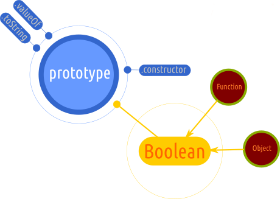

# `Boolean`

Este un constructor.
Este un obiect de „împachetare” a unei valori pasate, care va fi evaluată la în funcție de natura sa, la `true` sau `false`.

Proprietatea `length` a lui Boolean este 1.

Dacă valoarea pasată inițial este `0`, `-0`, `null`, `false`, `NaN`, `undefined` sau un șir gol "", valoarea obiectului creat de constructor va fi `false`.

Introducerea șirului de caractere `"false"`, va avea drept rezultat crearea unui obiect cu valoarea inițială `true`.

Valorile primare `true` / `false` nu trebuie confundate cu valorile obiectelor Boolean. Nu sunt același lucru.

```javascript
var ceva = new Boolean('false');
console.log(ceva); // Boolean { true }
```

Buna practică spune că trebuie evitată folosirea constructorului (apelarea cu `new`), în cazul în care este nevoie de a transforma o valoare care nu este boolean la una. Se va folosi apelarea simplă ca funcție pentru acest lucru.



## Metoda `Boolean.prototype.toString()`

Această metodă returnează șirul de caractere corespondent valorii de adevăr: "true" și/sau "false".

Metoda suprascrie `Object.prototype.toString()`.

## Metoda `Boolean.prototype.valueOf()`

Returnează primitiva obiectului `Boolean`.
Atenție, suprascrie `Object.prototype.valueOf()`.
