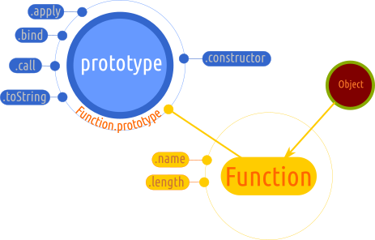

# Function

Este un constructor pentru funcții. Primele argumente introduse constituie parametrii formali ai viitoarei funcții iar ultimul argument va fi codul executabil.

## Spune standardul

Atunci când `Function` este apelat ca funcție și nu ca un constructor, este creat și inițializat un nou obiect `Function`. Astfel, apelul `Function()` este echivalent cu expresia care generează obiectul `Function`: `new Function()`.

Constructorul lui `Function` este în sine un obiect funcție built-in. Acest obiect capabil să stea drept constructor însuși obiectului intern `Function` a fost tratat în geneză și în materialul dedicat dualității obiect - funcție.

**Obiectul prototype al lui `Function` este în sine un obiect - funcție intern**. Acest lucru este încă acceptat pentru că trebuie asigurată compatibilitatea cu restul codului scris înainte de ECMAScript 2015.

`Function` nu poate fi constructor (nu are metoda internă `[[Construct]]`). Acest obiect nu are o proprietate `property`.

**Spune standardul**:

Funcțiile create folosind `Function.prototype.bind()` au următoarele sloturi interne:

-   `[[BoundTargetFunction]]` care este obiectul funcție împachetat,
-   `[[BoundThis]]`, fiind valoarea care este pasată întotdeauna ca `this` atunci când este apelată funcția împachetată.
-   `[[BoundArguments]]` este o listă de valori a cărei valori sunt folosite ca prime argumente pentru funcția împachetată apelată.

Nu au proprietatea `prototype` obiectele funcții care sunt create prin `Function.prototype.bind()` sau care au fost create prin evaluarea definirii unei simple metode (care nu este `Generator`) sau funcțiile arrow.
În exemplul alăturat, ultimul argument specifică codul executabil.

```javascript
var adunare = new Function("primulNr", "alDoileaNr", "return primulNr + alDoileaNr");
adunare(1, 2); // 3
```

Începând cu ES6 argumentele pasate constructorului pot fi manipulate astfel încât un argument să existe în funcție de existența altuia anterior.

```javascript
var functieNoua = new Function("unu", "doi = unu", "return unu + doi");
functieNoua(5); // 10
functieNoua(5, 4);  // 9
```

Pot fi folosiți și parametrii rest:

```javascript
var functieNoua = new Function('...intrari', 'return intrari[0]');
functieNoua('a','b','c','d'); // "a"
```



## Metode:

-   `Function.prototype.apply()`
-   `Function.prototype.bind()`
-   `Function.prototype.call()`
-   `Function.prototype.toString()`

### Function.prototype.apply()

Apelează o funcție căreia îi setează legătura `this` la obiectul precizat între paranteze . Argumentele destinate funcției pot fi un array.

Funcția este pur și simplu invocată în contextul indicat de primul argument al lui `apply`, pasându-se argumentele care sunt elementele array-ului din al doilea argument al lui `apply`:  `nume_funcție.apply(this, ['para1', 'para2'])`.

```javascript
"use strict";
function adunare (a, b) {
  console.log(a, b); // 10 5
  return this.a + this.b;
}
var obi = {
  a: 20,
  b: 1
}
var numere = [10, 5];
adunare.apply(obi, numere); // 21
```

Metoda primește două argumente:

-   o referință către un obiect, care devine și `this` pentru funcția apelată cu `apply()`,
-   o listă de argumente organizată ca array sau ceva ce seamănă cu un array (`array-like`).

Dacă nu este invocat *strict mode* (`"use strict";`), `null` și `undefined` în cazul primului argument, acesta va fi înlocuit cu obiectul global, iar dacă pasezi primitive, acestea vor fi *învelite* în obiectul corespondent (în limba engleză această operațiune este numită `boxing`).

Pentru parametrul listei de argumente se poate folosi și obiectul care seamănă ca un array: `arguments`. Acesta este un obiect care este disponibil mediului intern al funcției. Astfel, poți pasa toate argumentele în obiectul apelat, care trebuie să gestioneze aceste argumente.

Începând cu ECMAScript 5 se poate folosi orice obiect care este array-like pentru al doilea argument. Cazul cel mai util ar fi aplicațiile practice în lucrul cu API-ul DOM-ului. Aici ne gândim la obiectele `NodeList` ( [referința MDN](https://developer.mozilla.org/en-US/docs/Web/API/NodeList) ) returnate de `Node.childNodes` și `document.querySelectorAll`. Atenție, `NodeList` nu sunt array-uri și nu se pot invoca metodele din prototipul lui `Array`.

#### Metoda `apply()` în uz

Obiectul pasat ca și context de execuție este menționat între paranteze, fiind urmat de un array cuprinzând argumentele funcției.

Începând cu ECMAScript 5, array-ul argumentelor pasate poate fi un obiect care are caracteristicile unui array. Ca exemplu de tipologie este `arguments`, care este un obiect asemănător unui array disponibil în timpul execuției unei funcții.

Ține minte că și funcțiile interne (metode ale obiectelor interne), se pot bucura de avantajele folosirii lui `apply()`. În cazul obiectului intern `Math`:

```javascript
var numere = [12, 43, 32, 3];
var max = Math.max.apply(null, numere); // 43
// null setează la global scope this.
var min = Math.min.apply(null, numere); // 3
```

Atunci când este pasat ca prim argument valoarea `null`, funcția se va aplica direct pe argumentele pasate fără a face o legătură la `this`.

```javascript
"use strict";
function adunare (a, b) {
  return a + b;
}
var numere = [10, 5];
adunare.apply(null, numere);
```

În cazul obiectului intern `Array` putem crea un array *dens* (adică populat cu valori):

```javascript
Array.apply(null, Array(5)); // Array [ undefined, undefined, undefined, undefined, undefined ]
```

#### Folosirea lui Reflect.apply()

Poți folosi metoda `apply` a obiectului `Reflect` pentru a obține același rezultat. În acest caz, asigură-te că lista argumentelor nu este `null` sau `undefined`. În caz contrar, va fi indicată o eroare.

```javascript
var colectie = [1, 23, 43];
var celMaiMareFunct = Function.prototype.apply.call(Math.max, null, colectie);
var celMaiMareReflect = Reflect.apply(Math.max, null, colectie);
```

### Function.prototype.bind()

Returnează o funcție nouă a cărui `this` este setat la un obiect care trebuie să-l menționezi între paranteze urmat opțional de o secvență de argumente. Secvența de argumente introdusă de `bind()` are precedență asupra celor introduse la momentul apelării funcției.

```javascript
function incrementare (arg) {
  console.log(arg);
  console.log(arguments); //  { 0: 12, 1: 10, 2: 5, callee: incrementare(), length: 3, __proto__: Object }
  return arg + 1;
};
var adauga = incrementare.bind(null, 12, 10); // 12 suprascrie pe 5
console.log(adauga(5)); // 13
```

Standardul spune că funcțiile obiecte create folosind `Function.prototype.bind()` sunt **obiecte exotice**. Acest obiect funcție exotic împachetează funcția originală. Acest lucru mai înseamnă că nu au proprietatea `prototype`. Apelarea acestei împachetări conduce la apelarea funcției împachetate.

De cele mai multe ori se apelează la utilizarea lui `bind()` atunci când folosești metode puse la dispoziție de API-ul browserului. Cel mai la îndemână exemplu este `setTimeout`, care este o metodă a lui `window`, având `this` setat la window. Pentru a o face să performeze corect în contextul unui anumit obiect, trebuie legată de obiect prin `bind`.

Un exemplu cu aplicativitate directă este manipularea DOM-ului. Te ajută să te asiguri că vei referenția mereu obiectul `document` și pentru ca să nu scape bindingul lui `this` în obiectul global al JavaScript.

```javascript
var extrage = document.getElementById.bind(document, 'elementulX');
var elemX = extrage();
```

Un alt exemplu elocvent este întâlnit la gestionarea evenimentelor atunci când dorim să ne asigurăm că funcția cu rol de callback este *legată* corect de `this`-ul obiectului generat de elementul DOM.

```html
<button id="test2">Apasă-mă! 2</button>
<script>
  let state = {
    valoare: false,
    modificator: function modi () {
      this.valoare ? this.valoare = false : this.valoare = true;
      console.log(this.valoare);
    }
  };
  let but2 = document.querySelector('#test2');
  but2.addEventListener('click', state.modificator.bind(state));
</script>
```

### Function.prototype.call()

Apelează o funcție în contextul unui obiect precizat primul în argumente, urmat de menționarea parametrilor funcției unul după celălalt despărțiți prin virgule. Metoda setează legătura `this` la obiectul pasat. Argumentele de după specificarea lui `this` sunt pasate funcției apelată cu `call()`.

```javascript
function faCeva (arg){
  console.log('Am primit ' + arg);
};
faCeva.call(null, ['o banană', ' și un măr']);
// Am primit o banană, și un măr
```

În cazul în care funcția nu rulează sub regula `"use strict";`, iar primul argument în loc să fie un obiect, este `null` sau `undefined`, obiectul la care se va face legătura `this` va fi cel global. În cazul folosirii lui `"use strict";`, valoarea legăturii `this` va fi `undefined`.

```javascript
var ceva = 10;
function afisez () {
  'use strict'; // TypeError: this is undefined
  console.log(this.ceva);
}
afisez(); // 10 în cazul în care funcția rulează fără regulă
```

Metoda permite realizarea de adevărate interfețe, care expun proprietăți comune unor clase de obiecte diferite. De exemplu, am putea avea o interfață pentru `Vehicule`, de exemplu. Indiferent că am putea avea clase de obiecte precum `Avioane` sau `Nave`, potențial, acestea pot avea descriptori comuni precum `nume`, `naționalitate`.

```javascript
function Vehicule (nume, nationalitate) {
  this.nume = nume;
  this.nationalitate = nationalitate;
}

function Avion (nume, nationalitate) {
  Vehicule.call(this, nume, nationalitate);
  this.mediu = 'aer';
}

function Nava (nume, nationalitate) {
  Vehicule.call(this, nume, nationalitate);
  this.mediu = 'apa';
}

var IAR81 = new Avion('IAR81', 'RO');
// {mediu: "aer", nationalitate: "RO", nume: "IAR81"}
var FerdinandI = new Nava('Ferdinand I', 'RO');
// { nume: "Ferdinand I", nationalitate: "RO", mediu: "apa" }
```

Ceea ce am realizat este introducerea proprietăților comune din interfață în obiectele create în baza claselor diferite de vehicule.

### Function.prototype.toString()

Returnează un șir de caractere, care reprezintă codul sursă al acelei funcții.
