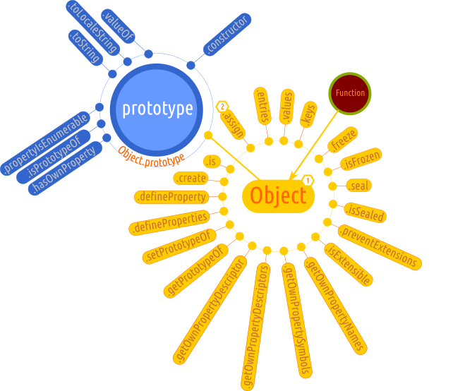

# Object

Este un obiect intern al Javascript caracterizat de standard ca fiind unul dintre cele fundamentale. Poate fi folosit pentru crearea de obiecte atunci când este nevoie de setarea unor detalii fine ale proprietăților acestora.
Creează un wrapper (un obiect ambalaj) pentru un obiect atunci când este instanțiat prin apelarea cu `new` a constructorului `Object`. Parafrazând o zicală românească, am putea spune că în acest moment „haina face pe om”. Acest wrapper spune că lucrăm cu un obiect.

## Mantre

-   `Object` este un constructor.
-   `Object` creează un wrapper pentru o anumită valoare. Dacă valoarea este `null` sau `undefined`, `Object` va crea și returna un obiect gol.
-   Dacă valoarea pasată nu este `null` sau `undefined`, `Object` va returna un obiect de tipul care corespunde valorii oferite.
-   Dacă valoarea este deja un obiect, va fi returnată valoarea.
-   Obiectul window are o metodă numită Object \[ function Object() ]. Motorul Javascript construiește automat metoda Obiect în obiectul window (`window.Object` returnează function Object()).
-   Toate obiectele în JavaScript descind din `Object`, își au originea în `Object`. Toate obiectele moștenesc metode și proprietăți din `Object.prototype`. Acestea pot fi suprascrise.
-   `Object.prototype` este un obiect în care poți adăuga propriile proprietăți și metode.
-   Modificările aduce obiectului `Object.prototype` se propagă către toate obiectele. Singura excepție este atunci când proprietățile și metodele supuse modificărilor nu sunt ele la rândul lor modificate mai departe în lanțul prototipal.
-   Proprietățile lui `Object` nu sunt `enumerable`. Deci, nu vor apărea în bucle `for...in` care nu ciclează doar proprietățile proprii.

## Spune standardul

Valoarea slotului intern `[[Prototype]]` a obiectului cu rol de prototype pentru Object este `null` iar valoarea slotului intern `[[Extensible]]` este `true`.

## Crearea obiectelor folosind constructorul `Object`

A. Crearea de obiecte goale

```javascript
const obiect = new Object();
const object = new Object(null);
const object = new Object(undefined);
```

B. Crearea de obiecte de un anumit tip

```javascript
// crearea de obiecte Boolean
const obiect = new Object(true);
const object = new Object(Boolean());
```



## Object.prototype.constructor

Indică funcția care stă la baza prototipului.

## Object.create()

Va crea un obiect având un obiect prototip și proprietăți care sunt specificate.

### Comportament la instanțierea obiectelor noi

Să luăm un exemplu simplu care va descoperi anumite comportamente în cazul lui `Object`.

```javascript
const animal = {
  caracteristici: {}
}; // Object.getPrototypeOf(animale) returnează prototype-ul lui Object
const vrabie = Object.create(animal);
// Object.getPrototypeOf(vrabie) returnează
// prototype-ul lui Object căruia i se adaugă
// proprietatea picioare: 4
vrabie.caracteristici.picioare = '2';
const crocodil = Object.create(animal);
crocodil.caracteristici.picioare = '4';
animal.caracteristici.picioare // 4
// implicit
vrabie.caracteristici.picioare // 4
```

Ceea ce se întâmplă în acest caz este că obiectele nou create sunt la concurență în a modifica un membru al prototipului: `animal.caracteristici.picioare`.

Pentru a evita un astfel de comportament, ai putea gândi ca pentru fiecare obiect nou creat, să setezi un obiect nou care că reprezinte atributele specifice ale fiecărui animal.

```javascript
const animal = {
  caracteristici: {}
};
const cal = Object.create(animal);
cal.caracteristici = {picioare: 4};
const cangur = Object.create(animal);
cangur.caracteristici = {picioare: 2};
```

Acest exemplu este limitat, pentru că în cazul în care setezi obiectul caracteristici în acest mod, îl vei rescrie ori de câte ori vei folosi o nouă instanțiere, care vine. La rândul său cu propriile-i caracteristici.

Soluția este de a renunța la setarea completă a obiectului `caracteristici` și setarea specifică a fiecărei proprietăți a obiectului `caracteristici` pentru fiecare dintre posibilitățile contribuite de obiectele create.

```javascript
const animal = {
  caracteristici: {}
};
const cal = Object.create(animal);
cal.caracteristici = {insusiri: {picioare: 4}};
const cangur = Object.create(animal);
cangur.caracteristici = {insusiri: {picioare: 2}};
```

Astfel, nu se vor mai înregistra schimbări în obiectul care servește drept prototip. În schimb, obiectele create vor moșteni și vor accesa pe baza lanțului prototipal proprietăți ale obiectului care a oferit prototipul.

Plus de asta `Object` permite crearea unui obiect specificând în mod direct atributele fiecărui membru prin pasarea unui obiect de configurare.

```javascript
const animal = {
  caracteristici: {}
};
const cal    = Object.create(animal, {caracteristici: {writable: true, configurable: true, value: {picioare: 4}}});
const cangur = Object.create(animal, {caracteristici: {writable: true, configurable: true, value: {picioare: 2}}});
```
