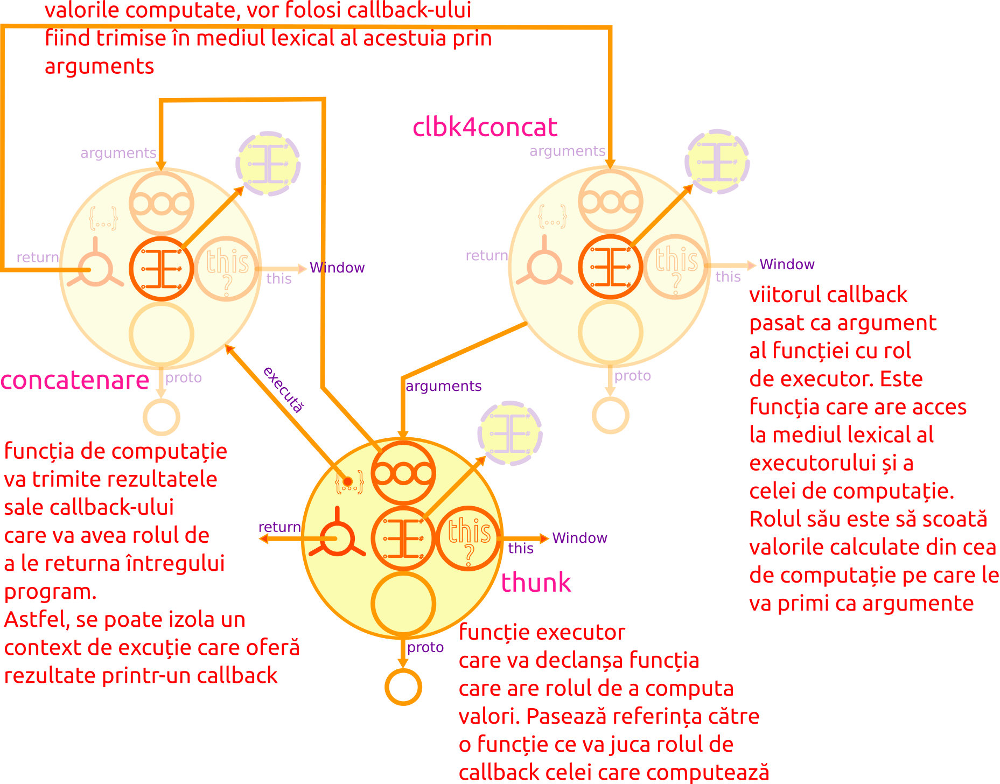

# Promise

Cea mai mare valoare individuală este timpul. Una din preocupările constante ale programatorului este aceea a gestionării timpilor de execuție printr-o succesiune eficientă a operațiunilor. Dincolo de aceste considerente abstracte, pentru moment, cel mai valoros lucru, atunci când scrii cod, este să poți întocmi o hartă mentală a execuției, care să jaloneze declarații, medii lexicale, apeluri și timpi de execuție. Această hartă este strâns legată de algoritmica programului, dar pe măsura complexității realizate, apar **necunoscute** care trebuie gestionate. Aceste **necunoscute** sunt legate de **timpul** necesar rezolvării anumitor evaluări care depind de alte resurse, unele aflate la distanță, iar altele poate necesitând computare. Vă mai aduceți aminte de faptul că o funcție are nevoie de valorile din mediul lexical sau obiectul context pentru a putea să-și execute codul din corp? Ce se întâmplă atunci când o resursă este la distanță sau în corpul funcției este apelată o alta care aparține unui API extern, așa cum sunt cele puse la dispoziție de browser. Cea mai prost scenariu ar implica blocarea firului de execuție al programului pentru a satisface toate condițiile necesare efectuării propriilor evaluări. Dar ce-ar fi dacă am proceda la trimiterea în *fundal* (*runtime-ul de execuție*) a acestor operațiuni care necesită timp și/sau efort pentru a fi soluționate. O astfel de funcție, ar ieși de pe scenă precum un actor care **promite** să revină după ce va lua din culise recuzita necesară. Publicul va rămâne *în așteptare* urmărind jocul celorlalți actori rămași.

Această operațiune de anticipare a unor rezultate în anumite cazuri este în strânsă legătură cu momentul în care se execută o anumită operațiune. Uneori, când soliciți niște date dintr-o sursă locală sau la distanță, serviciul responsabil poate să nu funcționeze. Sau datele să nu se fi generat dintr-o altă operațiune de prelucrare. În acest caz, vorbim de aspectele asincrone ale rulării codului. Toate aceste necunoscute, mici sincope, lucruri care nu pot fi stăpânite printr-o gândire pur algoritmică, au nevoie să fie gestionate cumva. Pot fi asemuite previziunii meteorologice prin care se încearcă anticiparea vremii. Cum în cazul programării este nevoie de un rezultat concret, aceste aprecieri ale posibilității obținerii sau nu a unui rezultat, poartă numele de **promisiuni**. O promisiune este o valoare care poate fi disponibilă **acum**, în **viitor** sau **niciodată**. Ceea ce se *promite* este faptul că vei primi un răspuns, fie acesta unul **pozitiv**, fie unul **negativ**.

Mulți practicieni apelează la comparația promisiunilor cu **IOU** -urile. Un IOU este o sintagmă în limba engleză: **I owe you** (**îți sunt dator** am traduce în română), care reglementează o realitate tranzacțională asemănătoare unor chitanțe sau AWB în cazul efectelor poștale. AWB-ul este un jeton pe care îl primești în urma achitării unui produs care urmează să-ți fie livrat. Produsul poate să-ți fie livrat după o perioadă (înregistrăm un **succes**) sau poți primi o explicație pentru problemele apărute la livrare (înregistrăm o **eroare**) însoțită de o posibilă rezolvare pentru problema apărută. În cazul AWB-urilor, poți urmări comanda și pentru o vreme vei vedea mesajul *în curs de livrare* - în engleză ar fi **pending**.

Mai există un termen care trebuie lămurit pentru că ne vom lovi de el adesea: **concurrency**, care s-ar traduce în limba română **concurență**, dar în contextul acestui limbaj de programare cu nuanța de **concomitent**. Kyle Simpson spune despre acest fenomen că două operațiuni în JavaScript se pot desfășura în aceeași fereastră de timp, dar asta nu înseamnă că se întâmplă în paralel. În JavaScript nimic nu se petrece în paralel pentru că avem un singur fir de execuție. În acest caz, se apelează la  prioritizarea execuției diverselor părți ale codului. Ce te faci când în lucrul curent, cu evenimente, multiple funcții încep evaluarea, iar unele au nevoie de valorile returnate de altele ș.a.m.d. În acest mediu înalt concurențial, avem deja componentele care reglează controlul programului: **stiva apelărilor**, **bucla evenimentelor** (*event loop*) și **coada sarcinilor** (*task queue*). Gestionarea acestui mediu concurențial, a introdus paradigma de lucru **asincron**. Pentru a rezolva mai elegant problema asincronicității dincolo de ceea ce pot oferi callback-urile, ES6 a introdus oficial conceptul de **promises** (promisiuni) în standard. Pe lângă *call stack*, *event loop* și *task queue*, promisiunile mai introduc un o coadă de așteptare proprie numită *microtask queue*, care are prioritate față de *task queue* în introducerea unor callback-uri în *event loop*.

**Standardul spune**:

> O promisiune este un obiect care este folosit ca locțiitor pentru rezultatele care ar putea apărea în urma unei computații întârziate (posibil asincronă).([25.4Promise Objects](http://www.ecma-international.org/ecma-262/7.0/index.html#sec-promise-objects)).

**Moment ZEN**: O promisiune este un obiect care *împachetează* o operațiune asincronă cu specificația că va returna un rezultat sau o eroare la un moment viitor.

## Scurt istoric

Promisiunile nu sunt un concept nou în programare. Trevor Burnham menționează în lucrarea sa *Async JavaScript* faptul că la începuturile ideilor de organizare a resurselor în rețea, ceea ce numim acum Internet, exista un proiect care s-a numit Xanadu programat în C++, unde apare ideea de promisiuni. Mai apoi sub conceptul **deferred** își face apariția și în alte limbaje de programare cum ar fi limbajul de programare **E** (era numit *futures*) și apoi Python. Wikipedia aduce o definiție și prin aceasta, în prim plan, câțiva termeni relevanți pentru înțelegerea promisiunilor:

> În domeniul informaticii, viitor («future»), promisiune («promise»), întârziere («delay») și amânare («deferred») se referă la constructe folosite pentru a sincroniza execuția programului în unele limbaje de programare care permit execuția concurențială. Aceștia descriu un obiect care se comportă ca un proxy «mecanism de delegare» pentru un rezultat care, inițial este necunoscut pentru că, în mod curent computarea valorii sale nu este încă încheiată.

Conform autorilor Wikipediei și lui Trevor Burnham, termenii de **promisiune**, **deferred** și **future** sunt folosiți interșanjabil.

Termenul de **promise** (promisiune) a fost propus în anul 1976, dar după adoptarea în Python, un pas a mai lipsit pentru a fi preluat ca practică și în JavaScript. Și *deferred* își face apariția mai întâi în 2007, prin biblioteca de cod **Dojo** (`dojo.Deferred`). Doi ani mai târziu apare specificația *Promises/A* în biblioteca de cod **CommonJS**. În același an (2009) apare și **NodeJS**, care folosește CommonJS pentru a realiza modularitatea. Merită menționat faptul că biblioteca de cod **JQuery**, care motorizează foarte multe pagini web în acest moment, a introdus conceptul de promisiuni, dar cu nuanța **deferred**, însemnând că poți declanșa o promisiune în mod direct fără a mai apela un callback. Prin folosirea promisiunilor, intrăm în zona **soluțiilor asincrone**, care implică o înțelegerea prealabilă a modului în care funcționează *bucla evenimentelor* și *callback-urile*.

## Foaie de parcurs către promisiuni

Pentru că odată cu promisiunile, ne apropiem de stadii avansate ale înțelegerii acestui limbaj de programare ca instrument de prelucrare al datelor, vom parcurge un scenariu simplu, pentru a ajunge în final să vedem care ar fi ajutorul pe care ni-l oferă. Pentru prelucrarea datelor simple dintr-un posibil array am folosit cu succes **soluțiile sincrone** din a căror gamă fac parte prelucrările de date cu instrucțiunea `for` sau cu metoda `forEach()` oferită de prototipul lui `Array`.

```javascript
var listă = [1, 2, 3];
listă.forEach(function (elementArray) {
  console.log(elementArray);
}); // 1 2 3
// sau cu un array function
listă.forEach(elementArray => console.log(elementArray)); // 1 2 3
```

După cum am observat, am implicat în soluție o funcție cu rol de callback și deja am aflat că promisiunile sunt soluția la problemele pe care utilizarea acestora le ridică. Callback-urile au problemele lor bine-cunoscute printre care imposibilitatea de a colecta erorile ridicate prin `try...catch`.

Promisiunile sunt obiecte care țin locul valorilor rezultate din operațiuni asincrone. Este un concept foarte puternic în sine. Este ca și cum ai calcula deja în cap ce ai face cu un lucru pe care l-ai comandat pe Internet, dar care nu a ajuns încă acasă. Gândește-te că ai avea un locțiitor de valoare, care ar permite deja utilizarea sa în combinație cu altele. Acest obiect locțiitor poate fi instrumentat grație unor stări prin care trece.

### Fundamentul opțiunii pentru promisiuni

Să răspundem la întrebarea: de ce avem nevoie de promisiuni? Răspuns: pentru că cedarea controlului unei părți terțe printr-un callback, nu mai este un răspuns adecvat nevoilor de precizie a rulării codului. Pur și simplu nu ne mai permitem luxul de a folosi callback-uri despre care știm puține lucruri privitor la cum vor fi executate, când, de câte ori, în câte locuri ale API-ului (de regulă folosești API-uri construite de alții), ș.a.m.d. Mecanismul oferit de callback-uri își păstrează valoarea sa în anumite condiții.

Vom explora un model de funcții existent, care ar mai rezolva din problemele callback-urilor. Acesta se numește funcții **thunk**, care conform lucrării lui P.Z.Ingerman din 1961, introduce conceptul, fiind în definiția sa *un fragment de cod care oferă o adresă*. În accepțiunea modernă și în contextul pregătitor înțelegerii promisiunilor, un *thunk* este o funcție care încapsulează în același timp cod sincron și asincron, acceptă un singur argument, care este o funcție CPS (*continuation passing style* - vezi la callback-uri) și returnează o altă funcție sau chiar un alt *thunk*.
Un *thunk* asincron este o funcție căreia îi pasezi un callback pentru a scoate o valoare. Hai să vedem mai întâi cum arată un *thunk* sincron și care este utilitatea sa.

```javascript
function numePrenume (nume, prenume) {
  return `${nume} ${prenume}`;
};
let thunk = function () {
  return numePrenume('Ionel', 'Pavelescu');
};
thunk(); // Ionel Pavelescu
```

După cum observi, o expresie de funcție *thunk* are totul pentru a-ți oferi o valoare. Nu trebuie să introduci nicio valoare pentru a avea deja una la momentul execuției. Acesta este modelul simplu al unui *thunk* sincron.

Dincolo de operațiunea în sine, am construit un soi de *referință* către o valoare computată la apelarea oriunde în cod a funcției `thunk`, atunci când avem nevoie. Am numit funcția `thunk`, dar poate purta oricare alt nume. Mecanismul în sine este important de înțeles: accesul la o valoare computată care nu se schimbă pentru că este *hard-coded* (adică valorile sunt predefinite la apelarea lui `numePrenume`). Se mai petrece un lucru foarte important. Adu-ți aminte de faptul că o funcție pentru a se executa are nevoie de identificatorii valorilor din mediul lexical propriu sau a contextului. Variabila `thunk` va fi, de fapt, o referință către o stare ambalată într-un container. Această referință, acest container care ambalează o valoare, fie aceasta o funcție care returnează o valoare computată, va fi la dispoziția ta în întregul program.

Kyle Simpson spune că aici ar trebui să fim atenți pentru că, de fapt, aceasta este ideea principală a promisiunilor: **un ambalaj peste o valoare**. Referința către ambalaj poate fi utilizată în program ca orice valoare. Mai există un aspect important asociat promisiunilor, care merită reținut pentru a evita partizanatul. Promisiunile nu au fost introduse pentru a elimina callback-urile, ci pentru a elimina callback-urile inutile, spune Adam Boduch în lucrarea sa *JavaScript Concurency*.

Un *thunk asincron* este o funcție care, spre deosebire de surata sincronă, are nevoie de o funcție callback care să-i fie pasată. Pentru a simula asincronicitatea, în funcția returnată, vom folosi utilitarul `setTimeout()`.

```javascript
/* #1
  Creezi o funcție cadru
  Poate face prelucrări necesare callback-ului */
function concatenare (nume, prenume, callback) {
  console.log('concatenare', this); // Window
  // simulăm o operațiune asincronă
  setTimeout(function () {
    callback(`${nume} ${prenume}`);
    // apelul se va face ulterior celor 3 secunde
  }, 3000);
};

/* #2
   Creezi o expresie de funcție care primește o funcție
   pe care o pasează în funcția cadru ca argument la
   momentul execuției acesteia.
   Poate la rândul ei să prelucreze date pe care să
   le injecteze la apelul funcției cadru. */
var thunk = function (callbackApel) {
  console.log('thunk', this); // Window
  concatenare('Roxana', 'Nae', callbackApel);
};

/* #3
  Invoci thunk-ul cu un callback care să
  folosească datele din funcția cadru sau cele
  pasate prin declarea thunk-ului */
thunk(function clbk4concat (numePrenume) {
  console.log('clbk', this); // indow
  console.log(numePrenume);
});
```

Ceea ce tocmai am realizat este un mecanism prin care inițiem un apel căruia îi pasăm un callback. **Evaluarea va returna mereu și mereu o valoare**. Funcția `callback` va fi apelată după ce se vor scurge cel puțin trei secunde, simulând astfel un răspuns ulterior. Câștigul unui astfel de model este acela al accesului la mediul lexical al funcției `concatenare`, care poate include variabile de sistem, constante, în general date care nu sunt accesibile în mod direct. În acest scenariu, rolul callback-ului este acela de a prelucra datele existente în funcția cadru (cea de computație și cu valori protejate) și cele care au fost introduse de funcția `thunk`. Cert este faptul că vom avea un răspuns la execuția lui `thunk` la un moment dat.



Kyle Simpson explică entuziast că ceea ce am realizat prin apelarea funcției asincrone, este un ambalaj al operațiunilor care se vor desfășura într-o bulă de timp izolată. Un timp de execuție de care nu va mai depinde nicio altă funcție, care până mai odinioară, când foloseam callback-urile, ar fi trebuit să aștepte. Aceasta este majora deficiență a practicii callback-urilor: gestionarea timpului, care se concluzionează printr-o stare confuză, dacă privești cine așteaptă după cine să termine execuția pentru a avea datele de lucru necesare. Adu-ți mereu aminte că o funcție are nevoie de toate datele pentru a-și încheia evaluarea. Este important să corelezi cu faptul că JavaScript are un singur fir de execuție, care înseamnă o singură linie temporală.

Chiar dacă nu am avut la îndemână aproape 20 de ani pentru a ajunge la concluziile lui Kyle, am să folosesc înțelepciunea dobândită pentru a vă spune și vouă că este mult mai bine să folosești promisiunile în practică și încet, încet să te depărtezi de callback-uri, folosindu-le acolo unde își dovedesc eficiența.
Înțelegerea funcțiilor *thunk* conduce la înțelegerea *promise-urilor* pentru că, spune aceeași voce autorizată: *thunk-urile sunt promisiuni fără un API fățos*. Funcțiile *thunk* sunt o soluție mai bună opozabilă callback-urilor, dar sunt tot un soi de callback-uri din care factorul timp a fost abstractizat. Ceea ce rămâne este calea înțelegerii promisiunilor.

## Constructorul Promise()

Este folosit pentru crearea unor obiecte promisiuni folosite în operațiuni asincrone. De fiecare dată când invoci cu operatorul `new` vei obține un obiect promisiune.

```javascript
const promisune = new Promise();
```

**Standardul spune**:

> Oricare obiect Promise este în una din cele trei stări posibile: `fulfilled`, `rejected` și `pending`.

Promisiunile implică gestionarea celor trei stări posibile ale unui răspuns: `pending`, `fulfilled` și `rejected`. O stare `pending` (tradus prin *în așteptare*) este cea în care se află promisiunea de îndată ce a fost creată. Starea `pending` va perpetua până când starea sa se modifică în `fulfilled` (în lb. română *împlinită*) sau `rejected` (în limba română *respinsă*). Starea `fulfilled` implică faptul că promisiunea s-a soldat cu aducerea valorii așteptate. Starea `rejected` indică faptul că valoarea nu este disponibilă.

O promisiune este *rezolvată*, dacă a fost *încheiată* sau dacă va servi drept stare altei promisiuni, care aștepta această rezolvare.

Pentru a face o promisiune, se va folosi constructorul `Promise` căruia îi pasăm un singur argument, care este o funcție apelată imediat ce promisiunea a fost creată. Acesta este o funcție cu rol de *executor*, spune standardul.

```javascript
var promisiune = new Promise(function executor (resolve, reject) {
  // cod evaluat de executor
});
```

Funcției îi sunt pasate două argumente: `resolve` și `reject` - două funcții cu rol de callback puse la dispoziție deja de motor. Prin convenție, cele două callback-uri se numesc `resolve` și `reject`, dar este posibil ca în codul scris de alții să găsești alte nume. Funcția executor este executată imediat de motorul JavaScript. În acest moment, promisiunea intră într-o stare (în engleză `state`) de așteptare marcată prin valoarea `pending`.

Avantajul de a avea două funcții ca argumente în executor este acela că putem pasa `resolve` și `reject` mai departe, dacă acest lucru este necesar. Nu este atât de important locul și timpul la care se va apela `resolve`, ci faptul că în acel moment, promisiunea își modifică starea în `fulfilled`. Callback-ul `resolve()` conduce la obținerea unei valori prin declanșarea execuției oricărui metode `then()`. Am putea traduce în limba română metoda `then` ca *apoi* sau *după aia*. Semantic, numele metodei implică acțiunea care se va petrece după ce promisiunea a intrat ori pe ramura `resolve`, ori pe ramura `rejected`.

```javascript
var promisiune = new Promise(function executor (resolve, reject) {
  // cod evaluat de executor. Încheierea execuției executorului este prin pasarea valorii lui resolve()
  resolve(valoare); // declanșează apelarea lui then, care primește valoarea
});
promisiune.then((valoare) => {
  console.log(valoare);
}).catch( function oEroare (error) {
  //cod tratare eroare
});
```

Valoarea pe care callback-ul `resolve(val)` o primește poate fi o valoare în sine sau un alt obiect `Promise`, care la rândul său va avea drept sarcină returnarea unei valori.

Poți testa eșecul prin apelarea funcției callback `reject()`. Funcția `reject()` este și ea pasată *executorului* și la rândul său primește un argument, care, de regulă, este un obiect `Error`. Ceea ce produce apelarea callback-ului `reject` este să mute starea promisiunii din `pending` în `rejected`. Modificarea stării va atrage după sine apelarea callback-ului `error`, care a fost pasat în `catch()` ca argument al funcției callback. Obiectul eroare poate fi pasat chiar și lui `then()`.

Metoda `catch(eroare)` are rolul de a *prinde* (în limba engleză *catch* înseamnă *a prinde*) toate erorile apărute similar comportamentului `try...catch`.

Returnarea din funcția executor nu înseamnă că a fost încheiată treaba pentru care am constituit promisiunea, ci faptul că această treabă a intrat în lucru și că în urma evaluării codului promisiunii am ajuns la un rezultat sau la un eșec.

Există posibilitatea ca o promisiune să nu-și poată schimba starea. Dacă nu este apelat callback-ul `resolve`, starea nu se poate schimba, promisiunea rămânând *agățată*.

```javascript
new Promise((resolve, reject) => {
  resolve();
  console.log('mă aflu în plină execuție');
}).then(() => {
  // reject();
  console.log('Eu nu am fost apelat încă');
}).catch((e) => {
  console.log('A apărut o eroare');
});
```

Dacă în exemplul de mai sus am comenta în cod callback-ul `resolve`, promisiunea ar rămâne perpetuu *agățată*. Asigură-te că starea promisiunii se va modifica la un moment dat.

### Fă o promisiune

La apelarea cu `new`, constructorul `Promise` creează obiectul promisiune care pune la dispoziție o metodă `then()`. Metoda `then()` primește o funcție cu rol de callback pentru prelucrarea datelor în caz de succes, fiind urmată de o metodă `catch()`, care afișează erorile pe ramura `failure`.

**Moment ZEN**: `then` este folosit pentru a constitui un lanț de operațiuni asincrone aplicabile pe rezultatul apărut.

Callback-ul din `then(callback)` este invocat dacă funcția `resolve()` este invocată pentru acea promisiune, condiția fiind satisfăcută. În caz contrar, se procesează eroarea în metoda `catch(obiEroare)`.

```javascript
let promisiune = new Promise((resolve, reject) => {
  // scrii cod care face ceva și apoi condiționezi rezolvarea
  let conditie = false;
  if(conditie){
    resolve("Am rezolvat treburile!");
  }else{
    reject("Te refuz că treaba nu e făcută!");
  };
});
promisiune.then(
  promisiuneRezolvata => {
    console.log(`Ți-am promis ceva! Vezi? ${promisiuneRezolvata}`);
  }
).catch(eroare => {
  console.log(`${eroare}`);
});
```

Toată povestea interesantă este legată de evaluarea codului care conduce la satisfacerea unei condiții, declanșând apelarea funcției `resolve(rezultat)`.

Interesant este și faptul că poți apela direct metoda `resolve()` a obiectului `Promise`.

```javascript
var eRezolvatăDeja = Promise.resolve('valoarea necesară');
eRezolvatăDeja.then((valoare) => {
  console.log(valoare);
}).catch((eroare) => {
  if (eroare) throw eroare;
});
// sau
var rezolvareLaCerere = () => Promise.resolve('altă valoare');
rezolvareLaCerere().then((valoare) => {
  console.log(valoare);
});

```

Pentru a vedea la lucru promisiunile într-un posibil exemplu viabil pentru activitatea practică de lucru cu datele, vom apela funcția specializată `fetch()`, care este deja oferită atât de browser, cât și de Node.js. Ceea ce vom face este să aducem o înregistrare din setul pus la dispoziție de API-ul Europeana.eu.

```javascript
// înlocuiește cheia API din link, cu una personală
// wskey=XpropriaCheieX - fă-ți o cheie de aici https://pro.europeana.eu/get-api
// dacă nu introduci cheia personală vei avea o eroare
// Cross-Origin Request Blocked
const promisiune = new Promise((resolve, reject) => {
  let adresa = "https://www.europeana.eu/api/v2/search.json?wskey=XpropriaCheieX&query=The%20Fraternity%20between%20Romanian%20and%20French%20Army";
  let xhr = new XMLHttpRequest();
  xhr.open('GET', adresa);
  xhr.responseType = 'json';
  xhr.onload = function () {
    resolve(xhr.response);
  };
  xhr.onerror = function () {
    reject('probleme cu resursa');
  };
  xhr.send();
});
promisiune.then(rezultat => {
  console.log(rezultat);
}).catch(error => console.log(error));
```

Pentru a exemplifica aplicat, am promisificat un apel AJAX către o resursă la distanță. În funcțiile care gestionează evenimentele `onload` și `onerror` am făcut apelurile către callback-urile specifice promisiunilor. Acest lucru permite lucrul cu metodele `then(succes, eșec)` și `catch(error)`. Numele parametrilor pot fi arbitrar alese, dar practica a creat o regulă de obișnuință prin termenii din limba engleză `resolve` și `reject`.

### Înlănțuirea metodelor `then()`

În cazul în care o metodă `then()` returnează o valoare, indiferent care este natura ei (poate fi chiar o altă promisiune), atunci, acea valoare este pasată unei alte metode `then((valDeLaAnterioara) => {})` pentru a fi prelucrată.

În acest caz, spunem că se face o înlănțuire a metodelor `then()` (în limba engleză **chaining**).

```javascript
let îțiPromit = new Promise( function (resolve, reject) {
  var unȘir = `un fragment interesant`;
  resolve(unȘir);
}).then( function (unȘir) {
  return unȘir.length;
}).then( function (dimensiune) {
  console.log(dimensiune);
}).catch( function (error) {
  if(error) throw new Error('ceva nu este bine');
});
console.log(îțiPromit); // 22
```

Dacă nu faci un `return` de pe un `then()`, nu vei putea folosi valoarea în următorul.

În cazul în care aplici `then` pe aceeași promisiune, dar nu folosești înlănțuirea, spunem că facem o bifurcare.

```javascript
let îțiPromit = new Promise( function (resolve, reject) {
  var unȘir = `un fragment interesant`;
  resolve(unȘir);
});

îțiPromit.then( function (unȘir) {
  console.log(unȘir.length);
}).catch( function (error) {
  if(error) throw new Error('ceva nu este bine');
});

îțiPromit.then( function (dimensiune) {
  console.log("Dimensiunea este: ", dimensiune);
}).catch( function (error) {
  if(error) throw new Error('ceva nu este bine');
});
console.log(îțiPromit); // 22 Dimensiunea este:  un fragment interesant
```

Mai trebuie adăugat faptul că erorile sunt propagate pe lanțul `then` până când sunt prelucrate cu un `catch`.

### Fă mai multe promisiuni odată

Metoda `all` permite executarea mai multor promisiuni într-o manieră paralelă. Este ca și cum ar alinia promisiunile la o linie de start precum alergătorii pe pistă, fiecare pe culoarul lui. La final, după ce toate operațiunile asincrone s-au încheiat, va fi inițiată execuția unei funcții callback unice, adică a unui `then()`, care va trata rezultatul.

```javascript
Promise.all([promisiune1(), promisiune2()]).then((arrayRezultate) => {
  console.log(arrayRezultate[0]); // consumă datele din array
});
```

Apelând `then()` pe rezultat, vom avea acces la un array cu rezultate tuturor promisiunilor.

Un exemplu de înlănțuire folosind arrow functions.

```javascript
let pasulUnu = () => {
  return new Promise(function(resolve, reject) {
    resolve("1. Am adus date de la un API. ");
  });
};

let pasulDoi = (mesaj) => {
  return new Promise(function(resolve, reject){
    resolve(mesaj + "2. Am făcut o transformare. ");
  });
};

let pasulTrei = (mesaj) => {
  return new Promise(function(resolve, reject){
    resolve(mesaj + "3. Am prelucrat datele");
  });
};

// secvențial
pasulUnu().then((rezultat) => pasulDoi(rezultat)).then((rezultat) => pasulTrei(rezultat)).then((rezultat) => {console.log("Am terminat iar etapele au fost: " + rezultat);});

// concurent
Promise.all([pasulUnu(), pasulDoi(), pasulTrei()]).then((rezultat) => {
  // poți consuma array-ul cu rezultate
  console.log("Am terminat!");
});

// termină una din toate
Promise.race([pasulUnu(), pasulDoi(), pasulTrei()]).then((rezultat) => {
  console.log("Am terminat!");
});
```

Am introdus la final metoda `race()`, care va oferi rezultatul celei mai rapide promisiuni care a fost rezolvată.

Un lanț de promisiuni poate fi integrat într-un alt lanț de promisiuni, dacă acest lucru este necesar. Folosirea promisiunilor nu trebuie limitată doar la un flux unic de prelucrare.

Un caz ilustrative pentru `Promise.all()` este cel al aducerii într-o pagină web a mai multor resurse deodată. Pentru a realiza acest lucru va fi nevoie să lucrăm cu API-ul `fetch`, care, de fapt creează promisiuni.

## Promise, alternativa la callback-uri

Am povestit deja faptul că promisiunile sunt o alternativă pentru practica callback-urilor. Să explorăm ce oferă noua practică cuplată cu ceea ce modulele JavaScript oferă.

```javascript
// varianta clasică cu callback
function incarcImagine (url, callback) {
  let imagine = new Image();
  imagine.onload = function () {
    callback(null, image);
  };
  imagine.onerror = function () {
    let mesaj = "Încărcare eșuată de la " + url;
    callback(new Error(msg));
  };
  imagine.src = url;
};
export default incarcImagine;

/*În alt fișier*/
import incarcaImagine from './loader-imagine';

let adaugaImagine = (src) => {
  let elemImg = document.createElement('img');
  elemImg.src = img.src;
  document.body.appenChild(elemImg);
};

incarcaImagine('img/globul.jpeg', (error, img) => {
  if(error) throw error;
  adaugaImagine(img1.src);
  incarcaImagine('img/luna.jpeg', (error, img) => {
    if(error) throw error;
    adaugaImagine(img2.src);
  })
});
```

Și varianta care folosește promisiuni:

```javascript
// varianta Promise
function incarcImagine (url) {

  return new Promise((resolve, reject) => {
    let imagine = new Image();

    // SUCCES
    imagine.onload = function () {
     rezolve(image);  // apelezi resolve cu valoarea în caz de succes
    };

    // AI EȘUAT
    imagine.onerror = function () {
     let mesaj = "Încărcare eșuată de la " + url;
     reject(new Error(msg));
    };

    imagine.src = url;
  });
};
export default incarcImagine;

/*În alt fișier*/
import incarcaImagine from './loader-imagine';

let adaugaImagine = (src) => {
  let elemImg = document.createElement('img');
  elemImg.src = img.src;
  document.body.appenChild(elemImg);
};

Promise.all([
  incarcaImagine('img/globul.jpeg'),
  incarcaImagine('img/luna.jpeg'),
]).then((imaginile) => {
  imaginile.forEach(img => adaugaImagine(img.src));
}).catch((e) => {
  console.log(e);
});
```

În cazul în care se dorește promisificarea unei funcții asincrone, poți construi un ambalaj, care va îmbrăca funcția dorită în comportamentul promisiunilor. Un posibil model ar fi următorul.

```javascript
function promisificareCeva (parametru) {
  // creează și returnează un obiect promisiune
  return new Promise( function (resolve, reject) { // funcția anonimă inițiază operațiunea asincronă
    ceva(param1, param2, function (err) { // operațiunea de încărcare este gestionată de un callback
      if (err) {
        reject(err);
        return;
      }
      resolve(data); // promisiunea este rezolvată cu succes și este apelat automat următorul then din lant
    });
  });
};
```

## Programare funcțională cu promisiuni

În anumite circumstanțe, pentru că promisiunile oferă o metodă elegantă de a trata codul care se execută asincron, poate că vei dori să promisifici o funcție care folosea un callback. Multe dintre metodele obiectelor interne pe care le pune la dispoziție din oficiu orice implementare de ECMAScript, folosesc paradigma callback-urilor.

Pentru a promisifica orice utilitar, se va *îmbrăca* acel utilitar într-o funcție, care va returna o promisiune.

```javascript
function oFunctiePromisificată (intrare1, intrare2) {
  return new Promise((resolve, reject) => {
    functieDePromisificat(intrare1, intrare2, (error, date) => {
      if (error) {
        retunr reject(error);
      }
      rezolve(date);
    });
  });
}
oFunctiePromisificată.then((date) => {
  // Fă ceva cu datele aduse aici.
}).catch(error => console.error);
```

În cazul în care este folosit NodeJS, se poate folosi și `util.promisify(numeUtili)`

### O funcție `map()` promisificată

Să presupunem că dorim că aplicăm o funcție pe datele dintr-o listă (poate fi foarte bine datele dintr-o listă de fișiere diferite în cazul folosirii Node.js cu `fs`). În exemplul oferit, am denumit în limba română cele două callback-uri ale obiectului Promise la momentul instanțierii pentru a cimenta și mai mult faptul că cele două denumiri sunt doar niște convenții de numire a callback-urilor funcției cu rol de executor.

```javascript
const lista = ["a", "b", "c"];

function dublezLitere (element) {
  return element + element;
};

// Promisificarea lui map
function mapPromisificat (lista, functieDeAplicat) {
  // returnează o listă de promisiuni
  let promisiuni = lista.map(function callbackPerElement (element) {
    // un element, egal o promisiune
    const promisiune = new Promise (function (rezolvat, respins) {
      // invocarea funcției de transformare pe element
      functieDeAplicat(element, function (eroare, rezultat) {
        if(eroare) return respins(eroare);
        rezolvat(rezultat);
      });
    });
    return promisiune;
  });
  return Promise.all(promisiuni);
};

let listaPromisiunilor = mapPromisificat(lista, dublezLitere);
// obiect Promise
```

Pentru fiecare element din array, creezi câte o promisiune.

Totuși, pentru a respecta bunele practici, în lucrul curent ar trebui să folosim denumirile din limba engleză: `resolve` și `reject`.

## Mantre

-   JavaScript rulează într-un singur fir de execuție. Nu poate rula două secvențe de cod în **același timp**
-   Ținta promisiunilor nu este să elimine callback-urile, ci să elimine callback-urile inutile. (*JavaScript Concurrency*, Adam Boduch)
-   O promisiune este un obiect „care este utilizat ca o promisiune” și care reprezintă o valoare potențială apărută ca rezultat al unei operațiuni asincrone.
-   `resolve()` și `reject` sunt două funcții obiect.

## Dependințe cognitive

- funcții,
- closure-uri
- callback-uri,
- obiecte (metode)

## Alonje

- `fetch` (API)
- `async`/`await`

## Resurse

-   [Promises/A+](https://programminghistorian.org/en/lessons/installing-omeka)
-   [ECMAScript versiunea 7](http://www.ecma-international.org/ecma-262/7.0/index.html#sec-promise-objects)
-   [Trevor Burnham. Async JavaScript]()
-   [Wikipedia. Futures and promises](https://en.wikipedia.org/wiki/Futures_and_promises)
-   [Eric Elliot. Master the JavaScript Interview: What is a Promise?](https://medium.com/javascript-scene/master-the-javascript-interview-what-is-a-promise-27fc71e77261)
-   [Jecelyn Yeen. JavaScript Promises for Dummies](https://scotch.io/tutorials/javascript-promises-for-dummies)
-   [Benjamin Diuguid. Asynchronous Adventures in JavaScript: Callbacks](https://medium.com/dailyjs/asynchronous-adventures-in-javascript-callbacks-39880f1b470e)
-   [P.Z.Ingerman.Thunks: A Way of Compiling Procedure Statements with Some Comments on Procedure Declarations](http://archive.computerhistory.org/resources/text/algol/ACM_Algol_bulletin/1064045/frontmatter.pdf)
-   [Thunks](https://github.com/thunks/thunks)
-   [Rethinking Asynchronous JavaScript: Thunks](https://frontendmasters.com/courses/rethinking-async-js/thunks/)

### Video

- [More About JavaScript ES6 Promises methods, Steve Griffith, Jul 27, 2017](https://www.youtube.com/watch?v=nB-aLKE76pY)
