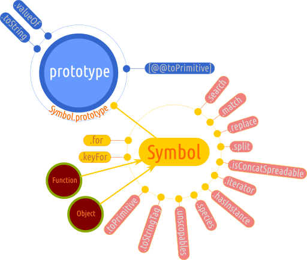

# Symbol

Cel mai bine învățăm din povești, iar trecutul limbajului de programare JavaScript oferă câteva interesante, care au orientat dezvoltarea limbajului către introducerea unui nou tip de valori primare așa cum sunt simbolurile. Legenda spune că de îndată ce JavaScript nu a mai fost tratat ca pe un mijloc de a dinamiza paginile web care erau statice prin interacțiune, programatorii au început dezvoltarea de biblioteci de cod. Aceste biblioteci de cod includeau propriile obiecte, care „se întâlneau” cu obiectele provenite din utilizarea altor biblioteci de cod. Inevitabil propritățile unui obiect intrau în coliziune cu proprietățile altor obiecte în cazul în care propritățile aveau același nume. Pentru a evita astfel de coliziuni, se apela la diverse mecanisme de protejare a propriilor obiecte pentru a fi sigure în utilizare. Dar odată cu apariția lui `Symbol` mare parte din aceste probleme vor dispărea.

`Symbol` este o proprietate a obiectului global. Nu trebuie folosit cu `new` pentru că nu este un constructor de obiecte. Pur și simplu nu permite sintaxa `new Symbol()`. Dacă i se pasează un argument care nu este undefined, acest argument va fi un șir de caractere care va avea rolul de descriptor pentru noul simbol creat.

```javascript
new Symbol(); // TypeError: Symbol is not a constructor
```

`Symbol()` este o funcție care returnează o valoare de tipul symbol. Adu-ți aminte mereu faptul că un simbol este o valoare primară. A fost introdusă de ECMAScript 6. Pe scurt, un simbol este asociat cheii unei proprietăți a unui obiect. Evidența simbolurilor este ținută prin intermediul unui **registru global de simboluri**.

Symbol nu este chiar o creație ECMAScript, ci este un concept folosit și în alte limbaje de programare. Am aflat că în limbajul de programare Lisp, toți identificatorii sunt considerați a fi simboluri. Până la apariția simbolurilor, toți identificatorii din JavaScript erau exclusiv șiruri de caractere. Dacă ții morțiș, poți converti un simbol la un șir de caractere folosind metoda `toString()` moștenită automat.

```javascript
var piatră = Symbol('onix');
typeof piatră; // "symbol"
typeof piatră.toString(); // "string"
```

Symbol are totuși o serie de proprietăți care oferă acces la membrii acestui obiect intern, are proprietăți statice, care îți permit să investighezi registrul global de simboluri, care este constituit înainte de a se începe evaluarea codului.



Standardul lămurește faptul că atunci când se constituie registrul simbolurilor, care este o listă de elemente, care fiecare, individual, este un „Record”, ceea ce decriptat înseamnă că avem de-a face cu un obiect (19.4.1 The Symbol Constructor). Da, fiecare simbol este, de fapt, câte un obiect care are două proprietăți:

-   cheia pentru prima proprietate este `[[Key]]` și are drept valoare un șir de caractere necesar identificării la nivel global a simbolului respectiv și
-   a doua proprietate care are drept cheie `[[Symbol]]`, care are drept valoare un **simbol** ce poate fi accesat din oricare tărâm.

Folosim simbolurile pentru a avea chei cu adevărat unice pentru proprietățile unui obiect și oriunde avem nevoie de identificatori unici. Simbolurile sunt ca niște fulgi de nea. Nu există asemănare a unuia cu altul.

Valorile de acest tip pot fi folosite pentru a face anumite proprietăți ale unui obiect să fie anonime. Astfel, se poate realiza trecerea unor proprietăți într-o zonă „privată”, care să fie disponibilă doar obiectului pentru care s-au creat aceste proprietăți. După cum am observat, există deja construite astfel de proprietăți în obiectele interne ale JavaScript.

Îndeajuns cu teoria. Cel mai rapid scenariu de utilizare este al unui simbol utilizat ca proprietate a unui obiect.

```javascript
let unSimbol = Symbol('oDescriere');
this[unSimbol] = function () {
  console.log('fac ceva');
};
```

Ceea ce tocmai s-a întâmplat este că s-a creat un simbol, care este o valoare ce va sta „ascunsă” și care poate fi referențiată doar prin identificatorul variabilei și prin apelarea metodei `getOwnPropertySymbols()`. Am spus că stă „ascunsă” pentru că este non-enumerabilă, ceea ce înseamnă că nu *iese la numărătoarea* cu `for...in`, prin sondarea cu `Object.getOwnPropertyNames(obiect)` sau prin interogarea obiectului cu `Object.keys(obiect)`.

Un detaliu foarte important este acela că proprietățile pentru care cheile sunt simboluri nu pot fi accesate decât prin folosirea sintaxei cu paranteze drepte.

```javascript
var obi = {},
    propPrivata = Symbol('stauPitita');

obi[propPrivata] = "ceva privat";
obi[propPrivata]; // "ceva privat"
console.log(Object.getOwnPropertyNames(obi)); //=> []
console.log(Object.getOwnPropertySymbols(obi)); // [Symbol(stauPitita)]
console.log(Reflect.ownKeys(obi)); // [Symbol(stauPitita)]
```

Se observă faptul că simbolurile ies la iveală prin interogarea cu `Object.getOwnPropertySymbols(obiect)`, fiind generat un array al acestora, dar mai există o metodă a obiectului intern Reflect: `Reflect.ownKeys(obiect)`.

## Folosirea la „nume computate” pentru proprietăți

Am văzut anterior că simbolurile sunt create și introduce ca nume ale proprietăților în cazul în care folosim sintaxa cu paranteză dreaptă pentru a adăuga ulterior proprietăți unui obiect existent.

Alternativ, se pot crea toate simbolurile și se poate construi obiectul din start punându-le ca nume de proprietăți, fiecare la locul lui.

```javascript
var piatraRoșie = Symbol("zăpadă");
var piatraVânătă = Symbol("mătase");
var obiect = {
  [piatraRoșie]: "Un hematit",
  [piatraVânătă]: "Sulfat de cupru"
};
obiect[piatraRoșie]; // "Un hematit"
```

## Simbolurile pot fi folosite cu `Object.defineProperty()` și `Object.defineProperties()`.

Chiar dacă folosim simboluri pentru numele proprietăților acest lucru nu afectează modul de lucru în cazul în care se dorește *modelarea* propriu-zisă a proprietății din punct de vedere al atributelor.

Pentru „modelarea” unei singure proprietăți folosim `Object.defineProperty()`. Să presupunem că avem un obiect cu o proprietate deja, pe care dorim să o setăm în așa fel încât să nu poată fi modificată.

```javascript
var simbol0 = Symbol('rață'),
    animale = {
      [simbol0]: "mac mac"
    };
Object.defineProperty(animale, simbol0, {writable: false});
```

Și acum dorim să introducem în același obiect o proprietate nou nouță dar cu atributelele proprietății configurate după necesitățile proprii. Să spunem că nu dorim ca valoarea să poată fi editată. În acest sens, mai întâi vom crea un nou simbol.

```javascript
var simbol1 = Symbol('cal');
Object.defineProperties(animale, {
  [simbol1]: {
    value: 'nihaha',
    writable: false
  }
});
console.log(animale[simbol0]); //=> mac mac
console.log(animale[simbol1]); //=> nihaha
```

## Registrul global pentru simboluri

Registrul acesta trebuie înțeles ca un mediu partajat pentru întreg codul. Ca un fel de obiect global pentru simboluri.

Registrul global pentru symbols ține evidența acestora folosindu-se de o cheie numită, evident `key`. Această cheie va fi folosită și ca descriere atunci când simbolurile care sunt create sunt introduse în registrul global (este cel care acționează peste tot la momentul rulării codului).

Există două metode prin care poți adăuga un `Symbol` în registrul global:

-   `Symbol.for(key)` și
-   `Symbol.keyFor(symbol)`

```javascript
Symbol.for('test') === Symbol.for('test'); // true
```

Unul dintre simbolurile folosite extensiv este `Symbol.iterator`. Acesta este folosit pentru a defini metoda `@@iterator` pentru metodele aplicate obiectelor care implementează protocolul de iterare (acest protocol de care vei auzi în mod repetate este un set de reguli pe care trebuie să le respecte un obiect pentru a deveni iterabil).

## Metode de acces la registrul simbolurilor

Metodele `Symbol.for()` și `Symbol.keyFor()` pot accesa valorile din registrul simbolurilor. După cum am văzut anterior, registrul simbolurilor este creat înainte de evaluarea codului JavaScript și este o listă de obiecte care există în motor și care nu poate fi accesată direct. Aceste două metode sunt singurii mediatori dintre procesul de rulare al codului (*runtime*) și registrul simbolurilor.

## Folosirea aceluiași simbol pentru întreg codul rulat: `Symbol.for('numeSimbol')`

Această metodă aduce un simbol din registrul simbolurilor. Invocarea lui `Symbol.for("stringDeId")` introduce un simbol în registrul simbolurilor dacă acesta nu există și apoi îl returnează imediat. La o invocare ulterioară cu aceeași valoare string la argument, aduce același simbol setat prima dată.

```javascript
let primo = Symbol.for('unu');
let secundo = Symbol.for('unu');
primo == secundo;
```

Diferite părți ale codului rulat pot folosi același simbol pentru a reprezenta un identificator unic. Pentru a genera simboluri care să fie disponibile întregului cod, se va folosi `Symbol.for()`. Această metodă acceptă un singur parametru, care va fi identificatorul pentru simbolul nou creat.

```javascript
let solidM = Symbol.for('metal');
let lichidM = Symbol.for('metal');
let rezultate = {
  [solidM]: "oxid de fier"
};
console.log(rezultate[solidM]); // oxid de fier
rezultate[lichidM] = "vapor de mercur";
console.log(rezultate[lichidM]); // vapor de mercur
console.log(rezultate[solidM]); // vapor de mercur
```

Identificatorul pentru ambele proprietăți ale obiectului este același simbol. Setarea oricărei proprietăți cu oricare dintre identificatorii care trimit către același simbol se soldează cu returnarea aceleiași valori. Aceasta este cea care a fost introdusă ultima având drept identificator unul care trimite la același simbol. În cazul nostru, oricare dintre proprietăți identificate prin variabilele ce trimit la același simbol, se comportă precum un alias.

Încheiem povestea lui `Symbol.for()` prin a întări faptul că prima dată când este folosit, se constituie un nou simbol în registrul dedicat lor, iar la invocarea acesteia încă o dată, este obținut același simbol. Nu este creat unul nou. Variabilele care își atribuie același simbol se comportă precum aliasuri unul pentru altul.

### Symbol.keyFor('nume cheie')

Folosind această metodă se obține numele cheii unui simbol care există deja în registru.

## Well-Known Symbols - simboluri bine-cunoscute

Standardul indică o serie de simboluri pe care le atașează atributul de „bine-cunoscute”. În spatele fiecărui astfel de simbol „bine-cunoscut” se află algoritmi (acești algoritmi sunt interni motorului de JavaScript) care au anumite efecte. Am putea spune că, de fapt, aceste simboluri identifică proprietăți care oferă „funcționalități bine-cunoscute” pentru obiectele interne. Mai pe scurt, unele obiecte interne JavaScript, au niște proprietăți ale căror chei sunt simboluri. Ce se ascunde în spatele lor este un algoritm, care oferă o funcție sau un anume comportament la momentul când tu, ca programator, le invoci.

Un lucru foarte important pe care-l menționează standardul este acela că „valorile simbolurilor bine-cunoscute sunt comune tuturor tărâmurilor”.

Prin ce se disting *simbolurile bine-cunoscute* de celelalte? Prin faptul că sunt referențiate printr-o notație specială folosită doar în textul standardului. Acesta este formată din numele simbolului, care este stabilit de standard, precedat de o pereche de ampresand: `@@iterator`, de exemplu. Pentru cazul utilizării de zi cu zi, aceste simboluri bine-cunoscute sunt parte a obiectului cu rol de prototip pentru obiectele interne `Object`, `Array` și `String` cu excepția unuia singur care este operatorul `instanceof`.

### Symbol.hasInstance

Acesta este cazul operatorului `instanceof` prin care putem afla dacă un anumit obiect este o instanță a celui pentru care se face investigația.

```javascript
var obi = {x: true};
obi instanceof Object; // true
// echivalent cu
Object[Symbol.hasInstance](obi);
```

Concluzia este că operatorul `instanceof` începând cu ECMAScript 6 a devenit o prescurtare către metoda `hasInstance` a lui `Symbol`. În acest caz, toate funcțiile în JavaScript vor avea o metodă `Symbol.hasInstance` prin care se poate testa dacă un obiecte este sau nu o instanță a acesteia. Această metodă este chiar în obiectul prototip al lui `Function` (`Function.prototype`), ceea ce face ca toate funcțiile să o moștenească. Proprietatea `Symbol.hasInstance` este non-writable, non-configurable și non-enumerable pentru a se asigura faptul că nu va fi suprascrisă dintr-o eroare. Totuși, fii foarte atent că prin utilizarea metodei `Object.defineProperty()`, poți modifica fără probleme `Symbol.hasInstance`.

### Symbol.isConcatSpreadable

Aceasta este o valoare boolean. Ceea ce indică ea este dacă un obiect poate fi transformat într-un array ce conține proprietățile sale atunci când se invocă `concat()` pe un array existent. Adu-ți aminte că un array este la rândul său un obiect, de fapt. Acest simbol dă girul că obiectul poate fi tratat ca un array căruia urmează să se adauge ca elemente noi la un array pe care se face `concat`-ul.

```javascript
var obiSimulandUnArray = {
  0: "unu",
  1: "doi",
  length: 2,
  [Symbol.isConcatSpreadable]: true
};
// obiSimulandUnArray are acum comportament de array
var numaram = ["zero"].concat(obiSimulandUnArray);
console.log(numaram); // [ "zero", "unu", "doi" ]
```

### Symbol.iterator

Acest simbol este mijlocul prin care se aplează iteratorul pentru un anumit obiect. Este bine-cunoscută apelarea iteratorului atunci când se folosește `for...of`.

### Lucrul cu textul

Există patru metode a constructorului `Symbol`, care permit o posibilă interacțiune și mai intimă cu modul în care sunt exploatate textele folosind regex-urile. Pentru a înțelege ce oferă metodele lui Symbol, să trecem în revistă metodele utilizate de obiectul intern `RegExp`.

-   `match(șablonRegExp)` prin care se verifică dacă un șir de caractere este identic cu cel menționat prin șablonul regex-ului.
-   `replace(șablonRegExp, șirDeÎnlocuire)` prin care se caută un fragment identic cu cel menționat de regex, iar atunci când este găsit, se face înlocuirea sa cu șirul de caractere introdus ca al doilea argument.
-   `search(șablonRegExp)` localizează un fragment menționat prin șablonul regex-ului în interiorul unui text.
-   `split(șablonRegExp)` „sparge” un șir de caractere într-un array pe baza potrivirii după un șablon menționat prin regex.

Ceea ce oferă aceste metode este posibilitatea de a modifica felul în care se face căutarea definind, de fapt redefinind metodele care folosesc șabloane regex să se comporte ca metodele originale de la care se așteaptă să existe un regex, dar de fapt să existe o altă implementare de căutare.

### Symbol.match

Este simbolul care pune în funcțiune algoritmii responsabili cu realizarea unei căutări într-un șir de caractere după un șablon. Este apelabil prin invocarea metodei `match()` pusă la dispoziție de obiectul intern RegExp.

### Symbol.replace

Este simbolul care pune în funcțiune algoritmii responsabili cu realizarea unei înlocuiri a unui fragment dintr-un șir care se potrivește cu un șablon. Este apelabil prin invocarea metodei `replace()` pe care obiectul intern RegExp o oferă.

### Symbol.search

Este mecanismul declanșat la căutarea într-un șir după un șablon atunci când este apelată metoda `search()` a lui RegExp.

### Symbol.split

Este algoritmul care se pune în mișcare la apelarea metodei `split()` pe care obiectul intern String o pune la dispoziție.

### Symbol.species

Este o valoare implicată în crearea de obiecte derivate. Următoarele tipuri de obiecte interne au definite intern `Symbol.species`.

-   Array,
-   ArrayBuffer,
-   Map,
-   Promise,
-   RegExp,
-   Set,
-   Typed arrays

Toate aceste obiecte interne folosesc simbolul „well-known” `Symbol.species` pentru a returna pe `this`. Acest lucru mai implică un lucru: această proprietate va returna funcția constructor.

```javascript
Array[Symbol.species]; // function Array()
```

### Symbol.toPrimitive

Un simbol utilizat pentru a converti un obiect la o primitivă. Standardul îl menționează, dar încă nu există aplicații practice. Metoda este definită în prototipul fiecărui obiect și se comportă ca o rețetă care indică cum trebuie tratat obiectul dacă se dorește transformarea sa într-o primitivă. Un posibil model de utilizare a metodei este acela de a identifica tipul datelor.

### Symbol.toStringTag

Este algoritmul implicat de metoda `toString` a obiectului intern `Object`. Acest simbol aduce la iveală o proprietate a fiecărui obiect atunci când este invocat `Object.prototype.toString.call()`. De exemplu, pentru un array, invocarea acestei metode aduce valoarea `Array`, care aparține proprietății `Symbol.toStringTag`.
Poți folosi `Symbol.toStringTag` pentru a defini propriile valori.

```javascript
function Ceva (valoare) {
  this.valoare = valoare;
};
Ceva.prototype[Symbol.toStringTag] = "Ceva";
var test = new Ceva('ciuca');
console.log(test.toString()); // [object Ceva]
console.log(Object.prototype.toString.call(test)); // [object Ceva]
```

### Symbol.unscopables

Sunt proprietățile care sunt excluse de la folosirea lui `width`.

## Lucrul cu simbolurile

Evaluarea funcției `Symbol()` este o valoare de tip `symbol`. Adu-ți aminte mereu faptul că simbolurile sunt tipuri de date primare.

```javascript
var unSimbol = Symbol('simbol01');
typeof unSimbol; // "symbol"
```

Spune standardul că valoarea pentru slotul intern `[[Prototype]]` a lui Symbol este `funcția-obiect internă` a cărui slot intern `[[Prototype]]` este obiectul prototype a lui `Object`.

Tot standardul aduce lămuriri în ceea ce privește câteva aspecte care țin de bucătăria motoarelor JavaScript, dar care ne vor face nouă o imagine a contextului. Motorul de căutare înainte de a porni evaluarea codului construiește în „culise” o listă goală dedicată tuturor simbolurilor care vor fi create. Lista aceasta poate fi înțeleasă ca un registru. Chiar se numește **GlobalSymbolRegistry** și este o listă disponibilă tuturor tărâmurilor care ar putea fi; e o listă globală.

Structura unei singure înregistrări din acest registru este cheie (un șir de caractere) - simbol (un simbol).

## De ce avem nevoie de Symbol?

Pentru că un simbol este unic și nu poate fi modificat.

```javascript
console.log(Symbol('ceva') === Symbol('ceva')); // false
```

## Mantre

-   Simbolurile nu vor intra în conflict cu valorile șir ale cheilor unui obiect.
-   Simbolurile nu împlică faptul că sunt un set privat de valori.
-   Nu poți face transformări (coercion) pe simboluri.

## Referințe

-   [https://hacks.mozilla.org/2015/06/es6-in-depth-symbols/](https://hacks.mozilla.org/2015/06/es6-in-depth-symbols/)
-   [Zakas, Nicholas C. Understanding ECMAScript 6: The Definitive Guide for JavaScript Developers](https://www.keithcirkel.co.uk/metaprogramming-in-es6-symbols/)
