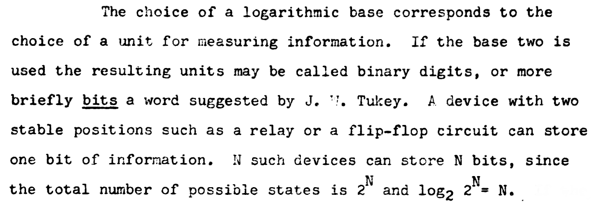
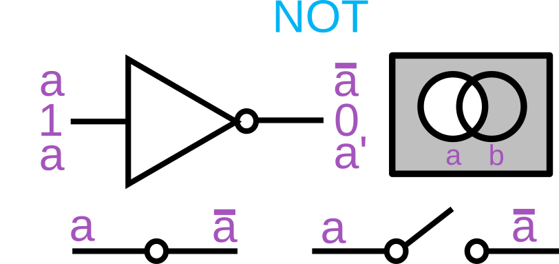
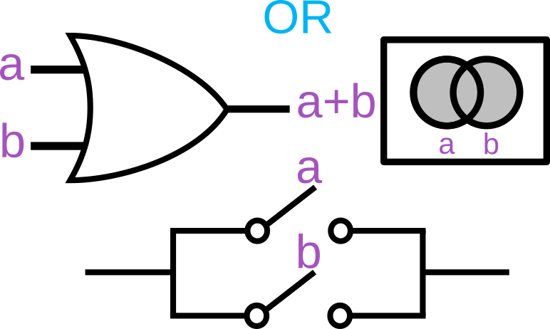
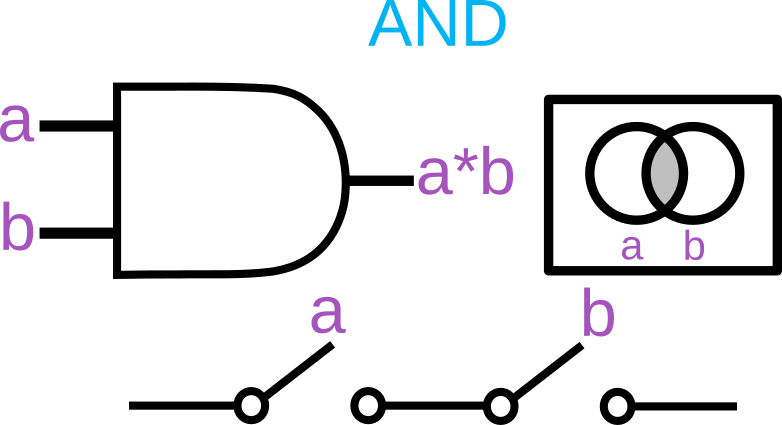

# Operatorii logici

## Introducere

Toate expresiile pot fi reduse la o valoare de adevăr, fie aceasta adevărată (`true`) sau falsă (`false`). Acest mod de lucru constituie o ramură a algebrei booleene introdusă de George Boole prima dată în lucrarea *The Mathematical Analysis of Logic* (*Analiza matematică a logicii*), 1847 cu o dezvoltare deplină în 1854 în lucrarea *An investigation of the Laws of Thought*. În loc de a opera cu numere așa cum facem în operațiunile aritmetice de bază (adunare și înmulțire), operațiunile booleene de bază sunt:

-   **conjuncția**, numită în engleză **AND** și în română **ȘI**, fiind *produsul logic* notat cu simbolul `∧` sau `∩`,
-   **disjuncția**, numită în engleză **OR**, fiind suma logică notată cu simbolul `∨` sau `∪` și
-   **negarea** sau **complementarea**, numită în engleză **NOT**, fiind notată cu simbolul `¬`.

Ceea ce a permis algebra lui Boole este construcția de porți logice cu ajutorul circuitelor electronice imediat ce am avut la îndemână conceptul de **bit** ca unitate de codare a informației. În timp ce studia circuitele de basculare (gândește-te la un releu), în anii 30 ai secolului trecut, matematicianul și inginerul american Claude Elwood Shannon face o conexiune importantă între algebra Booleană și dispozitivele electromagnetice folosite pentru comutarea liniilor în trunchiurile de telefonie.


Observațiile sale s-au concluzionat în teza *A Symbolic Analysis of Relay and Switching Circuits*. Shannon este și cel care ia termenul de **bit** de la John Tukey pentru a avea o unitate de măsură pentru informația dintr-un mesaj.



Acesta a fost saltul către aplicațiile practice în domeniul electronicii. Vom face o mică călătorie în aplicarea conceptului de bit, codat cu `0`, dacă valoarea sa de adevăr este falsă și cu `1`, dacă valoarea sa exprimă adevărul. Dacă vom cupla această informație cu cel mai simplu circuit electronic pe care toată lumea îl cunoaște, cel al unui bec care se aprinde acționând un întreruptor, vom putea să ne jucăm cu valori de adevăr stabilite prin aprinderea sau stingerea becului. Dacă întreruptorul este apăsat, curentul va circula și becul se va aprinde indicând valoarea `1` de adevăr. Acum că am stabilit cadrul, în onoarea lui George Boole și a lui Shannon, haide să aplicăm algebra booleană. Acest exercițiu este foarte valoros pentru înțelegerea mai departe a operatorilor booleani cu o mare alonjă către structurile de control a execuției. Cu ajutorul acestora luăm decizii privind execuția codului în funcție de valoarea de adevăr a unei expresii.

## Operațiuni boolene

Pentru că este absolut necesară înțelegerea operațiunilor boolene, vom constitui câteva tabele cu acestea. Să pornim de la o valoare booleană. Ce putem face cu aceasta? Cel mai simplu este să o negăm. Veți vedea că în multe lucrări, negarea unei valori boolene este marcată printr-un semn distinctiv, fie o linie deasupra valorii, fie un apostrof după valoare. Ce realizăm negând? `1` devine `0` și `0` devine `1`.



Am pus pentru exemplificare reprezentările des întâlnite ale complementării așa cum este des întâlnit în schemele electronice sau în teoria seturilor.

A fost simplu, nu? Hai să ne uităm la următoarea operațiune: disjuncția sau adunarea logică. Vom porni de la reprezentare pentru că făcând socotelile, vom putea extrage un tabel de adevăruri pentru această operațiune.



Să o luăm băbește. Din acest moment, ceea ce este notat cu `a` în diagramă, vom considera a fi valoarea `false`, iar ceea ce este notat cu `b`, vom considera că este valoarea `true`. Ca să facă sens și mai mult, poți să-ți închipui că `true` este `ceva` (poate fi orice), iar `false` este `nimic`. Astfel, putem face operațiunile mentale mai ușoare. Pentru cele dintre voi care s-au jucat cu întreruptoare, vizual, se poate imagina un circuit simplu (ultimul de jos), care închid sau deschid un circuit pentru a alimenta un bec. Valorile de adevăr pot fi obținute apăsând și deschizând întreruptoarele.

Și acum să facem calcule:

-   `nimic` (`false`) adunat cu `ceva` (`true`) egal `ceva` (`true`);
-   `ceva` (`true`) adunat cu `nimic` (`false`) egal `ceva` (`true`);
-   `ceva` (`true`) adunat cu `ceva` (`true`) egal `ceva` (`true`);
-   `nimic` (`false`) adunat cu `nimic` (`false`) egal `nimic` (`false`);

Să facem un tabel pentru claritate:

| a     | b     | a + b |
| ----- | ----- | ----- |
| false | true  | true  |
| true  | false | true  |
| true  | true  | true  |
| false | false | false |

Nu-i greu? Este chiar fascinant că poți face operațiuni cu niște abstracțiuni despre care știi doar că e `ceva` sau `nimic`. Fascinant, nu?

Să avansăm cu operațiunea de conjuncție - AND.



Facem calculul și pentru că vorbim de o înmulțire, voi apela la ceea ce a rămas din școală de la înmulțirea cu 0. Vă mai aduceți aminte, nu? E simplu. Vom opera cu 0 și cu 1, corespondent lui `false` și `true`.

-   `0` (`false`) înmulțit cu `1` (`true`) egal `0` ( `false`);
-   `0` (`false`) înmulțit cu `0` (`false`) egal `0` ( `false`);
-   `1` (`true`) înmulțit cu `0` (`false`) egal `0` ( `false`);
-   `1` (`true`) înmulțit cu `1` (`true`) egal `1` (`true`);

Să constituim tabela de adevăr. Dacă te ajută să înțelegi, privește atent la circuitul realizat din cele două întrerupătoare. Singurul mod în care trece curentul este să apeși pe ambele întreruptoare, restul: nu trece nimic -  `false`.

| a     | b     | a * b |
| ----- | ----- | ----- |
| false | true  | false |
| false | false | false |
| true  | false | false |
| true  | true  | true  |

Aplicat la domeniul programării, valorile variabilelor sunt reduse la corespondentul lor de adevăr. Limbajul permite lucrul cu valorile de adevăr și falsitate pentru a decide un curs de evaluare sau pentru a proba anumite valori prin reducerea acestora la o concluzie înscrisă adevărului (și în engleză îi spunem *truthy*) sau falsității (în engleză îi spunem *falsy*).

## Legile lui De Morgan

Pentru a vă adăuga încă un instrument util în viitoarele evaluări, Legile lui De Morgan sunt niște reguli simple de transformare. Acestea poartă numele matematicianului Augustus De Morgan:

-   negarea *disjuncției* (adunarea logică) este conjuncția (înmulțirea) negațiilor
-   negarea *conjuncției* este disjuncția negațiilor.

> NOT(**true** OR **false**) <=> NOT **true** AND NOT **false**
> NOT(**true** AND **false**) <=> NOT **true** OR NOT **false**

Pentru noi specialiștii în științele informării, legile lui Morgan au o rezonanță familiară pentru că se aplică la căutarea în text, folosindu-se operatorii Boolean.

> NOT(**termen1** OR **termen2**) este același lucru precum (NOT **termen1**) AND (NOT **termen2**)

Acestea fiind însușite, asimilarea operatorilor booleni va fi o floare la ureche după cum urmează.

## Operatorul de negare `!`

Acest operator este folosit atunci când dorești să inversezi evaluarea unei anumite valori din punct de vedere a valorii Boolean la cere se poate reduce.

```javascript
!1;   // false
!!10; // true
```

Ceea ce s-a întâmplat este că motorul JS a văzut operatorul și a evaluat valoarea de adevăr a lui 1. Știm că pentru 1, valoarea de adevăr este `true`. Negat, aceasta va deveni  `false`.

La nevoie poți nega negația `!!true`. Folosind acest operator pe orice valoare, spui motorului că dorești să folosești echivalentul boolean. Ca să folosești valoarea sa adevărată, mai trebuie să negi încă o dată expresia. Este un truc pe care coercion îl oferă pentru a folosi valoarea boolean a unei valori: `!!20; // true`.

## Operatorul logic ȘI - `&&` (AND)

Este un operator care spune firului de execuție că pentru a continua valorile de la stânga și de la dreapta operatorului, trebuie să fie evaluate la `true`. Doar dacă ambele expresii sunt evaluate la `true`, evaluarea poate continua. Dacă una dintre condiții este evaluată la `false`, întreaga evaluare este `false`, iar execuția va urma traseul pregătit pentru parcursul `false`.

## Operatorul logic ȘI cu atribuire - `&&=`

Acest operator este folosit pentru a atribui o valoare doar dacă operatorul din stânga se reduce la o valoare de adevăr (*truthy*).

```javascript
let a = 1, b = 0;
a &&= 'ceva'; // a va avea valoarea "ceva"
```

În cazul în care valoarea nu este una *truthy*, variabila își păstrează valoarea inițială.

## Operatorul logic ORI - `||` (OR)

Folosirea acestui operator spune firului de execuție că cel puțin una dintre condiții trebuie să fie satisfăcută.

În cazul lui OR, JavaScript evaluează doar primul operand iar dacă acesta este *truthy*, nu va mai fi evaluat și cel de-al doilea operand. Evaluarea este pur și simplu scurt-circuitată pentru eficiență. Acest lucru se petrece pentru că doar evaluarea la `false` a operandului din stânga conduce la necesitatea de a evalua și pe cel de-al doilea operand pentru a da rezultatul final ca fiind `false` în cazul în care acesta este `false`.

```javascript
true  || true;  // true
true  || false; // true
false || true;  // true
false || false; // false
```

Același mecanism este aplicat și în cazul lui AND (`&&`). În cazul lui OR, dacă valoarea primului operand se reduce la ceva fals, atunci este returnată valoarea celui de-al doilea operand.

```javascript
false && false; // false
false && true;  // false
true  && false; // false
true  && true;  // true
```

Atenție la cazul în care poate ai dori evaluarea celui de-al doilea operand. Acest lucru nu se va întâmpla câtă vreme primul este *truthy*. Acest comportament poate fi considerat ca un mecanism selectiv de incrementare a unei variabile.

```javascript
let x = false, y = 0;
x || y++;
console.log(y);
```

Acest comportament permite o uzanță des întâlnită în programare pentru inițializarea unui obiect dacă acesta nu există deja. Acest idiom este întâlnit și în codul în care se dorește dotarea unei funcții cu valori pentru parametri chiar de la bun început.

```javascript
const obi = obi || {nume: "obiect important"};
```

În cazul nostru, obiectul `obi` ca operand este evaluat la o valoare *truthy* (toate obiectele la evaluare returnează *truthy*), dacă există deja, adică dacă a fost instanțiat. În acest caz, literalul care instanția obiectul, nu mai este evaluat.

**Spune standardul**:

> Valoarea produsă de operatorul `&&` sau de `||`, nu este neapărat de tip Boolean. Valorea produsă va fi întotdeauna valoarea unuia dintre expresiile ca operand ([12.13 Binary Logical Operators](http://www.ecma-international.org/ecma-262/8.0/#sec-binary-logical-operators)).

```javascript
"stânga"  && "dreapta"; // "dreapta"
"dreapta" && "stânga";  // "stânga"
"stânga"  && "";        // ""
   ""     && "dreapta"; // ""

"stânga"  || "dreapta"; // "stânga"
"dreapta" || "stânga";  // "dreapta"
"stânga"  || "";        // "stânga"
       "" || "stânga";  // "stânga"
```

Se observă că aplicarea operatorilor pe diferitele valori, are ca finalitate returnarea unui dintre operanzi. În cazul lui `&&`, dacă primul operand poate fi transformat (*coercion*) într-o valoare `false`, îl va returna, dacă nu, va returna operandul din dreapta.

În cazul lui `||`, îl va returna pe primul operand, dacă acesta poate fi transformat în `true`. În caz contrar, îl returnează pe cel din dreapta.

Ceea ce observăm este faptul că operatorii Boolean, în cazul JavaScript, se comportă mai mult ca niște selectori de valori în funcție de valoarea lor de adevăr. Acest comportament este cel mai vizibil atunci când folosești structuri de decizie pentru care evaluarea expresiei condiționale, nu se reduce la o valoare boolean, ci la una *truthy* sau *falsey*.

```javascript
const ceva = 10;
if (ceva === 1 || ceva === 10 } || ceva === 100) {
  // execută codul
}
```

## Operatorul ORI cu atribuire - `||=`

Acest operator este folosit pentru a atribui o valoare doar dacă operatorul din stânga se reduce la o valoare falsă (*falsy*).

```javascript
let a = 0, b = 1;
a ||= 'altceva'; // a va deveni "altceva"
```

## Operatorul ternar

Acest operator oferă posibilitatea analizei și reducerii expresiilor la valori boolene pentru a apuca diferite căi în evaluare. Spre deosebire de restul operatorilor care sunt fie unari, fie binari, acesta face evaluarea pentru trei operanzi. De aici îi vine și denumirea de operator ternar.

Are următoarea formă: `expresie ? expresie pentru cazul true : expresie pentru cazul false`.

Primul operand de dinaintea semnului întrebării este cel care condiționează evaluarea celor care stau la dreapta și la strânga semnului două puncte. În cazul în care condiția este evaluată la o valoare truthy, prima expresie de după semnul întrebării va fi evaluată. În caz contrar, cea de după semnul două puncte.

```javascript
variabilă = 10 ? variabilă++ : 'am doar' + variabilă;
```

Mulți programatori folosesc acest operator pe post de sintaxă prescurtată a enunțului `if...else`, dar recomandarea generală este contrară acestei practici. Există diferențe între cele două expresii.

Mai poți folosi operatorul ternar pentru inițializarea condiționată a unei variabile în funcție de o expresie.

```javascript
let x = true, y = 100;
let z = x ? y : 'eroare de inițializare';
console.log(z);
```

Ca regulă de bună practică, nu inculca ternarii pentru că devin greu de înțeles.

## Resurse

-   [Algebră booleană, Wikipedia în limba română](https://ro.wikipedia.org/wiki/Algebr%C4%83_boolean%C4%83)
-   [Boolean algebra, Wikipedia în limba engleză](https://en.wikipedia.org/wiki/Boolean_algebra)
-   [Claude E. Shannon: A Goliath Amongst Giants](https://www.bell-labs.com/claude-shannon/)
-   [Claude Shannon, painted portrait - la théorie de l'information _1010155](https://www.flickr.com/photos/home_of_chaos/7591110676/in/album-72157630621527032/)
-   [Logical conjunction](https://en.wikipedia.org/wiki/Logical_conjunction)
-   [Boolean algebra (structure)](https://en.wikipedia.org/wiki/Boolean_algebra_(structure))
-   [RETHINKING THE JAVASCRIPT TERNARY OPERATOR | James Sinclair | 5th March 2021](https://jrsinclair.com/articles/2021/rethinking-the-javascript-ternary-operator/)
