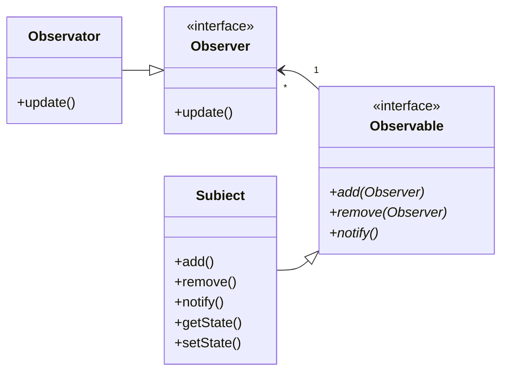
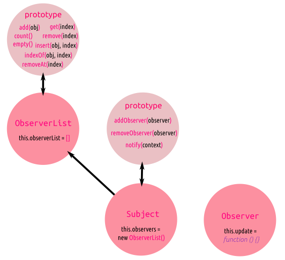

# Observable

Acesta este un șablon comportamental (*behavioral pattern*) pentru că punctul de interes este gestionarea comportamentului obiectelor în sensul înțelegerii și modelării interacțiunilor dintre acestea atunci când se petrece ceva.

Este posibil ca în aplicația pe care o dezvoltăm, să fie necesar ca atunci când un obiect a suferit o modificare, altele să fie notificate, pentru ca la rândul lor să-și modifice starea. Obiectele care doresc să fie anunțate de modificarea **stării** (*observers*), vor trebui să se **aboneze** la obiectul care va suferi modificarea (*observable*). Am putea concluziona că oferă o structură unei relații observator-observat atunci când un set de obiecte care **observă** sunt interesate în orice tip de modificare suferită de cel care este **observat**. Putem să numim obiectul observat, cel la care se abonează cele interesate, adică **subiectul**. Am putea spune că se realizează o relație de cardinalitate one-to-many - observable to observers.

Pornim de la un obiect numit **subiect**. Acest obiect menține în viață o listă de obiecte care își desfășoară propriile activități în funcție de ceea ce se petrece cu el. Aceste obiecte dependente sunt numite **observatori**. Obiectul cu rol de *subiect* va alerta observatorii despre orice **modificare a stării** sale prin *difuzarea* (*broadcast*) unei notificări specifice fiecărui observator în parte. Reține faptul că *observatorii* nu *stau cu ochii* pe *subiect*, ci **se abonează** pentru a fi *notificați*. Obiectele care sunt *subiectele* vor **notifica** observatorii **abonați** de modificările care apar.



Când nu se mai dorește ca un observator să mai fie notificat cu privire la aspectul pentru care s-a *abonat* la *subiect*, acesta poate fi eliminat din lista celor abonați.

## Anatomie

Pentru a înțelege în adâncime acest șablon, vom face o implementare ES5, urmând să o transformăm într-o clasă folosind ES6. Am ales exemplul oferit de Addy Osmani, din lucrarea sa *Learning JavaScript Design Patterns* pentru claritatea și pătrunderea pe care le oferă. Trucul este să adaugi obiectelor (*subiectelor*), care doresc să-și comunice starea, o metodă.

Pentru a implementa acest model, mai întâi ai nevoie de o funcție cu rol de constructor, care să poată gestiona o listă de observatori. În baza constructorului vom instanția un obiect de tip `ObserverList` care să fie parte a posibilelor viitoare subiecte. Avem nevoie de o **listă** - un array.

```javascript
function ObserverList () {
  this.observerList = [];
}
```

Mai avem nevoie de o metodă necesară actualizării stării tuturor celorlalte obiecte din listă. Gestionarea observatorilor implică implementarea câtorva metode necesare:

- `adăugare` (*add*), introduce observatorii care se abonează în array;
- `cuantificare` (*count*), obții numărul elementelor din array;
- `getter` (*get*), testează ca numărul primit care este indexul la care e înregistrat observatorul, să fie în limitele lungimii listei. Odată verificarea făcută este returnat elementul de la indexul primit;
- `existăObiectul` (*indexOf*), testează dacă obiectul abonat se află în *listă*. Dacă da, este returnat, dacă nu, este returnată valoarea `-1`;
- `ștergeObservator` (*removeAt*), elimină un obiect observator din listă.

```javascript
ObserverList.prototype.add = function( obj ){
  return this.observerList.push( obj );
};

ObserverList.prototype.count = function(){
  return this.observerList.length;
};

ObserverList.prototype.get = function( index ){
  if( index > -1 && index < this.observerList.length ){
    return this.observerList[ index ];
  }
};

ObserverList.prototype.insert = function (obj, index) {
  var pointer = -1;
  // pentru cazul în care dorești să introduci obiectul în capul listei
  if (index === 0) {
    this.observerList.unshift(obj);
    pointer = index;
  } else if (index === this.observerList.length) {
    this.observerList.push( obj );
    pointer = index;
  }
  return pointer;
}

ObserverList.prototype.indexOf = function( obj, startIndex ){
  var i = startIndex, pointer = -1;

  while( i < this.observerList.length ){
    if( this.observerList[i] === obj ){
      pointer = i;
    }
    i++; // condiția de ieșire: numărul mai mare ca lungimea
  }

  return pointer;
};

ObserverList.prototype.removeAt = function( index ){
  if (index === 0) {
    this.observerList.shift();
  } else if (index === this.observerList.length -1) {
    this.observerList.pop();
  }
};

ObserverList.prototype.empty = function(){
  this.observerList = [];
}
```

Odată creat gestionarul de obiecte, să creăm obiectul la care obiectele observator din lista tocmai creată să se poată *abona* pentru a putea primi *noutăți*. În acest scop, vom crea un nou constructor de **subiecte** în care vom instanția drept primă proprietate obiectul listă.

```javascript
function Subject () {
  this.observers = new ObserverList(); // instanțiază gestionarul listei
}
```

Apoi vom avea nevoie să implementăm următoarele metode:

- `adaugăUnObservator` (*addObserver*), care primește drept argument obiectul care dorește să fie abonat și va folosi metoda `add` a obiectului listă `this.observers` pentru a-l adăuga;
- `eliminăObservator` (*removeObserver*), care va folosi metoda `removeAt` obiectului care gestionează lista pentru a șterge/*dezabona* un observator primit ca argument.
- `notificare` (*notify*), care va actualiza starea tuturor observatorilor din listă.

```javascript
Subject.prototype.addObserver = function( observer ){
  this.observers.add( observer );
};

Subject.prototype.removeObserver = function( observer ){
  this.observers.removeAt( this.observers.indexOf( observer, 0 ) );
};

Subject.prototype.notify = function( context ){
  var observerCount = this.observers.count(), i;
  for(i = 0; i < observerCount; i++){
    this.observers.get(i).update( context );
  }
};
```

Acum că am terminat lista care se va instanția în subiect, avem nevoie de un constructor care să creeze obiectele `Observer`.

```javascript
function Observer () {
  this.update = function () {
    // este o valoare care va fi suprascrisă la momentul creării unui nou observator
  }
}
```

Pentru proprietatea `update`, am atribuit o funcție, dar această valoare poate și va fi rescrisă la momentul în care se va instanția obiectul `Observer`. Chiar în acel moment, această proprietate `update` va fi introdusă în obiectul care se dorește a fi extins și astfel, se va putea modifica din acel obiect extins. Ca o concluzie, obiectele `Observer` pot implementa logici interne total diferite unele de celelalte pentru metoda `update`, dar trebuie să o aibă.



Obiectele care vor dori să se *aboneze* (obiecte create în baza API-urilor Web, de regulă), nu au metodele necesare notificării celorlate din listă privind modificarea stării. Un exemplu de astfel de obiect este un element DOM, care este o instanță a clasei `Element`. Pentru că elementele DOM vor intra în rolul de observatoare, avem nevoie de o funcție cu ajutorul căreia să *extindem* obiectul instanță `Element` cu metodele necesare. Pentru a realiza acest lucru, avem nevoie de o funcție a cărei specializare este adăugarea de proprietăți suplimentare unui obiect existent.

```javascript
function extend (destination, source) {
  var key;
  // Îmbogățești obiectul tip cu proprietățile obiectului tip `Element`
  for (key in source) {
      destination[key] = source[key];
  }
  return destination;
};
```

Pentru a face o demonstrație practică, să presupunem că avem următoarele elemente în DOM:

```html
<button id="addNewObserver">Adaugă un checkbox</button>
<input id="mainCheckbox" type="checkbox"/>
<div id="observersContainer"></div>
```

Pentru care facem referințele către obiectele de tip `Element` din DOM.

```javascript
var controlCheckbox = document.getElementById( "mainCheckbox" ),
    addBtn = document.getElementById( "addNewObserver" ),
    container = document.getElementById( "observersContainer" );
```

Vom extinde obiectul `controlCheckbox` cu metodele subiectului.

```javascript
extend(controlCheckbox, new Subject());
```

În acest moment, dacă adăugăm un *listener* pe checkbox, acesta va putea emite notificări către toți ceilalți observatori din listă.

```javascript
controlCheckbox.onclick = function pentruOnclick () {
  controlCheckbox.notify(controlCheckbox.checked);
};
```

Pentru a *abona* un nou observator, vom crea un nou checkbox, adică un obiect. Ceea ce se introduce în array-ul observatorilor sunt obiectele cărora li se adaugă un comportament, adică câte o metodă.

```javascript
addBtn.onclick = addNewObserver;

function addNewObserver(){

  // Creează un checkbox nou
  var check = document.createElement( "input" );
  check.type = "checkbox";

  // Extinde checkbox-ul cu proprietățile lui Observer
  extend( check, new Observer() );

  // Aici faci înlocuirea comportamentului original cu cel particularizat dorit
  check.update = function( value ){
    this.checked = value;
  };

  // Adaugă observatorul în lista lor
  controlCheckbox.addObserver( check );

  // Adaugă elementul nou creat
  container.appendChild( check );
}
```

În cazul de mai sus, de fiecare dată când se dă click pe buton, se creează câte un obiect *input* de tip *check*, care este extins cu obiectul `Observer`. Acesta are o singură metodă, care este rescrisă imediat cu un comportament dorit. În cazul nostru metoda `update`, va pasa o valoare tuturor celor care există deja în listă. În cazul ales, dacă input-check-ul de control (primul din interfață) este bifat, toate celelalte checkbox-uri vor fi bifate la rândul lor.

## Model folosind ES6

Odată cu posibilitatea de scrie direct clase, putem modela mai ușor.


## Detalii

Acest model/pattern are capacitatea de a modela codul necesar gestiunii relațiilor dintre un eveniment, cererile async către un server apărute în urma acelui eveniment și posibilele animații.

## Resurse

- [The Observer Pattern | Learning JavaScript Design Patterns | Addy Osmani ](https://addyosmani.com/resources/essentialjsdesignpatterns/book/#observerpatternjavascript)
- [The Observer Pattern in JavaScript explained | pawelgrzybek.com](https://pawelgrzybek.com/the-observer-pattern-in-javascript-explained/)
- [The Power of the Observer Pattern in JavaScript | jsmanifest.com](https://jsmanifest.com/observer-pattern-in-javascript/)
- [How to Use the Observable Pattern in JavaScript | Eric Fuller | https://webdevstudios.com](https://webdevstudios.com/2019/02/19/observable-pattern-in-javascript/)
- [JavaScript Design Patterns: The Observer Pattern | Camilo Reyes | sitepoint.com](https://www.sitepoint.com/javascript-design-patterns-observer-pattern/)
- [The Observer Pattern in JavaScript — the Key to a Reactive Behavior](https://blog.bitsrc.io/the-observer-pattern-in-javascript-the-key-to-a-reactive-behavior-f28236e50e10)
- [Javascript Design Patterns #5 - Observer Pattern | DevSage | youtube.com | Nov 11, 2019](https://www.youtube.com/watch?v=45TeJEmcqk8)
- [The Observer Pattern | Learning JavaScript Design Patterns by Addy Osmani | O'Reilly](https://www.oreilly.com/library/view/learning-javascript-design/9781449334840/ch09s05.html)
- [Observer Design Pattern in JavaScript | Devan Patel | digitalocean.com | September 21, 2020](https://www.digitalocean.com/community/conceptual_articles/observer-design-pattern-in-javascript)
- [Diving into the great observer pattern in javascript | Enmanuel Durán | enmascript.com | March 09, 2019 ](https://enmascript.com/articles/2019/03/09/diving-into-the-great-observer-pattern-in-javascript)
- [Observer Pattern – Design Patterns (ep 2) | Christopher Okhravi | youtube.com | Feb 1, 2017](https://www.youtube.com/watch?v=_BpmfnqjgzQ)
