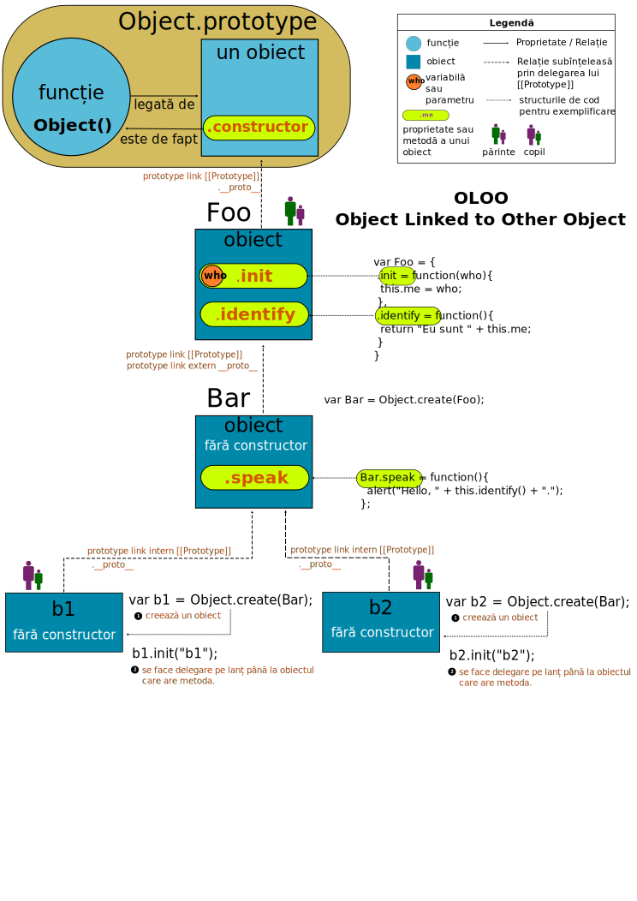

# Objects Linked to Other Objects

Se referă la eliminarea complexității pe care o implică delegarea comportamentală prin intermediul obiectului prototype. Acest model a fost conceput de Kyle Simpson pentru a simplifica relațiile între obiecte între care totuși se stabilește o legătură.

```js
var Foo = {};

var Bar = Object.create(Foo);

var b1 = Object.create(Bar);
```

Secvența de mai sus creează același lanț de legături simple între obiecte fără a folosi obiectul prototype.

```js
var Foo = {
  init: function(who){
   this.me = who;
  },
  identify: function(){
    return "I'm " + this.me;
  }
};

var Bar = Object.create(Foo);

Bar.speak = function(){
  alert("Hello, " + this.identify() + ".");
};

var b1 = Object.create(Bar);
b1.init("b1");

var b2 = Object.create(Bar);
b2.init("b2");

b1.speak();
b2.speak();
```

Foo poate fi considerat ca un utilitar la care se poate delega.

## Mantre
- Nu există decât un singur lanț prototipal pe care se face delegarea. Un obiect nu poate delega decât către un singur utilitar.
- Nu mai există constructori în acest model. Totul se deleagă la utilitar.


