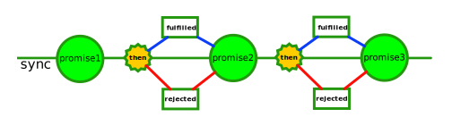

# Promises

Promisiunile sunt o alternativă la șablonul de lucru tradițional bazat pe callback-uri.

O promisiune este o abstacțiune care permite unei funcții să returneze un obiect promisiune, care reprezintă posibilul rezultat al unei operațiuni asincrone.

Despre un `promise` spunem că:
- este în **pending** atunci când operațiunea asincronă nu s-a încheiat
- este **fulfilled** atunci când operațiunea s-a încheiat cu succes
- este **rejected** atunci când o operațiune se încheie cu o eroare
- este **settled** atunci când o promisiune este împlinită sau este rejected.

Diferența dintre modele:

```js
/*
MODELUL ASYNCRON - cod tip CPS
 */
operatiuneAsync(argument, (error, date) => {
  if(error){
    // scrie cod de tratare a erorii și fă un return
  }
  // scrie cod pentru prelucrarea datelor
});

/*
MODELUL PROMISE - then care primește ca argumente două funcții, una corespunzând succesului iar alta erorii
 */
operatiunePromise(argument).then(date => {
  // prelucrarea rezultatului
}, error => {
  // gestionează eroarea
});
```

Dacă nu sunt specificate handlere pentru **fulfilled** sau pentru **rejected**, valoarea returnată în caz de succes sau eroarea vor fi propagate către următoarea promisiune înlănțuită până când va fi întâlnit un handler pentru prelucrare.

Execuția secvențială devine foartă ușoară în cazul folosirii promisiunilor.

```js
op(arg).then(date1 => return op(arg2))
  .then(date2 => return 'am terminat';)
  .then(undefined, error => {
    // tratarea erorilor
  });
```

Atenție! Din perspectiva rezultatului, o promisiune este rezultată sincron, dar funcțiile de handling se execută asincron.



Promisiunile au o metodă principlă: `then`.
`promise.then(onFulfilled, onRejected)` este semnătura generală pentru promisiuni.
`promise.catch(onRejected)` este semnătura pentru prelucrarea erorilor, dar este de fapt un echivalent pentru `promise.then(undefined, onRejected)`.
