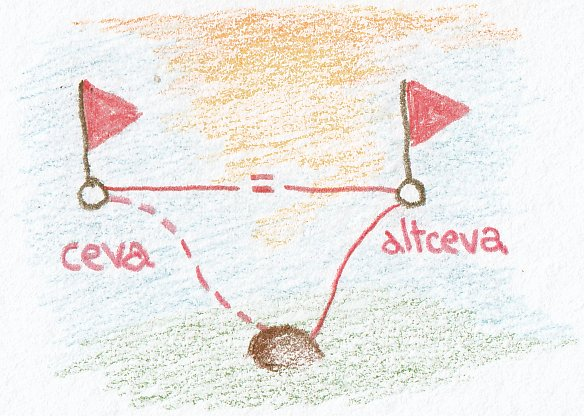
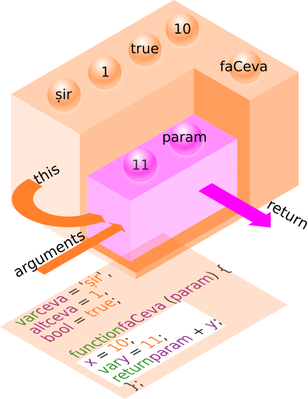

# Mediul lexical - scope

## Introducere

Povesteam anterior că în ceea ce privește limbajul de programare JavaScript, felul în care este redactat textul, adică codul sursă, este crucial. De ce? Pentru că JavaScript interpretează locul declarațiilor de obiecte, de funcții și variabile ca fiind semnalul că trebuie să genereze niște planuri cu anumite separări între ele.

Ca să mă fac înțeles mai bine e ca și cum te-ai apuca să faci o casă, ai terenul nivelat și aduci materialele de construcție. Apoi rânduiești materialele în funcție de subansamblurile ce trebuie create.

De exemplu, grinzile din lemn, cuiele și caielele vor constitui subansamblul structurii de rezistență. Vata de sticlă, izolația și plăcile de rigips vor fi componentele subansamblului numit pereți. Fiecare subansamblu va fi apoi combinat cu celelalte. Unele vor fi incluse în altele și toate împreună vor forma obiectul final.

Astfel, după ordonare, despre fiecare material de construcție se va ști cărui „subansamblu” aparține. Aceste „subansambluri”, hai să le numim de acum **medii lexicale** (în limba engleză, textul standardului îl numește **lexical environment**) sau **scope** (tradus în română scope ar fi zonă, domeniu în care ceva are efect). *Mediile* acestea au atributul de lexical pentru că sunt generate după apariția lor în „firul narativ” al codului, în funcție de punctuație și semne.
Mediul lexical sau scope-ul poate fi foarte ușor înțeles ca un „registru inventar” al tuturor identificatorilor care au valori „legate” de aceștia.

În demersul nostru, vom folosi interșanjabil următoarele: „mediu lexical”, „scope” și „lexical scope”. Toate numesc același lucru. Termenul standardului este „mediu lexical”, dar în practica de zi cu zi veți întâlni denumirea de scope. Deja sunteți familiari cu ea de la întâlnirea cu debugger-ul când lucram cu *Global Scope* și *Function Scope*. De cele mai multe ori vă veți întâlni în diferite alte lucrări despre JavaScript cu ambele variante.

Mediul lexical nu este ceva nou, de curând adăugat limbajelor de programare. Rădăcinile conceptului și domeniul de aplicare vin chiar de la începutul deceniului șase al secolului trecut.

> „Este porțiunea de cod sursă pentru care este disponibilă o legătură între un nume și o entitate” (definiție pentru limbajul de programare ALGOL 60, 1960).

Această definiție explică cel mai bine conceptul de „legătură”. De fapt, acesta este menirea mediului lexical, de a ține evidența acestor legături. De ce? Pentru că valorile legate de un anume identificator se pot modifica în timp deoarece valoarea pentru care s-a făcut legătura s-a modificat.

Un identificator se poate lega de un alt identificator care este legat la o valoare. Da! Ai intuit perfect: unii identificatori se comportă ca referințele bibliografice. Trimit la alți identificatori. Dacă sunt interogați, răspund cu valoarea legată de cel la care face trimitere.



Reține faptul că atunci când variabilei referință i se dă o valoare „solidă”, acest identificator nu va mai fi o referință, ci însăși variabila.

```javascript
var ceva = 10;
var altceva = ceva;
console.log(altceva); // 10
altceva = 20;
console.log(altceva); // 20
console.log(ceva);    // 10
```

Felicitări! Tocmai ai făcut o mare achiziție privind modul cum funcționează variabilele.

În cazul funcțiilor, atunci când sunt pasate valori, reține faptul că JavaScript, de fapt copiază valoarea în **lexical environment**, care poate fi comparat pentru o ușoară referință comună cu un „registru inventar al mediului”. Acum putem spune că ***o valoare este în scope***.

Mediul lexical se formează la faza de compilare.

Atunci când unei funcții îi sunt pasate referințe către valori drept argumente, valorile către care se face referința, nu mai sunt copiate în **lexical environment**, ci doar referința, care va fi utilizată pentru a ajunge la valoare. Mai multe referințe pot trimite către aceeași valoare.

Astfel, putem spune că există „tipuri” asociate valorilor (**value types**), adică „tipuri de valori” și „tipuri de referințe” (**reference types**).

## Definiții

Este **locul** unde te uiți după lucruri.
Locul unde definești variabilele determină zona unde le poți folosi și astfel scope se stabilește în funcție de structura codului.
Este **mediul** în care au efect funcțiile și sunt disponibile variabilele.
Global scope este locul de unde pot fi accesate funcții și variabile în întreg codul.

## Formare și alcătuire

Pentru a oferi cea mai corectă imagine a *mediului lexical*, voi folosi textul standardului pe care-l voi adapta unei scheme logice cu scopul de a lămuri pas cu pas ce este mediul lexical, cum apare, care este componența și la ce folosește acesta.

## Spune standardul

*   Codul sursă este o structură lexicală.
*   Când rulăm codul, acesta întră într-un proces de evaluare.
*   Evaluarea structurii lexicale a codului produce un lexical environment.
*   Spunem în acest moment că mediul lexical este asociat cu anumite structurile sintactice ale codului ECMAScript.
*   Structurile sintactice cărora le sunt asociate medii lexicale sunt: declarațiile de funcții, declararea unui bloc de cod prin acolade și condiția `catch` a instrucțiunii `try`.
*   De câte ori rulezi codul, acesta este evaluat și se va crea mediul lexical tot de atâtea ori.
*   Un *mediu lexical* constă dintr-o **înregistrare de mediu** (în engleză, *Environment Record* ) și o referință la un mediu lexical de pe un strat superior. Referința poate avea valoarea **null**, dacă un strat extern nu există. Înregistrarea de mediu este un inventar a tuturor legăturilor identificatorilor și spunem că este asociat mediului lexical
*   Mediul lexical este folosit pentru a defini asocieri ale identificatorilor cu variabile și funcții. Reține o mică diferență: mediul lexical permite definirea legăturilor iar înregistrarea de mediu ține evidența legăturilor realizate.
*   Din punctul de vedere al standardului, un mediu lexical este pur un mecanism al specificațiilor, care va fi implementat de cei care construiesc motoare JavaScript.

### Mediului lexical și registrul descriptiv

Adu-ți aminte de obiectul global. Da, cel care este disponibil din oficiu la momentul în care tu începi să rulezi codul sursă propriu. Acest obiect global are și el la rândul său asociat un mediu, care se numește invariabil **global environment** - **mediu global**. Reține faptul că pe măsură ce codul ECMAScript este rulat, se pot adăuga sau se pot modifica proprietăți în **obiectul global**, ceea ce va avea ca efect și modificarea dinamică a **mediului global**.

Mediul lexical 0, cel după care nu mai există niciun alt strat superior, de fapt, cel global, este un spațiu comun tuturor elementelor unui program, care urmează să fie evaluate.

Valorile lui **lexical environment** și a lui **environment record** sunt mecanisme interne stabilite de specificația standardului și este posibil să nu se regăsească în implementarea motorului de JavaScript cu care lucrezi curent. Le-am menționat pentru că lucrul cu JavaScript trebuie privit din perspectiva standardului și a mecanismelor descrise de acesta.

Un **environment record** (descriere de mediu sau harta mediului) este un mecanism prin care este ținută evidența legăturilor realizate prin identificatori. Acest conectări se formează la momentul evaluării codului sursă și implicit la constituirea **mediului lexical**. Se mai poate spune că este **registrul inventar** al **mediului lexical**. Traducem aceasta ca fiind înregistrarea descriptivă aferentă mediului lexical constituit. Vă puteți închipui o fișă de evidență care ține socoteala cui, ce îi este atribuit.

Câte medii lexicale (**lexical environments**) se pot stabili:

-   **global environment** - mediul global este cel mai de sus posibil la care cele interne fac conexiuni.,
-   **module environment** - mediul lexical al modulelor conține legăturile la declarațiile de prim nivel ale unui **Module**. Conține legături importate în mod explicit de `Module`. Mediul extern al unui `Module` este **global environment**,
-   **function environment** - mediul lexical au unei funcții este un mediu care se stabilește **la invocarea** unei funcții. Mediul funcției poate să stabilească o nouă legătură la „this”. Un **function environment** este un **lexical environment** care corespunde momentului invocării funcției. Mediul funcției capturează și starea necesară pentru a suporta invocații ale metodei **super**.

În obiectul **environment record** există două tipuri de valori:

-   ***declarative Enviroment Records*** - **înregistrări declarative în mediu** și
-   ***object Environment Records*** - **înregistrări de mediu ale obiectelor**.

***Declarative Enviroment Records*** definește efectele unor elemente precum declarații de funcții, de variabile și structuri `try...catch`.
***Object Environment Records*** definește efectele unor elemente precum declarația `with`, care asociază legătura identificatorului cu proprietățile unui obiect.

Fiecare înregistrare de mediu a unui obiect are o legătură la un obiect numit **binding object**. Un obiect **environment record** are drept sarcină să lege șirurile de caractere care sunt numele identificatorilor proprietăților obiectului pentru care se stabilește acest **environment record**. Cheile proprietăți care nu sunt numere nu vor fi considerate în obiectul **environment record**. În setul legăturilor (bindings) sunt incluse deopotrivă proprietățile moștenite, cât și cele proprii indiferent de setarea atributului „enumerable”. Setul identificatorilor legați de environment record poate varia în funcție de șteregerea sau adăugarea proprietăților și sunt considerate a fi *legături schimbătoare* - *mutable bindings* în engleză.

Toate legăturile din obiectul **environment records** se pot schimba pe parcursul execuției.

## Block scope

Începând cu ES6 simpla declararea a unui bloc de cod prin introducerea unei perechi de acolade, are ca efect crearea unui mediu lexical.

## Mediul lexical în practică

Scope (*lexical environment*) trebuie înțeles ca totalitatea identificatorilor din zonele menționate anterior. Un mediu lexical (*scope*) este un registru constituit la momentul scrierii codului în care identificatorii sunt asociați unor valori și în consecință poți ști ce există la un moment dat.

```javascript
var ceva = 1;
var faCeva = function redau () {
  var altceva = 10;
  console.log(altceva);
  var prelucrez = function adunare () {
    return ceva + altceva;
  };
};
```

În exemplul de mai sus, GEC (Global Execution Context) ține evidența identificatorilor `ceva` și `faCeva`. Funcția `faCeva` ține evidența identificatorilor `altceva`, `console.log` și `prelucrez`. Mediul lexical (scope-ul) depinde de gradul de imbricare a codului (o funcție care conține o alta ș.a.m.d. înseamnă **code nesting**). După cum spuneam, mediul lexical se stabilește chiar și la nivelul `catch` din enunțul `try...catch`.

Scope-ul nu se realizează la nivel de bloc în JavaScript pentru enunțurile `for`, `while`, `if` și `switch`.

```javascript
function faCeva () {
  if(!oVar){
    var oVar = 30;
  }
  console.log(oVar);
};
faCeva(); //-> 30
```

Este observabil faptul că variabila declarată în `if` este accesibilă în afara blocului if. Acest lucru se petrece datorită mecanismului de hoisting.

## Mantre

-   Faza de compilare este urmată de o fază de execuție.
-   Mediul lexical este generat la faza de compilare. De fapt, acesta este un set de reguli pentru a determina cum se face căutarea după un anume identificator.
-   La momentul rulării codului mediile lexicale există deja. Doar legătura this, care se apropie de ideea de scope dinamic caracteristic altor limbaje, se consituie la momentul rulării codului, relectând contextul în care a fost apelată funcția.
-   Declararea funcțiilor generează mediul lexical.
-   Când funcțiile sunt executate mediul lexical folosit este cel constituit la momentul compilării, nu cel existent la momentul invocării. Asta înseamnă lexical, de fapt.
-   La invocarea unei funcții se generează o referință către mediul lexical existent la momentul definirii. Dacă a fost definită în global, se va ține o referință la ce se află în global, se face o cartografiere a tuturor identificatorilor din global. Definirea unei alte funcții interne, va crea o referință către toți identificatorii funcției gazdă.
-   Un context de execuție stabilit la executarea unei funcții are un mediu lexical asociat, adică zona tuturor identificatorilor definiți în acel context.
-   Mediul lexical poate fi perceput ca o hartă de identificatori la a căror valori ai access. Atunci când este în execuție, interpretorul caută o proprietate în mediul lexical curent. Dacă nu o găsește, atunci interpretorul va căuta mai sus în mediul lexical părinte și tot așa până când nu mai există un alt mediu părinte. Această secvență de medii concentrice, se numește scope chain. Căutarea se mai numește „walking up the scope chain".
-   Când este definită o funcție, aceasta memorează lanțul mediilor lexicale (scope chain) care era în efect în acel moment.
-   Obiectul creat de invocarea unei funcții este adăugat scope chain-ului existent. Scope chain-ul astfel rezultat reprezintă scope chain-ul de la acel moment. Obiectul rezultat de fapt are rolul de a face legăturile tuturor variabilelor funcției în scope chain.
-   Când funcția returnează, obiectul care face binding-ul variabilelor este scos din **scope chain**.
-   Dacă nu există funcții interne, nu mai există nicio legătură spre obiectul care face binding-ul variabilelor se distruge obiectul și se face garbage collecting.
-   Când sunt definite funcții interne, acestea la rândul lor generează referințe în scope chain. Chiar dacă funcția gazdă returnează, câtă vreme există o referință la funcția internă, aceasta va memora și identificatorii din mediul lexical al gazdei - se face closure.
-   Câtă vreme există o referință către o proprietate dintr-un mediu lexical, acesta va exista. Este principiul din spatele funcționării closure-urilor. Când o funcție returnează, mediul lexical creat de ea dispare, doar dacă nu cumva avem un closure (o altă funcție găzduită la care există o referință).

## Ce conține mediul lexical

-   variabilele locale,
-   parametrii funcției în cazul în care avem de-a face cu o funcție,
-   declarații de funcții,
-   scope-ul blocului părinte (se face lanțul prin care se caută „pe fir” mai sus identificatorul pentru care a fost definită o variabilă)



În imaginea însoțitoare, am strecurat un fenoment interesant. Este vorba despre variabila x, care apare în funcție, dar care, atenție, nu a fost definită. În cazul în care codul nostru rulează fără regula "use strict"; se va genera automat o variabilă x din oficiu care va ține de mediul lexical global.

## Variabilele „în scope”

Scope-ul unei variabile poate fi înțeles setul de linii de cod sursă pentru care este definit un identificator.
Variabilele locale sunt disponibile funcției în care au fost declarate și tuturor funcțiilor interne.
Variabilele locale sunt reatribuite cu valori de fiecare dată când o funcție este invocată.
Nu uita, parametrii unei funcții sunt la rândul lor variabile locale.

```javascript
var ceva = 1000;
function scope1 (){
  // pot accesa ceva aici
  function scope2 (){
    // pot accesa ceva și aici
    var altceva = 1; // nu poate fi accesat din scope1 și nici din global; pot returna o referință către altceva
  };
};
```

Declarațiile de variabile se află în scope de la momentul în care au fost declarate, până la închiderea blocului funcției în care au fost declarate indiferent de imbricarea altor blocuri `{}`.

Funcțiile care poartă nume se află în scope-ul întreg al funcției în care au fost declarate indiferent de adâncimea blocurilor imbricate.

## Mediul lexical al funcțiilor

Atunci când este pus să evalueze o funcție, Motorul JavaScript consultă mai întâi *lexical environment*, care se constituie după felului în care este redactat codul.

Acesta este generat în funcție de cum apar diferitele structuri de cod cum ar fi blocurile de cod delimitate în mod obișnuit de acolade: `{}`. Începând cu versiunea ES6 - *block scoping* este posibil ori de câte ori încadrezi enunțuri între acolade, anterior fiind limitat doar la funcții. În mod tradițional, funcțiile au fost singurele mecanisme care generau un mediu lexical propriu și astfel permiteau și ideea de *spații private* pentru date și funcționalități private. Puteți să vă închipuiți funcțiile în contextul mediului lexical realizat ca pe niște grădini private din interiorul cărora poți privi *lumea* de afară, dar invers niciodată.

Înainte de ES6 **block scope**-ul se realiza doar printr-un IIFE (Immediately Invoked function Expression), care produce propriul său lexical scope izolat de restul codului.

```javascript
// cele două stiluri de a scrie IIFE-uri
(function () { … })(); // dog balls
(function () { … }()); // stilul Douglas Crockford
```

În ES6 pur și simplu ai nevoie doar de acolade și folosirea lui `let` pentru declararea variabilelor.

```javascript
{
  let x = 1;
}
```

### Momentul declarării unei funcții

Dacă ești începător și încă nu ai parcurs subiectul funcțiilor, atunci următoarele informații vor fi cea mai bună încălzire pentru că îți oferă cel mai bun context de a le înțelege modul de operare. Dacă ai citit temeinic restul capitolelor, ai toate informațiile pentru a face această încălzire.

La momentul declarării, identificatorul funcției este adăugat la mediul lexical deja existent, care să presupunem că ar fi `Global Object`.
Identificatorul acestei noi funcții, care doar a fost declarată, referă un obiect funcție care tocmai s-a generat. Trebuie să-ți șoptesc un secret: funcțiile for obiecte sunt.

Când o funcție este adăugată scope-ului existent la momentul declarării, o altă proprietate internă care este scope-ul preexistent la momentul declarării este accesibil funcției noi la momentul invocării. Dacă declarăm o funcție în `Global Object`, scope va fi chiar `Global Object`.

## Mediul lexical pentru obiecte

Dacă încă nu ai trecut prin subiectul legat de modurile în care se stabilesc legăturile `this`, acest subiect ar trebui abordat abia după aceea. Această legătură numită `this`, după cum vei afla mai târziu, este vitală pentru a alege contextul corect de exectare a unei funcții.
Pentru a studia cum este constituit mediul lexical al obiectelor, avem nevoie să exprimentăm nițel cu o funcție care să construiască un obiect pe care să-l studiem.

```javascript
function Obi () {
  var obi = new Object(); // apelăm constructorul Obiect()
  obi.token = 100;
  obi.mesaj = function () {
    console.log('Esti un om de nota ' + this.token);
    console.log(this);
  };
  obi.mesaj();
  setTimeout(obi.mesaj, 2000);
  return obi;
};
Obi();
// Object { token: 100, mesaj: Obi/obi.mesaj(), ceva: Obi/obi.ceva() }
// Esti un om de nota undefined
```

Atenție!

În cazul invocării lui `setInterval`, `this` este setat la obiectul global, care este, de regulă, `window`. Acest lucru se întâmplă pentru că `setInterval` se execută într-un context diferit de cel în care este invocat. Utilitarul `setInterval` va căuta o funcție `obi.ceva` în obiectul `window`. Acest lucru se întâmplă pentru că `setInterval` schimbă contextul la global și astfel taie calea către funcția cu rol de metodă din obi. Bineînțeles, funcția care există în obi cu rol de metodă nu există în obiectul global. Pentru ca referința să se facă corect, `obi.mesaj` trebuie apelată ca metodă: `obi.ceva()`. Când `setInterval` va invoca `obi.ceva` ca funcție și nu ca metodă, nu va avea acces la `this` cel dorit, al obiectului în care avem datele. Doar metodele apelate direct au acces la `this`, nu și cele în contextul unui utilitar. În cazul de mai sus `Obi()` își va încheia execuția imediat după returnarea obiectului.

```javascript
function Obi(){
  var obi = new Object();
  obi.token = 100;
  obi.mesaj = function(){
    console.log('Esti un om de nota ' + this.token);
    console.log(this);
  };
  setInterval(function () {
    obi.mesaj();
  }, 2000);
  return obi;
};
Obi();
// Object { token: 100, mesaj: Obi/obi.mesaj(), ceva: Obi/obi.ceva() }
// Esti un om de nota 100
// blocul se repetă
```

În acest al doilea caz, invocăm funcția cu rol de metodă dintr-un callback. Motivul pentru care se scope-ul este corect este pentru că funcția care invocă metoda trăiește în același scope cu obiectul pentru care invocă metoda. Funcția anonimă (callback-ul) oferă posibilitatea de a executa metoda și de a ne asigura că nu va executa ca funcție. Dacă s-ar invoca direct metoda `obi.mesaj()`, aceasta s-ar executa o singura dată la momentul execuției lui `Obi()` și apoi ar pierde scope-ul la a doua invocare în favoarea lui global. În acest caz `Obi()` va continua execuția până când `setInterval()` va fi întrerupt.

## Înlănțuirea mediilor lexicale - scope chain

Metoda de a căuta o variabilă în **scope chain** este similară cu cea care se face în **lanțul prototipal** cu o diferență notabilă. Dacă încerci să accesezi o proprietate care nu există într-un obiect, dacă pe lanțul prototipal nu este găsită proprietatea, nu este returnată o eroare, ci `undefined`. Dacă încerci să accesezi o proprietate care nu există în **scope chain**, adică o variabilă care nu există, atunci este returnată eroarea `ReferenceError`.

Ultimul element din **scope chain** este Obiectul Global.

## Alonjă

Constituie baza pentru înțelegerea closure-urilor.

## Referințe

-   [Wikipedia, Scope](https://en.wikipedia.org/wiki/Scope_(computer_science))
-   [Wikipedia, Immediately-invoked function expression](https://en.wikipedia.org/wiki/Immediately-invoked_function_expression)
