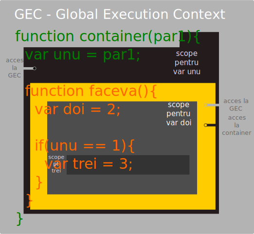

# Despre scope
============

Posibilă traducere în limba română: „perimetru” sau „arie de efect”

## Definiții
Este **locul** unde te uiți după lucruri.
Este **perimetrul** din cuprinsul codului în care au efect funcțiile și sunt disponibile variabilele.
Global scope este locul de unde pot fi accesate funcții și variabile în întreg codul.

Javascript generează un scope lexical. Nu este unul dinamic.

Bash are un scope (perimetru) dinamic și Perl activând o opțiune.

## Acumulări rapide
- JavaScript are un **scope lexical**. De fapt, este vorba despre scope
care este format la faza de compilare.
- Declararea unei funcții conduce la stabilirea un scope (un perimetru, o
zonă).
- **Scope chain** este totalitatea obiectelor care definesc variabilele
existente în scope pentru o secvență de cod. Când motorul are nevoie să
găsească valoarea unei variabile, se uită la primul obiect din lanț.
Operațiunea se mai numește „walking up the scope chain".

## Mantre
-   Funcțiile generează SCOPE-ul.
-   JavaScript are un **scope lexical** general la faza de compilare.
-   Când funcțiile sunt executate SCOPE-ul folosit este cel de la
    MOMENTUL DEFINIRII (faza de compilare), nu cel de la momentul
    invocării (asta înseamnă LEXICAL SCOPE, de fapt).
-   Scope-ul unei variabile poate fi înțeles setul de linii de cod sursă
    pentru care este definită variabila. Variabilele locale sunt
    disponibile funcției în care au fost declarate și tuturor
    funcțiilor interne. Variabilele locale sunt reatribuite cu valori de
    fiecare dată când o funcție este invocată. Nu uita, parametrii sunt
    la rândul lor variabile locale.
-   Când este definită o funcție, aceasta stochează scope chain-ul care
    era în efect în acel moment.
-   Obiectul creat de invocarea unei funcții este adăugat scope chain-ului existent.
    - Scope chain-ul astfel rezultat reprezintă scope chain-ul de la acel moment.
    - Obiectul rezultat de fapt are rolul de a face legăturile tuturor variabilelor funcției în scope chain.
-   Când funcția returnează, obiectul care face binding-ul variabilelor
    este scos din **scope chain**.
-   Dacă nu există funcții interne, nu mai există nicio legătură spre
    obiectul care face binding-ul variabilelor și se face
    GARBAGE COLLECTING.
-   Când sunt definite funcții interne, acestea la rândul lor generează
    referințe în scope chain.
-   Dacă o funcție internă este returnată sau introdusă într-o
    variabilă, atunci va exista o referință către aceasta și nu se va
    face garbage collecting (avem un clojure).
-   Scope chain-ul unui closure este unul viu; funcțiile interne nu fac
    copii private ale scope-ului și nici nu fac snapshoturi ale
    binding-urilor variabilelor.

## Q&A

**Întrebare**: Când se formează scope?
**Răspuns**: La faza de compilare.

Iată cum arată scope-ul ca reprezentare și ca arie în care are efect o
valabilă sau o funcție

## Aprofundare prin efect
- ### [Clojures](clojures/clojures.md "Subiectul clojures")
  - #### [Clojures in loop](clojures/clojures.md "Caz explicat de clojures")
