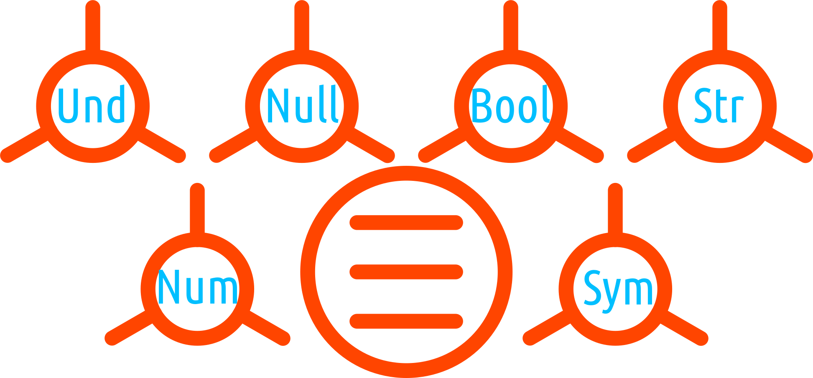
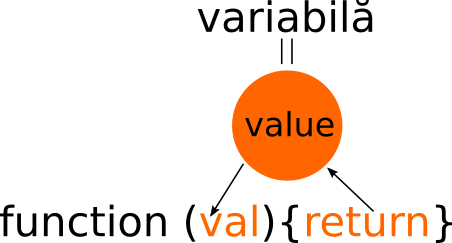

# Valorile în JavaScript

Valorile sunt datele pe care un programator le poate manipula în JavaScript. Valorile ca tipologie sunt diferite.

## Valorile în JavaScript

Limbajul de programare ECMAScript, adică JavaScript-ul nostru are câteva valori care sunt **tipuri ale limbajului**, cum le spune standardul. Ce înseamnă că sunt tipuri ale limbajului? Simplu, sunt acele valori pe care un programator le poate manipula folosind limbajul de programare ECMAScript.

**Spune standardul**: *O valoare a limbajului ECMAScript este o valoare care este caracterizată de un tip al limbajului ECMAScript*.
Pe scurt, tipul indică valoarea.

Tipurile de valori disponibile sunt:

- `Undefined`,
- `Null`,
- `Boolean`,
- `String`,
- `Symbol`,
- `Number` și
- `Object`

Pentru aceste valori primare, am creat un simbol de care să ne folosim în acest manual. Acesta este pentru primele șase un cerc cu trei raze în care este înscrisă o prescurtatare a numelui valorii. Singura valoare care este exceptată va fi cea a obiectului pe care l-am reprezentat precum un cerc cu trei linii suprapuse ce simbolizează proprietățile sale. Acest sistem de notare vizuală nu face parte din standard și îl adoptăm aici pentru a ne face viața mai ușoară în anumite explicații.



Primitivele sunt valori în sine și sunt egale cu ele însele.

Aceste valori sunt cele pe care diferitele structuri de prelucrare sau de stocare permanentă ori temporară, le vor organiza și manipula. Sunt baza structurilor de date, dacă vrei, atomii substanței cu care lucrăm în programare.

```javascript
10 === 10; // true
'ceva' === 'ceva'; // true
// prin contrast, un array,
[] === []; // false
// sau un obiect generat de o funcție
(function () {}) === (function () {}); // false
```

Atunci când nu ești sigur de valoarea reprezentată de un identificator, există un operator la îndemână care să te ajute să verifici ce este: `typeof`.

```javascript
var a = 10,
    b = 'ceva',
    c = true,
    d = undefined,
    e = Symbol('descriere'),
    f = null;
typeof a; // number
typeof b; // string
typeof c; // boolean
typeof d; // undefined
typeof e; // symbol
typeof f; // object
```

Atenție! `typeof null`, returnează `object`. Acest lucru se întâmplă pentru că standardul ECMAScript spune că `null` este un tip distinct în sine.

## Împachetarea primitivelor

Valorile primitive, întocmai ca obiectele, au proprietăți și metode. Primitivele beneficiază de acestea prin „împachetarea” valorii în obiectul intern corespondent. Împachetarea (wrapping-ul) se face fără știrea sau intervenția utilizatorului și astfel, pare că și primitivele au metode.

Poți verifica acest lucru prin accesarea uneia dintre cele mai utile proprietăți a unui șir de caractere: length.

```javascript
'ceva'.length; // 4
// sau
var x = 'ceva'; x['length']; // 4
```

O valoare primitivă care a fost „împachetată” o vom semnala vizual printr-un cerc cu trei raze ca și în cazul primitivelor, dar înscris într-un cerc.


O valoare primitivă care a fost „împachetată” o vom semnala vizual printr-un cerc cu trei raze ca și în cazul primitivelor, dar înscris într-un cerc.

În cuprinsul acestei lucrări mantrele trebuie înțelese ca proproziții care rezumă o anumită învățătură despre subiectul tratat. Poate fi privit și ca o recapitulare a ceea ce a fost explicat pe larg. Ținta este ca în cazul detașării acestor propoziții, să poată sintetiza cu maximum de efect un anumit subiect. Repetarea și revizitarea acestora, ca și în tradiția budistă, va conduce la stabilirea unor repere mentale.

## `Undefined`

Tipul de valori `Undefined` nu poate să conțină decât o singură valoare: `undefined`. `Null`, la fel.

## `Boolean`

Cu `Boolean` lucrurile se schimbă, acest tip putând avea două valori: `true` sau `false`.

Acum vom purcede la a împușca doi iepuri deodată. La ce mă refer este la faptul că în afară de a declara valori literale, valorile pot fi create instanțiidu-se obiectul corespondent tipului de valoare. Ești în ceață? Hai să o lămurim. JavaScript este un limbaj orientat pe obiecte. Am lămurit treaba asta mai demult, dar este necesar să o repetăm pentru firul logic. Din start sunt disponibile niște obiecte interne, niște constructori (funcții care invocate creează obiecte), de fapt. Printre aceste obiecte, se află și cele care permit crearea de valori la momentul în care le instanțiezi folosind operatorul `new`. Un exemplu scurt și trecem mai departe. Dacă dorim să introducem valoarea trei, valoarea literală pur și simplu permite să declari caracterul `3;`. Corect? Simplu! Dar pentru că există un obiect intern corespondent, ai putea să obții aceeași valoare generând obiectul intern cu ajutorul cuvântului cheie new după cum urmează: `new Number('3');`. Complicat? Nu cred. Dacă ești amețit nițel, reține acum că pentru fiecare valoare literală numerică ca șir, există un obiect intern pe care-l poți folosi. Aceste obiecte interne se numesc „obiecte ambalaj”, pentru că împăturesc o valoare căreia îi oferă metode și proprietăți transformând-o într-un obiect, de fapt.

Iată, pentru valorile boolean, există un constructor, de fapt o funcție, care invocată prin operatorul `new`. Există o eroare teribilă în a cărei plasă poți cădea dacă nu ești atent. Aceea ar fi confundarea valorilor generate prin folosirea constructorilor, acestea fiind obiecte, cu valorile literale. Nu uita, folosirea unui constructor, adică instanțierea sa cu operatorul `new` rezultă în crearea unui obiect, nu a unei valori literale. Poți testa acest lucru evaluând identificatorul cu operatorul `typeof`.

```javascript
var bool = new Boolean(true);
if(bool) {console.log(bool)}; // true
typeof bool; // "object"
```

## `String`

Tipul `String` este folosit pentru a reprezenta date reprezentate textual, fiind, de fapt, un șir de caractere, care prin succesiune și aranjament transmit informații importante. FFiecare caracter codat UTF16 considerat a fi „un element”. Un element este valoarea unui „code unit” din schema de codare a caracterelor UTF-16.

Standardul spune că un șir de caractere literal este „șirul constituit din zero sau mai multe puncte de cod Unicode cuprinse între ghilimele simple sau duble”.

Sunt pur și simplu siruri de caractere care pot fi introduse în mod direct cu ajutorul ghilimelelor.

```javascript
'ceva';
"altceva";
'\u221E'; //"∞" o secvență Unicode
```

## `Symbol`

Tipul `Symbol` este un set de valori care nu sunt pot fi considerate a fi șiruri, dar care pot fi folosite ca și chei ale unei proprietăți într-un obiect.

În cazul lui `Symbol`, fiecare valoare care reprezintă simbolul, este unică și nu poate fi modificată (este „immutable”), dar fiecare valoare la rândul ei poate avea o valoare asociată folosită pentru a descrie simbolul, care este `undefined` sau un șir de caractere. Un `Symbol` cu care te vei întâlni foarte des este `@@iterator` și care este o referință către o metodă care returnează un obiect iterator pentru un obiect pe care-l folosești. Formula `for...of` face apel automat la această metodă.

## `Number`

Valorile numerice sunt caracterele a căror interpretare conduce la înțelegerea de către computer a foptului că-i introduci o valoare numerică. O valoare numerică exprimată printr-un literal va fi întotdeauna rotunjită atunci când se evaluează valoarea numerică.
În cazul în care avem valori zecimale, acestea pot fi reprezentate și dacă încep cu 0. Important este că cifra care urmează să nu fie sub 8 pentru căci în acest caz este interpretat ca fiind un octal.

Care sunt numerele pe care le poți introduce ca literale.

- Întregii binari precum `0b` (litera `b` poate fi introdusă și ca majusculă).
- Digiții binari clasici: `0` și `1`.
- Valorile octale scrise ca zero urmat de `o` - `0o` sau zero urmat de `O` - `0O`. Valorile numerice care urmează secvenței `0o` nu trebuie să fie mai mari de 7.
- Întregi hexazecimali precum `0x` sau `0X`.

```javascript
var unBinar = 0b0010000011000000111100001100000;
console.log(unBinar); //274757728
var unOctal = 0o644; console.log(unOctal); //420
var unHexa = 0x24443AD; console.log(unHexa); //38028205
```

Odată cu valorile numerice poți menționa și exponenții: `e` sau `E`.
Poți scrie semnul minus care să indice cu care valoare de pe axa numerelor se operează: `-10` și `10`, de exemplu.

Tipul `Number` țintește valori numerice cu dubă precizie pe 64 de biți.
`Number` nu poate avea valori mai multe de 18437736874454810627 (standardul IEEE 754-2008).
Alte valori de tip `Number` sunt `NaN` (Not-a-Number, care tot o implementare a standardului menționat este), `Infinity` pozitivă și negativă, zero și minus zero.

## `Object`

Tipul `Object` este o colecție de proprietăți.

Inițializarea unui obiect este o sarcină simplă folosind literalul corespunzător. Pur și simplu folosești acoladele între care pui perechile de chei-valori și cam asta e.

```javascript
var obi = {unu: 1, este: true};
```

Începând cu ECMAScript 2015 se poate folosi și notația prescurtată.

```javascript
var unu = 1, este = true;
var obi = {unu, este};
console.log(obi); // {"unu":1,"este":true}
```

Obiectele au și ele obiectul de împachetare corespondent care poate fi instanțiat prin apelarea cu `new` a constructorului `Object`.

```javascript
new Object();
```

Oricare proprietate a unui obiect este, fie o proprietate care conține date, fie un „accessor”.
O „proprietate de date” a unui obiect este o asociere dintre valoarea unei chei cu o valoare a limbajului (unul dintre tipuri), plus un set de atribute de tip Boolean (`writable`, `enumerable`, `configurable`).
O „proprietate accesor” (`get` și `set`), asociază o cheie cu una din cele două funcții accesor, plus un set de atribute tip Boolean.
Cheile unui obiect nu pot fi decât un șir de caractere sau o valoare `Symbol`. Atenție, chiar și un șir vid poate sta drept cheie. Numele cheii este întotdeauna un șir de caractere.

Proprietățile unui obiect accesate prin get și set, sunt cele ale obiectului, dar și cele moștenite.
Atenție, fiecare obiect trebuie să aibe seturi cheie - valoare care să fie unice. Duplicatele nu sunt acceptate.

Acum că am încheiat cu tratarea valorilor care sunt și tipurile limbajului nostru și pentru că am tratat și povestea reprezentărilor literale ale lor, vom continua cu restul reprezentărilor literale pentru valori care le putem considera derivate din cele nucleu. De ce le tratez precum derivări? Pentru că se bazează pe valorile nucleu oferind un rafinament adaptat unor situații necesare pentru tratarea anumitor valori. Cel mai simplu, pentru a înțelege este relația dintre obiect și array. Un array este la rândul său un obiect, dar unul specializat pe manipularea datelor ca și liste de valori, care valori pot fi cele descrise până în acest moment.

## Literalul array

În cazul array-urilor, forma literală pentru constituire este lista elementelor introdusă între paranteze pătrate.

```javascript
var arr = ['unu', 2, true];
```

Obiectul de împachetare este `Array` iar instanțierea acestuia cu `new` crează un array.

```javascript
new Array('unu', 2, true);
```

## Literal RegExp

Ca să nu fii confuză, RegExp este o parte importantă a rutinelor de lucru cu șiruri în oricare limbaj de programare. RegExp înseamnă regular expressions iar utilitatea sa este dovedită prin capacitatea de a face regăsiri într-un șir de caractere, care poate fi de orice dimensiuni (o carte, de exemplu). După cum intuiești, RexExp este foarte puternic ca și capacitate de a căuta după cuvinte cheie, expresii, succesiuni de caracteer, ce să mai, șabloane aranjate și construite după cele mai fanteziste reguli. Dar și aceste șabloane, trebuie specificate cumva. Uneori le poți introduce într-o variabilă iar în cazul literalelor, le putem specifica direct.

```javascript
/a+b/g; //sau
/^a+b$/g;
```

Obiectul de împachetare este `RegExp` și instanțierea sa cu `new` produce un obiect.

```javascript
new RegExp('^a+b$', 'g');
```

## Literalul funcțiilor

Pentru a înțelege faptul că funcțiile au literalul lor, trebuie să înțelegem un lucru foarte simplu. În JavaScript, funcțile sunt valori.

```javascript
function () { return true };
```

O funcție are și ea la rândul ei un obiect de împachetare și poate fi creată prin invocarea cu `new`.

```javascript
new Function('return true');
```

### Literale rezervate pentru marcaje și delimitări în șirurile de caractere

Acestea sunt: `'` (ghilimele simple), '"' (ghilmele duble), `\b`, `\f`, `\r`, `\n`, `\t`, `\v`.
Pentru digiții zecimali este marcajul care indică că următoarea secvență de caractere este un număr zecimal: `x`, `u`. Pentru valorile hexazecimale este `x`.
Secvențe de escape pentru UNICODE: `u` sau `u{ }`

## Template Literal - text șablon

Începând cu ECMAScript 2015 avem un mod suplimentar de a lucra cu fragmente de text și acesta este numit **template literal** - „șabloane literale”. Chestia extraordinară este că permite introducerea de expresii care pot fi evaluate folosind secvența `${identificator sau expresie}` și lucrul cu fragmente de text pe mai multe rânduri. Pentru a construi un template string punem tot textul nostru între două <code>&#96;</code>, care este caracterul pentru reprezentarea **accentului grav** (grave accent, în engleză). Acest caracter mai este denumit în limba engleză și **backtick**.

Acestea este semnul distinct care spune motorului JavaScript că se pot interpola rezultate ale evaluării unei expresii folosind combinațiea dollar-acolade precum în: `${oVariabilaSauExpresie}`.

```javascript
var ceva = `ceva text ${numeIdentificator}`;
```

*Șabloanele literale* (template literal) sunt un pas evolutiv important dacă ne gândim la faptul că până acum trebuia să apelăm la concatenare pentru a introduce într-un șir de caractere rezultatul evaluării unor expresii. Acest lucru introduce un nivel suplimentar de calcul pentru că mototul JS trebuia mai întâi să analizeze dacă nu cumva este vorba despre o adunare. Așa, folosind *șabloanele literale*, lucrurile sunt clare.

```javascript
var a = 5, b = 10;
console.log("Cinsprezece este suma " + (a + b) + " și\nnu " + (2 * a + b) + ".");
// este echivalent cu:
console.log(`Cinsprezece este suma ${a + b} și\nnu ${2 * a + b}.`);
```

O formă și mai avansată de *șabloane literale* (template literal) este cea numită `tagged template literals` - **literale șablon cu etichetă**. Un simplu exemplu:

```javascript
var a = 0.5, b = 10;
var stranse = `Adunarea este: ${(a + b).toFixed(2)}, înmulțirea este: ${a * b}`;
console.log(stranse);
```

Se pot imbrica șabloane, precum în următorul exemplu:

```javascript
var oParte = 'o parte de text',
    altaParte = `Ce voi face este ${ `să unesc ${oParte}` }`;
console.log(altaParte);
```

### Tagged template literals - funcții de șablonare

În acest caz, se folosește o funcție care este apelată cu datele template-ului literal care este procesat. Funcția primește datele din template ca bucăți individuale și trebuie să le combine pentru a creea rezultatul.

```javascript
var atribut = 'foarte bun',
    procent = '100';

function inlocuieste (text, atrInput, procInput) {
  var sirPanaPrimaInlocuire = text[0];
  var sirDeDupaInlocuirePanaLaUrm = text[1];
  var ceAMaiRamas = text[2];

  // în funcție poți face anumite modificari valorilor
  // care vor fi interpolate
  if (procInput == 100) {
    procInput = 'sută la sută';
  };

  return sirPanaPrimaInlocuire + atrInput + sirDeDupaInlocuirePanaLaUrm + procInput + ceAMaiRamas;
};

var transmutare = inlocuieste`Un text ${atribut} cu ${procent} încântare.`;
console.log(transmutare);
```

Există un exemplu și mai elaborat care permite introducerea unui șablon ca argument al unei funcții cu fiecare loc de substituire numerotat, iar aceasta, la rândul său, returnează o alta care va accepta drept argumente valorile ce vor completa șablonul.

```javascript
function zetar (sablon, ...chei) {
  return (function (...valori) {
    var setValori = valori[valori.length - 1] || {};
    var rezultat = [sablon[0]];
    chei.forEach(function (cheie, i) {
      var valoare = Number.isInteger(cheie) ? valori[cheie] : setValori[cheie];
      rezultat.push(valoare, sablon[i + 1]);
    });
    return rezultat.join('');
  });
};
var sablon1 = zetar`Am un ${0} și ${1} bani`;
sablon1('leu', 10);
// "Am un leu și 10 bani"
```

## Datele: agregarea și prelucrarea lor

Orice limbaj de programare are nevoie de structuri care să permită stocarea și manipularea facilă a datelor.
Javascript permite manipularea datelor la nivelul unor structuri stabilite formal în limbaj precum array-urile și obiectele. Însă cele mai simple structuri de date sunt însăși șirurile de caractere, care se supun metodelor de prelucrare specifice unui array.
Cele mai utile structuri de prelucrare a datelor sunt funcțiile. Pe acestea vă veți sprijini atunci când veți porni la manipularea valorilor. Din punct de vedere al preluării, imaginați-vă că sunteți în poziția unei funcții care produce niște rezultate. Dacă acele rezultate nu ar fi „salvate” într-o structură capabilă să le preia, acestea s-ar pierde.

Obiectele pot fi transformate în array-uri dacă acest lucru servește procesării datelor conținute. De cele mai multe ori, varietatea și flexibilitatea metodelor obiectelor interne limbajului, vă vor oferi și soluțiile de prelucrare.

Cel mai des vor fi folosite array-urile și obiectele, care seamănă cu array-urile (adică care oferă suport parțial metodelor care pot fi aplicate în mod tradițional asupra array-urilor).
Aceste structuri vor folosi datele ca valori prezentate deja.

## Valorile ca „cetățeni de primă-clasă” - first-class citizens

În JavaScript, valorile care pot fi asignate unor variabile, care pot fi trimise funcțiilor ca argumente și care pot fi returnate dintr-o funcție, se numesc valori „first-class”. Funcțiile în JavaScript sunt valori de primă clasă.



Faptul că funcțiile pot fi considerate valori în sine, putând fi pasate, returnate și asignate, fac din limbajul de programare JavaScript unul foarte expresiv și unic în felul său.

De curând au fost introduse clasele în limbaj, acestea fiind considerate și ele de primă clasă.
